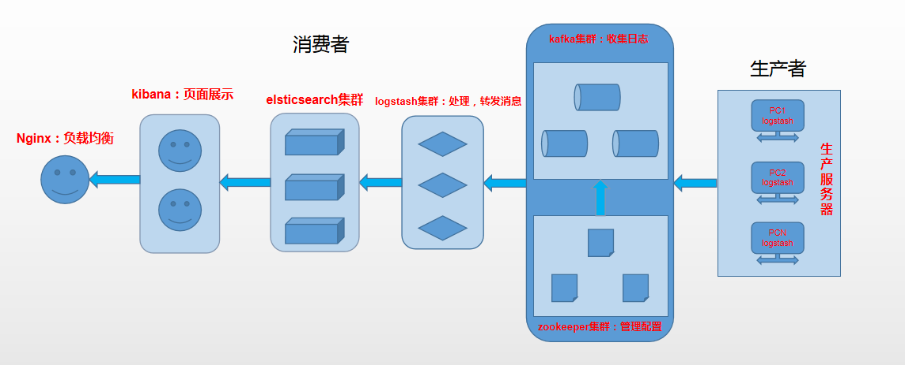

## 实验环境： ##

	CentOS 7.6
		node1：192.168.164.150
		node2：192.168.164.151
		node3：192.168.164.152
	JDK-1.8.0
	Zookeeper-3.4.14	
	kafka_2.12-2.2.0
	elasticsearch-6.3.0
	kibana-6.3.0
	logstash-6.3.0

## 架构图： ##

	
# 初始化准备 #

**1.按需关闭防火墙、SELinux**
	

	~]# systemctl stop firewalld
	~]# systemctl disable firewalld
	~]# setenforce 0
	~]# sed -i '/SELINUX/s/enforcing/disabled/g' /etc/sysconfig/selinux

**2.同步系统时间**
		
	1.安装ntpdate工具
	~]# yum -y install ntp ntpdate
			
	2.设置系统时间与网络时间同步
	~]# ntpdate cn.pool.ntp.org
			
	3.将系统时间写入硬件时间
	~]# hwclock --systohc

# 1.安装JDK 8
[https://www.oracle.com/technetwork/java/javase/downloads/java-archive-javase8-2177648.html](https://www.oracle.com/technetwork/java/javase/downloads/java-archive-javase8-2177648.html)

	~]# yum install jdk-8u202-linux-x64.rpm -y
	~]# echo "JAVA_HOME=/usr/java/latest" > /etc/profile.d/jdk.sh
	~]# echo "PATH=$JAVA_HOME/bin:$PATH" >> /etc/profile.d/jdk.sh
	~]# source /etc/profile.d/jdk.sh
	~]# java -version
	java version "1.8.0_202"
	Java(TM) SE Runtime Environment (build 1.8.0_202-b08)
	Java HotSpot(TM) 64-Bit Server VM (build 25.202-b08, mixed mode)
	
	注：zookeeper(java)与kafka(scale)都需要JVM环境

# 2.搭建zookeeper集群
zookeeper包下载: [https://mirrors.tuna.tsinghua.edu.cn/apache/](https://mirrors.tuna.tsinghua.edu.cn/apache/)

zookeeper配置参数：[http://zookeeper.apache.org/doc/current/zookeeperAdmin.html#sc_configuration](http://zookeeper.apache.org/doc/current/zookeeperAdmin.html#sc_configuration)

**node1:node2/3同，只需修改myid文件即可**

	~]# wget https://mirrors.tuna.tsinghua.edu.cn/apache/zookeeper/zookeeper-3.4.14/zookeeper-3.4.14.tar.gz
	~]# tar xf zookeeper-3.4.14.tar.gz -C /usr/local/
	~]# cd /usr/local/
	~]# ln -sv zookeeper-3.4.14/ zookeeper
	~]# cd zookeeper/conf
	~]# cat zoo.cfg
		tickTime=2000
		initLimit=10
		syncLimit=5
		dataDir=/usr/local/zookeeper-3.4.14/data
		
		dataLogDir=/usr/local/zookeeper-3.4.14/log
		autopurge.snapRetainCount=3
		autopurge.purgeInterval=1
	
		clientPort=2181
		server.0=192.168.164.128:2888:3888
		server.1=192.168.164.132:2888:3888
		server.2=192.168.164.133:2888:3888
	
	~]# mkdir ../{data,log}
	~]# echo 0 > data/myid			#最好从0开始，否则可能会无法实现高可用
	
	~]# echo 'ZK_HOME=/usr/local/zookeeper' > /etc/profile.d/zk.sh                               
	~]# echo 'PATH=$ZK_HOME/bin:$PATH' >> /etc/profile.d/zk.sh
	~]# source /etc/profile.d/zk.sh
	
	~]# zkServer.sh start		#启动zk
	~]# zkServer.sh status		#查看zk状态
	
	~]# zkCli -server IP:PORT 
	
	＃配置参数说明：
	tickTime:客户端与服务器或者服务器与服务器之间每个tickTime时间就会发送一次心跳。通过心跳不仅能够用来监听机器的工作状态，还可以通过心跳来控制Flower跟Leader的通信时间，默认2秒
	initLimit：集群中的follower服务器(F)与leader服务器(L)之间初始连接时能容忍的最多心跳数（tickTime的数量）。
	syncLimit：集群中flower服务器（F）跟leader（L）服务器之间的请求和答应最多能容忍的心跳数。   
	dataDir：该属性对应的目录是用来存放myid信息跟一些版本，日志，跟服务器唯一的ID信息等。
	clientPort：客户端连接的接口，客户端连接zookeeper服务器的端口，zookeeper会监听这个端口，接收客户端的请求访问！这个端口默认是2181。
	server.N=YYY:A:B
		N：代表服务器编号（也就是myid里面的值）
		YYY：服务器地址
		A：表示 Flower 跟 Leader的通信端口，简称服务端内部通信的端口（默认2888）
		B：表示 是选举端口（默认是3888）
	配置observer角色：
		peerType=observer	#设置observer角色，只需在设置为observer服务器配置
		server.N=IP:PORT1:PORT2:observer	#所有服务器配置

**服务自启：**

	~]# cat /etc/init.d/zookeeper 
		#!/bin/bash
		
		# chkconfig:2345 20 90
		# description:zookeeper
		# processname:zookeeper
		
		export JAVA_HOME=/usr/java/latest
		
		case $1 in        
		        start) 
		                /usr/src/zookeeper-3.4.14/bin/zkServer.sh start
		        ;;        
		        stop)
		                /usr/src/zookeeper-3.4.14/bin/zkServer.sh stop
		        ;;        
		        status) 
		                /usr/src/zookeeper-3.4.14/bin/zkServer.sh status
		        ;;        
		        restart)
		                /usr/src/zookeeper-3.4.14/bin/zkServer.sh restart
		        ;;        
		        *) 
		                echo "require start|stop|status|restart"
		esac	
	
	~]# chmod a+x /etc/init.d/zookeeper
	~]# chkconfig --add zookeeper
	~]# chkconfig --list

# 3.搭建kafka集群
[https://mirrors.tuna.tsinghua.edu.cn/apache/kafka/](https://mirrors.tuna.tsinghua.edu.cn/apache/kafka/)

	~]# wget https://mirrors.tuna.tsinghua.edu.cn/apache/kafka/2.2.0/kafka_2.12-2.2.0.tgz	
	~]# tar xf kafka_2.12-2.2.0.tgz -C /usr/local/
	~]# cd /usr/local/
	~]# ln -sv kafka_2.12-2.2.0/ kafka
	~]# cd kafka/config/
	
	~]# cat server.properties | grep -v '#' | grep -v "^$"
		broker.id=1										#kafka节点标识(节点唯一)
		listeners=PLAINTEXT://192.168.164.128:9092		#本机ip
		num.network.threads=3
		num.io.threads=8
		socket.send.buffer.bytes=102400
		socket.receive.buffer.bytes=102400
		socket.request.max.bytes=104857600
		log.dirs=/usr/local/kafka/kafka-logs				#kafka数据存放目录
		num.partitions=3
		num.recovery.threads.per.data.dir=1
		offsets.topic.replication.factor=1
		transaction.state.log.replication.factor=1
		transaction.state.log.min.isr=1
		log.retention.hours=168
		log.segment.bytes=1073741824
		log.retention.check.interval.ms=300000
		zookeeper.connect=192.168.164.128:2181,192.168.164.132:2181,192.168.164.133:2181	#zookeeper集群地址
		zookeeper.connection.timeout.ms=6000
		group.initial.rebalance.delay.ms=0
		
	~]# echo 'KFK_HOME=/usr/local/kafka_2.12-2.2.0' > /etc/profile.d/kfk.sh
	~]# echo 'PATH=$KFK_HOME/bin:$PATH' >> /etc/profile.d/kfk.sh
	~]# source /etc/profile.d/kfk.sh
	
	~]# kafka-server-start.sh -daemon /usr/local/kafka/config/server.properties		#启动kafka

	验证kafka是否可用：	
		1.
		~]# zkCli.sh -server localhost:2181
		[zk: localhost:2181(CONNECTED) 0] get /brokers/ids/1
		{"listener_security_protocol_map":{"PLAINTEXT":"PLAINTEXT"},"endpoints":["PLAINTEXT://192.168.164.128:9092"],"jmx_port":-1,"host":"192.168.164.128","timestamp":"1556540032798","port":9092,"version":4}
		cZxid = 0x60000002b
		ctime = Tue Apr 30 04:13:52 CST 2019
		mZxid = 0x60000002b
		mtime = Tue Apr 30 04:13:52 CST 2019
		pZxid = 0x60000002b
		cversion = 0
		dataVersion = 1
		aclVersion = 0
		ephemeralOwner = 0x7d3ae0001
		dataLength = 200
		numChildren = 0
	
		2.
		~]# jps -l | grep kafka
	
	注：
		kafka节点默认需要的内存为1G，如果需要修改内存，可以修改kafka-server-start.sh的配置项。
			vim /usr/local/kafka/kafka_2.12-2.0.0/bin/kafka-server-start.sh
		找到KAFKA_HEAP_OPTS配置项，例如修改如下：
			export KAFKA_HEAP_OPTS="-Xmx2G -Xms2G"

**kafka常用命令：**

	启动kafka：
		~]# kafka-server-start.sh -daemon /usr/local/kafka/config/server.properties
	
	停止kafka：
		~]# kafka-server-stop.sh 
	
	创建topic：
		~]# kafka-topics.sh --create --zookeeper 192.168.164.128:2181,192.168.164.132:2181,192.168.164.133:2181 --replication-factor 1 --partitions 1 --topic topic_name
	
	展示topic：
		~]# kafka-topics.sh --list --zookeeper 192.168.164.128:2181,192.168.164.132:2181,192.168.164.133:2181
	
	描述topic：
		~]# kafka-topics.sh --describe --zookeeper 192.168.164.128:2181,192.168.164.132:2181,192.168.164.133:2181 --topic topic_name
	
	生产者发送消息：
		~]# kafka-console-producer.sh --broker-list 192.168.164.128:9092 --topic topic_name
	
	消费者消费消息：
		kafka-console-consumer.sh --zookeeper 192.168.164.128:2181,192.168.164.132:2181,192.168.164.133:2181 --topic topic_name --from-beginnin
	
	删除topic：
		~]# kafka-topics.sh --delete --topic topic_name --zookeeper 192.168.164.128:2181,192.168.164.132:2181,192.168.164.133:2181

# 4.搭建elasticsearch集群

	~]# tar xf elasticsearch-6.3.0.tar.gz -C /usr/local/
	~]# cd /usr/local/
	~]# ln -sv elasticsearch-6.3.0/ elasticsearch

**配置文件：**

	~]# cat /usr/local/elasticsearch/config/elasticsearch.yml | grep -v '#'
		cluster.name: myes			#集群名称，一定要一致，当集群内节点启动的时候，默认使用组播（多播），寻找集群中的节点
		node.name: node1											#节点名称
		path.data: /usr/local/elasticsearch/data					#数据目录		
		path.logs: /usr/local/elasticsearch/log						#日志目录
		bootstrap.memory_lock: true									#启动时锁定内存
		network.host: 192.168.164.150								#本机IP
		http.port: 9200												#开放端口
		discovery.zen.ping.unicast.hosts: ["node2", "node3"]		#集群中其他成员
		discovery.zen.minimum_master_nodes: 2						#成为master
	
	~]# cat jvm.options | grep -v '#' | grep -v '^$' | head -n 2       
		-Xms1g
		-Xmx1g
	
	~]# useradd elastic												#elasticsearch 5.0后不能使用root登录
	~]# chown -R elastic:elastic /usr/local/elasticsearch/			#修改用户权限，否则es无权限启动
	~]# echo "123456" | passwd --stdin elastic
	
	~]# vim /etc/sysctl.conf										#调整系统虚拟内存
		vm.max_map_count=262144
	~]# sysctl -p
	
	~]# vim /etc/security/limits.conf 								#修改tcp连接数 #锁定内存
	~]# tail -n 2 /etc/security/limits.conf
		* soft nofile 65536
		* hard nofile 65536
		* soft memlock unlimited 									
		* hard memlock unlimited 
	
	~]# su - elastic 												#es默认不能使用root启动
	~]# cd /usr/local/elasticsearch/bin
	~]# /usr/local/elasticsearch/bin/elasticsearch -d				#非root用户
	
	~]# curl -XGET http://node1:9200/_cat/nodes						#查看信息 .../_cat
		192.168.164.150 11 96 0 0.06 0.07 0.13 mdi * node1
		192.168.164.152 11 96 1 0.11 0.20 0.48 mdi - node3
		192.168.164.151 10 96 0 0.08 0.17 0.21 mdi - node2

# 5.elasticsearch-head插件

	elasticsearch-head简介：
		1.ElasticSearch-head是一个H5编写的ElasticSearch集群操作和管理工具，可以对集群进行傻瓜式操作。
		2.显示集群的拓扑,并且能够执行索引和节点级别操作
		3.搜索接口能够查询集群中原始json或表格格式的检索数据
		4.能够快速访问并显示集群的状态
		5.有一个输入窗口,允许任意调用RESTful API。这个接口包含几个选项,可以组合在一起以产生有趣的结果
		6.es的图形界面插件，托管于GitHub,使用9100端口
	
	安装NodeJS，root用户
		~]# wget https://nodejs.org/dist/v8.11.3/node-v8.11.3-linux-x64.tar.gz
		~]# tar xf node-v8.11.3-linux-x64.tar.gz -C /usr/src/
		~]# cd /usr/local/
		~]# ln -sv /usr/src/
		~]# ln -sv /usr/src/node-v8.11.3-linux-x64/ node
		~]# ln -sv /usr/local/node/bin/node /usr/local/bin/node
		~]# ln -sv /usr/local/node/bin/npm /usr/local/bin/npm
		~]# yum install -y git
		~]# cd ~
		~]# git clone git://github.com/mobz/elasticsearch-head.git
		~]# cd elasticsearch-head/
		#~]# npm install grunt -save
		~]# npm install
		~]# nohup npm run start &
	
	注：以上方法会有一些报错，但仍可使用
	
		~]# vim /usr/local/elasticsearch/config/elasticsearch.yml
			http.cors.enabled: true
			http.cors.allow-origin: "*"
	
		重启es

# 6.搭建logstash集群

	~]# tar xf logstash-6.3.0.tar.gz -C /usr/local/	
	~]# ln -sv logstash-6.3.0/ logstash
	
	~]# ./bin/logstash -e 'input{stdin{}}output{stdout{codec=>rubydebug}}'		#测试logstash，可能会等好几分钟
	
	~]# cat logstash-test.conf
		input {
	    #stdin {}
	    	file {
	            path => "/var/log/messages"
	            start_position => "beginning"
	    	}
		}
		
		output {
			elasticsearch {
		    	hosts => ["192.168.164.150:9200","192.168.164.151:9200","192.168.164.152:9200"]
		        	index => "system-messages-%{+YYYY-MM}"
		    }
		}
	
	~]# nohup /usr/local/logstash/bin/logstash -f /usr/local/logstash/logstash-test.conf &		#启动logstash
	
	注：搜集系统日志需注意日志权限问题

# 7.搭建kibana

	~]# tar xf kibana-6.3.0-linux-x86_64.tar.gz -C /usr/local/
	~]# ln -sv kibana-6.3.0-linux-x86_64/ kibana
	
	~]# cat kibana.yml | grep -v '#' | grep -v '^$'
		server.port: 5601											#web访问端口
		server.host: "192.168.164.150"								#kibana所在服务器IP
		server.name: "node1.kibana"									#Kibana实例对外展示的名称
		elasticsearch.url: "http://192.168.164.150:9200"			#从es拿数据地址
	
	~]# nohup ./bin/kibana &  										#访问 http://192.168.164.150:5601
	
	~]# echo 'LS_HOME=/usr/local/logstash-6.3.0/' >> /etc/profile.d/elk.sh
	~]# echo 'ES_HOME=/usr/src/elasticsearch-6.3.0/' >>　/etc/profile.d/elk.sh
	~]# echo 'KB_HOME=/usr/src/kibana-6.3.0-linux-x86_64/' >> /etc/profile.d/elk.sh
	~]# echo 'PATH=$ES_HOME/bin:$LS_HOME/bin:$KB_HOME/bin:$PATH' >> /etc/profile.d/elk.sh 
	~]# source /etc/profile.d/elk.sh

# 8.写入日志(服务器到kafka)

## 1.filebeat->logstash->kafka

**filebeat->logstash:**
	

	~]# cat /etc/filebeat/filebeat.yml	
	
	filebeat.inputs:
	- type: log
	  enabled: true
	  paths:
	    - /var/log/nginx/access.log
	  tags: ["nginx-log"] 			#当有多个日志文件写入时，logstash可通过该标签将日志写入不同topic
	
	output.logstash:
	  hosts: ["192.168.164.154:5044"]

**logstash->kafka:**	

	~]# cat /etc/logstash/conf.d/logstash-kafka.conf 
		input {
		    beats {
				host => "0.0.0.0"
		        port => 5044
		    }
		}
		
		output {
		    if "nginx-log" in [tags]{		#通过filebeat里面的tag进行判断
		        kafka {
		            bootstrap_servers => "192.168.164.150:9092,192.168.164.151:9092,192.168.164.152:9092"	#kafka集群
	                topic_id => "nginx-menssages"			#生成的topic 
		            compression_type => "snappy"			#压缩方式
		        }
		        #stdout {codec => rubydebug}
		    }
		}

## 2.filebeat->kafka

	filebeat.inputs:
	- type: log
	  enabled: true 
	  paths:
		- /var/log/nginx/access.log
	
	output.kafka:
	  hosts: ["kafka1:9092","kafka2:9092","kafka3:9092"]
	  topic: nginx-messages
	  keep_alive: 10s

# 9.输出日志(kafka到es)

	~]# cat logstash-nginx.conf 
		input {
	        kafka {
	        	bootstrap_servers => "192.168.164.150:9092,192.168.164.151:9092,192.168.164.152:9092"	#kafka集群
	            group_id => "logstash"
	            auto_offset_reset => "earliest"
	            decorate_events => true
	            topics => ["nginx-menssages"]		#从kafka集群的哪个topics拿数据
	            type => "nginx"						#标记这个输入，output可进行判断
	            #codec => json
	        }
		}
		
		output {
	        if [type] == "nginx" {
	            elasticsearch {
	                hosts => ["192.168.164.150:9200"]
	                index => "nginx-messages-%{+YYYY-MM}"		#索引，kibana中使用添加
	            }
	        }
		}

