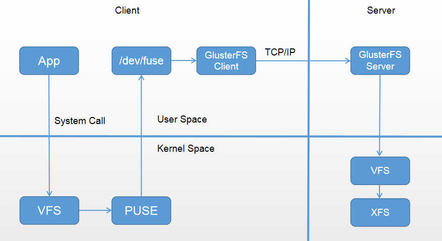
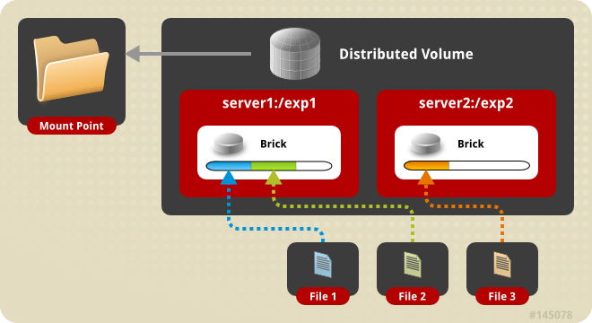
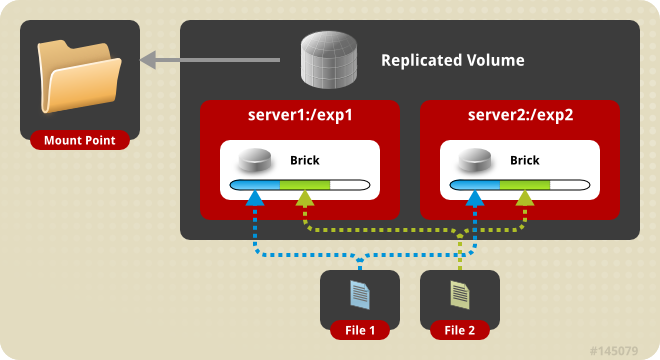
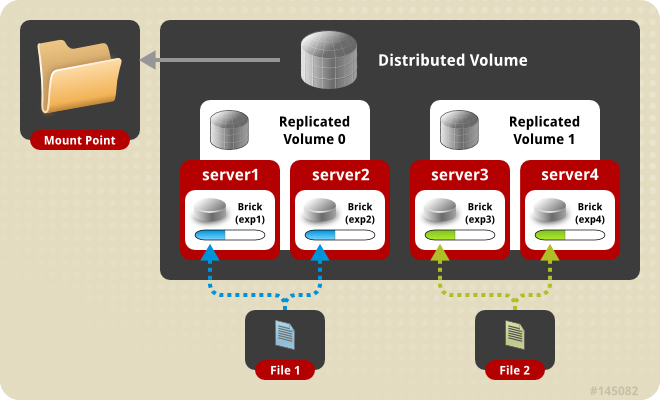
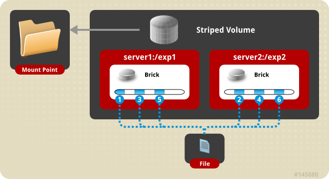
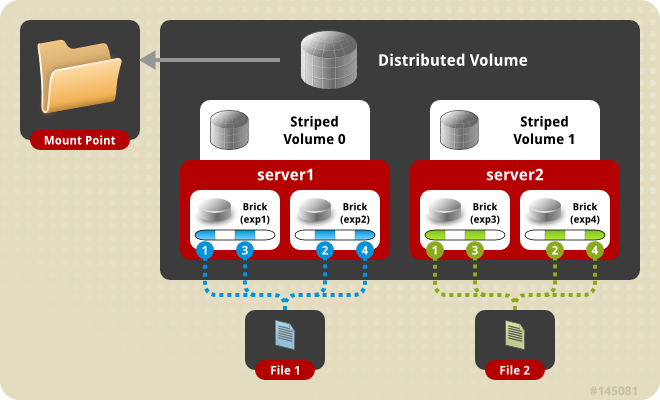

# 1.分布式文件系统

	分布式文件系统（Distributed File System）是指文件系统管理的物理存储资源并不直接与本地节点相连，而是分布于计算网络中的一个或者多个节点的计算机上。目前意义上的分布式文件系统大多都是由多个节点计算机构成，结构上是典型的客户机/服务器模式。流行的模式是当客户机需要存储数据时，服务器指引其将数据分散的存储到多个存储节点上，以提供更快的速度，更大的容量及更好的冗余特性。

# 2.GlusterFS概述

	GlusterFS系统是一个可扩展的网络文件系统，相比其他分布式文件系统，GlusterFS具有高扩展性、高可用性、高性能、可横向扩展等特点，并且其没有元数据服务器的设计，让整个服务没有单点故障的隐患。
	
	术语：
		Brick:GFS中的存储单元，通过是一个受信存储池中的服务器的一个导出目录。可以通过主机名和目录名来标识，如'SERVER:EXPORT'
		Client:挂载了GFS卷的设备
		Node:一个拥有若干brick的设备
	
	无元数据设计:
		元数据是用来描述一个文件或给定区块在分布式文件系统中所在的位置，简而言之就是某个文件或某个区块存储的位置。传统分布式文件系统大都会设置元数据服务器或者功能相近的管理服务器，主要作用就是用来管理文件与数据区块之间的存储位置关系。相较其他分布式文件系统而言，GlusterFS并没有集中或者分布式的元数据的概念，取而代之的是弹性哈希算法。集群中的任何服务器和客户端都可以利用哈希算法、路径及文件名进行计算，就可以对数据进行定位，并执行读写访问操作。这种设计带来的好处是极大的提高了扩展性，同时也提高了系统的性能和可靠性；另一显著的特点是如果给定确定的文件名，查找文件位置会非常快。但是如果要列出文件或者目录，性能会大幅下降，因为列出文件或者目录时，需要查询所在节点并对各节点中的信息进行聚合。此时有元数据服务的分布式文件系统的查询效率反而会提高许多。
	
	客户端访问流程:
		当客户端访问GlusterFS存储时，首先程序通过访问挂载点的形式读写数据，对于用户和程序而言，集群文件系统是透明的，用户和程序根本感觉不到文件系统是本地还是在远程服务器上。读写操作将会被交给VFS(Virtual File System)来处理，VFS会将请求交给FUSE内核模块，而FUSE又会通过设备文件/dev/fuse将数据交给GlusterFS Client。最后经过GlusterFS Client的计算，并最终经过网络将请求或数据发送到GlusterFS Server上。



# 3.GlusterFS集群模式

### 3.1 分布式卷（Distributed Volume）
又称哈希卷，近似于RAID0，文件没有分片，文件根据hash算法写入各个节点的硬盘上，优点是容量大，缺点是没冗余

```
~]# gluster volume create NEW_VOLUME server1:/dir1 server2:/dir2 server3:/dir3 server4:/dir4
```



### 3.2 复制卷（Replicated Volume）
相当于raid1，复制的份数，决定集群的大小，通常与分布式卷或者条带卷组合使用，解决前两种存储卷的冗余缺陷。缺点是磁盘利用率低。
复本卷在创建时可指定复本的数量，通常为2或者3，复本在存储时会在卷的不同brick上，因此有几个复本就必须提供至少多个brick，当其中一台服务器失效后，可以从另一台服务器读取数据，因此复制GlusterFS卷提高了数据可靠性的同事，还提供了数据冗余的功能

```
~]# gluster volume create NEW_VOLUME replica 2 transport tcp server1:/dir1 server2:/dir2
```



### 3.3 分布式复制卷（Distributed Replicated Volume）
分布式复制GlusterFS卷结合了分布式和复制Gluster卷的特点，看起来类似RAID10，但其实不同，RAID10其实质是条带化，但分布式复制GlusterFS卷则没有

```
~]# gluster volume create NEW_VOLUME replica 2 transport tcp server1:/dir1 server2:/dir2 server3:/dir3 server4:/dir4
```



### 3.4 条带卷（Striped Volume）
相当于raid0，文件是分片均匀写在各个节点的硬盘上的，优点是分布式读写，性能整体较好。缺点是没冗余，分片随机读写可能会导致硬盘IOPS饱和

```
~]# gluster volume create NEW_VOLUME stripe 2 transport tcp server1:/dir1 server2:/dir2
```



### 3.5 分布式条带卷（Distributed Striped Volume）
当单个文件的体型十分巨大，客户端数量更多时，条带卷已经无法满足需求，此时将分布式与条带化结合起来是一个比较好的选择。其性能与服务器数量有关

```
~]# gluster volume create NEW_VOLUME stripe 4 transport tcp server1:/dir1 server2:/dir2 server3:/dir3 server4:/dir4 server5:/dir5 server6:/dir6 server7:/dir7 server8:/dir8
```



# 4.搭建GlusterFS集群

**环境准备：**

	~]# systemctl stop firewalld
	~]# systemctl disable firewalld
	~]# sed -i 's/SELINUX=enable/SELINUX=disabled/g' /etc/sysconfig/selinux 
	~]# setenforce 0
	
	~]# cat /etc/hosts
	
	~]# cat /etc/hosts
		...
		192.168.5.10 glusterfs01
		192.168.5.11 glusterfs02

**glusterfs集群搭建：**

	可通过至少两块盘，或者两个分区
	
	通过两块盘额外步骤：
	glusterfs01：
		~]# mkfs.xfs /dev/sdb
		~]# mkdir -p /data
		~]# echo '/dev/sdb /data xfs defaults 0 0' >> /etc/fstab
		~]# mount -a && mount
	
	glusterfs02：
		~]# mkfs.xfs /dev/sdb
		~]# mkdir -p /data
		~]# echo '/dev/sdb /data xfs defaults 0 0' >> /etc/fstab
		~]# mount -a && mount
	
	安装软件（以下操作两节点一致）
		~]# yum install centos-release-gluster -y
		~]# yum install -y glusterfs glusterfs-server glusterfs-fuse glusterfs-rdma
		~]# rpm -q glusterfs
			glusterfs-6.5-1.el7.x86_64
	
	启动服务
		~]# systemctl start glusterd.service 
		~]# systemctl status glusterd.service 
	
	配置互信（可信池）
		~]# gluster peer probe glusterfs02		#glusterfs01上操作		
		~]# gluster peer probe glusterfs01		#glusterfs02上操作	
	
	检查对等状态
		~]# gluster peer status 
	
	建立一个GlusterFS卷
		~]# mkdir -p /data/g_test
	
		~]# gluster volume create g_test replica 2 glusterfs01:/data/g_test glusterfs02:/data/g_test		#任意一个节点执行即可，若有报错，需在最后添加 force 参数（在使用分区做时会发生此错误）
	
	启用存储卷
		~]# gluster volume start g_test	#任意一个节点执行即可
	
	查看信息
		~]# gluster volume info	
	
	删除存储卷
		~]# gluster volume stop GLUSTERFS_NAME	#要先停止卷
		~]# gluster volume delete GLUSTERFS_NAME	#删除卷


**客户端测试：**

	挂载测试（请先做好hosts）
		~]# yum install centos-release-gluster -y
		~]# yum install -y glusterfs glusterfs-fuse
	
		~]# mount.glusterfs  glusterfs01:/g_test /opt
	
		~]# echo "glusterfs01:/g_test /opt glusterfs defaults 0 0" >> /etc/fstab		#永久生效