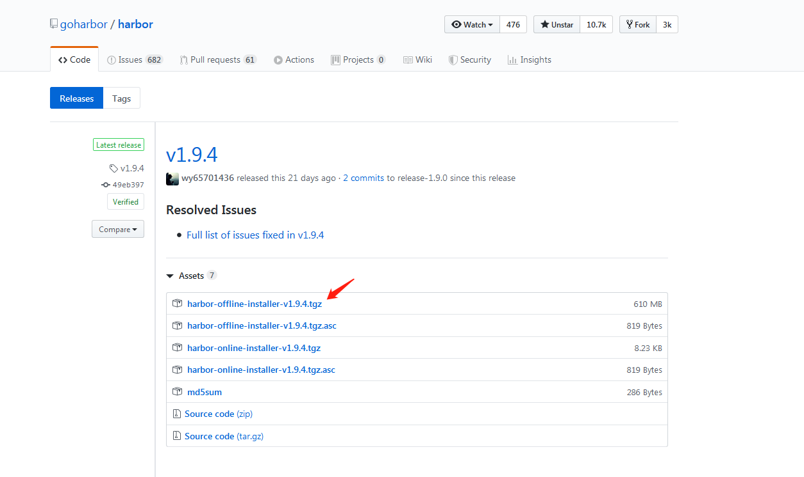

# harbor仓库搭建

###实验环境

	192.168.5.35 Centos7.6

###实验准备

	~]# systemctl stop firewalld
	~]# systemctl disable firewalld
	
	~]# sed -i 's/SELINUX=enable/SELINUX=disabled/g' /etc/sysconfig/selinux 
	~]# setenforce 0
	
###harbor搭建

	~]# wget https://mirrors.aliyun.com/docker-ce/linux/centos/docker-ce.repo -P /etc/yum.repos.d/

	~]# yum install -y docker-ce docker-compose

	~]# systemctl start docker 
	~]# systemctl enable docker

	~]# curl -L https://github.com/docker/compose/releases/download/v1.25.2/docker-compose-`uname -s`-`uname -m` -o /usr/local/bin/docker-compose
	~]# chmod +x /usr/local/bin/docker-compose

#####下载包：

	~]# wget https://github.com/goharbor/harbor/releases/download/v1.9.4/harbor-offline-installer-v1.9.4.tgz

	#offline与online的区别是前者包中已有harbor镜像，后者需在线安装

	~]# tar xf harbor-offline-installer-v1.9.4.tgz -C /usr/local/

	~]# cat harbor.yml | grep -vE "#|^$"
		hostname: harbor.ik8s.io
		http:
		  port: 80
		  port: 443							#默认为80，启动443后会将80请求重定向
		   certificate: /data/ssl/harbor.crt
		   private_key: /data/ssl/harbor.key
		harbor_admin_password: Harbor12345	#web界面管理账号  admin/Harbor12345
		database:
		  password: root123
		  max_idle_conns: 50
		  max_open_conns: 100
		data_volume: /data
		clair:
		  updaters_interval: 12
		jobservice:
		  max_job_workers: 10
		notification:
		  webhook_job_max_retry: 10
		chart:
		  absolute_url: disabled
		log:
		  level: info
		  local:
		    rotate_count: 50
		    rotate_size: 200M
		    location: /var/log/harbor
		_version: 1.9.0
		proxy:
		  http_proxy:
		  https_proxy:
		  no_proxy:
		  components:
		    - core
		    - jobservice
		    - clair

	~]# ./prepare
	~]# ./install.sh 

	

	
####签发证书

	1. 自建CA
		~]# cd /etc/pki/CA
		~]# (umask 077;openssl genrsa -out private/cakey.pem 2048)
		~]# openssl req -new -x509 -key private/cakey.pem -out cacert.pem -days 3650

	2. 建立相关序列和索引文件
	
		~]# touch index.txt
		~]# echo "01" > serial
	
	3. nginx端生成证书请求
		
		~]# mkdir /data/ssl -pv
		~]# cd /data/ssl
		~]# (umask 077;openssl genrsa -out /data/ssl/harbor.key 2048)
		~]# openssl req -new -key /data/ssl/harbor.key -out /data/ssl/harbor.csr
	
	4. CA为证书请求颁发证书
		
		~]# cd -
		~]# openssl ca -in /data/ssl/harbor.csr -out /data/ssl/harbor.crt

####重载配置

	~]# docker-compose down -v
	~]# vim harbor.yml		#修改配置
	~]# ./prepare
	~]# docker-compose up -d
		

####http访问

	客户端配置
	~]# cat /etc/docker/daemon.json 		#配上host，然后加上非安全访问即可
		{
		  "insecure-registries":["http://harbor.ik8s.io"]
		}

	~]# systemctl daemon-reload
	~]# systemctl restart docker 

	~]# docker login admin		#登录后会将密码存在 /root/.docker/config.json

####https访问

	arbor采用https的方式交换数据，Docker客户端处需要配置签署 harbor 证书的 CA 证书。

    在Docker客户端服务器上创建指定目录：/etc/docker/certs.d/[IP地址或域名]（Harbor地址，harbor.cfg文件中的hostname项）

	~]# mkdir -p /etc/docker/certs.d/[IP地址或域名]

    拷贝CA证书到上述目录中

	