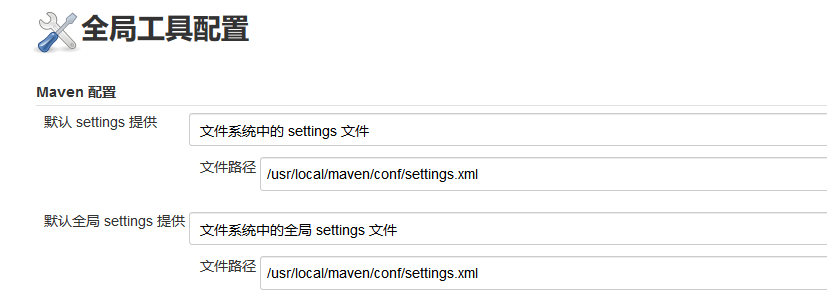
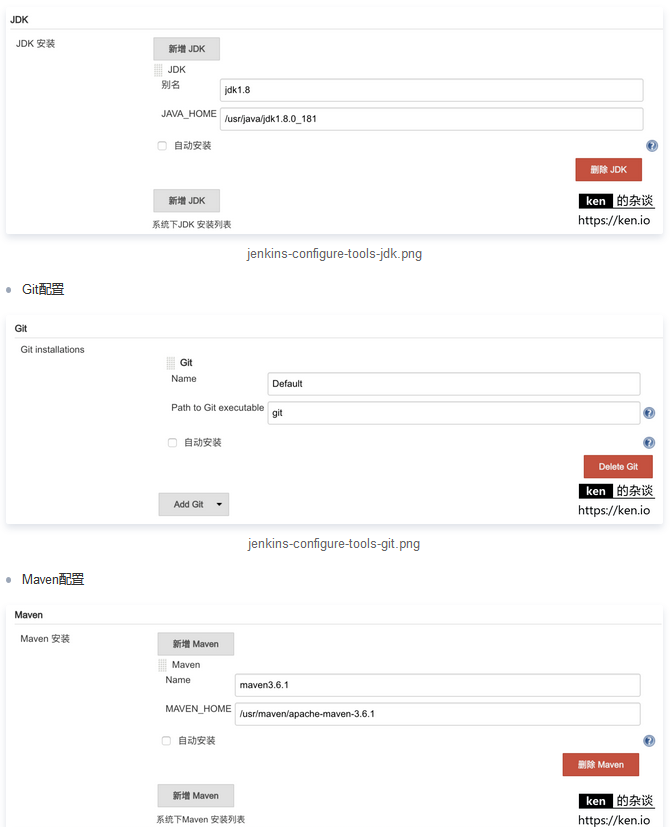
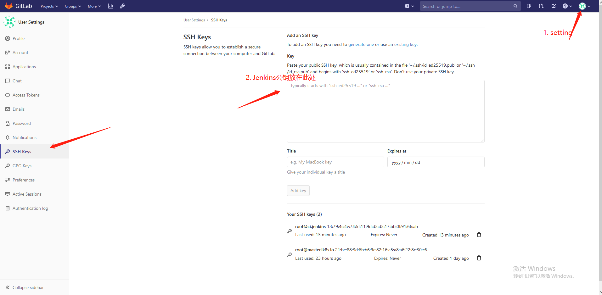
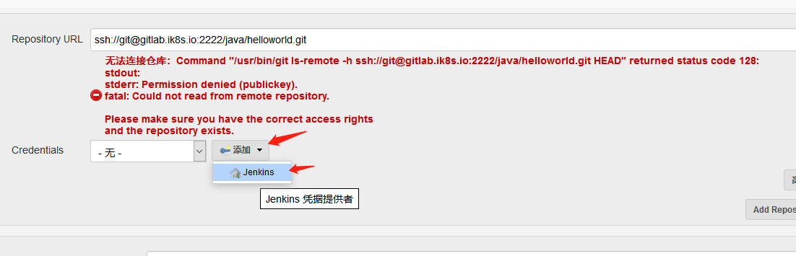
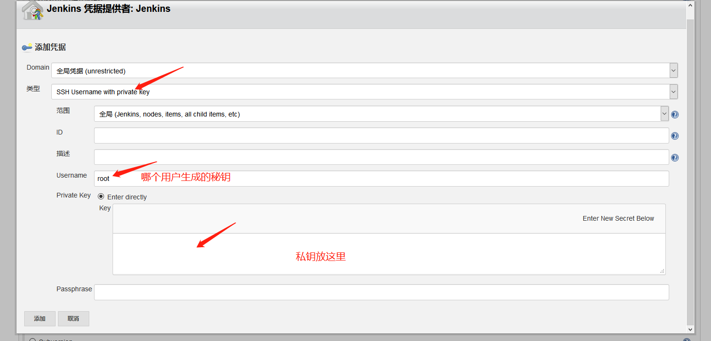
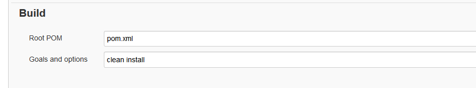

# 1. Gitlab搭建

## 1.1 yum安装

官网：https://about.gitlab.com/

rpm地址：https://packages.gitlab.com/gitlab/gitlab-ce

```
~]# cat /etc/yum.repos.d/gitlab-ce.repo		#官网速度太慢，可使用国内源 
    [gitlab-ce]
    name=Gitlab CE Repository
    baseurl=https://mirrors.tuna.tsinghua.edu.cn/gitlab-ce/yum/el$releasever/
    gpgcheck=0
    enabled=1

~]# yum install -y gitlab-ce
~]# cat /etc/gitlab/gitlab.rb | grep -vE "#|^$"
	external_url 'http://chuan.gitlab.com'

~]# gitlab-ctl reconfigure		#修改完配置后要执行此操作
```

## 1.2 docker安装

```c
~]# wget https://mirrors.aliyun.com/docker-ce/linux/centos/docker-ce.repo -P /etc/yum.repos.d/
~]# yum install -y docker-ce
    
~]# mkdir /etc/docker			#启动镜像加速

~]# vim /etc/docker/daemon.json
	{
 		"registry-mirrors": ["https://nqq67ahg.mirror.aliyuncs.com"]
	}

~]# systemctl daemon-reload
~]# systemctl start docker 			#不能先启动kubelet，否则会报错
    
~]# docker pull gitlab/gitlab-ce

~]# mkdir /data/{gitlab,jenkins} -pv
~]# cd /data/gitlab/

~]# mkdir log etc data
~]# docker run --name gitlab -d -p 8880:80 -p 8443:443 -p 2222:22 --restart always -v /data/gitlab/etc:/etc/gitlab -v /data/gitlab/data:/var/opt/gitlab -v /data/gitlab/log:/var/log/gitlab --privileged=true gitlab/gitlab-ce

~]# docker exec -it gitlab /bin/bash 
/ # cat /etc/gitlab/gitlab.rb | grep -vE "#|^$"
    external_url 'http://gitlab.ik8s.io'			#用户登录地址
	gitlab_rails['gitlab_ssh_host'] = 'gitlab.ik8s.io'		#ssh克隆地址
	gitlab_rails['gitlab_shell_ssh_port'] = 2222			#ssh克隆端口
    gitlab_rails['backup_path'] = "/var/opt/gitlab/backups"	 #默认备份路径
    gitlab_rails['backup_keep_time'] = 604800				#默认存储备份文件时长，超过时长删除备份，单位s，7天
/ # gitlab-ctl reconfigure
    
    
http://gitlab.ik8s.io:8880
账号：root/password

https://segmentfault.com/a/1190000019721220
```

# 2. Gitlab使用

## 2.1 gitlab常用命令

```c
gitlab-ctl:
    gitlab-ctl reconfigure 	#修改完配置文件要执行此操作
    gitlab-ctl 				#客户端命令行操作行
    gitlab-ctl stop 		#停止 gitlab
    gitlab-ctl start 		#启动 gitlab
    gitlab-ctl restart 		#重启 gitlab
    gitlab-ctl status 		#查看组件运行状态
    gitlab-ctl tail nginx 	#查看某个组件的日志
    
gitlab-rake 		#数据备份恢复等数据操作
```

## 2.2 git常用命令

```c
git config --global user.name "name" 		#设置全局用户名
git config --global user.email xxx@xx.com 	#设置全局邮箱
git config --global --list 					#列出用户全局设置
git add index.html / . 			#添加指定文件、目录或当前目录下所有数据到暂存区
git clone HTTP_URL	#克隆代码
git clone -b dev HTTP_URL	#克隆dev分支的代码
git commit -m "11" 	#提交文件到工作区
git status 			#查看工作区的状态
git push 			#提交代码到服务器
git pull 			#获取代码到本地
git log 			#查看操作日志
vim .gitignore 		#定义忽略文件
git reset --hard HEAD^^ 	#git 版本回滚， HEAD 为当前版本，加一个^为上一个，^^为上上一个版本
git reflog 					#获取每次提交的 ID，可以使用--hard 根据提交的 ID 进行版本回退
git reset --hard 5ae4b06 	#回退到指定 id 的版本
git branch 					#查看当前所处的分支
git checkout -b develop 	#创建并切换到一个新分支
git checkout develop 		#切换分支
```

## 2.3 gitlab数据备份与恢复

**全量备份：**

```c
#停止 gitlab 数据服务
~]# gitlab-ctl stop unicorn
~]# gitlab-ctl stop sidekiq		

#手动备份数据    
~]# gitlab-rake gitlab:backup:create
~]# ll /var/opt/gitlab/backups/		#默认备份目录
-rw-------. 1 git git 184320 5月  27 06:55 1590576923_2020_05_27_13.0.0_gitlab_backup.tar

#备份完成后启动服务   
~]# gitlab-ctl start 
```

**恢复：**

```c
#恢复数据之前停止服务
~]# gitlab-ctl stop unicorn
~]# gitlab-ctl stop sidekiq 

#恢复数据，文件只需要到版本号即可
~]# gitlab-rake gitlab:backup:restore BACKUP=1590576923_2020_05_27_13.0.0
    
#恢复完成后启动服务   
~]# gitlab-ctl start 
```

# 3. 常见部署方式

## 3.1 蓝绿部署

```c
蓝绿部署指的是不停老版本代码(不影响上一个版本访问)，而是在另外一套环境部署新版本然后进行测试，测试通过后将用户流量切到新版本，其特点为业务无中断，升级风险相对较小。
```

**具体过程：**

```c
1.当前版本业务正常访问(V1)
2.在另外一套环境部署新代码(V2)，代码可能是增加了功能或者是修复了某些 bug
3.测试通过之后将用户请求流量切到新版本环境
4.观察一段时间，如有异常直接切换旧版本
5.下次升级，将旧版本升级到新版本(V3)
```

## 3.2 金丝雀发布/灰度发布

```c
金丝雀发布也叫灰度发布，是指在黑与白之间，能够平滑过渡的一种发布方式，灰度发布是增量发布的一种类型，灰度发布是在原有版本可用的情况下，同时部署一个新版本应用作为"金丝雀"(小白鼠)，测试新版本的性能和表现，以保障整体系统稳定的情况下，尽早发现、调整问题。
```

**具体过程：**

```c
1.准备好部署各个阶段的工件，包括：构建工件，测试脚本，配置文件和部署清单文件。
2.从负载均衡列表中移除掉“金丝雀”服务器。
3.升级“金丝雀”应用（排掉原有流量并进行部署）。
4.对应用进行自动化测试。
5.将“金丝雀”服务器重新添加到负载均衡列表中（连通性和健康检查）。
6.如果“金丝雀”在线使用测试成功，升级剩余的其他服务器。（否则就回滚）
    
灰度发布可以保证整体系统的稳定，在初始灰度的时候就可以发现、调整问题，以保证其影响度。
```

## 3.3 滚动发布

```c
滚动发布，一般是取出一个或者多个服务器停止服务，执行更新，并重新将其投入使用。周而复始，直到集群中所有的实例都更新成新版本
```

## 3.4 A/B测试

```c
A/B 测试也是同时运行两个 APP 环境，但是蓝绿部署完全是两码事，A/B 测试是用来测试应用功能表现的方法，例如可用性、受欢迎程度、可见性等等，蓝绿部署的目的是安全稳定地发布新版本应用，并在必要时回滚，即蓝绿部署是一套正式环境环境在线，而A/B 测试是两套正式环境在线。
```

# 4. Tomcat搭建

**jdk：**

```c
~]# tar xf jdk-8u211-linux-x64.tar.gz -C /usr/local/
~]# cd /usr/local/
~]# ln -sv jdk1.8.0_211/ jdk
~]# cat /etc/profile.d/tomcat.sh
export HISTTIMEFORMAT="%F %T `whoami` "				#用于给history加上时间用户信息
export LANG="en_US.utf-8"
export JAVA_HOME=/usr/local/jdk
export CLASSPATH=.:$JAVA_HOME/jre/lib/rt.jar:$JAVA_HOME/lib/dt.jar:$JAVA_HOME/lib/tools.jar
export PATH=$PATH:$JAVA_HOME/bin

~]# source /etc/profile.d/tomcat.sh
~]# java -version

```

**tomcat*2：**

```c
~]# mkdir /apps
~]# tar xf apache-tomcat-8.5.55.tar.gz -C /apps
~]# ln -sv /apps/apache-tomcat-8.5.55/ /apps/tomcat
    
~]# useradd www -u 2019						#跑tomcat用户
~]# mkdir /data/tomcat/webdir/myapp -pv		#
~]# mkdir /data/tomcat/appdir
    
~]# cat /apps/tomcat/conf/server.xml | grep -w '<Host'		#更改数据目录
    <Host name="localhost"  appBase="/data/tomcat/webdir"
    
~]# cat /data/tomcat/webdir/myapp/index.html
	<h1>node:IP</h1>    
        
~]# chown -R www:www /apps /data
    
~]# cat /etc/init.d/tomcat
    #!/bin/bash
    BIN_PATH="/apps/tomcat/bin"

    function start()
    {
        PID=`ps -ef | grep tomcat | grep java | awk '{print $2}'`
        if [ -n "$PID" ];then
            echo "PID $PID tomcat is already running..." 
        else
            $BIN_PATH/catalina.sh start
        fi
    }

    function stop()
    {
        PID=`ps aux | grep tomcat | grep java | awk '{print $2}'`
        for i in $PID
        do
            kill -9 $i
            echo "PID $i is killed..."
        done
    }

    function restart()
    {
        stop
        start
    }

    if [ "$#" != "1" ];then
        echo "参数个数不为1"
        exit 1
    fi

    case $1 in
        start)
            start
        ;;
        stop)
            stop
        ;;
        restart)
            restart
        ;;
        *)
            echo "参数错误"
        ;;
    esac


```

# 5. Jenkins

## 5.1 Jenkins搭建

下载rpm包：https://pkg.jenkins.io/redhat-stable/

插件地址：http://updates.jenkins-ci.org/

```c
~]# wget https://pkg.jenkins.io/redhat-stable/jenkins-2.164.3-1.1.noarch.rpm
~]# rpm -ivh jenkins-2.164.3-1.1.noarch.rpm
    
~]# grep -v "#" /etc/sysconfig/jenkins | grep -v "^$"	jenkins配置文件
    JENKINS_HOME="/var/lib/jenkins"
    JENKINS_JAVA_CMD=""
    JENKINS_USER="jenkins"
    JENKINS_JAVA_OPTIONS="-Djava.awt.headless=true"
    JENKINS_PORT="8080"
    JENKINS_LISTEN_ADDRESS=""
    JENKINS_HTTPS_PORT=""
    JENKINS_HTTPS_KEYSTORE=""
    JENKINS_HTTPS_KEYSTORE_PASSWORD=""
    JENKINS_HTTPS_LISTEN_ADDRESS=""
    JENKINS_DEBUG_LEVEL="5"
    JENKINS_ENABLE_ACCESS_LOG="no"
    JENKINS_HANDLER_MAX="100"
    JENKINS_HANDLER_IDLE="20"
    JENKINS_ARGS=""
    
~]# /var/lib/jenkins/		#jenkins数据存储目录 
    
    
~]# ln -sv /usr/local/jdk/bin/java /usr/bin/java		#若不做此连接，jenkins将找不到java命令
    
~]# systemctl start jenkins	
   
# 手动部署插件，将插件下载到 /var/lib/jenkins/plugins 下，或者在界面上进行添加，命令行添加注意权限问题
   
可选参数：   
JENKINS_ARGS="-server -Xms1g -Xmx1g -Xss512k -Xmn1g
-XX:CMSInitiatingOccupancyFraction=65
-XX:+UseFastAccessorMethods
-XX:+AggressiveOpts -XX:+UseBiasedLocking
-XX:+DisableExplicitGC -XX:MaxTenuringThreshold=10
-XX:NewSize=2048M -XX:MaxNewSize=2048M -XX:NewRatio=2
-XX:PermSize=128m -XX:MaxPermSize=512m -XX:CMSFullGCsBeforeCompaction=5
-XX:+ExplicitGCInvokesConcurrent -XX:+UseConcMarkSweepGC -XX:+UseParNewGC
-XX:+CMSParallelRemarkEnabled -Djava.awt.headless=true
-Dcom.sun.management.jmxremote
-Dcom.sun.management.jmxremote.port=10049
-Dcom.sun.management.jmxremote.authenticate=false
-Dcom.sun.management.jmxremote.ssl=false
-Djava.rmi.server.hostname="192.168.100.150""		#此项为zabbix监控需要，监听10049端口
    


```

## 5.2 Jenkins升级

```c
~]# wget https://mirrors.tuna.tsinghua.edu.cn/jenkins/war/2.220/jenkins.war

~]# rpm -ql jenkins        
    /etc/init.d/jenkins
    /etc/logrotate.d/jenkins
    /etc/sysconfig/jenkins
    /usr/lib/jenkins
    /usr/lib/jenkins/jenkins.war		#将下好的war包替换此包
    /usr/sbin/rcjenkins
    /var/cache/jenkins
    /var/lib/jenkins
    /var/log/jenkins
    
~]# systemctl stop jenkins 
    
~]# mv /usr/lib/jenkins/jenkins.war /usr/lib/jenkins/jenkins.war_bak

~]# mv jenkins.war  /usr/lib/jenkins/
    
~]# systemctl start jenkins

    
    
```

# 6. jenkins+maven+git构建Java项目

安装插件：git、Maven Integration、Publish Over SSH 

**安装maven：**

```c
http://maven.apache.org/download.cgi

~]# wget https://mirrors.tuna.tsinghua.edu.cn/apache/maven/maven-3/3.6.3/binaries/apache-maven-3.6.3-bin.tar.gz
~]# tar xf apache-maven-3.6.3-bin.tar.gz -C /usr/local/
~]# cd /usr/local/
~]# ln -sv apache-maven-3.6.3/ maven
~]# cat /etc/profile.d/mvn.sh 
	MVN_HOME=/usr/local/maven
	PATH=$MVN_HOME/bin:$PATH
~]# . /etc/profile.d/mvn.sh
~]# mvn -v
    Apache Maven 3.6.3 (cecedd343002696d0abb50b32b541b8a6ba2883f)
    Maven home: /usr/local/maven
    Java version: 1.8.0_211, vendor: Oracle Corporation, runtime: /usr/local/jdk1.8.0_211/jre
    Default locale: en_US, platform encoding: UTF-8
    OS name: "linux", version: "3.10.0-957.el7.x86_64", arch: "amd64", family: "unix"
```

注：需要拉取代码的服务器，需在gitlab上注册ssh-key，即在服务器上生成密钥对，公钥需放在gitlab上，实现无交互拉取代码

**Jenkins配置全局配置：**

```c
系统管理->全局工具配置
```






**jenkins配置秘钥认证从gitlab拉取代码：**

Jenkins服务器生成密钥对：

```c
~]# ssh-keygen -t rsa  #一路回车
~]# ll ~/.ssh/			#公钥放在gitlab上，私钥放在Jenkins上，从而实现ssh无交互代码拉取
    -rw------- 1 root root 1675 Jul  8 05:56 id_rsa
    -rw-r--r-- 1 root root  397 Jul  8 05:56 id_rsa.pub
    -rw-r--r-- 1 root root  206 Jul  8 05:59 known_hosts
```

gitlab：



jenkins：第一次创建项目时





**maven 构建项目：**先清除，然后构建



