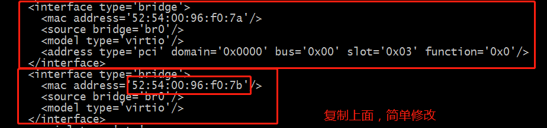

# KVM装机 #

## 实验环境 ##

	宿主机：Centos7.6
	安装镜像：Centos7.6

## 关闭防火墙、SELINUX ##

	~]# systemctl stop firewalld
	~]# systemctl disable firewalld

	~]# sed -i 's/SELINUX=enable/SELINUX=disabled/g' /etc/sysconfig/selinux 
	~]# setenforce 0

## 1.虚拟机开启虚拟化选项 ##

## 2.查看宿主机是否支持虚拟化 ##

	~]# grep --color -E '(vmx|svm)' /proc/cpuinfo				#有vmx就说明支持
	....................................vmx.......................................... 
	
## 3.配置网卡 ##

	~]# cat /etc/sysconfig/network-scripts/ifcfg-eth0		#加上最后一行
		TYPE=Ethernet
		PROXY_METHOD=none
		BROWSER_ONLY=no
		BOOTPROTO=dhcp
		DEFROUTE=yes
		IPV4_FAILURE_FATAL=no
		NAME=eth0
		UUID=d5792590-f1b7-4705-ba41-6d3fd8cf2507
		DEVICE=eth0
		ONBOOT=yes
		
		BRIDGE=br0

	~]# cat /etc/sysconfig/network-scripts/ifcfg-br0		#新建一个网卡，填入宿主机的IP，MASK，GATEWAY，DNS等信息
		TYPE='Bridge'
		BOOTPROTO=static
		DEVICE='br0'
		ONBOOT='yes'
		IPADDR=192.168.164.156
		NETMASK=255.255.255.0
		GATEWAY=192.168.164.2
		DNS1=192.168.164.2
		DELAY='0'

	~]# systemctl restart network
	~]# yum install -y net-tools

## 4.安装kvm ##
	
	~]# wget https://mirrors.aliyun.com/epel/epel-release-latest-7.noarch.rpm			#更新源
	~]# rpm -ivh epel-release-latest-7.noarch.rpm

	~]# yum -y install			\
		qemu-kvm 				\
		qemu-kvm-tools 			\
		qemu-img				\
		virt-manager 			\
		libvirt 				\		
		libvirt-python 			\
		libvirt-client 			\
		bridge-utils 			\
		virt-viewer 			\
		virt-install

	~]# systemctl start libvirtd
	~]#	systemctl enable libvirtd

	~]# lsmod | grep kvm			#查看kvm模块
		kvm_intel             183621  3 
		kvm                   586948  1 kvm_intel
		irqbypass              13503  3 kvm

	
	~]# virsh -c qemu:///system list
		 Id    Name                           State
		----------------------------------------------------
 
	~]# virsh --version
		4.5.0

	~]# virt-install --version
		1.5.0	

	
	~]# mkdir /data/{iso,vm-image}		#存放iso文件和安装文件

	~]# virt-install 
		--name Centos7.6-kvm-1 		\							#虚拟机名称
		--ram 1024 	\											#分配内存大小		
		--vcpus=1 	\											#分配cpu个数	
		--disk path=/data/vm-image/Centos7.6-kvm-1.img,size=10 \		#安装镜像文件存放目录，size为磁盘空间大小，单位G	
		--network bridge=br0 		\							#桥接网卡信息
		--cdrom /data/iso/CentOS-7-x86_64-DVD-1810.iso \		#iso文件
		--vnclisten=192.168.164.156 \		#vnc连接地址
		--vncport=6900 				\		#vnc连接端口
		--vnc								#连接方式

	出现如下提示，需要登录vnc客户端进行连接：
		Domain installation still in progress. Waiting for installation to complete.	
		

## 5.安装vncviewer ##

	可找一台windows机器进行安装，连接来初始化虚拟机，选相应的版本进行安装即可
	https://www.realvnc.com/en/connect/download/viewer/
	
	按下面步骤连接上后，就是装系统的操作了

### 初始化系统
	初始化网卡
	初始化dns

## 6.常用命令 ##

	virsh list 				#查看正在运行 
	virsh list --all 		#查看所有 
	virsh start NAME 		#启动 
	virsh shutdown NAME		#关机 
	virsh destroy NAME 		#强制关机 
	virsh autostart NAME 	#随机启动 
	virsh suspend NAME 		#挂起 
	virsh resume NAME 		#恢复 
	virsh domrename OldName NewName 	#修改主机名，关机状态才能修改
	virsh undefine NAME 	#删除虚拟机,只会删除配置文件，不会删除磁盘文件 
	virsh define NAME		#导入虚拟机,只能恢复配置文件丢失的情况
	virsh edit NAME 		#编辑,虚拟机配置可以动态查看编辑，默认配置放在/etc/libvirt/qemu/
	virsh vncdisplay NAME	#查看vnc端口 0->5900
	virsh autostart (--disable) NAME		#开机自启
	

## 7.宿主机登录KVM虚拟机 ##

### 1.通过ssh连接

### 2.通过virsh console 连接

	kvm虚拟机内操作
	~]# grubby --update-kernel=ALL --args="console=ttyS0,115200n8"
	~]# reboot

	宿主机连接
	~]# virsh console NAME 

## 8.虚拟机磁盘扩容(慎重使用) ##

### 热扩容(虚拟机开机状态下，不推荐使用)

	~]# qemu-img create -f raw /data/vm-image/Centos7.6-kvm-1.img 3G
	~]# virsh attach-disk Centos7.6-kvm-1 /data/vm-image/Centos7.6-kvm-1.img  vdb --cache none
	
### 冷扩容(虚拟机关机状态下)
	
	~]# qemu-img create -f qcow2 /data/vm-image/Centos7.6-kvm-1.img 5G			#qcow2是对应操作系统xml文件中disk区域type名称

	~]# vim /etc/libvirt/qemu/Centos7.6-kvm-1.img
	...
	<disk type='file' device='disk'>
      <driver name='qemu' type='qcow2'/>
      <source file='/data/vm-image/centos7.6-kvm-1_desk.img'/>
      <target dev='vdb' bus='virtio'/>
	</disk>
	...
	
	~]# systemctl restart libvirtd

## 9.克隆镜像 ##

	被克隆镜像需要关机
	~]# virt-clone 
		--original c7kvm-1 					#被克隆服务器名
		--name c7kvm-1_bak 					#新主机名
		-f /data/vm-image/c7kvm-1_bak.img 	#安装文件存放位置
		--force 								#强制执行

	~]# vi /etc/libvirt/qemu/c7kvm-1_bak.xml			#修改克隆配置文件
	...
	<graphics type='vnc' port='5901' autoport='no' listen='192.168.164.156'>		#修改vnc端口，不设置为自动
	...

	~]# systemctl restart libvirtd		

## 10.迁移 ##

	基本原理就是把这个虚拟机的xml文件和img传到其它虚拟机里面，然后修改xml文件中的ip和端口等其它文件，如果你有磁盘文件，也需要一起cp到目标服务器上。
	~]# virsh domblklist c7kvm-1
		Target     Source
		------------------------------------------------
		vda        /data/vm-image/c7kvm-1.img
		hda        -

	~]# virsh define /etc/libvirt/qemu/c7kvm-1.xml

## 11.增加网卡 ##

### 1.宿主机修改虚拟机xml配置文件

	
	~]# vi /etc/libvirt/qemu/c7kvm-1.xml

	

	~]# systemctl restart libvirtd		#重启服务以及虚拟机	
	~]# virsh shutdown c7kvm-1
	~]# virsh start c7kvm-1

### 2.虚拟机内配置

	~]# nmcli conn			#查看新网卡UUID
		NAME                UUID                                  TYPE      DEVICE 
		eth0                56173dc0-f238-4ec0-8a8e-bf1b27479e05  ethernet  eth0   
		Wired connection 1  796e863b-865c-3152-ac3b-18c37553d41f  ethernet  eth1 

	~]# cp /etc/sysconfig/network-scripts/ifcfg-eth0 /etc/sysconfig/network-scripts/ifcfg-eth1
	~]# vi /etc/sysconfig/network-scripts/ifcfg-eth1

	
	~]# systemctl restart network
	
## 12.网络由NAT改为桥接 ##

	
	
		
webvirtmgr:虚拟机web管理接口

	https://www.cnblogs.com/lei0213/p/10785156.html
	

	
