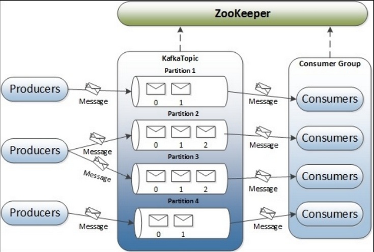

# kafka架构图:



## 1. kafka基础操作

**1.启动/停止 kafka**

```c
~]# ./kafka-server-start.sh -daemon server.properties
    
~]# ./kafka-server-stop.sh
```

**2.创建一个topic**

```c
~]# ./kafka-topics.sh --create --topic test1 --zookeeper 192.168.5.60:2181,192.168.5.61:2181,192.168.5.62:2181 --replication-factor 2 --partitions 6

参数解析:	
	--topic：指定topic name
	--partitions：指定分区数，这个参数需要根据broker数和数据量决定，正常情况下，每个broker上两个partition最好 
	--replication-factor：指定partition的replicas数，建议设置为2
```

**3.查看topic**

```c
#展示所有topic：
~]# ./kafka-topics.sh --list --zookeeper 192.168.5.60:2181,192.168.5.61:2181,192.168.5.62:2181
    
#描述topic详细信息
~]# ./kafka-topics.sh --describe --zookeeper 192.168.5.60:2181 --topic test1	#zk集群只需要写一个节点即可
    Topic:history-topic     PartitionCount:3        ReplicationFactor:1     Configs:
        Topic: history-topic    Partition: 0    Leader: 0       Replicas: 0     Isr: 0
        Topic: history-topic    Partition: 1    Leader: 2       Replicas: 2     Isr: 2
        Topic: history-topic    Partition: 2    Leader: 0       Replicas: 0     Isr: 0
            
PartitionCount：partition 个数。
ReplicationFactor：副本个数。
Partition：partition 编号，从 0 开始递增。
Leader：当前 partition 起作用的 breaker.id。
Replicas: 当前副本数据所在的 breaker.id，是一个列表，排在最前面的起作用。
Isr：当前分区中可用的副本(即在允许范围内，与leader最近的副本)，慢于时间超过replica.lag.time.max.ms后，它就变成“非同步”副本，就会被踢出ISR副本集合中。但后面如何follower副本的速度慢慢提上来，那就又可能会重新加入ISR副本集合中了
```

**4.修改topic**

```c
#修改topic的分区数(修改分区数时，仅能增加分区个数,减少会报错，且不能用来修改副本个数)
~]# ./kafka-topics.sh --alter --zookeeper 192.168.5.60:2181 --partitions 8 --topic test1 
    
#删除topic
~]# ./kafka-topics.sh --delete --bootstrap-server node1:9092,node2:9092,node3:9092 --topic topicName	

#消费出的消息结果将打印出消息体的 key 和 value。
~]# ./kafka-console-consumer.sh --bootstrap-server node1:9092,node2:9092,node3:9092 --property print.key=true --topic topicName
```

**5.查看消费组信息**

```c
# 查看有那些 group ID 正在进行消费
~]# ./kafka-consumer-groups.sh --new-consumer --bootstrap-server 192.168.75.128:9092 --list

# 查看指定group.id 的消费者消费情况 
~]# ./kafka-consumer-groups.sh --new-consumer --bootstrap-server 192.168.75.128:9092 --group group --describe
TOPIC  PARTITION  CURRENT-OFFSET  LOG-END-OFFSET  LAG   CONSUMER-ID     HOST               CLIENT-ID
topic     0         10426              10429       3    consumer-1   /10.25.172.104      consumer-1

TOPIC:队列名
PARTITION:分区号
CURRENT-OFFSET:当前消费到的偏移量
LOG-END-OFFSET:下一条消息生产的偏移量
LAG:消息积压数量
CONSUMER-ID:消费id
HOST:主机ip
CLIENT-ID:客户端id
```

**6.生产者生产、消费组消费**

	#生产者生产
	~]# kafka-console-producer.sh --broker-list 192.168.5.60:9092 --topic test1 
	
	#消费者消费
	1) 从头开始 
	~]# kafka-console-consumer.sh --bootstrap-server localhost:9092 --topic test --from-beginning 
	
	2) 从尾部开始 
	~]# kafka-console-consumer.sh --bootstrap-server localhost:9092 --topic test --offset latest 
	
	3) 指定分区 
	~]# kafka-console-consumer.sh --bootstrap-server localhost:9092 --topic test --offset latest --partition 1 
	
	4) 取指定个数 
	~]# kafka-console-consumer.sh --bootstrap-server localhost:9092 --topic test --offset latest --partition 1 --max-messages 1 
	
	5) 新消费者（ver>=0.9） 
	~]# kafka-console-consumer.sh --bootstrap-server localhost:9092 --topic test --new-consumer --from-beginning --consumer.config config/consumer.properties 

**7.平衡分区leader**

```c
~]# ./kafka-preferred-replica-election.sh --zookeeper 192.168.5.60:2181
    
#也可以直接通过配置文件实现  auto.leader.rebalance.enable=true  默认打开的
```

**8.自带压测工具**

```c
~]# ./kafka-producer-perf-test.sh --topic test --num-records 100 --record-size 1 --throughput 100 --producer-props bootstrap.servers=localhost:9092 
```


## 2.kafka server.properties 配置文件

	############################# Server Basics #############################
	#每一个broker在集群中的唯一表示，要求是正数。当该服务器的IP地址发生改变时，broker.id没有变化，则不会影响consumers的消息情况
	broker.id=0	
	
	############################# Socket Server Settings #############################
	#监控的kafka端口
	listeners=PLAINTEXT://192.168.5.60:9092
	
	#broker处理消息的最大线程数，一般情况下不需要去修改 
	num.network.threads=3
	
	#broker处理磁盘IO的线程数，数值应该大于你的硬盘数 
	num.io.threads=8
	
	#socket的发送缓冲区，socket的调优参数SO_SNDBUFF 
	socket.send.buffer.bytes=102400
	
	#socket的接受缓冲区，socket的调优参数SO_RCVBUFF 
	socket.receive.buffer.bytes=102400
	
	#socket请求的最大数值，防止serverOOM，message.max.bytes必然要小于socket.request.max.bytes，会被topic创建时的指定参数覆盖 
	socket.request.max.bytes=104857600
	
	############################# Log Basics #############################
	#kafka数据的存放地址，多个地址的话用逗号分割,多个目录分布在不同磁盘上可以提高读写性能  /data/kafka-logs-1，/data/kafka-logs-2
	log.dirs=/usr/local/kafka/kafka-logs
	
	#设置partitions 的个数
	num.partitions=3
	
	#在启动时用于日志恢复和在关闭时刷新的每个数据目录的线程数。
	num.recovery.threads.per.data.dir=1
	
	############################# Internal Topic Settings  #############################
	#
	offsets.topic.replication.factor=1
	transaction.state.log.replication.factor=1
	transaction.state.log.min.isr=1	
	
	############################# Log Flush Policy #############################
	#log文件”sync”到磁盘之前累积的消息条数，下为10000条,因为磁盘IO操作是一个慢操作,但又是一个”数据可靠性"的必要手段,所以此参数的设置,需要在"数据可靠性"与"性能"之间做必要的权衡.如果此值过大,将会导致每次"fsync"的时间较长(IO阻塞),如果此值过小,将会导致"fsync"的次数较多,这也意味着整体的client请求有一定的延迟.物理server故障,将会导致没有fsync的消息丢失.
	log.flush.interval.messages=10000
	
	#仅仅通过interval来控制消息的磁盘写入时机,是不足的.此参数用于控制"fsync"的时间间隔,如果消息量始终没有达到阀值,但是离上一次磁盘同步的时间间隔达到阀值,也将触发.
	log.flush.interval.ms=1000
	
	############################# Log Retention Policy #############################
	# log.retention.minutes 或 log.retention.hours 数据文件保留多长时间， 存储的最大时间超过这个时间会根据log.cleanup.policy设置数据清除策略，log.retention.bytes和log.retention.minutes或log.retention.hours任意一个达到要求，都会执行删除
	# 有2删除数据文件方式：
	#	按照文件大小删除：log.retention.bytes
	# 	按照2种不同时间粒度删除：分别为分钟，小时
	log.retention.hours=168
	
	# topic每个分区的最大文件大小，一个topic的大小限制 = 分区数*log.retention.bytes。-1没有大小限log.retention.bytes和log.retention.minutes任意一个达到要求，都会执行删除，会被topic创建时的指定参数覆盖
	log.retention.bytes=1073741824
	
	#topic的分区是以一堆segment文件存储的，这个控制每个segment的大小，会被topic创建时的指定参数覆盖 
	log.segment.bytes=1073741824
	
	#文件大小检查的周期时间，是否触发 log.cleanup.policy中设置的策略
	log.retention.check.interval.ms=300000
	
	############################# Zookeeper #############################
	#kafka连接zk的集群，多个用”,”号隔开；#这样写不是很友好，kafka在连上zk后，直接在zk的根目录创建自己需要的文件夹，这样会导致如果有别的项目也在用zk，会导致zk的根目录下特别的乱，kafka会产生一个controller的文件夹，如果别的项目也有controller会导致冲突和混淆，所以推荐以下用法：zookeeper.connect=192.168.43.15:2181/kafka,192.168.43.16:2181/kafka,192.168.43.17:2181/kafka
	zookeeper.connect=192.168.5.60:2181,192.168.5.61:2181,192.168.5.62:2181
	
	#kafka连接Zookeeper的超时时间
	zookeeper.connection.timeout.ms=6000
	
	############################# Group Coordinator Settings #############################
	
	group.initial.rebalance.delay.ms=0
	
	更多配置参考官网：http://kafka.apache.org/documentation/#brokerconfigs

## 3.kafka配置优化

	https://blog.csdn.net/lizhitao/article/details/42180265

## 4.kafka启动参数调整

	#kafka节点默认需要的内存为1G，如果需要修改内存，可以修改kafka-server-start.sh的配置项。
	~]# vim /usr/local/kafka/kafka_2.12-2.0.0/bin/kafka-server-start.sh
		#找到KAFKA_HEAP_OPTS配置项，例如修改如下：
	    export KAFKA_HEAP_OPTS="-Xmx2G -Xms2G"

## 5.kafka学习系列文章

	https://blog.csdn.net/lizhitao/article/details/39499283