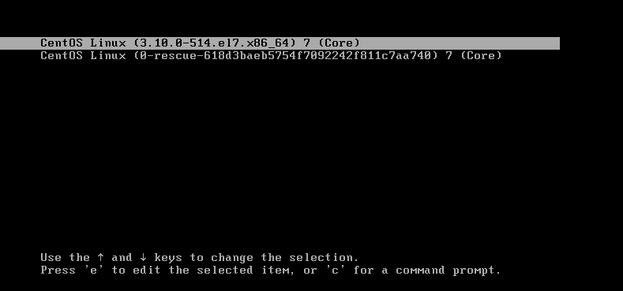

###1.开机

	任意键暂停启动

###2.编辑

* 按e进入编辑模式
* 在 linux16 行最末添加  rw init=/sysroot/bin/sh
* 按 ctrl+x 启动
* 输入 chroot /sysroot
* 输入 passwd root 修改密码
* 输入 touch  /.autorelabel
* 输入 exit 退出
* 输入 reboot 重启，新密码登录