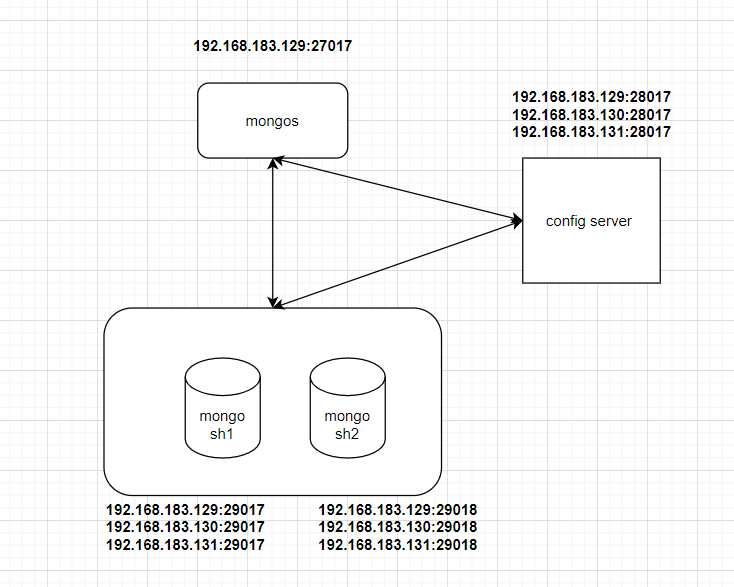

# 1. MongoDB安装

## 1.1 yum安装

```c
~]# cat /etc/yum.repos.d/mongodb-org.repo
    [mongodb-org] 
    name = MongoDB Repository
    baseurl = https://mirrors.aliyun.com/mongodb/yum/redhat/$releasever/mongodb-org/3.6/x86_64/
    gpgcheck = 1 
    enabled = 1 
    gpgkey = https:// www.mongodb.org/static/pgp/server-3.6.asc

~]# yum install -y mongodb-org-server mongodb-org-shell mongodb-org-tools
~]# cat /etc/mongod.conf | grep -vE "#|^$"
    systemLog:
      destination: file
      logAppend: true
      path: /var/log/mongodb/mongod.log
    storage:
      dbPath: /data/mongodb
      journal:
        enabled: true
    processManagement:
      timeZoneInfo: /usr/share/zoneinfo
    net:
      port: 27017
    
~]# mkdir -pv /data/mongodb
~]# chown mongod:mongod /data -R
    
~]# systemctl start mongod
```

## 1.2 二进制包安装

```c
~]# tar -zxvf mongodb-linux-x86_64-4.0.1.tgz 
~]# mv mongodb-linux-x86_64-4.0.1 /usr/local/mongodb
~]# cd /usr/local/mongodb
~]# mkdir db logs
~]# cat mongodb.conf
    dbpath=/usr/local/mongodb/db
    logpath=/usr/local/mongodb/logs/mongodb.log
    port=27017
    fork=true
~]# ./bin/mongo --host ip --port 27017
```


# 2. CRUD操作

```c
~]# mongo --host 127.0.0.1		#默认登录在test库
    
帮助
> help
> help.mycoll.help()
```

## 2.1 Create

```c
> use stu		#延迟创建数据库，当有数据生成就自动生成库
> db.student.insert({name:"zhangsan",age:55,sex:"M"})		#插入一条数据
    
> show dbs		#插入数据后，库已经生成
  admin   0.000GB
  config  0.000GB
  local   0.000GB
  stu     0.000GB    
    
> show collections 	#可以理解为表
  student
```

## 2.2 Read

```c
> db.student.find()		#查询当前collection所有数据
> db.student.find().pretty()	#结果以json格式显示

find比较操作：
    > db.student.find({age:{$gt: 50}})		#大于
    > db.student.find({age:{$gte: 55}})		#大于等于
    > db.student.find({age:{$lt: 55}})		#小于
    > db.student.find({age:{$lte: 55}})		#小于等于
    > db.student.find({age:{$eq: 55}})		#等于
    > db.student.find({age:{$ne: 55}})		#不等于

find逻辑运算：
    > db.student.find({$or:[{name:"lisi"},{age:{$lt:25}}]})		#or
    > db.student.find({$and:[{sex:"M"},{age:{$lt:25}}]})		#and
	
find type查找：https://www.runoob.com/mongodb/mongodb-operators-type.html
    > db.student.find({age:{$type:1}})		#与下条等同
    > db.student.find({age:{$Type:"double"}})
        
按照列名进行统计计数，实现mysql groupby
    > db.student.aggregate([{$group:{_id:"$age",count:{$sum:1}}}])
    
        _id : 指明根据哪个字段来进行统计
        count: 统计完成后的字段名
            
        1、$sum分组求和

        2、$avg分组平均值

        3、$min分组最小值

        4、$max分组最大值

        5、$first分组第一条记录

        6、$last分组最后一天记录
            
命令行查询mongo数据：
    # 这样有个问题，就是mongo默认不会将数据显示完全，只是简单查询一下没问题，若要导出数据，还是要下面的方法
	~]# /data/server/mongodb_27017/bin/mongo  -u root -p '54master@@)@!1234' --authenticationDatabase 'admin' localhost:27017/union_epg --eval "db.getCollection('epgGroupChannel').find({'epgGroupId':1000109})"
     
    #使用js文件来查询    
	~]# /data/server/mongodb_27017/bin/mongo  -u root -p '54master@@)@!1234' --authenticationDatabase 'admin' localhost:27017/union_epg /home/liuzichuan_cmsc18/query.js > /home/liuzichuan_cmsc18/result.log
        
    ~]# cat /home/liuzichuan_cmsc18/query.js	# json格式打印
        rs.slaveOk()
        # 第一个大括号表示筛选条件，第二个大括号表示显示字段 1 为显示 0 为不显示
		var c = db.getCollection('epgGroupChannel').find({"epgGroupId":1000109},{"code":1,"_id":0})
		while(c.hasNext()) {
    		printjson(c.next());
		}
                  
```

## 2.3 Update

```c
> db.student.update({name:"zhangsan"},{$set:{age:36}})		#修改zhangsan的age字段
> db.student.update({name:"zhangsan"},{$unset:{age:36,sex:"M"}})    #删除zhangsan的age、sex字段
> db.student.update({age:55},{$set:{sex:"G"}},{multi:true})		#当有多个匹配项时，默认只会修改匹配到的第一个，加此参数全部修改   
    
> db.student.save({"_id":ObjectId("5f3df4c027519270934ecb5d"),name:"test",age:66})    	#替换某一个id的数据
```

## 2.4 Delete

```c
> db.student.remove({age:{$gte:55}})		#移除age大于等于55的数据，默认是匹配到的都删除
> db.student.remove({age:{$gte:55}},{justOne:true})		#只删除匹配到的第一个
```

## 2.5 其他操作

```c
use stu		#进入stu库
db.stats()	#查看stu库信息
db.student.stats()	#查看stu库student collection信息
db.student.drop()	#删除stu库student collection
db.dropDatabase()    #删除stu库 
```

# 3. 索引

```
1.单列索引
2.组合索引
3.多键索引：文档中有子文档的时候
4.空间索引
5.全文索引
6.hash索引
```

```c
创建单列索引：
    > use stu
    > for(i=0;i<10000;i++) db.student.insert({name:"student_"+i,age:(i%99),sex:(i%2)})
    > db.student.ensureIndex({name:1})		# 1表示以升序创建索引，-1降序
    > db.student.getIndexes()				#得到coll下所有索引
    > db.student.dropIndex("name_1")		#删除索引
    > db.student.dropIndexes()				#删除当前coll下所有索引  
        
创建唯一索引：
    > db.student.ensureIndex({name:1},{unique:ture})			#创建唯一索引
```

# 4. 用户管理

| **Read**                 | 允许用户读取指定数据库                                       |
| ------------------------ | :----------------------------------------------------------- |
| **readWrite**            | 允许用户读写指定数据库                                       |
| **dbAdmin**              | 允许用户在指定数据库中执行管理函数，如索引创建、删除，查看统计或访问system.profile |
| **userAdmin**            | 允许用户向system.users集合写入，可以找指定数据库里创建、删除和管理用户 |
| **clusterAdmin**         | 只在admin数据库中可用，赋予用户所有分片和复制集相关函数的管理权限。 |
| **readAnyDatabase**      | 只在admin数据库中可用，赋予用户所有数据库的读权限            |
| **readWriteAnyDatabase** | 只在admin数据库中可用，赋予用户所有数据库的读写权限          |
| **userAdminAnyDatabase** | 只在admin数据库中可用，赋予用户所有数据库的userAdmin权限     |
| **dbAdminAnyDatabase**   | 只在admin数据库中可用，赋予用户所有数据库的dbAdmin权限。     |
| **root**                 | 只在admin数据库中可用，超级账号，超级权限                    |

```c
用户创建语法:
{
  user: "<name>", 
  pwd: "<cleartext password>", 
  customData: { <any information> }, 
  roles: [ 
    { role: "<role>", db: "<database>" } | "<role>", 
	... 
  ] 
}

语法说明：
    user字段：用户的名字;
    pwd字段：用户的密码;
    cusomData字段：为任意内容，例如可以为用户全名介绍;
    roles字段：指定用户的角色，可以用一个空数组给新用户设定空角色；
    roles 字段：可以指定内置角色和用户定义的角色。
```

## 4.1 创建用户

### 1.创建管理员用户

```c
#进入管理数据库
> use admin

#创建管理用户，root权限
> db.createUser(
  {
    user: "root",
    pwd: "root",
    roles: [ { role: "root", db: "admin" } ]
  }
  )    

注意：
    1.创建管理员角色用户的时候，必须到admin下创建。
    2.删除的时候也要到相应的库下操作。

#查看创建完用户后的collections；
> show tables; 
  system.users  # 用户存放位置
  system.version
      
#查看创建的管理员用户
> show users
  {
      "_id" : "admin.root",
      "user" : "root",
      "db" : "admin",
      "roles" : [
          {
              "role" : "root",
              "db" : "admin"
          }
      ]
  }

# 验证用户是否能用
> db.auth("root","root")
  1  # 返回 1 即为成功
```

### 2.创建对某库的只读用户

```c
# 在test库创建只读用户test
> use test
> db.createUser(
  {
    user: "test",
    pwd: "test",
    roles: [ { role: "read", db: "test" } ]
  }
  )

# 测试用户是否创建成功
> db.auth("test","test")
> show  users

# 登录test用户，并测试是否只读
~]# mongo --host 127.0.0.1 --port 27017 -utest -ptest stu    
> show collections
> db.createCollection('b')	#会无法创建
```

### 3.**创建某库的读写用户**

```
# 创建test1用户，权限为读写
> db.createUser(
  {
    user: "test1",
    pwd: "test1",
    roles: [ { role: "readWrite", db: "test" } ]
  }
  )

# 查看并测试用户
> show users;
> db.auth("test1","test1")
```

### 4.**创建对多库不同权限的用户**

```
# 创建对app为读写权限，对test库为只读权限的用户
> use app
> db.createUser(
  {
    user: "app",
    pwd: "app",
    roles: [ { role: "readWrite", db: "app" },
             { role: "read", db: "test" }
    ]
  }
  )

# 查看并测试用户
> show users
> db.auth("app","app")
```

### 5.**删除用户**

```
# 删除app用户：先登录到admin数据库
~]# mongo -uroot –proot 127.0.0.1/admin

# 进入app库删除app用户
~]# use app
~]# db.dropUser("app")

```

### 6.命令行中进行登陆

**方法一：登录时验证**

```
~]$ mongo -uroot -proot admin 
    MongoDB shell version: 3.2.8
    connecting to: admin

```

**方法二：在数据库中进行登陆验证**

```
~]$ mongo 
    MongoDB shell version: 3.2.8
    connecting to: test
    > use admin
    switched to db admin
    > db.auth("root","root")
    1
    > show tables;
    system.users
    system.version
```

### 7.查看当前mongo客户端链接数

```c
> db.serverStatus().connections
```

# 5. MongoDB复制

```c
分类：
    1.主从	master/slave
    2.复制集	replica set
```

## 5.1 复制集搭建(replica set)

```c
主节点将数据修改操作保存在oplog中，集群节点至少为3个，且应该为奇数个节点，从节点每2s会向主节点发送心跳信息，通过选举出主节点
    
复制集节点分类：
    
	1. 0优先级节点：这种节点的特点是优先级为0，可参与选举，拥有副本数据，但不被选举成为主节点，可读不可写；这种节点我们也叫冷备节点；通常用于异地容灾使用；

　　2. 被隐藏的从节点：这种节点的特点是，可参与选举，拥有副本数据，但不被选举成为主节点，对客户端不可读写也不可见；通常用于同步同一副本集中的其他节点的不同工作流的场景中；

　　3. 延迟复制的从节点：这种节点的特点是，副本数据落后主节点一个时间窗口，也就说这种节点上的副本数据总是过期的；除此它可参与选举，不可被选举为主节点；主要用于特殊功用；比如在主节点上执行了一个删除操作，我们可以在延迟复制的从节点上把数据找回；

　　4. arbiter节点：这种就是我们说的仲裁节点，它可参与选举，不拥有副本数据，不被选举成为主节点，不可读写；主要作用是辅助判定主节点是否存活，辅助从节点完成选举，实现故障转移；

    对于副本集成员属性，特别需要说明下这几个：priority、hidden、slaveDelay、tags、votes。

    priority：对于副本节点，可以通过该属性来增大或者减小该节点被选举成为主节点的可能性，取值范围为0-1000（如果是arbiters，则取值只有0或者1），数据越大，成为主节点的可能性越大，如果被配置为0，那么他就不能被选举成为主节点，而且也不能主动发起选举。这种特性一般会被用在有多个数据中心的情况下，比如一个主数据中心，一个备份数据中心，主数据中心速度会更快，如果主节点挂掉，我们肯定希望新主节点也在主数据中心产生，那么我们就可以设置在备份数据中心的副本节点优先级为0。
    
    hidden：隐藏节点会从主节点同步数据，但对客户端不可见，在mongo shell 执行 db.isMaster() 方法也不会展示该节点，隐藏节点必须Priority为0，即不可以被选举成为主节点。但是如果有配置选举权限的话，可以参与选举。因为隐藏节点对客户端不可见，所以跟客户端不会互相影响，可以用来备份数据或者跑一些后端定时任务之类的操作
    
    slaveDelay：延迟同步即延迟从主节点同步数据，比如延迟时间配置的1小时，现在时间是 09:52，那么延迟节点中只同步到主节点 08:52 之前的数据。另外需要注意延迟节点必须是隐藏节点，且Priority为0。那这个延迟节点有什么用呢？有过数据库误操作惨痛经历的开发者肯定知道答案，那就是为了防止数据库误操作，比如更新服务前，一般会先执行数据库更新脚本，如果脚本有问题，且操作前未做备份，那数据可能就找不回了。但如果说配置了延迟节点，那误操作完，还有该节点可以兜底，只能说该功能真是贴心
    
    tags：支持对副本集成员打标签，在查询数据时会用到，比如找到对应标签的副本节点，然后从该节点读取数据，这点也非常有用，可以根据标签对节点分类，查询数据时不同服务的客户端指定其对应的标签的节点，对某个标签的节点数量进行增加或减少，也不怕会影响到使用其他标签的服务    
        
    votes：表示节点是否有权限参与选举，最大可以配置7个副本节点参与选举。

        
oplog：
    大小固定的文件，存储在local数据库中
    	初始同步
    	回滚后追赶
    	切分块迁移
    
    local库：存放了副本集的所有元数据和oplog;用于存储oplog的是一个名为oplog.rs的collection，oplog大小依赖于OS与文件系统，				当然可以手动指定
    
Mongo的数据同步类型：
    初始同步：
        节点没有任何数据时
        节点丢失副本复制历史
        
       	初始同步的步骤：
        	1.克隆所有数据库
        	2.应用数据集的所有改变
        	3.为所有collection构建索引
        
    复制：      
```

**复制集搭建：**

```c
~]# tar -zxvf mongodb-linux-x86_64-4.0.1.tgz 
~]# mv mongodb-linux-x86_64-4.0.1 /usr/local/mongodb
~]# cd /usr/local/mongodb
~]# mkdir db logs
~]# cat mongodb.conf		#所有主节点都需要配置此配置
    systemLog:
	   #日志输出目的地，可以指定为“file”或者“syslog”,表述输出到日志文件，如果不指定，则会输出到标准输出中
       destination: file	
       path: "/usr/local/mongodb/logs/mongod.log"
       #如果为 true，当 mongod/mongos 重启后，将在现有日志的尾部继续添加日志。否则，将会备份当前日志文件，然后创建一个新的日志文件；默认为 false。
       logAppend: true
    storage:
       dbPath: "/usr/local/mongodb/db"
       #开启journal日志持久存储，journal日志用来数据恢复,是mongod最基础的特性,常用于故障恢复。64位系统默认为 true
       journal:	 
          enabled: true
       #每个库一个目录,默认值为 false
       directoryPerDB: true				
    processManagement:
       fork: true		#运行在后台
       pidFilePath: /data/data/mongodb_27017/mongod_27017.pid
    net:
       port: 27017
       bindIp: 0.0.0.0
    setParameter:
       enableLocalhostAuthBypass: false
    replication:
       replSetName: new-dms			#复制集名称，每个节点必须一致
       oplogSizeMB: 16384			#单位为M
    security:
       authorization: enabled
       keyFile: /usr/local/mongodb/keyfile

    更详细参数参考官网：https://docs.mongodb.com/manual/reference/configuration-options/


~]# /usr/local/mongodb/bin/mongod -f ../mongo.conf		#三个节点启动服务
           
#主节点配置复制集
~]# /usr/local/mongodb/bin/mongo --host 192.168.183.129 --port 27017 		#随便登录一个节点
    > config = {_id:'my-res',members:[
        {_id:0,host: '192.168.183.129:27017',priority: 10,votes:1},
        {_id:1,host: '192.168.183.130:27017',priority: 0,votes:0},
        {_id:2,host: '192.168.183.131:27017'}
    ]}

	注：priority：代表优先级，优先级越高，越有希望成为主，最高优先级的会争抢primary，就算挂掉重启后也会重新成为主
       votes：代表投票权，一个mongo副本集最多只能有七个节点具有投票权

    > rs.initiate(config)           
    {
            "ok" : 1,
            "operationTime" : Timestamp(1562308842, 1),
            "$clusterTime" : {
                    "clusterTime" : Timestamp(1562308842, 1),
                    "signature" : {
                            "hash" : BinData(0,"AAAAAAAAAAAAAAAAAAAAAAAAAAA="),
                            "keyId" : NumberLong(0)
                    }
            }
    }           

#从节点确认ok
~]# /usr/local/mongodb/bin/mongo --host 192.168.183.130 --port 27017	#从节点登录
	> rs.slaveOk()
```

**复制集常用管理操作**

**1. 主节点修改集群节点属性：**

```c
#主节点给某个从节点设定优先级
（优先级为0的节点，无法成为主节点）
> cfg=rs.conf()
> cfg.members[1].priority=2	
> cfg.members[1].votes=0	#votes=0无选举权限
> rs.reconfig(cfg)		#重新载入配置
```

**2. 查看复制集状态：**

```
rs.isMaster()
rs.status()
```

**3. 查看复制集配置：**

```
rs.config()
rs.conf()
```

**4. 添加普通节点：**

```
rs.add("ip:port")
rs.add({host:"ip:27017",priority:1,votes:1})
```

**5. 删除一个节点：**

```
rs.remove("ip:port")
```

**6. 新增仲裁节点：**

```
rs.addArb("ip:port")
cfg=rs.conf()		#将从节点转换为仲裁节点
cfg.members[1].arbiterOnly=true
rs.reconfig(cfg)
```

**7. 更改Oplog大小：**

```
use local
db.oplog.rs.stats().maxSize
db.adminCommand({replSetResizeOplog: 1, size: 16000})
```

**8. 重新触发选主：**

```
rs.stepDown()

#关闭主节点，也可触发
db.shutdownServer()
```

**9. 一段时间内不能成为主：**

```
rs.freeze(120)
```

**10. 启用链式复制：**

```
cfg = rs.config()
cfg.settings.chainingAllowed = true
rs.reconfig(cfg)
```

**副本重新选举的影响条件：**

```c
1.心跳信息
2.优先级
3.optime：与主节点同步的时间差
4.网络连接
```

## 5.2 集群启用账户认证

```c
1.修改配置文件/etc/mongod.conf
  security:
    authorization: enabled
    keyFile: /usr/local/mongodb/mongokey.file	#集群模式需要额外添加此行配置，用于集群内认证

2.创建认证文件
	~]# openssl rand -base64 756 > /usr/local/mongodb/mongokey.file	#所有mongo节点上都需要放置此文件
	~]# chmod 400 /usr/local/mongodb/mongokey.file		#必须要给予此权限，否则会报错，从节点也必须有次文件
    ~]# rm -f /usr/local/mongodb/db/mongod.lock		#若是集群中途添加认证功能，需删除此文件，否则报错
 
3.重启服务
    ~]# systemctl restart mongod   
    ~]# ./mongod --shutdown --dbpath /data/mongo/db		
    ~]# db.shutdownServer();		#mongo shell里使用
        
说明：可以先开启认证重启后再添加用户。但是只能在admin库添加一次，所以如果忘记了，或者权限分配不恰当就无法再更改，所以建议先添加用户再开启认证重启，并且集群不建议在每个单节点添加用户，并且建议单节点关闭初始添加账号的权限，详情见enableLocalhostAuthBypass)
   
4.创建账号		#primary节点添加即可
   > db.createUser(
  	{
    user: "root",
    pwd: "54master@@)@!1234",
    roles: [ { role: "root", db: "admin" } ]
  	}
  )  
        
5.重新登录，加入从节点，从节点也要开启认证
```

## 5.3 集群管理员密码修改

### 1. 忘记管理员密码

**1.修改配置文件，关闭认证，重启服务**

```c
找到：
security:
     authorization: enabled
修改：
#security:
#    authorization: enabled
```

**2.无密码登录，删除用户**

```c
PRIMARY> use admin

PRIMARY> db.system.users.find()
{ "_id" : "admin.root", "user" : "root", "db" : "admin", "credentials" : { "SCRAM-SHA-1" : { "iterationCount" : 10000, "salt" : "qgUsEDIVbutytZML2XIsag==", "storedKey" : "/bb2XmwTrVVdzrKw5jxu8b7UKNo=", "serverKey" : "+Bz/EycBIn6Pu1dV+VIQGQ7NxYo=" }, "SCRAM-SHA-256" : { "iterationCount" : 15000, "salt" : "B29bJExv2GESpmKluC1+SKb03mftMqHUBDqXsA==", "storedKey" : "4hqZoXUAAEfurSkvzmuuONk+iZjGVRGe+mqWgsY6Jic=", "serverKey" : "G71ALyfNg7liTs91PfPBkd7rnQXvO2S3Ydfr9pdpOiM=" } }, "roles" : [ { "role" : "root", "db" : "admin" } ] }

PRIMARY> db.system.users.remove({"_id" : "admin.root"})
WriteResult({ "nRemoved" : 1 })
```

**3.创建新用户**

```c
PRIMARY> db.createUser(
{
    user: "epg",
    pwd: "cosepg0tU#uI7H",
    roles: [ { role: "readWrite", db: "union_epg" } ]
  	}
)  
```

**4.开启认证，重启服务**


## 5.4 复制集标签管理

```c
对于某些副本集，我们希望根据每个节点的一些特殊标签来做一些特殊的操作，我们可以把某些节点打上对应的标签，通过标签来进行对应的处理
    
conf = rs.conf()	# 拿到当前配置
conf.members[0].tags = { "wr": "ncos"}	# 给id号为0的节点打上 wr:ncos的标签
conf.members[1].tags = { "wr": "ncos"}
conf.members[2].tags = { "wr": "ncos"}
conf.members[3].tags = { "wr": "ncos"}
rs.reconfig(conf)	# 重载配置生效
```


# 6.MongoDB主从

## 6.1 主从搭建

注：mongo4.x已不支持主从模式

**master：**

```c
~]# tar -zxvf mongodb-linux-x86_64-3.0.1.tgz 
~]# mv mongodb-linux-x86_64-3.0.1 /usr/local/mongodb
~]# cd /usr/local/mongodb
~]# mkdir db logs
~]# cat mongodb.conf
    dbpath=/usr/local/mongodb3/db
    logpath=/usr/local/mongodb3/logs/mongod_27017.log
    pidfilepath=/tmp/mongod_27017.pid
    fork = true				#运行在后台
    port = 27017
    logappend=true
    storageEngine=wiredTiger  #mongodb3之后支持mmapv1/wiredTiger两种引擎,默认值为mmapv1,wiredTiger引擎更加优秀。
    master=true
    keyFile=/usr/local/mongodb3/keyfile
    auth=true			#启用密码认证
    
~]# ./bin/mongo --host ip --port 27017
	use admin
	db.createUser({ user: "root", pwd: "mongoroot0tU#uI7H",roles: [{role: "root", db: "admin"}]})
    
~]#  ./mongo --host 192.168.183.129 --port 27017 -uroot -pmongoroot0tU#uI7H --authenticationDatabase admin
    
	use test
    db.createUser({user: "testuser", pwd: "cosepg0tU#uI7H",roles: [{role: "readWrite", db: "test"}]})
```

**slave：**

```c
~]# tar -zxvf mongodb-linux-x86_64-3.0.1.tgz 
~]# mv mongodb-linux-x86_64-3.0.1 /usr/local/mongodb
~]# cd /usr/local/mongodb
~]# mkdir db logs
~]# cat mongodb.conf
    dbpath=/usr/local/mongodb3/db
    logpath=/usr/local/mongodb3/logs/mongod_27017.log
    pidfilepath=/tmp/mongod_27017.pid
    fork = true
    port = 27017
    logappend=true
    storageEngine=wiredTiger
    slave=true
    source=192.168.183.129:27017
    keyFile=/usr/local/mongodb3/keyfile
    auth=true
       
~]# ./mongo --host 192.168.183.129 --port 27017 -uroot -pmongoroot0tU#uI7H --authenticationDatabase admin
    rs.slaveOk()
        
    db.printReplicationInfo()
        
```


```
1.在slave查看同步信息,与db.printReplicationInfo() 相似，这个是在主库执行
~]# db.printSlaveReplicationInfo()   
    
2.如果长时间没有同步上master
(1)、重启服务
(2)、~]# use admin
	 ~]# db.runCommand({resync:1})
	 
3.如果master挂掉，无法重启，先将slave提升成master

	1.停止slave服务
	2.删除本地数据库，slave相关的信息就存在本地数据库中
		~]# cd /var/lib/mongo
		~]# rm -rf local.*
	3.修改配置文件
		~]# vi /etc/mongod.conf
		#删除下面几行
		#slave=true
		#source=masterip
		#autoresync=true
		#增加一行
		master=true
		
	4.启动mongo
```

## 6.2 主从同步失败处理

```c
如果同步失败，可使用如下命令同步所有数据：

同步出现问题，日志会有如下记录:
TueFeb 19 16:31:45 [replslave] all sources dead: data too stale haltedreplication, sleeping for 5 seconds

	都是每5秒重试，一直在重试，那么如果要解决只能执行下面的命令全部同步一下

	> Use admin

	> db.runCommand ( { "resync": 1 } )

	也可在启动从库时添加--autoresync参数

 

同步原理：
	同步就是master上把对数据的更改操作记录到oplog中，然后slave抓取master的oplog执行。从这点看Oplog的功能和mysql的mysql-bin.的功能类似。Mysql-bin以二进制日志的形式存在，但是oplog是以一个mongodb的表的形式存在，该表在local库表名为oplog.$main，该表为循环写入形，所以不用定时清理。

 
修改oplog大小：
	我们在首次启动mongodb服务的时候如果没有设置oplog的大小，那么它的默认值将是所在硬盘的5%，那么如果我们想要改变大小呢，必须重启，然后在启动的时候设置oplogsize，不过还有个小问题，因为之前的oplog已经存在了，所以修改完大小启动会报错，Tue Feb 19 15:43:19[initandlisten] cmdline oplogsize (10) different than existing (1779)，解决方法就是将mongodb数据目录下的local.*删除，参见：http://api.mongodb.org/wiki/current/Halted%20Replication.html

由于删除后oplog是重建的，slave的时间点信息比master上oplog的开始时间点要小，所以从库只能做全同步才能继续同步。但是有个问题，如果主库数据非常多的话，做一次全同步是一件非常耗时的事，况且数据也没有丢失。那么现在有个小技巧：

    1.关闭slave的mongo服务

    2.Master上在我们删除local.*之后，不要急着启动服务，先用linux的date命令更改系统时间，让时间小于slave上同步的最后时间，也就是slave执行db.printSlaveReplicationInfo()看到的时间

    3.然后启动主库和从库方能继续同步
```


# 7. MongoDB分片

```c
分片架构中的角色：
    mongos：Router
    config server：元数据服务器
    shard：数据节点，也称mongo实例

分片类型：
    1.基于范围分片
    	对于顺序的索引
    2.基于列表切片
    	离散指定分片，对于不是顺序的索引
    3.基于hash切片
    
    目标：写离散，读集中
```

参考文档：https://www.cnblogs.com/clsn/archive/2004/01/13/8214345.html#auto-id-22

### 


## 7.1 MongoDB分片集群搭建

**架构图：**



**1. 搭建 mongo sh1:**

```c
~]# tar -zxvf mongodb-linux-x86_64-4.0.1.tgz 
~]# mkdir /data/mongo_shard/ -pv
~]# mv mongodb-linux-x86_64-4.0.1 /data/mongo_shard/mongodb_29017
~]# cd /data/mongo_shard/mongodb_29017
~]# mkdir db logs
~]# cat mongodb.conf		#所有节点都需要配置此配置
    systemLog:
      destination: file
      path: /data/mongo_shard/mongodb_29017/logs/mongodb.log
      logAppend: true
    storage:
      journal:
        enabled: true
      dbPath: /data/mongo_shard/mongodb_29017/db
      directoryPerDB: true
      #engine: wiredTiger
      wiredTiger:
        engineConfig:
          cacheSizeGB: 1
          directoryForIndexes: true
        collectionConfig:
          blockCompressor: zlib
        indexConfig:
          prefixCompression: true
    net:
	#从节点配置需修改此参数
      bindIp: 192.168.183.129
      port: 29017
    #开启集群认证请看5.2
    #security:
    #  authorization: enabled
    #  keyFile: /data/mongo_shard/mongodb_29017/mongokey.file
    processManagement: 
      fork: true
      pidFilePath: /data/mongo_shard/mongodb_29017/mongod_27017.pid
    replication:
      oplogSizeMB: 128
      replSetName: shard1
    sharding:
      clusterRole: shardsvr
    
~]# cat startup.sh 
/data/mongo_shard/mongodb_29017/bin/mongod -f /data/mongo_shard/mongodb_29017/mongod.conf
          
~]# cat stop.sh 
/data/mongo_shard/mongodb_29017/bin/mongod --shutdown --dbpath /data/mongo_shard/mongodb_29017/db
          
#主节点配置复制集
~]# /usr/local/mongodb/bin/mongo --host 192.168.183.129 --port 29017 		#随便登录一个节点
    > config = {_id:'shard1',members:[
        {_id:0,host: '192.168.183.129:29017'},
        {_id:1,host: '192.168.183.130:29017'},
        {_id:2,host: '192.168.183.131:29017'}
    ]}

    > rs.initiate(config)           
    {
            "ok" : 1,
            "operationTime" : Timestamp(1562308842, 1),
            "$clusterTime" : {
                    "clusterTime" : Timestamp(1562308842, 1),
                    "signature" : {
                            "hash" : BinData(0,"AAAAAAAAAAAAAAAAAAAAAAAAAAA="),
                            "keyId" : NumberLong(0)
                    }
            }
    }           

#从节点确认ok
~]# /usr/local/mongodb/bin/mongo --host 192.168.183.130 --port 29017	#从节点登录
	> rs.slaveOk()
       
```

**2. 搭建 mongo sh2:**

```c
~]# tar -zxvf mongodb-linux-x86_64-4.0.1.tgz 
~]# mkdir /data/mongo_shard/ -pv
~]# mv mongodb-linux-x86_64-4.0.1 /data/mongo_shard/mongodb_29018
~]# cd /data/mongo_shard/mongodb_29018
~]# mkdir db logs
~]# cat mongodb.conf		#所有节点都需要配置此配置
    systemLog:
      destination: file
      path: /data/mongo_shard/mongodb_29018/logs/mongodb.log
      logAppend: true
    storage:
      journal:
        enabled: true
      dbPath: /data/mongo_shard/mongodb_29018/db
      directoryPerDB: true
      #engine: wiredTiger
      wiredTiger:
        engineConfig:
          cacheSizeGB: 1
          directoryForIndexes: true
        collectionConfig:
          blockCompressor: zlib
        indexConfig:
          prefixCompression: true
    net:
	#从节点配置需修改此参数
      bindIp: 192.168.183.129
      port: 29018
    #开启集群认证请看5.2
    #security:
    #  authorization: enabled
    #  keyFile: /data/mongo_shard/mongodb_29018/mongokey.file
    processManagement: 
      fork: true
      pidFilePath: /data/mongo_shard/mongodb_29018/mongod_27018.pid
    replication:
      oplogSizeMB: 128
      replSetName: shard1
    sharding:
      clusterRole: shardsvr
    
~]# cat startup.sh 
/data/mongo_shard/mongodb_29018/bin/mongod -f /data/mongo_shard/mongodb_29018/mongod.conf
          
~]# cat stop.sh 
/data/mongo_shard/mongodb_29018/bin/mongod --shutdown --dbpath /data/mongo_shard/mongodb_29018/db
```

**3. configServer集群搭建**

```c
~]# tar -zxvf mongodb-linux-x86_64-4.0.1.tgz 
~]# mkdir /data/config_server -pv
~]# mv mongodb-linux-x86_64-4.0.1 /data/config_server/mongodb_28017
~]# cd /data/config_server/mongodb_28017
~]# mkdir db logs
~]# cat mongodb.conf		#所有节点都需要配置此配置
    systemLog:
      destination: file
      path: /data/config_server/mongodb_28017/logs/mongodb.log
      logAppend: true
    storage:
      journal:
        enabled: true
      dbPath: /data/config_server/mongodb_28017/db
      directoryPerDB: true
      #engine: wiredTiger
      wiredTiger:
        engineConfig:
          cacheSizeGB: 1
          directoryForIndexes: true
        collectionConfig:
          blockCompressor: zlib
        indexConfig:
          prefixCompression: true
    net:
      bindIp: 192.168.183.129
      port: 28017
    replication:
      oplogSizeMB: 2048
      replSetName: configReplSet
    sharding:
      clusterRole: configsvr
    processManagement: 
      fork: true
          
~]# cat startup.sh 
/data/config_server/mongodb_28017/bin/mongod -f /data/config_server/mongodb_28017/mongod.conf
          
~]# cat stop.sh 
/data/config_server/mongodb_28017/bin/mongod --shutdown --dbpath /data/config_server/mongodb_28017/db
          
注：config server 使用复制集不用有arbiter节点。3.4版本以后config必须为复制集 
         
```

**4. mongos节点配置**

```c
~]# tar -zxvf mongodb-linux-x86_64-4.0.1.tgz 
~]# mkdir /data/mongo_route -pv
~]# mv mongodb-linux-x86_64-4.0.1 /data/mongo_route/mongodb_27017
~]# cd /data/mongo_route/mongodb_27017
~]# mkdir db logs
~]# cat mongos.conf		#所有节点都需要配置此配置
    systemLog:
	  destination: file
      path: /data/mongo_route/mongodb_27017/logs/mongos.log
      logAppend: true
    net:
      bindIp: 192.168.183.129
      port: 27017
    sharding:
      configDB: configReplSet/192.168.183.129:28017,192.168.183.130:28017,192.168.183.131:28017
    processManagement: 
      fork: true

#启动mongos
~]# /data/mongo_route/mongodb_27017/bin/mongos -f /data/mongo_route/mongodb_27017/mongos.conf 

#登录mongos          
~]# /data/mongo_route/mongodb_27017/bin/mongo 192.168.183.129:27017/admin

#添加分片节点
> db.runCommand({ addshard : "shard1/192.168.183.129:29017,192.168.183.130:29017,192.168.183.131:29017",name:"mongo_shard1"})
> db.runCommand({ addshard : "shard2/192.168.183.129:29018,192.168.183.130:29018,192.168.183.131:29018",name:"mongo_shard2"})
    
#列出分片
> db.runCommand( { listshards : 1 } )
    
#整体状态查看
> sh.status()
```

## 7.2 MongoDB分片库操作

**1.激活需要分片的库**

```c
mongos> db.runCommand( { enablesharding : "test" } )		#test库使用分片
```

**2.指定分片建对集合分片，范围片键--创建索引**

```c
mongos> use test 
mongos> db.vast.ensureIndex( { id: 1 } )
mongos> use admin
mongos> db.runCommand( { shardcollection : "test.vast",key : {id: 1} } )
```

**3.集合分片验证**

```c
mongos> use test
mongos> for(i=0;i<20000;i++){ db.vast1.insert({"id":i,"name":"clsn","age":70,"date":new Date()}); }
mongos> db.vast.stats()
```

注：分片集合需指定分片类型(范围片键、hash片键)，然后为集合指定分片键列并创建索引,如下：

**范围片键：**

```c
1.为分片键创建索引
    mongos> use test 
	mongos> db.vast.ensureIndex( { id: 1 } )

2.创建范围片键，需在admin库
    admin> sh.shardCollection("test.vast",key : { id: 1}  )
	admin> db.runCommand( { shardcollection : "test.vast",key : { id: 1} } )
```

**hash片键：**

```c
1.为分片键创建hash索引
    mongos> use test 
	mongos> db.vast.ensureIndex( { name: "hashed" } )
    
2.创建hash片键，需在admin库
    admin> sh.shardCollection( "test.vast", { name: "hashed" } )
```

## 7.3 分片集群操作

**1.判断是否分片集群**

```c
mongos> use admin 
mongos> db.runCommand({ isdbgrid : 1})
```

**2.列出所有分片信息**

```c
mongos> use admin
mongos> db.runCommand({ listshards : 1})
```

**3.列出开启分片的数据库**

```c
admin> use config
config> db.databases.find( { "partitioned": true } )
config> db.databases.find() //列出所有数据库分片情况
```

**4.查看开启分片的片键**

```c
admin> use config
config> db.collections.find()
```

**5.查看分片的详细信息**

```c
admin> db.printShardingStatus()
admin> sh.status()
```

**6.删除分片节点**

```c
mongos> db.runCommand( { removeShard: "shard2" } )
```


# 8. MongoDB的备份与恢复

## 8.1 mongoexport/mongoimport

### 1.mongoexport导出

Mongodb中的mongoexport工具可以把一个**collection**导出成JSON格式或CSV格式的文件。可以通过参数指定导出的数据项，也可以根据指定的条件导出数据。

**mongoexport参数：**

| **参数**                     | **参数说明**                           |
| ---------------------------- | -------------------------------------- |
| **-h**                       | 指明数据库宿主机的IP                   |
| **-u**                       | 指明数据库的用户名                     |
| **-p**                       | 指明数据库的密码                       |
| **-d**                       | 指明数据库的名字                       |
| **-c**                       | 指明collection的名字                   |
| **-f**                       | 指明要导出那些列                       |
| **-o**                       | 指明到要导出的文件名                   |
| **-q**                       | 指明导出数据的过滤条件                 |
| **--type**                   | 指定文件类型                           |
| **--authenticationDatabase** | 验证数据的名称，即备份用户所在的数据库 |

**导出collection，默认为json格式**：

```c
~]# mongoexport --host 192.168.100.56 --port 27017 -uroot -proot --authenticationDatabase admin -d stu -c student -o ./stu.json		#必须要指定某个库某个collection
    
~]# cat stu.json 
    {"_id":{"$oid":"5f472c4409e15f31303ae939"},"name":"zhangsan","age":55.0,"sex":"M"}
    {"_id":{"$oid":"5f653456ed046b4d2fd989b7"},"name":"lisi","age":22.0,"sex":"M"}
    
~]# mongoexport --host 192.168.100.56 --port 27017 -utest -ptest --authenticationDatabase stu -d stu -c student -o ./stu2.json
```

---

**导出collection，为csv格式**：

```c
~]# mongoexport -h 10.0.0.152:27017 -uroot -proot --authenticationDatabase admin  -d stu -c student --type=csv -f name,age -o student.csv		#导出为csv格式必须要指定列名
    
~]# cat student.csv 
    name,age
    zhangsan,55
    lisi,22
```

---

### 2.mongoimport导入

Mongodb中的mongoimport工具可以把一个特定格式文件中的内容导入到指定的collection中。该工具可以导入JSON格式数据，也可以导入CSV格式数据。

**mongoimport参数：**

| **参数**                     | **参数说明**                          |
| ---------------------------- | ------------------------------------- |
| **-h**                       | 指明数据库宿主机的IP                  |
| **-u**                       | 指明数据库的用户名                    |
| **-p**                       | 指明数据库的密码                      |
| **-d**                       | 指明数据库的名字                      |
| **-c**                       | 指明collection的名字                  |
| **-f**                       | 指明要导出那些列                      |
| **-o**                       | 指明到要导出的文件名                  |
| **-q**                       | 指明导出数据的过滤条件                |
| **--drop**                   | 插入之前先删除原有的                  |
| **--headerline**             | 指明第一行是列名，不需要导入。        |
| **-j**                       | 同时运行的插入操作数（默认为1），并行 |
| **--authenticationDatabase** | 验证数据的名称                        |

**json格式导入：**

```c

~]# mongoimport --host 192.168.100.57 --port 27017 -uroot -proot --authenticationDatabase admin -d stu -c student --drop stu2.json 
```

**csv格式导入：**

```c
~]# mongoimport -h 10.0.0.152:27017 -uroot -proot --authenticationDatabase admin -d stu -c student --type=csv --headerline --file student.csv
```

## 8.2 mongodump/mongorestore

### 1.mongodump导出

**mongodump参数：**

| **参数**                     | **参数说明**                                  |
| ---------------------------- | --------------------------------------------- |
| **-h**                       | 指明数据库宿主机的IP                          |
| **-u**                       | 指明数据库的用户名                            |
| **-p**                       | 指明数据库的密码                              |
| **-d**                       | 指明数据库的名字                              |
| **-c**                       | 指明collection的名字                          |
| **-o**                       | 指明到要导出的文件名                          |
| **-q**                       | 指明导出数据的过滤条件                        |
| **--authenticationDatabase** | 验证数据的名称                                |
| **--gzip**                   | 备份时压缩                                    |
| **--oplog**                  | use oplog for taking a point-in-time snapshot |

**全库备份：**

```
# 备份为目录，目录下为库(目录)，库下为collection
~]# mongodump -h 10.0.0.152:27017 -uroot -proot --authenticationDatabase admin  -o /root/backup/all
```

**备份stu库：**

```
# 备份为目录，以库名命名，下为collection
~]# mongodump -h 10.0.0.152:27017 -uroot -proot --authenticationDatabase admin  -d stu -o /root/backup/db
```

**备份stu库下的student集合：**

```
# collection备份出来也是目录
~]# mongodump -h 10.0.0.152:27017 -uroot -proot --authenticationDatabase admin  -d stu -c student -o /root/backup/coll
```

```
~]# tree .
.
├── all
│   ├── admin
│   │   ├── system.users.bson
│   │   ├── system.users.metadata.json
│   │   ├── system.version.bson
│   │   └── system.version.metadata.json
│   └── stu
│       ├── student.bson
│       └── student.metadata.json
├── coll
│   └── stu
│       ├── student.bson
│       └── student.metadata.json
└── db
    └── stu
        ├── student.bson
        ├── student.metadata.json
        ├── teachername.bson
        └── teachername.metadata.json
```

**压缩备份库：**

```
~]# mongodump -h 10.0.0.152:27017 -uroot -proot --authenticationDatabase admin  -d test -o /home/mongod/backup/ --gzip
```

**压缩备份单表：**

```
mongodump -h 10.0.0.152:27017 -uroot -proot --authenticationDatabase admin  -d test -c vast -o /home/mongod/backup/ --gzip
```

### 2.mongorestore导入

**mongorestore参数：**

| **参数**                     | **参数说明**                                  |
| ---------------------------- | --------------------------------------------- |
| **-h**                       | 指明数据库宿主机的IP                          |
| **-u**                       | 指明数据库的用户名                            |
| **-p**                       | 指明数据库的密码                              |
| **-d**                       | 指明数据库的名字                              |
| **-c**                       | 指明collection的名字                          |
| **-o**                       | 指明到要导出的文件名                          |
| **-q**                       | 指明导出数据的过滤条件                        |
| **--authenticationDatabase** | 验证数据的名称                                |
| **--gzip**                   | 备份时压缩                                    |
| **--oplog**                  | use oplog for taking a point-in-time snapshot |
| **--drop**                   | 恢复的时候把之前的集合drop掉                  |

**全库备份中恢复单库（基于之前的全库备份）：**

```
~]# mongorestore -h 10.0.0.152:27017 -uroot -proot --authenticationDatabase admin --drop  /root/backup/all/
```

**恢复stu库：**

```
~]# mongorestore -h 10.0.0.152:27017 -uroot -proot --authenticationDatabase admin -d stu --drop /root/backup/db/
```

**恢复stu库下的student集合：**

```
~]# mongorestore -h 10.0.0.152:27017 -uroot -proot --authenticationDatabase admin -d stu -c student /root/backup/coll/stu/student.bson		#恢复集合必须指定文件，若不使用--drop参数，比配置文件多余的数据不会被清除
```

**--drop参数实践恢复：**

```
# 恢复单库
~]# mongorestore -h 10.0.0.152:27017 -uroot -proot --authenticationDatabase admin -d stu --drop /root/backup/db/
# 恢复单表
~]# mongorestore -h 10.0.0.152:27017 -uroot -proot --authenticationDatabase admin -d stu -c student --drop /root/backup/coll/stu/student.bson
```

## 8.3 mongoexport/mongoimport与mongodump/mongorestore的对比

* mongoexport/mongoimport导入/导出的是JSON格式，而mongodump/mongorestore导入/导出的是BSON格式。

* JSON可读性强但体积较大，BSON则是二进制文件，体积小但对人类几乎没有可读性。

* 在一些mongodb版本之间，BSON格式可能会随版本不同而有所不同，所以不同版本之间用mongodump/mongorestore可能不会成功，具体要看版本之间的兼容性。当无法使用BSON进行跨版本的数据迁移的时候，使用JSON格式即mongoexport/mongoimport是一个可选项。跨版本的mongodump/mongorestore并不推荐，实在要做请先检查文档看两个版本是否兼容（大部分时候是的）。

* JSON虽然具有较好的跨版本通用性，但其只保留了数据部分，不保留索引，账户等其他基础信息。使用时应该注意。

* mongoexport/mongoimport只适用导入导出collection，而mongodump/mongorestore适用于全库、单库、集合的备份与恢复。

## 8.4 参考文档

https://www.cnblogs.com/clsn/p/8244206.html

# 9. MongoDB监控

https://www.cnblogs.com/clsn/p/8244206.html

# 10. MongoDB集群性能优化

https://www.cnblogs.com/clsn/p/8244206.html