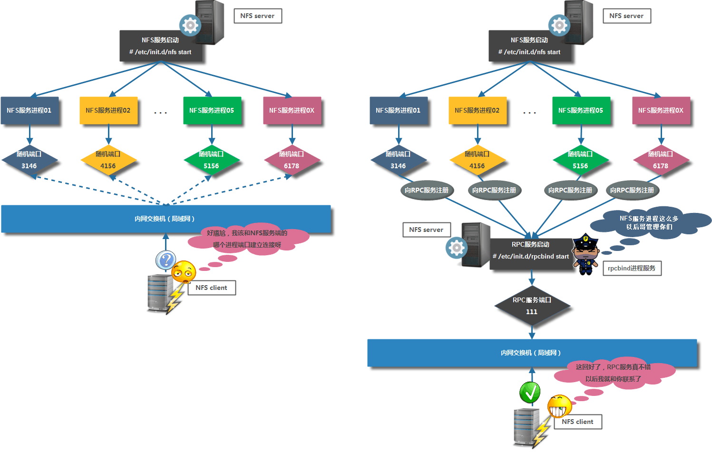
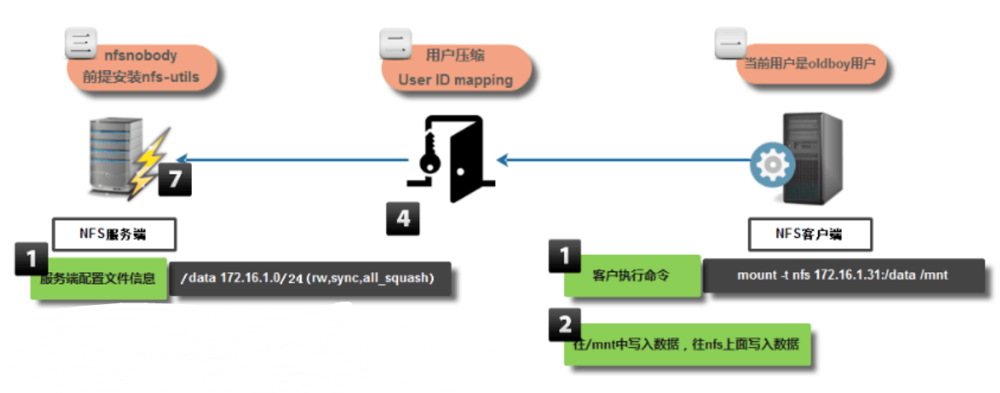

# 1.NFS简介

	NFS（Network File System）：网络文件系统， 它的主要功能是通过网络（一般是局域网）让不同的主机系统之间可以共享文件或目录。

	缺点：
	  1.winndows上无法使用
	  2.在高并发场景，以及存储量比较高的场景,对数据安全性要求比较高场景，需要采用分布式储存

# 2.NFS工作原理

	服务端：启动nfs服务于rpc服务
	客户端：需启动rpc服务

# 3.安装配置NFS

	服务端：
		~]# yum install -y nfs-utils rpcbind
	
		~]# cat /etc/exports		#nfs配置文件
			/data/v1  192.168.0.0/16(rw,sync,no_root_squash)
			/data/v2  192.168.0.0/16(rw,sync,no_root_squash)
			/data/v3  192.168.0.0/16(rw,sync,no_root_squash)
			/data/v4  192.168.0.0/16(rw,sync,no_root_squash)
			/data/v5  192.168.0.0/16(rw,sync,no_root_squash)

			第一部分：/data            --指定共享目录信息
			第二部分：172.16.1.0/24    --指定了一个网段信息，表示允许指定的网段主机挂载到我本地的共享目录上
			第三部分：(rw,sync)        --表示定义共享参数信息，
            		 rw     表示读写，对共享目录设置的权限
             		 sync   同步，数据会先写入到NFS服务器内存中，会立刻同步到磁盘里面==直接存储硬盘中

		~]# mkdir /data/v{1..5} -pv

		~]# systemctl start nfs			#监听2049端口
		~]# systemctl enable nfs		

		~]# systemctl start rpcbind		#监听111端口，默认会启动

		~]# showmount -e 192.168.164.172			#查看可挂载目录
			Export list for 192.168.164.172:
			/data/v5 192.168.0.0/16
			/data/v4 192.168.0.0/16
			/data/v3 192.168.0.0/16
			/data/v2 192.168.0.0/16
			/data/v1 192.168.0.0/16

	客户端：
		~]# yum install -y nfs-utils rpcbind		#下载工具包，无需启动服务，若rpc服务没启动需手动起

		~]# showmount -e 192.168.164.172			#查看可挂载目录
			Export list for 192.168.164.172:
			/data/v5 192.168.0.0/16
			/data/v4 192.168.0.0/16
			/data/v3 192.168.0.0/16
			/data/v2 192.168.0.0/16
			/data/v1 192.168.0.0/16

		~]# mount -t nfs 192.168.164.172:/data /mnt

		~]# echo "192.168.164.172:/data /mnt nfs defaults 0 0" >> /etc/fstab

更多参数：

[https://www.cnblogs.com/clsn/p/7694456.html](https://www.cnblogs.com/clsn/p/7694456.html "NFS参考博客")

		

 