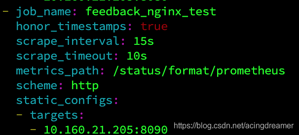

官网：[http://www.nginx.org](http://www.nginx.org)

web服务器排行：[https://news.netcraft.com](https://news.netcraft.com)

**Nginx用途：**

```c
Web Server:
    虚拟主机
Proxy Server:
    http
    smtp
    pop3/imap4
Stream Server:
```


# 1.nginx安装

## 1.1 编译安装 ##

	~]# wget http://nginx.org/download/nginx-1.16.1.tar.gz
	~]# tar xf nginx-1.16.1.tar.gz -C /usr/src
	~]# cd /usr/src/nginx-1.16.1
	
	#解决依赖
	~]# yum -y install gcc pcre pcre-devel zlib zlib-devel openssl openssl-devel	
	
	#添加用户和组，nginx主进程由root运行，子进程为nginx用户
	~]# groupadd www
	~]# useradd -g www www
	
	#配置
	~]# ./configure \
		--user=www \							#指定运行时的非特权用户				
		--group=www \							#指定运行时的非特权用户组
		--prefix=/usr/local/nginx \				#指定安装目录
		--conf-path=/etc/nginx/nginx.conf \		#配置文件所在目录
		--error-log-path=/var/log/nginx/error.log \		#错误日志访问日志
		--http-log-path=/var/log/nginx/access.log \		#访问日志
		--pid-path=/var/run/nginx.pid \			#PID文件
		--lock-path=/var/run/nginx.lock \		#锁文件
		--with-http_ssl_module \				#支持https，需要安装openssl支持
		--with-http_stub_status_module \		#启用nginx状态页
		--with-http_gzip_static_module \		#启用压缩
		--with-http_v2_module \					#支持HTTP 2.0
		--with-threads \						#启用线程池
		--http-client-body-temp-path=/var/tmp/nginx/client/ \		#设定http客户端请求临时文件路径
		--http-proxy-temp-path=/var/tmp/nginx/proxy/ \				#设定http代理临时文件路径
		--http-fastcgi-temp-path=/var/tmp/nginx/fcgi/ \				#设定http fastcgi临时文件路径
		--http-uwsgi-temp-path=/var/tmp/nginx/uwsgi \				#设定http uwsgi临时文件路径
		--http-scgi-temp-path=/var/tmp/nginx/scgi					#设定http scgi临时文件路径


	nginx手动启用模块：
		ngx_http_ssl_module		：--with-http_ssl_module    			#提供必要的https支持，需要依赖openssl库
		ngx_http_v2_module		：--with-http_v2_module				#支持http/2.0协议
		ngx_http_stub_status_module：--with-http_stub_status_module	#提供nginx状态页
		ngx_http_realip_module	：--with-http_realip_module  		#nginx作为后端服务器能够得到客户真实IP，而不是前段负载IP
		ngx_http_gzip_module	：--with-http_gzip_module			#对css,js等文件进行压缩，但会消耗CPU
		ngx_http_geoip_module	：--with-http_geoip_module
		ngx_http_addition_module：--with-http_addition_module	
		ngx_http_sub_module		：--with-http_sub_module
		--with-threads		#使用线程池 default threads=32 max_queue=65536;
		--with-file-aio		#启用aio
	
	nginx默认启用模块：
		ngx_http_access_module		：--without-http_access_module			#访问控制模块
		ngx_http_auth_basic_module	：--without-http_auth_basic_module		#用户认证模块
		ngx_http_referer_module		：--without-http_referer_module			#防盗链
		ngx_http_rewrite_module		：--without-http_rewrite_module			#rewrite重写模块
		ngx_http_proxy_module		：--without-http_proxy_module			#代理模块
		ngx_http_upstream_module	：										#定义服务器组，实现负载均衡
		ngx_http_fastcgi_module		：--without-http_fastcgi_module			#fastcgi代理，使用fastcgi模块
		ngx_http_scgi_module		：--without-http_scgi_module				#scgi代理，使用scgi模块
		–without-http-cache	 												#禁用http cache功能
	
	更多模块：
		http://nginx.org/en/docs/
	
	#编译安装
	~]# make && make install
	
	~]# echo 'PATH=/usr/local/nginx/sbin:$PATH' >> /etc/profile.d/nginx.sh
	~]# . /etc/profile.d/nginx.sh
	
	#添加启动脚本
	~]# cat /etc/init.d/nginx 
		#!/bin/bash
		#
		# nginx - this script start and stops the nginx daemon
		#
		# chkconfig: 2345 40 98
		# dectiption: NGINX is an HTTP(S) Server, HTTP(S) reverse proxy and IMAP/POP3 proxy server.
		
		path="/usr/local/nginx/sbin"
		pid="/var/run/nginx.pid"
		RETVAL=0     # return value
		
		. /etc/init.d/functions
		
		# start
		function usage(){
		    echo $"`basename $0` {status|start|stop|restart}"
		    exit 1
		}
		
		function status(){
		    if [[ -f $pid ]]; then
		        echo "nginx is running..."
		    else
		        echo "nginx is not running"
		    fi
		    exit $RETVAL
		}
		
		function start(){
		    if [ ! -f $pid ]; then
		        $path/nginx
		        RETVAL=$?
		        if [[ $RETVAL -eq 0 ]]; then
		            action "nginx is started" /bin/true
		        else
		            action "nginx is started" /bin/false
		            return RETVAL
		        fi
		    else
		        echo "nginx is running..."
		        return 0
		    fi
		}
		
		function stop(){
		    if [[ -f $pid ]]; then
		        $path/nginx -s stop
		        RETVAL=$?
		        if [[ $RETVAL -eq 0 ]]; then
		            action "nginx is stopped" /bin/true
		            return $RETVAL
		        else
		            action "nginx is stopped" /bin/false
		            return $RETVAL
		        fi
		    else
		        echo "nginx is no running"
		        return $RETVAL
		    fi
		}
		
		case "$1" in
		    start )
		        start
		        RETVAL=$?
		        ;;
		    stop )
		        stop
		        RETVAL=$?
		        ;;
		    restart )
		        stop
		        sleep 3
		        start
		        RETVAL=$?
		        ;;
		    status )
		        status
		        RETVAL=$?
		        ;;
		    * )
		        usage
		esac
		exit $RETVAL
		
	~]# chmod a+x /etc/init.d/nginx
	
	#将nginx服务加入chkconfig管理列表
	~]# chkconfig --add /etc/init.d/nginx
	~]# chkconfig nginx on
	~]# service nginx start

## 1.2 yum安装 ##

	http://nginx.org/en/linux_packages.html#RHEL-CentOS 	#官网提供的yum仓库

# 2.配置分析

## 2.1 nginx.conf

	~]# cat /etc/nginx/nginx.conf
		worker_processes  4;						#官方推荐根据（ 物理CPU个数*每个CPU核心数 ）来定义	
		worker_cpu_affinity 0001 0010 0100 1000;	#worker线程绑定CPU核心，指定位数上占位符为1表示使用该核心，8核就有八位		
		events {
			worker_connections  60000;			#每个worker进程的最大连接数
		}
	
		http {
		    include  mime.types;		#nginx支持的媒体文件类型。相对路径为同目录conf下的其他文件			
		    default_type  application/octet-stream;		# 默认的媒体类型
	
		    charset                         off;
		    server_names_hash_bucket_size   128;
		    client_header_buffer_size       32k;
		    large_client_header_buffers     8 64k;
		    client_max_body_size            300m;
		    underscores_in_headers on;
		
		    log_format  main  '$remote_addr  $remote_user [$time_local] $host$request_uri '
		                      '$status $body_bytes_sent $request_time $http_referer '
		                      '"$http_user_agent" "$upstream_addr" '
		                      '"$upstream_cache_status" "$request_body"';
		                      
		            log_format ystenlog ' $remote_addr - $remote_user [$time_iso8601] "$request" '
	                            ' "$status" $body_bytes_sent "$http_range" "$http_referer" '
	                            ' "$http_user_agent" $http_x_forwarded_for "$request_time" '
	                            ' "$host" "$server_port" "$sent_http_location" "$upstream_cache_status" ';
	
			# $remote_addr：客户端地址 
			# $remote_user：提供基本身份验证的用户名
			# $time_local：通用日志格式的本地时间
			# $host：按照这个优先顺序:请求行中的主机名，或者“host”请求头字段中的主机名，或者匹配请求的服务器名
			# $request_uri：完整的原始请求URI(带有参数)
	
			# $status：状态码
			# $body_bytes_sent：发送到客户端的字节数，不包括响应头
			# request_time：请求处理时间(以秒为单位，分辨率为毫秒)
			# $http_referer：
			
			# $http_user_agent：用户访问代理
			# $upstream_addr：保存上游服务器的IP地址和端口
	
			# $upstream_cache_status：保持访问响应缓存的状态，状态可以是"错过"、"绕道"、"过期"、"更新"、"重新验证"或"命中"。
			# $request_body：请求体（用户如何请求）
	
			# 更多参数：
				# http://nginx.org/en/docs/http/ngx_http_core_module.html#variables
				# http://nginx.org/en/docs/http/ngx_http_upstream_module.html#variables
	
			# log_format  main  '$remote_addr - $remote_user [$time_local] "$request" '
			#                  '$status $body_bytes_sent "$http_referer" '
			#                  '"$http_user_agent" "$http_x_forwarded_for"';
	
		    # access_log  logs/access.log  main;
		
		    sendfile        on;		#启用sendfile传输模式，此模式是"零拷贝"
		    tcp_nopush     on;		#只在sendfile on时有效。让数据包挤满到一定程度才发送出去，挤满之前被阻塞
		
		    keepalive_timeout  60;	#keepalive的超时时间
		
		    tcp_nodelay     on;		#仅在将连接转变为长连接的时候才被启用
		    server_tokens   off;	#错误页和“服务器”响应头字段中启用或禁用发出nginx版本，默认为on
			client_body_buffer_size         512k;	#Nginx分配给请求数据的Buffer大小，如果请求的数据小于该值会将数据先在内存中存储。
													如果请求的值大于该值小于client_max_body_size（用户最大请求大小），
													就会将数据先存储到临时文件中，client_body_temp_path指定的路径中,默认/tmp
		    proxy_ignore_client_abort   	on;		#如果此项设置为on开启，则服务器会忽略客户端中断（主动关闭或异常关闭），一直等着代理服务执行返回。
													并且如果执行没有发生错误，记录的日志是200日志。如果超时则会记录504。
													如果设置为off，则客户端中断后服务器端nginx立即记录499日志
		    proxy_connect_timeout           5;		#与upstream server建立连接的超时时间，默认60s，一般不超过75s
		    proxy_read_timeout              300;	#与upstream server的读超时时间，它决定了nginx会等待多长时间来获得请求的响应
		    proxy_send_timeout              100;	#upstream server数据回传时间，就是在规定时间之内upstream server必须传完所有的数据
			proxy_headers_hash_bucket_size  6400;		
		    proxy_headers_hash_max_size     51200;
		    proxy_buffer_size               16k;	#proxy_buffer_size 用来接受后端服务器 response 的第一部分，
													小的response header 通常位于这部分响应内容里边。
													默认proxy_buffer_size 被设置成 proxy_buffers 里一个buffer 的大小，当然可以设置更小些。
		    proxy_buffers                   8 128k;	#该指令设置缓冲区的大小和数量,从被代理的后端服务器取得的响应内容,会放置到这里，
													http-proxy-temp-path指定存放目录，Nginx将会尽可能的读取后端服务器的数据到buffer，
													直到proxy_buffers设置的所有buffer们被写满或者数据被读取完(EOF)，此时Nginx开始向客户端传输数据，
													会同时传输这一整串buffer。如果数据很大的话，Nginx会接收并把他们写入到temp_file里去，大小由proxy_max_temp_file_size 控制。「当数据没有完全读完的时候」，
													Nginx同时向客户端传送的buffer大小不能超过 proxy_busy_buffers_size 
		    proxy_busy_buffers_size         256k;	
		    proxy_temp_file_write_size      256k;	#当启用代理服务器对临时文件的响应进行缓冲时，限制一次写入临时文件的数据的大小
		    proxy_temp_path /data/proxy/proxy_temp_path;	#upstream server接受到的数据的临时文件目录，可指定多级结构
		    proxy_cache_path  /data/proxy/cache  levels=1:2   keys_zone=cache_one:200m inactive=1d max_size=3g;
													#levels：设置缓存文件目录层次，levels=1:2表示两级目录，
													目录名称：文件第一个字母为一级目录，文件二三个字母为第二级目录...										
													keys_zone 设置缓存名字和共享内存大小，inactive 在指定时间内没人访问则被删除
													max_size 最大缓存空间，如果缓存空间满，默认覆盖掉缓存时间最长的资源
			
		    gzip  on;								#启用或禁用响应的压缩。		
		    gzip_min_length                 1;		#设置将被gzip压缩的响应的最小长度。长度仅从“Content-Length”响应头字段确定。
		    gzip_buffers                    4 16k;	#设置用于压缩响应的缓冲区的数量和大小
		    gzip_http_version               1.1;	#设置压缩响应所需的请求的最小HTTP版本
		    gzip_proxied                    any;	#为所有代理请求启用压缩
		    gzip_comp_level                 5;		#设置响应的gzip压缩级别，可接受的值在1到9之间，数字越大压缩的越好，也越占用CPU时间
		    gzip_types                      text/plain application/x-javascript text/css application/xml text/javascript application/x-httpd-php image/jpeg image/gif image/png;	
													#进行压缩的文件类型，javascript有多种形式，其中的值可以在 mime.types 文件中找到。
		    gzip_vary                       on;		#如果指令gzip、gzip_static或gunzip处于活动状态，是否在http header中添加Vary: Accept-Encoding，建议开启
		    gzip_disable                    "MSIE [1-6]\.";	#禁用IE 6 gzip
		
			upstream backend_server	{	
				server IP:[PORT] [PARAMETER]					
				server HOSTNAME:[PORT] [PARAMETER]	
				
				#PARAMETER
					weight=NUM			权重，默认为1
					max_fails=NUM		失败尝试的最大次数	
					fail_timeout=NUm	设置服务器为不可用状态的超时时长
					backup				把服务器标记为"备用状态"
					down				手动标记为不可用
				
				调度算法：
					1.round robin	：轮询算法,默认算法
					2.weight		：权重算法，根据权重进行请求的分配
					3.ip_hash		：源地址hash算法（IP绑定），每个请求按访问IP的哈希结果分配，使来自同一个IP的访客固定访问一台后端服务器，并且可以有效解决动态网页存在的session共享问题
					4.url_hash		：按照访问url的hash结果来分配请求，使得每个url定向到同一个后端服务器，主要应用于后端服务器为缓存时的场景下。
					5.fair			：对比 weight、ip_hash更加智能的负载均衡算法，fair算法可以根据页面大小和加载时间长短智能地进行负载均衡，响应时间短的优先分配。
			}
	
			include backend_serever.conf	
		}
		
	#注意 upstream 下划线，有些版本可能不支持下划线  _

## 2.2 backend_serever.conf

	~]# cat backend_server.conf
	
		server {
	    	listen       80;	#服务监听端口
	    	server_name www.chuan.com;
	    	rewrite ^(.*) https://www.chuan.com$1 permanent;
		}
	
		server {
	
			#listen       80;
	    	#listen       443;
	    	#server_name  www.chuan.com;
			#if ($server_port = 80) {
	    	#	rewrite  (.*)  https://www.chuan.com$1;
	     	#}
	
			listen 443;				
			#listen 443 default ssl;						#服务监听端口
			server_name www.chuan.com;		#基于域名的虚拟主机
	
			ssl on;
			ssl_certificate /home/ca/chuan.crt;		#当前虚拟主机使用PEM格式的证书文件
			ssl_certificate_key /home/ca/chuan.key;	#当前虚拟主机上与其证书匹配的私钥文件	
			ssl_protocols TLSv1 TLSv1.1 TLSv1.2;	#支持ssl协议版本，默认支持为这三个
	
			access_log /usr/logs/backend_access.log main;	#访问日志
			error_log /usr/logs/backend_error.log error;	#错误日志
			error_page 403 500 /error_page.html; 			#访问出现403，500等，重定向到指定错误界面
	
		    location = /50x.html {
		        root /usr/local/nginx/html;
		    }
		
		    location ^~ /test/ {
		        root /usr/local/nginx/html;
		    }
		
		    location ~ \.(gif|jpg|jpeg|png|bmp|js|swf|css|html|htm)?$ {
		        root /usr/local/nginx/html;
		    }
		
		    location ~* \.(gif|jpg|jpeg|png|bmp|js|swf|css|html|htm)?$ {
		        #root /usr/local/nginx/html;
				proxy_redirect off;		#禁止重定向
				proxy_cache cache_one;	#定义用于缓存的共享内存区域，cache_one可在nginx.conf中定义
				proxy_cache_valid 200 12h;	#为特定响应码定义缓存时长
				proxy_cache_valid 304 12h;
				proxy_cache_valid 301 302 1m;
				proxy_cache_valid any 1m;
				proxy_cache_key $host$uri$is_args$args;		#定义缓存key
				proxy_set_header X-Forwarded-For  $remote_addr;	#将客户端真实IP放在报文首部传输给上游服务器，上游服务器接收到需要在日志格式中设置		
				proxy_set_header X-Forwarded-For $proxy_add_x_forwarded_for;		
				proxy_set_header X-Real-IP  $remote_addr;
	            proxy_set_header Host  $host;
				add_header Nginx-Cache "$upstream_cache_status";	#添加头部信息，是否命中缓存的状态
				proxy_pass http://backend_server;
				expires 1d;				#设置浏览器保存cookie的时间,如果没有指定该参数，它将导致cookie在浏览器会话结束时过期。
		    }
	
			location ~* \.(php|jsp|cgi|aspx|js|css)?$
	        {
	            proxy_set_header Host  $host;
	            proxy_set_header X-Forwarded-For  $remote_addr;
	            proxy_pass http://backend_server;
	        }
		
		    location /status {
		        stub_status on;
		        #access_log off;
		    }
	
			location / {
				root /usr/local/nginx/html;
				index index.html index.htm;
			}
		}		
		
	location语法：
		location [ = | ~ | ~* | ^~ ] url { ... }
		
		=：对URI做精确匹配
			例：	location = / { ... }
				http://www.chuan.com/   		匹配
				http://www.chuan.com/index.html 	不匹配			
		
		~：对URI做正则表达式模式匹配，区分字符大小写	
			例：	location ~ \.{jpg|png}
		
		~*：对URI做正则表达式模式匹配，不区分字符大小写
			例：location ~* \.{jpg|png}				
		
		^~：对URI的左半部分做匹配检查，不区分字符大小写
			例：location ^~ \.{jpg|png}				
		
		不带符号：匹配起始于此uri的所有url
				
		匹配优先级：=，^~，~/~*，不带符号

# 3.虚拟主机
## 3.1 基于ip

	~]# ip addr add 192.168.179.111 dev ens33
	~]# cat vhsot.conf
		server {
		    listen 80;
		    server_name 192.168.179.110;
		    location / {
		        root /data/www/ilinux;
		        index index.html index.htm;
		    }
		}
		server {
		    listen 80;
		    server_name 192.168.179.111;
		    location / {
		        root /data/www/iunix;
		        index index.html index.htm;
			}
		}
	
	创建访问目录：略

## 3.2 基于端口

	server {
	    listen 80;
	    server_name 192.168.179.110;
	    location / {
	        root /data/www/ilinux;
	        index index.html index.htm;
	    }
	}
	server {
	    listen 8080;
	    server_name 192.168.179.110;
	    location / {
	        root /data/www/iunix;
	        index index.html index.htm;
	    }
	}

## 3.3 基于FQDN

	server {
	    listen 80;
	    server_name www.ilinux.io;
	    location / {
	        root /data/www/ilinux;
	        index index.html index.htm;
	    }
	}
	server {
	    listen 80;
	    server_name www.iunix.io;
	    location / {
	        root /data/www/iunix;
	        index index.html index.htm;
	    }
	}

# 4.内建status页面

	依赖ngx_http_stub_status_module模块
	
	server {
	    listen 80;
	    server_name www.songyun.com;	#若不能解析域名，就要适用IP
		location / {
			root /data/www/html/;
			index index.html index.htm;
		}
	
	    location /status {
	        stub_status on;
			#access_log off;	#关闭日志，添加访问控制
	        #allow 192.168.179.111/32;	#访问控制
	        #deny all;
	    }
	}
	
	~]# curl http://www.songyun.com/status
		Active connections: 1 
		server accepts handled requests
		26 26 35 
		Reading: 0 Writing: 1 Waiting: 0 
	
		active connections – 当前处于活动状态的客户端连接数，包括正处于等待状态的连接
		server 
			accepts — 从服务启动开始到现在已经接收进来的总的客户端连接数
			handled	— 从服务启动以来已经处理过的连接数，一般handled的值和accepts的值相等，除非作出了连接数限定 
			requests — 服务启动以来总的客户端请求数。一个连接可以有多个请求，所以可以计算出平均每个连接发出多少个请求
		reading — 表示nginx正在读取请求首部的数量，即正在从socket recv buffer中读取数据的数量
		writing — 表示nginx正在将响应数据写入socket send buffer以返回给客户端的连接数量
		waiting — 表示等待空闲客户端发起请求的客户端数量，包括长连接状态的连接以及已接入但socket recv buffer还未产生可读事件的连接，其值为active-reading-writing

# 5.访问控制

	依赖ngx_http_auth_basic_module模块
	
	需要使用htpasswd命令，安装httpd-tools包。
	
	~]# yum install -y httpd-tools
	~]# htpasswd -b -c /etc/nginx/.htpasswd tom 123456			#创建tom用户，密码为123456
	
	server {
	    listen 80;
	    server_name 192.168.179.110;
	
	    location / {
	        root /data/www/html/;
	        index index.html index.htm;
	        auth_basic "Auth your name";
	        auth_basic_user_file /usr/local/nginx/.htpasswd;
	    }
	}

# 6.设置https服务

	依赖ngx_http_ssl_module模块

**1.自建CA：**

```c
~]# cd /etc/pki/CA
~]# (umask 077;openssl genrsa -out private/cakey.pem 2048)
~]# openssl req -new -x509 -key private/cakey.pem -out cacert.pem -days 3650
```

**2.建立相关序列和索引文件**

	~]# touch index.txt
	~]# echo "01" > serial

**3.nginx端生成证书请求**
	

	~]# mkdir /etc/nginx/ssl
	~]# cd /etc/nginx/ssl
	~]# (umask 077;openssl genrsa -out /etc/nginx/ssl/songyun.key 2048)
	~]# openssl req -new -key /etc/nginx/ssl/songyun.key -out /etc/nginx/ssl/songyun.csr

**4.CA为证书请求颁发证书**
	

	~]# cd -
	~]# openssl ca -in /etc/nginx/ssl/songyun.csr -out songyun.crt

这里由于CA和nginx在同一主机上，所以直接移动即可。

	~]# mv songyun.crt /etc/nginx/ssl/

**5.修改配置**

	server {
		listen       443 default ssl;	#监听443端口，也可打开80端口
		server_name  www.songyun.com;
		
		ssl_certificate      /etc/nginx/ssl/songyun.crt;
		ssl_certificate_key  /etc/nginx/ssl/songyun.key;
		
		ssl_session_cache    shared:SSL:1m;
		ssl_session_timeout  5m;
		
		ssl_ciphers  HIGH:!aNULL:!MD5;
		ssl_prefer_server_ciphers  on;
		
		......
	}
	
	~]# nginx -s reload
	
	注：代理多个站点 listen 443 ssl;

**6.给客户端添加信任证书**

	浏览器中将songyun.crt证书文件添加到 受信任的根证书颁发机构

# 7.反向代理

**架构图：**


**192.168.179.110:实现反代**

	仅使用模块ngx_http_proxy_module实现简单的反向代理
		
	server {
		listen       80;
		server_name  www.chuan.com;
		
		location / {
		    proxy_pass http://192.168.179.111:80;
		}   
		       
		location ~ \.php$ {
		    proxy_pass   http://192.168.179.113:80;
		}   	
	}

**192.168.179.113:nginx+php解析动态请求**

		server {
	    listen       80;
	    server_name  192.168.179.113;
	    location / {
	        root   /usr/share/nginx/html;
	        index  index.html index.htm;
	    }
	    location ~ \.php$ {
	        root           /usr/share/nginx/html;
	        fastcgi_pass   127.0.0.1:9000;
	        fastcgi_index  index.php;
	        fastcgi_param  SCRIPT_FILENAME  $document_root$fastcgi_script_name;
	        include        fastcgi_params;
	    }
	}

# 8.负载均衡

	依赖于ngx_http_upstream_module,ngx_http_proxy_module模块

**架构图**

	
**192.168.179.110:实现反代**

	http {
		...
		upstream dynamic_pool {
	        server 192.168.179.111:80 weight=2 max_fails=3 down;
	        server 192.168.179.113:80 weight=1 fail_timeout=5;
			ip_hash;
	    }
		
	    server {
	        listen 80;
	        server_name 192.168.179.110;
	
	        location / {
	            root /usr/local/nginx/html/;
	            index index.html index.htm;
	        }
	
	        location ~ \.php$ {
	            proxy_pass http://dynamic_pool;
	        }
	    }
		...
	}

# 9.动态模块编译

## 9.1 nginx-module-vts 流量监控模块

注：nginx-mudule-vts是第三方模块，需要单独下载

```c
# 下载模块源码包
~]# git clone git://github.com/vozlt/nginx-module-vts.git

# 重新编译
~]# nginx -v		#查看当前模块，在编译时加上这些参数
~]# ./configure --add-module=/data/nginx-module-vts 	#带着原来的模块，再添加nginx-module-vts模块，进行编译。
~]# make && make install
    
# 修改配置
    http {
        vhost_traffic_status_zone;	# 需在http模块中添加此参数
        vhost_traffic_status_filter_by_host on; # 根据host分别进行流量统计,即按照每个server来进行统计
        ...
        server {
            listen 8800;
            server_name localhost;
            location /status {
                vhost_traffic_status_display;
                vhost_traffic_status_display_format html;
            }
        }
    }   

注：在不想监控的server中，可以单独关闭监控
    server {
        vhost_traffic_status off;
    }

# 访问
http://ip:port/status

一般此监控通过prometheus与grafana 配合使用
```

**暴露接口给prometheus：/status/format/promtheus**




参考链接：https://blog.csdn.net/weixin_42674359/article/details/105208403

# 10. 版本平稳切换

# 11. nginx启用压缩及测试

**前言：**

```c
Nginx开启Gzip压缩功能， 可以使网站的css、js 、xml、html 文件在传输时进行压缩，提高访问速度, 进而优化Nginx性能!  Web网站上的图片，视频等其它多媒体文件以及大文件，因为压缩效果不好，所以对于图片没有必要支压缩，如果想要优化，可以图片的生命周期设置长一点，让客户端来缓存。 开启Gzip功能后，Nginx服务器会根据配置的策略对发送的内容, 如css、js、xml、html等静态资源进行压缩, 使得这些内容大小减少，在用户接收到返回内容之前对其进行处理，以压缩后的数据展现给客户。这样不仅可以节约大量的出口带宽，提高传输效率，还能提升用户快的感知体验, 一举两得; 尽管会消耗一定的cpu资源，但是为了给用户更好的体验还是值得的。

经过Gzip压缩后页面大小可以变为原来的30%甚至更小，这样，用户浏览页面的时候速度会快得多。Gzip 的压缩页面需要浏览器和服务器双方都支持，实际上就是服务器端压缩，传到浏览器后浏览器解压并解析。浏览器那里不需要我们担心，因为目前的巨大多数浏览器 都支持解析Gzip过的页面。
```

```
Nginx静态压缩(ngx_http_gzip_module、ngx_http_gzip_static_module 、ngx_http_gunzip_module )
ngx_http_gzip_static_module
ngx_http_gunzip_module
上面两个模块都是对ngx_http_gzip_module的补充，默认ngx_http_gzip_module模块会自动安装，其余两个模块需要手动指定
```

**1.http_gzip_static_module - 预读gzip功能**

```c
nginx实现静态压缩这种做法其实就像apache gzip压缩 ，这种压缩是我们常见的一些事情了 , 它的功能就是:  比如我们要读取1.html文件,它会在家目录里面先去找1.html.zg这个文件是否存在,因为1.html.zg这个文件是gzip的预压缩文件,如果有的话直接返回1.html.zg这个文件,没有过没有的话返回1.html , 所以它是先去磁盘目录找同名的.gz文件是否存在,相比gzip节省了gzip压缩时间和对于CPU处理压缩的性能损耗,但是它对硬盘有要求,因为需要预先把文件进行压缩(生产环境压缩文件时建议保留原文件,相当于备份)
```

**2.http_gunzip_module - 应用支持gunzip的压缩方式**

```c
这个模块一般用的很少很少,它是为了解决很少的一部分浏览器无法支持gzip压缩文件而需要用到的,如果有部分浏览器没法用gzip压缩文件的话就要用gunzip这种方式来解决问题,但是现实场景很少有用到
```

**Gzip压缩作用：**将响应报⽂发送⾄客户端之前可以启⽤压缩功能，这能够有效地节约带宽，并提⾼响应⾄客户端的速度。Gzip压缩可以配置http,server和location模块下。Nginx开启Gzip压缩功能的配置如下:

```c
#修改配置为
gzip on;                    #开启gzip压缩功能
gzip_min_length 10k;      #设置允许压缩的页面最小字节数; 这里表示如果文件小于10个字节，就不用压缩，因为没有意义，本来就很小. 
gzip_buffers 4 16k;       #设置压缩缓冲区大小，此处设置为4个16K内存作为压缩结果流缓存
gzip_http_version 1.1;    #压缩版本
gzip_comp_level 2;   #设置压缩比率，最小为1，处理速度快，传输速度慢；9为最大压缩比，处理速度慢，传输速度快; 这里表示压缩级别，可以是0到9中的任一个，级别越高，压缩就越小，节省了带宽资源，但同时也消耗CPU资源，所以一般折中为6
gzip types  text/plain application/x-javascript text/css application/xml text/javascript application/x-httpd-php application/javascript application/json;      #制定压缩的类型,线上配置时尽可能配置多的压缩类型!
gzip_disable "MSIE [1-6]\.";       #配置禁用gzip条件，支持正则。此处表示ie6及以下不启用gzip（因为ie低版本不支持）
gzip vary on;    #选择支持vary header；改选项可以让前端的缓存服务器缓存经过gzip压缩的页面; 这个可以不写，表示在传送数据时，给客户端说明我使用了gzip压缩
```

## 11.1 静态文件压缩

**测试压缩是否启用成功：**

```c
~]# curl -I -H "Accept-Encoding: gzip, deflate" "http://www.slyar.com/blog/"
     
    HTTP/1.1 200 OK
    Server: nginx/1.0.15
    Date: Sun, 26 Aug 2012 18:13:09 GMT
    Content-Type: text/html; charset=UTF-8
    Connection: keep-alive
    X-Powered-By: PHP/5.2.17p1
    X-Pingback: http://www.slyar.com/blog/xmlrpc.php
    Content-Encoding: gzip
     
    页面成功压缩
     
     
     
~]# curl -I -H "Accept-Encoding: gzip, deflate" "http://www.slyar.com/blog/wp-content/plugins/photonic/include/css/photonic.css"
     
    HTTP/1.1 200 OK
    Server: nginx/1.0.15
    Date: Sun, 26 Aug 2012 18:21:25 GMT
    Content-Type: text/css
    Last-Modified: Sun, 26 Aug 2012 15:17:07 GMT
    Connection: keep-alive
    Expires: Mon, 27 Aug 2012 06:21:25 GMT
    Cache-Control: max-age=43200
    Content-Encoding: gzip
     
    css文件成功压缩
     
~]# curl -I -H "Accept-Encoding: gzip, deflate" "http://www.slyar.com/blog/wp-includes/js/jquery/jquery.js"
     
    HTTP/1.1 200 OK
    Server: nginx/1.0.15
    Date: Sun, 26 Aug 2012 18:21:38 GMT
    Content-Type: application/x-javascript
    Last-Modified: Thu, 12 Jul 2012 17:42:45 GMT
    Connection: keep-alive
    Expires: Mon, 27 Aug 2012 06:21:38 GMT
    Cache-Control: max-age=43200
    Content-Encoding: gzip
     
    js文件成功压缩
     
~]# curl -I -H "Accept-Encoding: gzip, deflate" "http://www.slyar.com/blog/wp-content/uploads/2012/08/2012-08-23_203542.png"
     
    HTTP/1.1 200 OK
    Server: nginx/1.0.15
    Date: Sun, 26 Aug 2012 18:22:45 GMT
    Content-Type: image/png
    Last-Modified: Thu, 23 Aug 2012 13:50:53 GMT
    Connection: keep-alive
    Expires: Tue, 25 Sep 2012 18:22:45 GMT
    Cache-Control: max-age=2592000
    Content-Encoding: gzip
     
    图片成功压缩
     
~]# curl -I -H "Accept-Encoding: gzip, deflate" "http://www.slyar.com/blog/wp-content/plugins/wp-multicollinks/wp-multicollinks.css"
     
    HTTP/1.1 200 OK
    Server: nginx/1.0.15
    Date: Sun, 26 Aug 2012 18:23:27 GMT
    Content-Type: text/css
    Content-Length: 180
    Last-Modified: Sat, 02 May 2009 08:46:15 GMT
    Connection: keep-alive
    Expires: Mon, 27 Aug 2012 06:23:27 GMT
    Cache-Control: max-age=43200
    Accept-Ranges: bytes
     
    最后来个不到1K的文件，由于我的阈值是1K，所以没压缩
```

## 11.2 动态接口压缩

`代码改造`：
 **在接口请求返回信息的头部需要接口加入content-type，这样nginx才能实现压缩**

**gzip_types一定要加上 "application/json"**

**返回有： Content-Encoding: gzip  就说明压缩成功了**