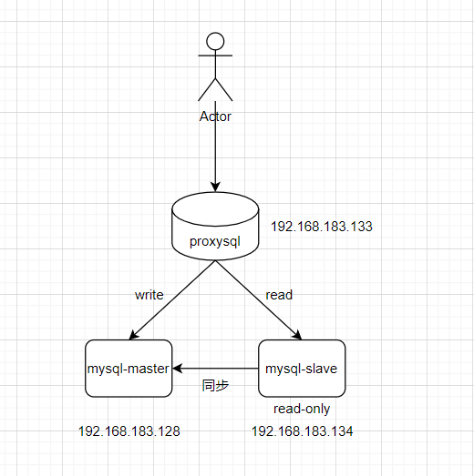

# 1.ProxySQL

**架构图：**



## 1.1 MySQL主从搭建

## 1.2 ProxySQL安装

```c
~]# wget https://github.com/sysown/proxysql/releases/download/v2.1.0/proxysql-2.1.0-1-centos7.x86_64.rpm
~]# yum install -y proxysql-2.1.0-1-centos7.x86_64.rpm

#启动后会监听两个端口，默认为6032和6033。6032端口是ProxySQL的管理端口，6033是ProxySQL对外提供服务的端口。    
~]# systemctl start proxysql
    

```

