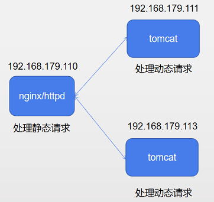
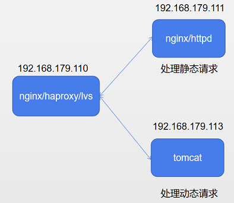

  tomcat/jetty/resin/jboss/webshpere/weblogic

# 1.二进制安装tomcat

## 1.1 安装jdk

	~]# tar xf jdk-8u60-linux-x64.tar.gz -C /usr/local/
	~]# ln -s /usr/local/jdk1.8.0_60/ /usr/local/jdk
	~]# echo 'export JAVA_HOME=/usr/local/jdk' > /etc/profile.d/jdk.sh
	~]# echo 'export PATH=$JAVA_HOME/bin:$PATH' >> /etc/profile.d/jdk.sh
	~]# . /etc/profile.d/jdk.sh
	~]# java -version
	java version "1.8.0_60"
	Java(TM) SE Runtime Environment (build 1.8.0_60-b27)
	Java HotSpot(TM) 64-Bit Server VM (build 25.60-b23, mixed mode)

## 1.2 安装tomcat

	~]# tar xf apache-tomcat-8.5.37.tar.gz -C /usr/local/
	~]# ln -s /usr/local/apache-tomcat-8.5.37/ /usr/local/tomcat 
	~]# echo "export CATALINA_HOME=/usr/local/tomcat" > /etc/profile.d/tomcat.sh
	~]# echo 'export PATH=$CATALINA_HOME/bin:$PATH' >> /etc/profile.d/tomcat.sh
	~]# . /etc/profile.d/tomcat.sh
	~]# version.sh
	Using CATALINA_BASE:   /usr/local/tomcat
	Using CATALINA_HOME:   /usr/local/tomcat
	Using CATALINA_TMPDIR: /usr/local/tomcat/temp
	Using JRE_HOME:        /usr/local/jdk
	Using CLASSPATH:       /usr/local/tomcat/bin/bootstrap.jar:/usr/local/tomcat/bin/tomcat-juli.jar
	Server version: Apache Tomcat/8.5.37
	Server built:   Dec 12 2018 12:07:02 UTC
	Server number:  8.5.37.0
	OS Name:        Linux
	OS Version:     3.10.0-862.el7.x86_64
	Architecture:   amd64
	JVM Version:    1.8.0_60-b27
	JVM Vendor:     Oracle Corporation

# 2.yum安装tomcat

```
~]# yum install tomcat-webapps tomcat-admin-webapps tomcat java-1.8.0-openjdk
```
## 2.1 多版本JDK切换

```c
~]# which java
	/usr/bin/java
    
~]# ll /usr/bin/java
	lrwxrwxrwx. 1 root root 22 5月  19 07:47 /usr/bin/java -> /etc/alternatives/java

~]# ll /etc/alternatives/java		#修改此链接即可
	lrwxrwxrwx. 1 root root 76 5月  19 07:47 /etc/alternatives/java -> /usr/lib/jvm/java-1.7.0-openjdk-1.7.0.261-2.6.22.2.el7_8.x86_64/jre/bin/java
```


# 3.配置管理界面

​	**server status:**
​	**manager app:**

	~]# vim /usr/local/tomcat/conf/tomcat-users.xml
	<tomcat-users ...>
	... 
	  <role rolename="admin-gui"/>
	  <role rolename="manager-gui"/>
	  <user username="chuan" password="123456" roles="manager-gui,admin-gui"/>
	</tomcat-users>
	
	~]# vim /usr/local/tomcat/conf/Catalina/localhost/manager.xml
	<?xml version="1.0" encoding="UTF-8"?>
	<Context docBase="${catalina.home}/webapps/manager" 
	        antiResourceLocking="false" privileged="true" >
	  <Valve className="org.apache.catalina.valves.RemoteAddrValve"
	         allow="^.*$" />
	</Context>
	
	host manager
	
	~]# cp /usr/local/tomcat/conf/Catalina/localhost/manager.xml /usr/local/tomcat/conf/Catalina/localhost/host-manager.xml
	~]# sed -i s/manager/host-manager/ /usr/local/tomcat/conf/Catalina/localhost/host-manager.xml

# 4.虚拟主机

**测试页：**
	

	~]# cat index.jsp 
		<%@ page language="java" %>
		<%@ page import="java.util.*" %>
		<html>
		  <body>
		    <% out.println("hello world! this is /usr/local/tomcat/chuan/xuexi dir"); %>
		  </body>
		</html>
	
	添加host组件即可：
	
	 	  <Host name="www.chuan1.com"  appBase="/www/chuan"
	            unpackWARs="true" autoDeploy="true">
	          <Context path="" docBase="/www/chuan" reloadable="true" />
	          <Context path="/xuexi" docBase="xuexi" reloadable="true" />
	        <Valve className="org.apache.catalina.valves.AccessLogValve" directory="logs"
	               prefix="longshuai_access_log" suffix=".txt"
	               pattern="%h %l %u %t &quot;%r&quot; %s %b" />
	      </Host>
	
	      <Host name="www.chuan2.com"  appBase="webapps/chuan"
	            unpackWARs="true" autoDeploy="true">
	          <Context path="" docBase="" reloadable="true" />
	          <Context path="/xuexi" docBase="xuexi" reloadable="true" />
	        <Valve className="org.apache.catalina.valves.AccessLogValve" directory="logs"
	               prefix="xiaofang_access_log" suffix=".txt"
	               pattern="%h %l %u %t &quot;%r&quot; %s %b" />
	      </Host>
	
	注：
		1.使用绝对路径则路径就为该路径，若使用相对路径，则前面要加上 $CATALINA_BASE 路径.
		2.若Host组件中未指定Context，则默认路径为APPBase/ROOT/目录。

# 5.反代实现负载均衡
## 5.1 模型一



**nginx反代：**

	upstream tomcat_servers {
	    server 192.168.179.111:8080 weight=1 max_fails=2 fail_timeout=2;
	    server 192.168.179.113:8080 weight=2 max_fails=2 fail_timeout=2;
	}
	
	server {
	    listen 80;
	    server_name 192.168.179.110;
	
	    location / {
	        root /www/html;
	        index index.html index.htm;
	    }
	
	    location ~* \.(jsp|jspx|do) {
	        proxy_pass http://tomcat_servers;
	    }
	}

**httpd反代：**

	AJP协议：
	~]# cat ajp.conf
		<VirtualHost 192.168.179.110:80>
		    serverName www.ilinux.io
		    DirectoryIndex index.html
		    DocumentRoot /www/html
		
			#<proxy balancer://TomcatLB>
	        #	BalancerMember ajp://192.168.179.111:8009 loadfactor=5
	        #	BalancerMember ajp://192.168.179.113:8009 loadfactor=10
	    	#</Proxy>	
	
		    ProxyVia off
		    ProxyRequests off
		    ProxyPreserveHost off
		 
		    ProxyPassMatch "^/(.*\.jsp)$" ajp://192.168.179.111:8009/$1
		    ProxyPassReverse "^/(.*\.jsp)$" ajp://192.168.179.111:8009/$1
		
			#ProxyPassMatch "^/(.*\.jsp)$" balancer://TomcatLB/$1
	    	#ProxyPassReverse "^/(.*\.jsp)$" balancer://TomcatLB/$1
	
		    <Directory /www/html>
		        AllowOverride None
		        Require all granted
		    </Directory>
		
		    <Proxy *>
		        Require all granted
		    </Proxy>
		</VirtualHost>


	http协议：
	
	~]# cat http.conf
		<VirtualHost 192.168.179.110:80>
		    serverName www.ilinux.io
		    DirectoryIndex index.html
		    DocumentRoot /www/html
		
		    ProxyVia off
		    ProxyRequests off
		    ProxyPreserveHost off
		 
		    ProxyPassMatch "^/(.*\.jsp)$" http://192.168.179.111:8080/$1
		    ProxyPassReverse "^/(.*\.jsp)$" http://192.168.179.111:8080/$1
		
		    <Directory /www/html>
		        AllowOverride None
		        Require all granted
		    </Directory>
		
		    <Proxy *>
		        Require all granted
		    </Proxy>
		</VirtualHost>

## 5.2 模型二


# 6 会话共享

**测试文件：**index.jsp

```c
<%@ page language="java" %>
<html>
    <head>
    	<title>TomcatA</title>
    </head>
    <body>
    	<h1>
    		<font color="purple">TomcatA.chuan.com</font>
    	</h1>
    	<table>
    		<tr>
    			<td>Session ID</td>
    			<% session.setAttribute("www.chuan","www.chuan"); %>
    			<td><%= session.getId() %></td>
    		</tr>
    		<tr>
    			<td>Create on</td>
    			<td><%= session.getCreationTime() %></td>
    		</tr>
    	</table>
    </body>
</html>
```

**memcached：会话存储在memcached中**

```
~]# yum install -y memcached
~]# cat /etc/sysconfig/memcached		#默认配置文件 
    PORT="11211"
    USER="memcached"
    MAXCONN="1024"
    CACHESIZE="64"
    OPTIONS=""
    
~]# systemctl start memcached

```

**msm：memcached session manager**

[https://github.com/magro/memcached-session-manager](https://github.com/magro/memcached-session-manager)

```c

```

# 7.JVM

## 7.1 JVM常用分析工具

**1. jPS：用来查看运行的所有JVM进程**

```c
jps:
	jps [option] [hostid]
	option：
        -q：静默显示
        -v：显示传递给jvm的命令行参数
        -m：输出传入main方法的参数
        -l：输出main类或jar完全限定名称
        -V：显示通过flag文件传递给jvm的参数
    hostid：
        主机ID，默认为localhost
```

**2. jinfo**：输出给定的java进程的所有配置信息

```c
jinfo：
    jinfo [option] [PID]
    option：
    	-flags：打印虚拟机的启动参数
    	-sysprops：打印系统属性
    	-flag <name>：打印虚拟机某个参数
    PID：
    	进程ID
```

**3. jstack**：查看指定的java进程的线程栈的相关信息

```c
jstack：
    jstack [-F] [option] <PID>
    option：
    	-l：long listings，会显示额外的锁信息，因此发生死锁时常用此选项
    	-m：混合模式，即输出java堆栈信息，也输出c/c++堆栈信息
    	-F：当使用"jstack -l PID"无响应，可以使用-F强制输出信息
```

**4.jstat**：输出指定的java进程的统计信息

```c
jstat 
    jstat -help|-options
    jstat -<option> [-t] [-h<lines>] <vmid> [<interval> [<count>]]
    
    ~]# jstat -options
        -class				#class loader
        -compiler			#JIT
        -gc					#GC信息统计
        -gccapacity			#统计堆中各代的容量
        -gccause
        -gcmetacapacity
        -gcnew				#新生代
        -gcnewcapacity
        -gcold				#老年代
        -gcoldcapacity
        -gcutil
        -printcompilation
  
        -gc：
            YGC：新生代的垃圾回收次数
            YGCT：新生代垃圾回收消耗的时长
            FGC：Full GC的次数
            FGCT：Full GC消耗的时长
            GCT：GC消耗的时长
    
    [<interval> [<count>]]：
    	interval：时间间隔，单位是毫秒
		count：显示的次数
    


    	
```

# 8.tomcat调优

**1.内存调整**

```c

```

**2.线程池设置**

```c
<Connector port="8080" procotol="HTTP/1.1" connectionTimeout="20000" redirectPort="8443" />
    
常用属性：
    maxThreads：最大线程数
    minSpareThreads：最小空闲线程数
    maxSpareThreads：最大空闲线程数
    acceptCount：等待队列的最大长度
    URIEncoding：URI地址编码格式，建议使用UTF-8
    enableLookups：是否启用dns解析，建议禁用
    compression：是否启动传输压缩机制，建议 on
    compressionMinSize：启用亚索传输的数据流最小值，单位是字节
    compressableMimeType：定义启用压缩功能的MIME类型 text/html text/xml text/css text/javascript
```

**3.禁用8005端口**

```c
<Server port="-1" shutdown="SHUTDOWN">
```

**4.隐藏版本信息**

```c
<Connector port="8080" protocol="HTTP/1.1"
               connectionTimeout="20000"
               redirectPort="8443" />

Server="SOME STRING"
```


