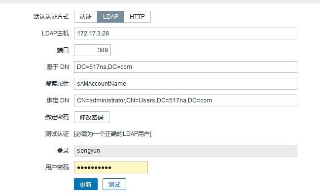
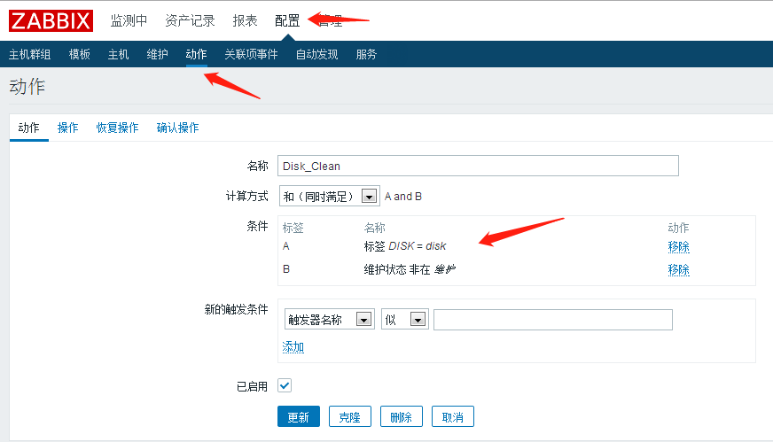
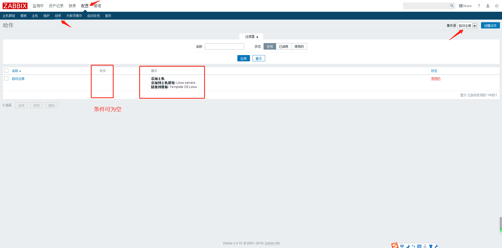
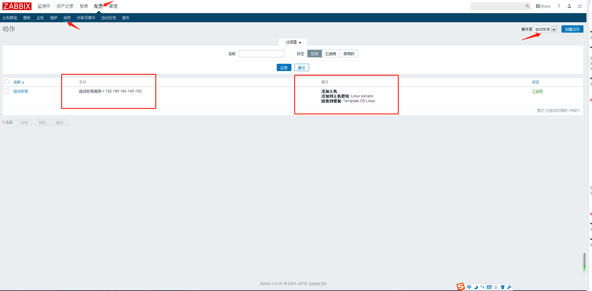

## 实验环境： ##

	CentOS 7.6
	httpd-2.4.38
	MySQL-5.7.26
	PHP-7.3.6
	zabbix-3.4.15

**安装包：**

	\\172.17.3.30\工具\安装包\zabbix-image

## 关闭防火墙与selinux ##

	~]# systemctl stop firewalld
	~]# systemctl disable firewalld
	~]# sed -i 's/SELINUX=enable/SELINUX=disabled/g' /etc/sysconfig/selinux 
	~]# setenforce 0

## Httpd安装 ##

	httpd依赖：apr、apr-util、pcre、pcre-devel、expat-devel、gcc

	解决依赖：
		~]# yum install -y pcre pcre-devel expat-devel gcc

	编译apr:
		~]# tar xf apr-1.6.5.tar.gz -C /usr/src/
		~]# cd /usr/src/apr-1.6.5/
		~]# ./configure --prefix=/usr/local/apr 
		~]# make && make install
		~]# cd ~

	编译apr-util:
		~]# tar xf apr-util-1.6.1.tar.gz -C /usr/src/
		~]# cd /usr/src/apr-util-1.6.1/
		~]# ./configure --prefix=/usr/local/apr-util --with-apr=/usr/local/apr
		~]# make && make install
		~]# cd

	编译httpd:
		~]# tar xf httpd-2.4.38.tar.gz -C /usr/src/
		~]# cd /usr/src/httpd-2.4.38/
		~]# ./configure           \
			--with-apr=/usr/local/apr           \ 
			--with-apr-util=/usr/local/apr-util \
			--prefix=/usr/local/apache          \ 
			--enable-so                         \
			--enable-cgi                        \
			--with-zlib							\
			--with-pcre							\
			--enable-rewrite					\
			--enable-mpms-shared=all			\
			--with-mpm=prefork
			
			注：参数解析
				--sysconfdir=/etc/httpd24  指定配置文件路径
	        	--enable-so 			启动模块动态装卸载
	        	--enable-ssl 		编译ssl模块
	        	--enable-cgi 		支持cgi机制（能够让静态web服务器能够解析动态请求的一个协议）
	        	--enable-rewrite  	支持url重写     
	        	--with-zlib  		支持数据包压缩       
	        	--with-pcre  		支持正则表达式
	        	--with-apr=/usr/local/apr  				指明依赖的apr所在目录
	        	--with-apr-util=/usr/local/apr-util/  	指明依赖的apr-util所在的目录
	        	--enable-modules=most      启用的模块
	        	--enable-mpms-shared=all   以共享方式编译的模块
	        	--with-mpm=prefork         指明httpd的工作方式为prefork,不指定上面这个参数将被静态编译

		~]# make && make install     

	设置PATH环境变量。
		~]# echo 'PATH=/usr/local/apache/bin:$PATH' >/etc/profile.d/apache.sh
		~]# source /etc/profile.d/apache.sh

	修改配置：
		~]# sed -i 's/#ServerName www.example.com:80/ServerName localhost:80/g' /usr/local/apache/conf/httpd.conf 

	文件目录：
		/usr/local/apache/htdocs
		
	启动服务：
		~]# apachectl start
		~]# ss -tnl
		LISTEN     0      128       :::80      :::*   

		~]# cp /usr/local/apache/bin/apachectl /etc/rc.d/init.d/httpd   
		~]# service httpd start

		~]# vi /etc/rc.d/init.d/httpd  
			# chkconfig: 2345 85 15
			# description: Apache is a World Wide Web server.

		//~]# systemctl daemon-reload
		~]# chkconfig --add httpd
		~]# cd

	访问：
		~]# curl http://localhost
		http://IP
		It works	

## Mysql安装 ##

	编译安装5.7
		~]# yum -y install ncurses-devel cmake gcc gcc-c++ perl*
		~]# perl -v 		#检查perl是否能用，若没有版本信息输出，卸掉后重新yum安装
		~]# cd ~
		~]# tar zxvf mysql-boost-5.7.26.tar.gz -C /usr/src/
	
		~]# mkdir /opt/mysql -p
		~]# useradd -M -s /sbin/nologin mysql
		~]# cd /usr/src/mysql-5.7.26/
		~]# cmake 					\
			-DCMAKE_INSTALL_PREFIX=/opt/mysql 	\
			-DMYSQL_DATADIR=/opt/mysql/data 	\
			-DSYSCONFDIR=/etc 					\
			-DWITH_MYISAM_STORAGE_ENGINE=1		\
			-DWITH_INNOBASE_STORAGE_ENGINE=1 	\
			-DWITH_MEMORY_STORAGE_ENGINE=1		\
			-DMYSQL_TCP_PORT=3306 				\
			-DMYSQL_USER=mysql 					\
			-DDEFAULT_CHARSET=utf8 				\
			-DDEFAULT_COLLATION=utf8_general_ci \
			-DWITH_BOOST=boost

		参数解析：
			-DCMAKE_INSTALL_PREFIX=/usr/local/mysql \			#mysql安装根目录
			-DMYSQL_DATADIR=/usr/local/mysql/mydata \			#mysql数据文件存放目录
			-DSYSCONFDIR=/usr/local/mysql/conf \					#mysql配置文件所在目录
			-DMYSQL_USER=mysql \									#mysql用户名
			-DWITH_MYISAM_STORAGE_ENGINE=1 \						#mysql的数据引擎
			-DWITH_INNOBASE_STORAGE_ENGINE=1 \					#mysql的数据引擎
			-DWITH_ARCHIVE_STORAGE_ENGINE=1 \					#mysql的数据引擎
			-DWITH_MEMORY_STORAGE_ENGINE=1 \						#mysql的数据引擎
			-DWITH_READLINE=1 \									#MySQL的readlinelibrary
			-DMYSQL_UNIX_ADDR=/usr/local/mysql/mysql.sock \		#MySQL的通讯目录
			-DMYSQL_TCP_PORT=3306 \								#MySQL的监听端口
			-DENABLED_LOCAL_INFILE=1 \							#启用加载本地数据
			-DENABLE_DOWNLOADS=1 \								#编译时允许自主下载相关文件
			-DWITH_PARTITION_STORAGE_ENGINE=1 \
			-DEXTRA_CHARSETS=all \								#使MySQL支持所有的扩展字符
			-DDEFAULT_CHARSET=utf8 \								#设置默认字符集为utf8
			-DDEFAULT_COLLATION=utf8_general_ci \				#设置默认字符校对
			-DWITH_DEBUG=0 \										#禁用调试模式
			-DMYSQL_MAINTAINER_MODE=0 \
			-DWITH_SSL:STRING=bundled \							#通讯时支持ssl协议
			-DWITH_ZLIB:STRING=bundled \							#允许使用zlib library
			-DDOWNLOAD_BOOST=1 \									#允许在线更新boost库
			-DWITH_BOOST=./boost									#指定boost安装路径
		
		~]# make && make install

		~]# cat /etc/profile.d/mysql.sh 
			MYSQL_HOME=/opt/mysql
			PATH=$MYSQL_HOME/bin:$PATH
		~]# . /etc/profile.d/mysql.sh 
	
		~]# mv /etc/my.cnf /etc/my.cnf.bak
		~]# mysqld --initialize --user=mysql --basedir=/opt/mysql --datadir=/opt/mysql/data		 	
		~]# cp /opt/mysql/support-files/mysql.server /etc/init.d/mysqld			

		~]# cat /etc/my.cnf
			[mysqld]
			datadir=/opt/mysql/data
			basedir=/opt/mysql
			socket=/tmp/mysql.sock

			symbolic-links=0				
			
			[mysqld_safe]
			log-error=/opt/mysql/log/error.log
			pid-file=/opt/mysql/data/mysql.pid
			
			!includedir /etc/my.cnf.d

		//~]# mkdir -p /var/lib/mysql
		//~]# chown -R mysql:mysql /var/lib/mysql
		~]# mkdir -p /opt/mysql/log
		~]# touch /opt/mysql/log/error.log
		~]# chown -R mysql:mysql /opt/mysql/log    

		~]# service mysqld start	

		~]# mysql -uroot -p

		mysql> set password=password("www.517la.com");
		mysql> exit

		还需配置
		~]# chkconfig --del mysqld
		~]# chkconfig --add mysqld	

	mysql5.6编译安装

		~]# yum -y install ncurses-devel cmake gcc gcc-c++ perl*
		~]# perl -v 		#检查perl是否能用，若没有版本信息输出，卸掉后重新yum安装
		~]# cd ~
		~]# tar zxvf mysql-5.6.44.tar.gz -C /usr/src/
		
		~]# mkdir /opt/mysql
		~]# useradd mysql
		~]# cd /usr/src/mysql-5.6.44/
			cmake \
			-DCMAKE_INSTALL_PREFIX=/opt/mysql \
			-DMYSQL_DATADIR=/opt/mysql/data \
			-DSYSCONFDIR=/etc \
			-DWITH_MYISAM_STORAGE_ENGINE=1 \
			-DWITH_INNOBASE_STORAGE_ENGINE=1 \
			-DWITH_MEMORY_STORAGE_ENGINE=1 \
			-DWITH_READLINE=1 \
			-DMYSQL_UNIX_ADDR=/var/lib/mysql/mysql.sock \
			-DMYSQL_TCP_PORT=3306 \
			-DENABLED_LOCAL_INFILE=1 \
			-DWITH_PARTITION_STORAGE_ENGINE=1 \
			-DEXTRA_CHARSETS=all \
			-DDEFAULT_CHARSET=utf8 \
			-DDEFAULT_COLLATION=utf8_general_ci
		
		~]# make && make install
			
		~]# vim /etc/my.cnf
			[mysqld]
			datadir=/opt/mysql/data
			socket=/opt/mysql/data/mysql.sock
			symbolic-links=0
			[mysqld_safe]
			log-error=/var/log/mysql/mysql.log
			pid-file=/var/run/mysql/mysql.pid

			!includedir /etc/my.cnf.d

		~]# cd /opt/mysql/
		~]# ./scripts/mysql_install_db  --user=mysql --basedir=/opt/mysql --datadir=/opt/mysql/data --skip-name-resolve --defaults-file=/etc/my.cnf --collation-server=utf8_general_ci
	
		#也可通过修改环境变量
		~]# ln -s /opt/mysql/bin/mysql /usr/bin
		~]# ln -s /opt/mysql/bin/mysqldump /usr/bin
		~]# cp /opt/mysql/support-files/mysql.server /etc/rc.d/init.d/mysqld
		#~]# chmod +x /etc/rc.d/init.d/mysqld 
		~]# /sbin/chkconfig --del mysqld
		~]# /sbin/chkconfig --add mysqld
		~]# chown -R mysql  /opt/mysql
		~]# cd
		
## PHP安装 ##

	~]# yum install -y openssl openssl-devel curl curl-devel libjpeg libjpeg-devel libpng libpng-devel freetype freetype-devel pcre pcre-devel libxslt libxslt-devel bzip2 bzip2-devel openldap openldap-devel nss_ldap openldap-clients openldap-servers

	~]# tar xf php-7.3.6.tar.gz -C /usr/src/
	~]# cd /usr/src/php-7.3.6/
	
	~]# ./configure --prefix=/usr/local/php --with-config-file-path=/usr/local/php/etc --with-curl --with-freetype-dir --with-gd --with-gettext --with-iconv-dir --with-kerberos --with-libdir=lib64 --with-libxml-dir --with-mysqli --with-openssl --with-pcre-regex --with-pdo-mysql --with-pear --with-png-dir --with-jpeg-dir --with-xmlrpc --with-xsl --with-zlib --with-bz2 --with-mhash --enable-fpm --enable-bcmath --enable-libxml --enable-inline-optimization --enable-gd-native-ttf --enable-mbregex --enable-mbstring --enable-opcache --enable-pcntl --enable-shmop --enable-soap --enable-sockets --enable-sysvsem --enable-sysvshm --enable-xml --enable-zip --with-ldap --with-ldap-sasl

	~]# make && make install
	~]# cp php.ini-development /usr/local/php/etc/php.ini
	~]# cp ./sapi/fpm/php-fpm.conf /usr/local/php/etc/php-fpm.conf
	~]# cp /usr/local/php/etc/php-fpm.d/www.conf.default /usr/local/php/etc/php-fpm.d/www.conf
	~]# cp ./sapi/fpm/init.d.php-fpm /etc/init.d/php-fpm

	//~]# /usr/local/php/sbin/php-fpm		#启动服务

	~]# cat /etc/profile.d/php.sh 
		PHP_HOME=/usr/local/php
		PATH=$PATH:$PHP_HOME/bin	
	~]# . /etc/profile.d/php.sh
	~]# cd /etc/init.d/
	~]# chmod a+x php-fpm
	~]# chkconfig --del php-fpm 
	~]# chkconfig --add php-fpm 
	~]# chkconfig php-fpm on

	~]# service php-fpm start

	#~]# vi /usr/local/apache/conf/httpd.conf
	#	DirectoryIndex  index.php  index.html
	#	AddType application/x-httpd-php  .php
	#	AddType application/x-httpd-php-source  .phps

	问题一：
			configure: error: Cannot find ldap libraries in /usr/lib
			
			~]# cp -frp /usr/lib64/libldap* /usr/lib/

	问题二：
		configure: error: Please reinstall the libzip distribution
		
		方法一：使用老版本（亲测）
			~]# wget https://nih.at/libzip/libzip-1.2.0.tar.gz
			~]# tar xf libzip-1.2.0.tar.gz -C /usr/src
			~]# cd /usr/src/libzip-1.2.0
			~]# ./configure
			~]# make -j4 && make install

		方法二：使用新版本
			~]# wget https://libzip.org/download/libzip-1.5.2.tar.gz
			~]# tar -zxf libzip-1.5.2.tar.gz
			~]# cd libzip-1.5.2
			~]# mkdir build 	
			~]# cd build 
			~]# cmake ..        （#注意：cmake后面有两个小数点）
			~]# make -j4
			~]# make test
			~]# make install

	问题三：
		configure: error: off_t undefined; check your library configuration

		方法：
			~]# cat /etc/ld.so.confcd 
				include ld.so.conf.d/*.conf

				/usr/local/lib64
				/usr/local/lib
				/usr/lib
				/usr/lib64
			~]# /sbin/ldconfig -v

	问题四：
		/usr/local/include/zip.h:59:21: fatal error: zipconf.h: No such file or directory
	
		方法：
			~]# cp /usr/src/php-7.3.6/ext/zip/lib/zipconf.h /usr/local/include/

## httpd代理php请求 ##

	~]# vi /usr/local/apache/conf/httpd.conf

	ServerName localhost:80

	LoadModule proxy_module modules/mod_proxy.so
	LoadModule proxy_fcgi_module modules/mod_proxy_fcgi.so
	
	Include conf/extra/httpd-vhosts.conf

	~]# cat /usr/local/apache/conf/extra/httpd-vhosts.conf 
	<VirtualHost 192.168.164.144:80>
	        DirectoryIndex index.php
	        #ServerName www.chuan.com
	        DocumentRoot /usr/local/apache/htdocs
	        ProxyRequests off
	        ProxyPassMatch ^/(.*\.php)$ fcgi://127.0.0.1:9000/usr/local/apache/htdocs/$1
	        <Directory /usr/local/apache/htdocs>
	            Options FollowSymLinks
	            AllowOverride None
	            Require all granted
	        </Directory>
	</VirtualHost>

## 测试mysql解析 ##

	~]# cat /usr/local/apache/htdocs/index.php
		<?php
    		phpinfo();
		?>

	~]# cat /usr/local/apache/htdocs/mysql.php
	<?php 
	    $mysqli = new mysqli("localhost", "root", "password"); 
	    if(!$mysqli)  { 
	        echo"database error"; 
	    }else{ 
	        echo"php env successful"; 
	    } 
	    $mysqli->close(); 
	?> 

	~]# service httpd restart

	http://IP/index.php
	http://IP/mysql.php

## 安装zabbix-server ##

	~]# yum install -y net-snmp* libxml2-devel libcurl-devel libevent libevent-devel fping gcc mysql-devel 
	~]# tar -xf zabbix-3.4.15.tar.gz -C /usr/src/
	~]# cd /usr/src/zabbix-3.4.15/
	~]# ./configure --prefix=/usr/local/zabbix --enable-server --enable-agent --with-mysql --enable-ipv6 --with-net-snmp --with-libcurl --with-libxml2 (--enable-java)
	
	# ~]# ./configure --prefix=/usr/local/zabbix-agent  --enable-agent
	# ~]# make && make install	
	# ~]# cat /usr/local/zabbix/etc/zabbix_agentd.conf | grep -vE "#|^$"
		# PidFile=/tmp/zabbix_agentd.pid
		# LogFile=/usr/local/zabbix/logs/zabbix_agentd.log
		# Server=127.0.0.1
		# ServerActive=127.0.0.1
		# Hostname=Zabbix server
		# Include=/usr/local/zabbix/etc/zabbix_agentd.conf.d/*.conf		

	~]# make && make install
	~]# useradd zabbix
	~]# cd /usr/local/
	~]# chown -R zabbix:zabbix zabbix/
	~]# mysql -uroot -p
	mysql> create database if not exists zabbix default character set utf8 collate utf8_general_ci;
	mysql> grant all on zabbix.* to zabbix@'192.168.164.%' identified by 'zabbix';
    mysql> flush privileges;
	mysql> use zabbix;
	mysql> source /usr/src/zabbix-3.4.15/database/mysql/schema.sql;
	mysql> source /usr/src/zabbix-3.4.15/database/mysql/images.sql;
	mysql> source /usr/src/zabbix-3.4.15/database/mysql/data.sql;
	~]# cd /usr/local/zabbix
	~]# mkdir logs
	~]# chown zabbix:zabbix logs

	~]# cat /usr/local/zabbix/etc/zabbix_server.conf | grep -vE "#|^$"

		SourceIP=192.168.164.100	#使用VIP必须使用这个参数
		LogFile=/usr/local/zabbix/logs/zabbix_server.log
		PidFile=/usr/local/zabbix/logs/zabbix_server.pid
		DBHost=localhost
		DBName=zabbix
		DBUser=zabbix
		DBPassword=zabbix
		DBSocket=/tmp/mysql.sock
		Timeout=20
		LogSlowQueries=3000
		#Include=/usr/local/zabbix/etc/zabbix_server.conf.d/*.conf

		CacheSize=5000M
		HistoryCacheSize=512M
		ValueCacheSize=512M
		AlertScriptsPath=/usr/local/zabbix/alertscripts			#自定义报警脚本的位置
		ExternalScripts=/usr/local/zabbix/externalscripts		#自定义监控脚本的位置

	~]# cat /usr/local/zabbix/etc/zabbix_agentd.conf | grep -vE "#|^$"
		PidFile=/tmp/zabbix_agentd.pid
		LogFile=/usr/local/zabbix/logs/zabbix_agentd.log
		Server=127.0.0.1
		ServerActive=127.0.0.1
		Hostname=Zabbix server
		Include=/usr/local/zabbix/etc/zabbix_agentd.conf.d/*.conf

	~]# cat /etc/profile.d/zabbix.sh 
		ZABBIX_HOME=/usr/local/zabbix
		PATH=$ZABBIX_HOME/sbin:$PATH

	~]# . /etc/profile.d/zabbix.sh 
	
	~]# /usr/local/zabbix/sbin/zabbix_server

	注意：
		启动的时候报错：error while loading shared libraries: libmysqlclient.so.20: cannot open shared object file: No such file or directory
		~]# ln -s /opt/mysql/lib/libmysqlclient.so.20 /usr/lib/  
		~]# ldconfig -v
		
		再启动还是出错，ps看一下进程是否存在
		
	
	~]# mv /usr/src/zabbix-3.4.15/frontends/php /usr/local/apache/htdocs/zabbix
	//~]# chown -R www:www /usr/local/apache/htdocs/zabbix

	~]# cp /usr/src/zabbix-3.4.15/misc/init.d/fedora/core/zabbix_server /etc/init.d/zabbix-server

	~]# vi /etc/init.d/zabbix-server
		22         BASEDIR=/usr/local/zabbix

	~]# systemctl daemon-reload
	~]# service zabbix-server start

	~]# chkconfig --add zabbix-server
	~]# chkconfig zabbix-server on

	访问zabbix：
		http://IP/zabbix/zabbix.php
		账号：Admin
		密码：zabbix

	注：根据提示来更改php.ini配置，修改完成后需重启php-fpm  /usr/local/php/etc/php.ini
		post_max_size = 16M
		max_execution_time = 300
		max_input_time = 300
		date.timezone = "Asia/Shanghai"

	~]# cat /usr/local/apache/htdocs/zabbix/conf/zabbix.conf.php
		<?php
		// Zabbix GUI configuration file.
		global $DB;
		
		$DB['TYPE']     = 'MYSQL';
		$DB['SERVER']   = '192.168.164.200';
		$DB['PORT']     = '3306';
		$DB['DATABASE'] = 'zabbix';
		$DB['USER']     = 'zabbix';
		$DB['PASSWORD'] = 'zabbix';
		
		// Schema name. Used for IBM DB2 and PostgreSQL.
		$DB['SCHEMA'] = '';
		
		$ZBX_SERVER      = '192.168.164.100';
		$ZBX_SERVER_PORT = '10051';
		$ZBX_SERVER_NAME = '';
		
		$IMAGE_FORMAT_DEFAULT = IMAGE_FORMAT_PNG;

## keepalived实现zabbix-server高可用 ##

**MASTER:**

	~]# yum install -y keepalived
	
	~]# cd /etc/keepalived/
	~]# mv keepalived.conf keepalived.conf_bak
	~]# vi keepalived.conf
			
		global_defs {
			router_id znode1
		}
		
		vrrp_script check_zabbix_server {
		    script "/etc/keepalived/check_zabbix_server.sh"
		    interval 2
		    weight -15
		    fall 2
		    rise 2
		}
		
		vrrp_instance zabbix_server {
		    state MASTER
		    interface ens32
		    virtual_router_id 88
		    priority 100
		    advert_int 1
		    authentication {
		        auth_type PASS
		        auth_pass 517na.com
		    }
		
		    virtual_ipaddress {
		        192.168.164.100
		    }
		
		    track_script {
		        check_zabbix_server
		    }
		}

	~]# vi check_zabbix_server.sh 

		#!/bin/bash
		
		# check zabbix_server is alived
		# author by songyun
		
		STATUS_1=`ps -C zabbix_server --no-header | wc -l`
		
		if [ $STATUS_1 -eq 0 ];then
		
		    service zabbix-server start
		    sleep 3
		
		    STATUS_2=`ps -C zabbix_server --no-header | wc -l`
		    if [ $STATUS_2 -eq 0 ];then
		
		        exit 1
		    fi
		
		fi

	~]# chmod a+x check_zabbix_server.sh
	~]# systemctl start keepalived
	~]# systemctl enable keepalived

**BACKUP:**

	~]# cat /etc/keepalived/keepalived.conf
	global_defs {
	   router_id znode2
	}
	
	vrrp_script check_zabbix_server {
	    script "/etc/keepalived/check_zabbix_server.sh"
	    interval 2
	    weight -15
	    fall 2
	    rise 2
	}
	
	vrrp_instance zabbix_server {
	    state BACKUP
	    interface ens32
	    virtual_router_id 88
	    priority 90
	    advert_int 1
	    authentication {
	        auth_type PASS
	        auth_pass 517na.com
	    }
	
	    virtual_ipaddress {
	        192.168.164.100
	    }
	
	    track_script {
	        check_zabbix_server
	    }    
	}

	
	~]# chmod a+x check_zabbix_server.sh

## 配置mysql主主同步 ##

**MASTER:**

	~]# cat /etc/my.cnf
		[mysqld]
		datadir = /opt/mysql/data
		basedir = /opt/mysql
		socket = /tmp/mysql.sock
		symbolic-links = 0
		
		skip-name-resolve
		
		slave_skip_errors = 1062
		
		server_id = 1
		log-bin = /opt/mysql/log/binary-log
		relay-log = /opt/mysql/log/relay-log
		binlog_format = mixed
		sync_binlog = 1
		auto-increment-increment = 2
		auto-increment-offset = 1
		
		binlog-do-db = zabbix
		binlog-do-db = student 
		binlog-ignore-db = mysql
		binlog-ignore-db = sys 
		binlog-ignore-db = performance_schema
		binlog-ignore-db = information_schema 
		
		replicate-do-db = zabbix
		replicate-do-db = student
		replicate-ignore-db = mysql
		replicate-ignore-db = sys 
		replicate-ignore-db = performance_schema
		replicate-ignore-db = information_schema
		
		gtid_mode=on
		enforce_gtid_consistency=on
		
		[mysqld_safe]
		log-error=/opt/mysql/log/error.log
		pid-file=/opt/mysql/data/mysql.pid
		
		!includedir /etc/my.cnf.d

	mysql> grant replication slave on *.* to 'zabbixM'@'192.168.164.148' identified by 'zabbixM';
	mysql> change master to
		   master_host='192.168.164.148',
		   master_port=3306,
		   master_auto_position=1;
	mysql> start slave user='zabbixB' password='zabbixB';
	
	mysql> show slave status\G;
	mysql> show processlist;

**BACKUP:**

	~]# cat /etc/my.cnf
		[mysqld]
		datadir = /opt/mysql/data
		basedir = /opt/mysql
		socket = /tmp/mysql.sock
		symbolic-links = 0
		
		skip-name-resolve

		slave_skip_errors = 1062
		
		server_id = 2
		log-bin = /opt/mysql/log/binary-log
		relay-log = /opt/mysql/log/relay-log
		binlog_format = mixed
		sync_binlog = 1
		auto-increment-increment = 2
		auto-increment-offset = 2
		
		binlog-do-db = zabbix
		binlog-do-db = student 
		binlog-ignore-db = mysql
		binlog-ignore-db = sys 
		binlog-ignore-db = performance_schema
		binlog-ignore-db = information_schema
		
		replicate-do-db = zabbix
		replicate-do-db = student 
		replicate-ignore-db = mysql
		replicate-ignore-db = sys 
		replicate-ignore-db = performance_schema
		replicate-ignore-db = information_schema
		
		gtid_mode=on
		enforce_gtid_consistency=on
		
		[mysqld_safe]
		log-error=/opt/mysql/log/error.log
		pid-file=/opt/mysql/data/mysql.pid
		
		!includedir /etc/my.cnf.d

	mysql> grant replication slave on *.* to 'zabbixB'@'192.168.164.144' identified by 'zabbixB';	#给master同步backup创建用户
	mysql> change master to						#连接master
		   master_host='192.168.164.144',
		   master_port=3306,
		   master_auto_position=1;
	mysql> start slave user='zabbixM' password='zabbixM';	#开启同步
	
	mysql> show slave status\G;			#查看线程状态
	mysql> show processlist;

	问题：当挂掉一个节点后，正常的节点有数据写入，把挂掉的节点启来后，IO线程会挂掉，需要手动连接正常节点来进行同步

	144挂掉：
		start slave user='zabbixB' password='zabbixB';

	148挂掉：
		start slave user='zabbixM' password='zabbixM';
	
## keepalived实现mysql高可用 ##

**MASTER:**

	~]# cat /etc/keepalived/keepalived.conf
		! Configuration File for keepalived
		
		global_defs {
		   router_id node1
		}
		
		vrrp_script check_mysql {
		    script "/etc/keepalived/check_mysql.sh"
		    interval 2
		    weight -15
		    fall 2
		    rise 2
		}
		
		vrrp_instance mysql {
		    state MASTER
		    interface ens32
		    virtual_router_id 66
		    priority 100
		    advert_int 1
		    authentication {
		        auth_type PASS
		        auth_pass 517na.com
		    }
		
		    virtual_ipaddress {
		        192.168.164.200
		    }
		
		    track_script {
		        check_mysql
		    }
		} 

**BACKUP:**

	~]# cat /etc/keepalived/keepalived.conf
		! Configuration File for keepalived
		
		global_defs {
		   router_id node2
		}
		
		vrrp_script check_mysql {
		    script "/etc/keepalived/check_mysql.sh"
		    interval 2
		    weight -15
		    fall 2
		    rise 2
		}
		
		vrrp_instance mysql {
		    state BACKUP
		    interface ens32
		    virtual_router_id 66
		    priority 90
		    advert_int 1
		    authentication {
		        auth_type PASS
		        auth_pass 517na.com
		    }
		
		    virtual_ipaddress {
		        192.168.164.200
		    }
		
		    track_script {
		        check_mysql
		    }
		}

	~]# cat check_mysql.sh 
		#!/bin/bash
		
		# check mysql is alived
		# author by songyun
		
		
		STATUS_1=`ps -C mysqld --no-header | wc -l`
		
		if [ $STATUS_1 -eq 0 ];then
		
		    service mysqld start
		    sleep 10
		
		    STATUS_2=`ps -C mysqld --no-header | wc -l`
		    if [ $STATUS_2 -eq 0 ];then
		
		        exit 1
		    fi
		fi

**附件：perl安装**

	~]# tar xf perl-5.24.1.tar.gz
	~]# cd perl-5.24.1
	~]# ./configure.gnu -des -Dprefix=/usr/local/perl
	~]# make
	~]# make test
	~]# make install

	~]# mv /usr/bin/perl /usr/bin/perl.bak
	~]# ln -s /usr/local/perl/bin/perl /usr/bin/perl
	
	~]# perl -v

**问题整理：**

	问题一：cannot open log:cannot create semaphore set: [28] No space left on device
		   这是由于Semaphore Arrays信号量集不足导致，用ipcs -s命令查看，有很多zabbix相关的信号量集列表

		~]# ipcs -s | grep zabbix
		0x00000000 1835059    zabbix     600        14        
		0x00000000 1867828    zabbix     600        14        
		0x00000000 1900597    zabbix     600        14        
		0x00000000 1933366    zabbix     600        14        
		0x00000000 1966135    zabbix     600        14        
		0x00000000 1998904    zabbix     600        14        
		0x00000000 2031673    zabbix     600        14        
		0x00000000 2064442    zabbix     600        14        
		0x00000000 2097211    zabbix     600        14        
		...

		~]# ipcs -s | grep zabbix| awk ' { print $2 } ' | xargs -n 1 ipcrm -s		
		~]# service zabbix-server start

	问题二：mysql服务器重启后，需要手动再启动主主同步
		主：
			~]# start slave user='zabbixB' password='zabbixB';

		从：
			~]# start slave user='zabbixM' password='zabbixM';
			

## LDAP认证 ##

	注：必须要php支持ldap模块,可用如下查看
	~]# php -m | grep ldap
	ldap

	LDAP主机：域控服务器IP
	端口：默认389，一般不动
	基于DN：域名分段写
	搜寻属性：默认SAMAccountName，一般不动
	绑定DN：CN=域管理员账号，CN=账号所属组，DC=同上
	Bind密码：域管理员密码
	测试认证：需要一个域中的账号

## 配置dingding告警 ##

	#yum install -y epel-release
	#yum install -y python-pip

	ImportError: No module named requests
		
	~]# yum install -y python-requests

**第一步：钉钉建立群聊**

**第二步：点击群设置**

**第三步：添加机器人**

**第四步：点击+号**

**第五步：创建自定义机器人**

**第六步：查看webhook**

**第七步：zabbix-server配置**

	~]# cat /usr/local/zabbix/etc/zabbix_server.conf | grep -Ev "#|^$"
	...
	AlertScriptsPath=/usr/local/zabbix/etc/alertscripts		#告警脚本存放目录
	...

	~]# cd /usr/local/zabbix/etc
	~]# mkdir alertscripts
	~]# chown -R zabbix:zabbix alertscripts

	~]# cd alertscripts
	~]# cat zabbix_send_ding.py 
		#!/usr/bin/env python
		# coding:utf-8
		# zabbix dingding
		
		import requests,json,sys,os,datetime
		
		webhook="https://oapi.dingtalk.com/robot/send?access_token=693f641aba0577965a70c23439cdc00f9c0e9b001fa1a1f0839d662495764937"
		
		user=sys.argv[1]
		text=sys.argv[3]
		
		data={
		    "msgtype": "text",
		    "text": {
		        "content": text
		    },
		    "at": {
		        "atMobiles": [
		            user
		        ],
		        "isAtAll": False
		    }
		}
		headers = {'Content-Type': 'application/json'}
		
		response=requests.post(url=webhook,data=json.dumps(data),headers=headers)
		
		if os.path.exists("/usr/local/zabbix/logs/dingding.log"):
		    f=open("/usr/local/zabbix/logs/dingding.log","a+")
		else:
		    f=open("/usr/local/zabbix/logs/dingding.log","w+")
		
		f.write("\n"+"--"*30)
		
		if response.json()["errcode"] == 0:
		    f.write("\n"+str(datetime.datetime.now())+"    "+str(user)+"    "+"发送成功"+"\n"+str(text))
		    f.close()
		else:
		    f.write("\n"+str(datetime.datetime.now()) + "    " + str(user) + "    " + "发送失败" + "\n" + str(text))
		    f.close()

	
	~]# service zabbix-server restart

**第八步：添加报警媒介类型**

**第九步：添加动作**

**第十步：绑定用户**

## 触发器触发后执行远程命令 ##

	1.修改agent配置
		~]# vim /etc/zabbix/zabbix_agentd.conf
			EnableRemoteCommands=1	#允许执行远程命令
		~]# systemctl restart zabbix-agent

	2.修改visudo
		因为执行远程命令是使用zabbix用户执行，需赋予权限
		~]# visudo
			zabbix	ALL=(ALL)	NOPASSWD:ALL
			
	3.在zabbix-server上测试
		~]# zabbix-get -I SRC_IP -p 10050 -s DST_IP -k "system.run[sudo CMD]"	 

	4.在页面进行配置

	5.编写执行脚本，添加执行权限

## 创建自动发现与自动注册规则 ##

**自动注册：客户端主动在服务端注册添加入监控**

**自动发现：服务器主动探测并将主机加入监控**

	
## proxy分布式监控

	~]# wget https://mirrors.aliyun.com/zabbix/zabbix/3.4/rhel/7/x86_64/zabbix-release-3.4-1.el7.centos.noarch.rpm
	~]# rpm -ivh zabbix-release-3.4-1.el7.centos.noarch.rpm
	~]# yum install -y zabbix-proxy-mysql zabbix-get zabbix-agent mariadb-server (net-snmp*)

	~]# systemctl start mariadb
	~]# mysql
	mysql> set password=password("960711");	

	mysql> create database zabbix_proxy;
	mysql> grant all on zabbix_proxy.* to zabbix_proxy@'localhost' identified by 'zabbix_proxy';
	mysql> flush privileges;
	
	~]# zcat /usr/share/doc/zabbix-proxy-mysql-3.4.15/schema.sql.gz | mysql -uzabbix_proxy -pzabbix_proxy zabbix_proxy

	~]# cat /etc/zabbix/zabbix_proxy.conf | grep -vE "#|^$"
		Server=192.168.164.100
		Hostname=Zabbix_proxy_192.168.164.145
		LogFile=/var/log/zabbix/zabbix_proxy.log
		LogFileSize=0								#日志不轮询生成，日志到最大清空老日志
		PidFile=/var/run/zabbix/zabbix_proxy.pid
		SocketDir=/var/run/zabbix
		DBName=zabbix_proxy
		DBUser=zabbix_proxy
		DBPassword=zabbix_proxy
		SNMPTrapperFile=/var/log/snmptrap/snmptrap.log
		Timeout=20
		ExternalScripts=/usr/lib/zabbix/externalscripts
		LogSlowQueries=3000

	~]# systemctl start zabbix-proxy
	~]# systemctl enable zabbix-proxy
	

## 可视化工具grafana安装配置 

	~]# cat /etc/yum.repos.d/grafana.repo 
		[grafana]
		name=grafana
		baseurl=https://packages.grafana.com/oss/rpm
		repo_gpgcheck=1
		enabled=1
		gpgcheck=1
		gpgkey=https://packages.grafana.com/gpg.key
		sslverify=1
		sslcacert=/etc/pki/tls/certs/ca-bundle.crt

	~]# yum list --showduplicates grafana
	~]# yum isntall -y grafana
	
	~]# systemctl start grafana-server				#监听3000端口

	~]# grafana-cli plugins install alexanderzobnin-zabbix-app		#下载zabbix插件
	

