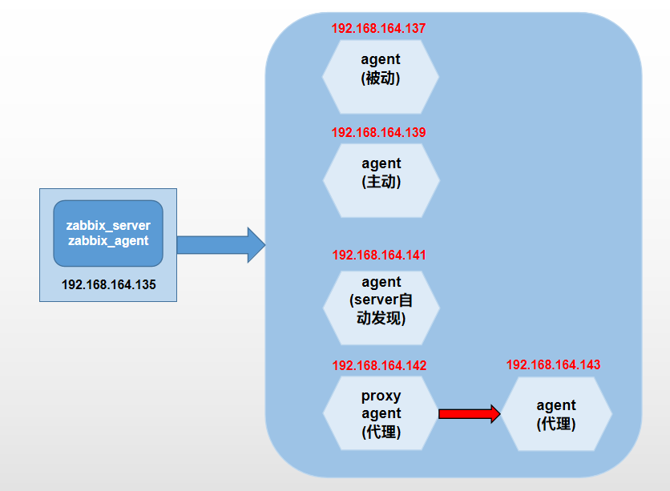

**实验环境：**

	CentOS 7.6
	Nginx-1.14.2
	MySQL-5.7.26
	PHP-7.3.6

# 1.LNMP环境 #

## 1.1 关闭防火墙与selinux ##

	~]# systemctl stop firewalld
	~]# systemctl enable firewalld

	~]# sed -i 's/SELINUX=enable/SELINUX=disabled/g' /etc/sysconfig/selinux 
	~]# setenforce 0

## 1.2 依赖安装 ##

	~]# yum -y install wget openssl* gcc gcc-c++ autoconf libjpeg libjpeg-devel libpng libpng-devel freetype freetype-devel libxml2 libxml2-devel zlib zlib-devel glibc glibc-devel glib2 glib2-devel bzip2 bzip2-devel ncurses ncurses-devel curl curl-devel e2fsprogs e2fsprogs-devel krb5 krb5-devel libidn libidn-devel openssl openssl-devel openldap openldap-devel nss_ldap openldap-clients openldap-servers make gd gd2 gd-devel gd2-devel libxslt libxslt-devel libaio libaio-devel

## 1.3 Nginx安装 ##

	~]# tar xf nginx-1.16.0.tar.gz -C /usr/src/
	~]# cd /usr/src/nginx-1.16.0/
	~]# useradd www
	~]# ./configure --user=www --group=www --prefix=/usr/local/nginx
	~]# make && make install
	
	~]# echo 'PATH=/usr/local/nginx/sbin:$PATH' >> /etc/profile.d/nginx.sh
	~]# . /etc/profile.d/nginx.sh

	~]# nginx &

## 1.4 二进制安装mysql ##

	~]# tar xf mysql-5.7.26-el7-x86_64.tar.gz -C /usr/src/
	~]# cd /usr/src/mysql-5.7.26-el7-x86_64/
	~]# ln -sv /usr/src/mysql-5.7.26-el7-x86_64 /usr/local/mysql
	~]# cat /etc/profile.d/mysql.sh
		MYSQL_HOME=/usr/local/mysql/
		PATH=$MYSQL_HOME/bin:$PATH
	~]# . /etc/profile.d/mysql.sh 
	~]# cd /usr/local/mysql/
	~]# useradd mysql 
	~]# mkdir data logs
	~]# echo "" > logs/error.log
	~]# ./bin/mysqld --initialize --user=mysql --basedir=/usr/local/mysql --datadir=/usr/local/mysql/data --port=3306			#会生成一个随机密码，这是初始化密码
	~]# cd /usr/local
	~]# chown -R mysql:mysql mysql/
	~]# vim /etc/my.cnf

		[client]
		port=3306
		socket=/tmp/mysql.sock
		default-character-set=utf8
		
		[mysql]
		no-auto-rehash
		default-character-set=utf8
		
		[mysqld]
		user    = mysql
		port    = 3306
		basedir = /usr/local/mysql
		datadir = /usr/local/mysql/data
		socket  = /tmp/mysql.sock
		pid-file = mysql3306.pid
		log-error=/usr/local/mysql/logs/error.log
		skip_name_resolve = 1
		open_files_limit    = 65535
		back_log = 1024
		max_connections = 1500
		max_connect_errors = 1000000
		table_open_cache = 1024
		table_definition_cache = 1024
		table_open_cache_instances = 64
		thread_stack = 512K
		external-locking = FALSE
		max_allowed_packet = 32M
		sort_buffer_size = 16M
		join_buffer_size = 16M
		thread_cache_size = 2250
		query_cache_size = 0
		query_cache_type = 0
		interactive_timeout = 600
		wait_timeout = 600
		tmp_table_size = 96M
		max_heap_table_size = 96M
		
		###***slowqueryparameters
		long_query_time = 0.1
		slow_query_log = 1
		slow_query_log_file = /usr/local/mysql/logs/slow.log
		
		###***binlogparameters
		log-bin=mysql-bin
		binlog_cache_size=4M
		max_binlog_cache_size=8M
		max_binlog_size=1024M
		binlog_format=MIXED
		expire_logs_days=7
		
		###***master-slavereplicationparameters
		server-id=3306
		#slave-skip-errors=all
		
		[mysqldump]
		quick
		max_allowed_packet=32M

	~]# cp /usr/local/mysql/support-files/mysql.server /etc/init.d/mysqld
	~]# service mysqld start
	~]# mysql -uroot -p

	mysql> set password=password("960711");

	~]# chkconfig --del mysqld
	~]# chkconfig --add mysqld
	~]# chkconfig mysqld on

## 1.5 安装php ##

	1.安装依赖库--libmcrypt
		~]# tar xf libmcrypt-2.5.8.tar.gz -C /usr/src/
		~]# cd /usr/src/libmcrypt-2.5.8/
		~]# ./configure 
		~]# make && make install
		~]# /sbin/ldconfig 
		~]# ./configure --enable-ltdl-install
		~]# make && make install
		~]# ln -svf /usr/local/lib/libmcrypt.la /usr/lib/libmcrypt.la
		~]# ln -svf /usr/local/lib/libmcrypt.so /usr/lib/libmcrypt.so
		~]# ln -svf /usr/local/lib/libmcrypt.so.4 /usr/lib/libmcrypt.so.4
		~]# ln -svf /usr/local/lib/libmcrypt.so.4.4.8 /usr/lib/libmcrypt.so.4.4.8
		~]# /sbin/ldconfig 

	2.安装依赖库--mhash
		~]# tar xf mhash-0.9.9.9.tar.gz -C /usr/src/
		~]# cd /usr/src/mhash-0.9.9.9/
		~]# ./configure 
		~]# make && make install
		~]# ln -svf /usr/local/lib/libmhash.a /usr/lib/libmhash.a
		~]# ln -svf /usr/local/lib/libmhash.la /usr/lib/libmhash.la
		~]# ln -svf /usr/local/lib/libmhash.so /usr/lib/libmhash.so
		~]# ln -svf /usr/local/lib/libmhash.so.2 /usr/lib/libmhash.so.2
		~]# ln -svf /usr/local/lib/libmhash.so.2.0.1 /usr/lib/libmhash.so.2.0.1
		~]# /sbin/ldconfig 

	3.安装依赖库--mcrypt
		~]# tar xf mcrypt-2.6.8.tar.gz -C /usr/src/
		~]# cd /usr/src/mcrypt-2.6.8/
		~]# ./configure 
		~]# make && make install

	4.安装php
		~]# tar xf php-7.3.6.tar.gz -C /usr/src/
		~]# cd /usr/src/php-7.3.6/
		~]# ./configure --prefix=/usr/local/php --with-config-file-path=/usr/local/php/etc --enable-fpm --with-fpm-user=www --with-fpm-group=www --with-mysqli --with-pdo-mysql --with-iconv-dir --with-freetype-dir --with-jpeg-dir --with-png-dir --with-zlib --with-libxml-dir=/usr --enable-xml --disable-rpath --enable-bcmath --enable-shmop --enable-sysvsem --enable-inline-optimization --with-curl --enable-mbregex --enable-mbstring --with-mcrypt --enable-ftp --with-gd --enable-gd-native-ttf --with-openssl --with-mhash --enable-pcntl --enable-sockets --with-xmlrpc --enable-zip --enable-soap --without-pear --with-gettext --disable-fileinfo --enable-maintainer-zts --enable-opcache --with-xsl

		注：--with-ldap 编译时添加ldap模块

		出现问题看下面解决办法
	
		~]# make && make install
		~]# cp php.ini-development /usr/local/php/etc/php.ini
		~]# cp ./sapi/fpm/php-fpm.conf /usr/local/php/etc/php-fpm.conf
		~]# cp /usr/local/php/etc/php-fpm.d/www.conf.default /usr/local/php/etc/php-fpm.d/www.conf
		~]# cp ./sapi/fpm/init.d.php-fpm /etc/init.d/php-fpm

		~]# /usr/local/php/sbin/php-fpm		#启动服务

		~]# cat /etc/profile.d/php.sh 
			PHP_HOME=/usr/local/php
			PATH=$PATH:$PHP_HOME/bin

		~]# . /etc/profile.d/php.sh
		~]# cd /etc/init.d/
		~]# chmod a+x php-fpm
		~]# chkconfig --del php-fpm 
		~]# chkconfig --add php-fpm 
		~]# chkconfig php-fpm on

		问题一：
			configure: error: Cannot find ldap libraries in /usr/lib
			
			~]# cp -frp /usr/lib64/libldap* /usr/lib/

		问题二：
			configure: error: Please reinstall the libzip distribution
			
			方法一：使用老版本（亲测）
				~]# wget https://nih.at/libzip/libzip-1.2.0.tar.gz
				~]# tar xf libzip-1.2.0.tar.gz -C /usr/src
				~]# cd /usr/src/libzip-1.2.0
				~]# ./configure
				~]# make -j4 && make install

			方法二：使用新版本
				~]# wget https://libzip.org/download/libzip-1.5.2.tar.gz
				~]# tar -zxf libzip-1.5.2.tar.gz
				~]# cd libzip-1.5.2
				~]# mkdir build 	
				~]# cd build 
				~]# cmake ..        （#注意：cmake后面有两个小数点）
				~]# make -j4
				~]# make test
				~]# make install

		问题三：
			configure: error: off_t undefined; check your library configuration

			方法：
				~]# cat /etc/ld.so.conf
					include ld.so.conf.d/*.conf

					/usr/local/lib64
					/usr/local/lib
					/usr/lib
					/usr/lib64
				~]# /sbin/ldconfig -v

		问题四：
			/usr/local/include/zip.h:59:21: fatal error: zipconf.h: No such file or directory

			~]# cp /usr/src/php-7.3.6/ext/zip/lib/zipconf.h /usr/local/include/

		注：
			为了让动态链接库为系统所共享,还需运行动态链接库的管理命令--ldconfig.此执行程序存放在/sbin目录下. ldconfig命令的用途,主要是在默认搜寻目录(/lib和/usr/lib)以及动态库配置文件/etc/ld.so.conf内所列的目录下,搜索出可共享的动态链接库(格式如前介绍,lib*.so*),进而创建出动态装入程序(ld.so)所需的连接和缓存文件.缓存文件默认为/etc/ld.so.cache,此文件保存已排好序的动态链接库名字列表. ldconfig通常在系统启动时运行,而当用户安装了一个新的动态链接库时,就需要手工运行这个命令. 

			
	PHP配置文件解析：
		1.php.ini是php运行核心配置文件
			#避免PHP信息暴露在http头中
			expose_php = Off
			#避免暴露php调用mysql的错误信息
			display_errors = Off		
			#在关闭display_errors后开启PHP错误日志（路径在php-fpm.conf中配置）
			log_errors = On	
			#设置PHP的扩展库路径
			extension_dir = "/usr/local/php7/lib/php/extensions/no-debug-non-zts-20141001/"	
			#设置PHP的opcache和mysql动态库
			zend_extension=opcache.so
			extension=mysqli.so
			extension=pdo_mysql.so
			#设置PHP的时区
			date.timezone = PRC
			#开启opcache
			[opcache]
			; Determines if Zend OPCache is enabled
			opcache.enable=1
			#设置PHP脚本允许访问的目录（需要根据实际情况配置）
			;open_basedir = /usr/share/nginx/html;

		2.php-fpm.conf是 php-fpm 进程服务的配置文件：
			#设置错误日志的路径
			error_log = /var/log/php-fpm/error.log
			#引入www.conf文件中的配置
			include=/usr/local/php7/etc/php-fpm.d/*.conf

		3.www.conf这是 php-fpm 进程服务的扩展配置文件：
			#设置用户和用户组
			user = nginx
			group = nginx
			#根据nginx.conf中的配置fastcgi_pass unix:/var/run/php-fpm/php-fpm.sock;设置PHP监听
			; listen = 127.0.0.1:9000   #####不建议使用
			listen = /var/run/php-fpm/php-fpm.sock
			#开启慢日志
			slowlog = /var/log/php-fpm/$pool-slow.log
			request_slowlog_timeout = 10s
			#设置php的session目录（所属用户和用户组都是nginx）
			php_value[session.save_handler] = files
			php_value[session.save_path] = /var/lib/php/session
			

## 1.6 测试解析php，连接数据库 ##

	测试解析php：
		~]# cat /usr/local/nginx/html/index.php
			<?php
        		phpinfo();
			?>

		~]# vi /usr/local/nginx/conf/nginx.conf
		
			location ~ \.php$ {
	            root           html;
	            fastcgi_pass   127.0.0.1:9000;
	            fastcgi_index  index.php;
	            fastcgi_param  SCRIPT_FILENAME  $document_root$fastcgi_script_name;
	            include        fastcgi_params;
	        }	
	
		~]# nginx -s reload

	测试连接数据库
	
	~]# cat /usr/local/nginx/html/mysql.php
	<?php 
	    $mysqli = new mysqli("localhost", "root", "password"); 
	    if(!$mysqli)  { 
	        echo"database error"; 
	    }else{ 
	        echo"php env successful"; 
	    } 
	    $mysqli->close(); 
	?> 	

## 1.7 优化php-开启opcache ##
	
	什么是Opcache呢？
		Opcache 的前生是 Optimizer+ ，它是PHP的官方公司 Zend 开发的一款闭源但可以免费使用的 PHP 优化加速组件。 
		Optimizer+ 将PHP代码预编译生成的脚本文件 Opcode 缓存在共享内存中供以后反复使用，从而避免了从磁盘读取代码再次编译的时间消耗。
		同时，它还应用了一些代码优化模式，使得代码执行更快。从而加速PHP的执行。

	查看是否有该模块，没有需要编译php：
		~]# ls -R /usr/local/php/lib/php/extensions | grep opcache
			opcache.a
			opcache.so
		~]# php -m | grep opcache

		启动成功后，php测试页面会加载出Zend OPcache模块
	

	php.ini:
		[opcache]
		zend_extension = opcache.so
		 
		; Zend Optimizer + 的开关, 关闭时代码不再优化.
		opcache.enable=1
		 
		; Determines if Zend OPCache is enabled for the CLI version of PHP
		opcache.enable_cli=1
		 
		 
		; Zend Optimizer + 共享内存的大小, 总共能够存储多少预编译的 PHP 代码(单位:MB)
		; 推荐 128
		opcache.memory_consumption=64
		 
		; Zend Optimizer + 暂存池中字符串的占内存总量.(单位:MB)
		; 推荐 8
		opcache.interned_strings_buffer=4
		 
		 
		; 最大缓存的文件数目 200  到 100000 之间
		; 推荐 4000
		opcache.max_accelerated_files=2000
		 
		; 内存“浪费”达到此值对应的百分比,就会发起一个重启调度.
		opcache.max_wasted_percentage=5
		 
		; 开启这条指令, Zend Optimizer + 会自动将当前工作目录的名字追加到脚本键上,
		; 以此消除同名文件间的键值命名冲突.关闭这条指令会提升性能,
		; 但是会对已存在的应用造成破坏.
		opcache.use_cwd=0
		 
		 
		; 开启文件时间戳验证 
		opcache.validate_timestamps=1
		 
		 
		; 2s检查一次文件更新 注意:0是一直检查不是关闭
		; 推荐 60
		opcache.revalidate_freq=2
		 
		; 允许或禁止在 include_path 中进行文件搜索的优化
		;opcache.revalidate_path=0
		 
		 
		; 是否保存文件/函数的注释   如果apigen、Doctrine、 ZF2、 PHPUnit需要文件注释
		; 推荐 0
		opcache.save_comments=1
		 
		; 是否加载文件/函数的注释
		;opcache.load_comments=1
		 
		 
		; 打开快速关闭, 打开这个在PHP Request Shutdown的时候会收内存的速度会提高
		; 推荐 1
		opcache.fast_shutdown=1
		 
		;允许覆盖文件存在（file_exists等）的优化特性。
		;opcache.enable_file_override=0
		 
		 
		; 定义启动多少个优化过程
		;opcache.optimization_level=0xffffffff
		 
		 
		; 启用此Hack可以暂时性的解决”can’t redeclare class”错误.
		;opcache.inherited_hack=1
		 
		; 启用此Hack可以暂时性的解决”can’t redeclare class”错误.
		;opcache.dups_fix=0
		 
		; 设置不缓存的黑名单
		; 不缓存指定目录下cache_开头的PHP文件. /png/www/example.com/public_html/cache/cache_ 
		;opcache.blacklist_filename=
		 
		 
		; 通过文件大小屏除大文件的缓存.默认情况下所有的文件都会被缓存.
		;opcache.max_file_size=0
		 
		; 每 N 次请求检查一次缓存校验.默认值0表示检查被禁用了.
		; 由于计算校验值有损性能,这个指令应当紧紧在开发调试的时候开启.
		;opcache.consistency_checks=0
		 
		; 从缓存不被访问后,等待多久后(单位为秒)调度重启
		;opcache.force_restart_timeout=180
		 
		; 错误日志文件名.留空表示使用标准错误输出(stderr).
		;opcache.error_log=
		 
		 
		; 将错误信息写入到服务器(Apache等)日志
		;opcache.log_verbosity_level=1
		 
		; 内存共享的首选后台.留空则是让系统选择.
		;opcache.preferred_memory_model=
		 
		; 防止共享内存在脚本执行期间被意外写入, 仅用于内部调试.
		;opcache.protect_memory=0
		
## 1.8 加载ldap验证模块 ##

# 2.Zabbix环境

## 架构图:

## 2.1 安装zabbix_server ##

	~]# tar -xf zabbix-3.2.11.tar.gz -C /usr/src/
	~]# yum install -y net-snmp-devel libxml2-devel libcurl-devel libevent libevent-devel
	~]# cd /usr/src/zabbix-3.2.11/
	~]# ./configure --prefix=/usr/local/zabbix --enable-server --enable-agent --with-mysql --enable-ipv6 --with-net-snmp --with-libcurl --with-libxml2
	
	# ~]# ./configure --prefix=/usr/local/zabbix-agent  --enable-agent
	# ~]# make && make install	
	# ~]# cat /usr/local/zabbix/etc/zabbix_agentd.conf | grep -vE "#|^$"
		# PidFile=/tmp/zabbix_agentd.pid
		# LogFile=/usr/local/zabbix/logs/zabbix_agentd.log
		# Server=127.0.0.1
		# ServerActive=127.0.0.1
		# Hostname=Zabbix server
		# Include=/usr/local/zabbix/etc/zabbix_agentd.conf.d/*.conf

	~]# make && make install
	~]# useradd zabbix
	~]# cd /usr/local/
	~]# chown -R zabbix:zabbix zabbix/
	~]# mysql -uroot -p
	mysql> create database if not exists zabbix default character set utf8 collate utf8_general_ci;
	mysql> grant all on zabbix.* to zabbix@'localhost' identified by 'zabbix';
    mysql> flush privileges;
	mysql> use zabbix;
	mysql> source /usr/src/zabbix-3.2.11/database/mysql/schema.sql;
	mysql> source /usr/src/zabbix-3.2.11/database/mysql/images.sql;
	mysql> source /usr/src/zabbix-3.2.11/database/mysql/data.sql;
	~]# cd /usr/local/zabbix
	~]# mkdir logs
	~]# chown zabbix:zabbix logs

	~]# cat /usr/local/zabbix/etc/zabbix_server.conf | grep -vE "#|^$"
		LogFile=/usr/local/zabbix/logs/zabbix_server.log
		PidFile=/tmp/zabbix_server.pid
		DBHost=localhost
		DBName=zabbix
		DBUser=zabbix
		DBPassword=zabbix
		DBSocket=/tmp/mysql.sock
		Timeout=4
		LogSlowQueries=3000
		Include=/usr/local/zabbix/etc/zabbix_server.conf.d/*.conf

	~]# cat /usr/local/zabbix/etc/zabbix_agentd.conf | grep -vE "#|^$"
		PidFile=/tmp/zabbix_agentd.pid
		LogFile=/usr/local/zabbix/logs/zabbix_agentd.log
		Server=127.0.0.1
		ServerActive=127.0.0.1
		Hostname=Zabbix server
		Include=/usr/local/zabbix/etc/zabbix_agentd.conf.d/*.conf

	~]# cat /etc/profile.d/zabbix.sh 
		ZABBIX_HOME=/usr/local/zabbix
		PATH=$ZABBIX_HOME/sbin:$PATH

	~]# . /etc/profile.d/zabbix.sh 

	注意：
		如果再启动的时候报错：error while loading shared libraries: libmysqlclient.so.20: cannot open shared object file: No such file or directory
		~]# ln -s /usr/local/mysql/lib/libmysqlclient.so.20 /usr/lib/
		~]# ldconfig
	
	~]# mv /usr/src/zabbix-3.2.11/frontends/php/ /usr/local/nginx/html/zabbix
	~]# chown -R www:www /usr/local/nginx/html/zabbix

	访问zabbix：
		http://IP/zabbix/zabbix.php
		账号：Admin
		密码：zabbix

	注：根据提示来更改php.ini配置，修改完成后需重启php-fpm
		post_max_size = 16M
		max_execution_time = 300
		max_input_time = 300
		date.timezone = "Asia/Shanghai"

## 2.2 安装zabbix_agent ##