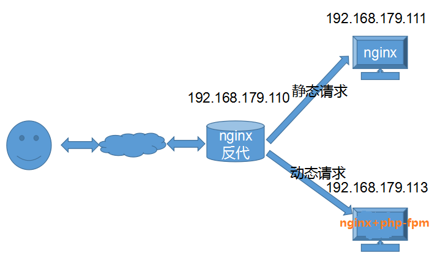

官网：[http://www.nginx.org](http://www.nginx.org)

#1.nginx安装

## 编译安装 ##

	~]# wget http://nginx.org/download/nginx-1.14.2.tar.gz
	~]# tar -xf nginx-1.14.2.tar.gz
	~]# cd nginx-1.14.2
	
	#解决依赖
	~]# yum -y install gcc pcre pcre-devel zlib zlib-devel openssl openssl-devel	
	
	#添加用户和组，nginx主进程由root运行，子进程为nginx用户
	~]# groupadd www
	~]# useradd -g www www
	
	#配置
	~]# ./configure \
	--user=www \
	--group=www \
	--prefix=/usr/local/nginx \
	--with-http_ssl_module \
	--with-http_stub_status_module \
	--with-http_realip_module \
	--with-threads

	~]# ./configure \
	--prefix=/usr/local/nginx \
	--conf-path=/etc/nginx/nginx.conf \
	--error-log-path=/var/log/nginx/error.log \
	--http-log-path=/var/log/nginx/access.log \
	--pid-path=/var/run/nginx.pid \
	--lock-path=/var/run/nginx.lock \
	--user=nginx \
	--group=nginx \
	--with-http_ssl_module \
	--with-http_v2_module \
	--with-http_dav_module \
	--with-http_stub_status_module \
	--with-threads \
	--with-file-aio

	ngx_http_ssl_module：提供必要的https支持，需要依赖openssl库
	ngx_http_v2_module：支持http/2.0协议
	ngx_http_stub_status_module：提供nginx状态页

	#编译安装
	~]# make && make install
	
	~]# echo 'PATH=/usr/local/nginx/sbin:$PATH' >> /etc/profile.d/nginx.sh
	~]# . /etc/profile.d/nginx.sh
	
	
	#添加启动脚本
	~]# vim /etc/init.d/nginx
		#!/bin/sh
		#
		# nginx - this script starts and stops the nginx daemon
		#
		# chkconfig:   - 85 15
		# description:  NGINX is an HTTP(S) server, HTTP(S) reverse \
		#               proxy and IMAP/POP3 proxy server
		# processname: nginx
		# config:      /usr/local/nginx/conf/nginx.conf
		# config:      /etc/sysconfig/nginx
		# pidfile:     /usr/local/nginx/logs/nginx.pid
		# Source function library.
		. /etc/rc.d/init.d/functions
		# Source networking configuration.
		. /etc/sysconfig/network
		# Check that networking is up.
		[ "$NETWORKING" = "no" ] && exit 0
		nginx="/usr/local/nginx/sbin/nginx"
		prog=$(basename $nginx)
		NGINX_CONF_FILE="/usr/local/nginx/conf/nginx.conf"
		[ -f /etc/sysconfig/nginx ] && . /etc/sysconfig/nginx
		lockfile=/var/lock/subsys/nginx
		make_dirs() {
		   # make required directories
		   user=`$nginx -V 2>&1 | grep "configure arguments:" | sed 's/[^*]*--user=\([^ ]*\).*/\1/g' -`
		   if [ -z "`grep $user /etc/passwd`" ]; then
		       useradd -M -s /bin/nologin $user
		   fi
		   options=`$nginx -V 2>&1 | grep 'configure arguments:'`
		   for opt in $options; do
		       if [ `echo $opt | grep '.*-temp-path'` ]; then
		           value=`echo $opt | cut -d "=" -f 2`
		           if [ ! -d "$value" ]; then
		               # echo "creating" $value
		               mkdir -p $value && chown -R $user $value
		           fi
		       fi
		   done
		}
		start() {
		    [ -x $nginx ] || exit 5
		    [ -f $NGINX_CONF_FILE ] || exit 6
		    make_dirs
		    echo -n $"Starting $prog: "
		    daemon $nginx -c $NGINX_CONF_FILE
		    retval=$?
		    echo
		    [ $retval -eq 0 ] && touch $lockfile
		    return $retval
		}
		stop() {
		    echo -n $"Stopping $prog: "
		    killproc $prog -QUIT
		    retval=$?
		    echo
		    [ $retval -eq 0 ] && rm -f $lockfile
		    return $retval
		}
		restart() {
		    configtest || return $?
		    stop
		    sleep 1
		    start
		}
		reload() {
		    configtest || return $?
		    echo -n $"Reloading $prog: "
		    killproc $nginx -HUP
		    RETVAL=$?
		    echo
		}
		force_reload() {
		    restart
		}
		configtest() {
		  $nginx -t -c $NGINX_CONF_FILE
		}
		rh_status() {
		    status $prog
		}
		rh_status_q() {
		    rh_status >/dev/null 2>&1
		}
		case "$1" in
		    start)
		        rh_status_q && exit 0
		        $1
		        ;;
		    stop)
		        rh_status_q || exit 0
		        $1
		        ;;
		    restart|configtest)
		        $1
		        ;;
		    reload)
		        rh_status_q || exit 7
		        $1
		        ;;
		    force-reload)
		        force_reload
		        ;;
		    status)
		        rh_status
		        ;;
		    condrestart|try-restart)
		        rh_status_q || exit 0
		            ;;
		    *)
		        echo $"Usage: $0 {start|stop|status|restart|condrestart|try-restart|reload|force-reload|configtest}"
		        exit 2
		esac
	
	
	~]# chmod a+x /etc/init.d/nginx
	
	#将nginx服务加入chkconfig管理列表
	~]# chkconfig --add /etc/init.d/nginx
	~]# chkconfig nginx on
	~]# service nginx start

## yum安装 ##

	http://nginx.org/en/linux_packages.html#RHEL-CentOS 	#官网提供的yum仓库
	

#2.虚拟主机
**基于ip:**

	~]# ip addr add 192.168.179.111 dev ens33
	~]# cat vhsot.conf
		server {
		    listen 80;
		    server_name 192.168.179.110;
		    location / {
		        root /data/www/ilinux;
		        index index.html index.htm;
		    }
		}
		server {
		    listen 80;
		    server_name 192.168.179.111;
		    location / {
		        root /data/www/iunix;
		        index index.html index.htm;
			}
		}
	
	创建访问目录：略

**基于端口：**

	server {
	    listen 80;
	    server_name 192.168.179.110;
	    location / {
	        root /data/www/ilinux;
	        index index.html index.htm;
	    }
	}
	server {
	    listen 8080;
	    server_name 192.168.179.110;
	    location / {
	        root /data/www/iunix;
	        index index.html index.htm;
	    }
	}
	
**基于FQDN：**

	server {
	    listen 80;
	    server_name www.ilinux.io;
	    location / {
	        root /data/www/ilinux;
	        index index.html index.htm;
	    }
	}
	server {
	    listen 80;
	    server_name www.iunix.io;
	    location / {
	        root /data/www/iunix;
	        index index.html index.htm;
	    }
	}

#3.内建status页面
	
	依赖ngx_http_stub_status_module模块
	
	server {
	    listen 80;
	    server_name 192.168.179.110;	#若不能解析域名，就要适用IP
		location / {
			root /data/www/html/;
			index index.html index.htm;
		}
	
	    location /status {
	        stub_status on;
			#access_log off;	#关闭日志，添加访问控制
	        #allow 192.168.179.111/32;
	        #deny all;
	    }
	}

#4.访问控制
	
	依赖ngx_http_auth_basic_module模块
	需要使用htpasswd命令，安装httpd-tools包。
	~]# yum install -y httpd-tools
	~]# htpasswd -b -c /usr/local/nginx/.htpasswd tom 123456
	
	server {
	    listen 80;
	    server_name 192.168.179.110;
	    location / {
	        root /data/www/html/;
	        index index.html index.htm;
	        auth_basic "Auth your name";
	        auth_basic_user_file /usr/local/nginx/.htpasswd;
	    }
	}

#5.设置https服务
[配置参考](http://www.cnblogs.com/f-ck-need-u/p/7683027.html#8-https)

#6.动态模块编译

#7.版本平稳切换

#8.反向代理
	
	#仅使用模块ngx_http_proxy_module实现简单的反向代理
		
	server {
		listen       80;
		server_name  www.chuan.com;
		
		location / {
		    proxy_pass http://192.168.179.111:80;
		}   
		       
		location ~ \.php$ {
		    proxy_pass   http://192.168.179.113:80;
		}   	
	}

#9.nginx+php-fpm处理动态请求
**yum安装：**

	
	192.168.179.113：
	
	~]# yum install -y nginx php-fpm
	
	server {
	    listen       80;
	    server_name  192.168.179.113;
	    location / {
	        root   /usr/share/nginx/html;
	        index  index.html index.htm;
	    }
	    location ~ \.php$ {
	        root           /usr/share/nginx/html;
	        fastcgi_pass   127.0.0.1:9000;
	        fastcgi_index  index.php;
	        fastcgi_param  SCRIPT_FILENAME  $document_root$fastcgi_script_name;
	        include        fastcgi_params;
	    }
	}
	
	~]# yum install php-mysql mariadb
	#测试mariadb：
	~]# vim mysql.php
	<?php 
	    $mysqli = new mysqli("localhost", "root", "password"); 
	    if(!$mysqli)  { 
	        echo"database error"; 
	    }else{ 
	        echo"php env successful"; 
	    } 
	    $mysqli->close(); 
	?> 
	
**编译安装：**

	nginx:
	
		~]# wget http://nginx.org/download/nginx-1.14.2.tar.gz
		~]# tar -xf nginx-1.14.2.tar.gz
		~]# cd nginx-1.14.2
		~]# yum -y install gcc pcre pcre-devel zlib zlib-devel openssl openssl-devel
		~]# groupadd -r nginx
		~]# useradd -r -g nginx nginx
		~]# ./configure   --user=nginx   --group=nginx   --prefix=/usr/local/nginx-1.14.2   --error-log-path=/var/log/nginx/error.log   --http-log-path=/var/log/nginx/access.log   --pid-path=/var/run/nginx/nginx.pid    --lock-path=/var/lock/subsys/nginx   --with-http_ssl_module   --with-http_flv_module   --with-http_stub_status_module   --with-http_gzip_static_module   --with-pcre 
	    ~]# make && make install
		~]# ln -s /usr/local/nginx-1.14.2/ /usr/local/nginx
		~]# echo 'export PATH=/usr/local/nginx/sbin:$PATH' > /etc/profile.d/nginx.sh
		~]# . /etc/profile.d/nginx.sh
		~]# nginx -V
	
	php:
		
	

#10.nginx负载均衡
**依赖于ngx_http_upstream_module，ngx_http_proxy_module**

**httpd+php-fpm nginx+php-fpm后端：**

	http {
		...
		...
		#默认调度方法是wrr
	 	upstream dynamic_pool {	
	        server 192.168.179.111:80;	#httpd+php-fpm
	        server 192.168.179.113:80;	#nginx+php-fpm
	    }
	
	    server {
	        listen 80;
	        server_name www.chuan.com;
	
	        location / {
	            root /usr/share/nginx/html/;
	            index index.html index.htm;
	        }
	
	        location ~ \.php$ {
	            proxy_pass http://dynamic_pool;
	        }
	
	        #location ~ \.php$ {
	        #    proxy_pass http://192.168.179.111:80;
	        #}
	    }
		...
		...
	}
	
	疑惑：为什么反代到httpd可以解析动态请求，但是用upstream就不行？

**nginx+php-fpm*2后端：**

	
	http {
		...
		...
		upstream dynamic_pool {
	        #server 192.168.179.110:80 backup;	#测试不通过
	        server 192.168.179.111:80 weight=2 max_fails=3 down;
	        server 192.168.179.113:80 weight=1 fail_timeout=5;
	    }
	
		#weight 权重
		#max_fails 失败尝试的最大次数
		#fail_timeout 设置服务器为不可用状态的超时时长
		#backup	把服务器标记为备用状态
		#down 手动标记为不可用	
	
	    server {
	        listen 80;
	        server_name 192.168.179.110;
	
	        location / {
	            root /usr/share/nginx/html/;
	            index index.html index.htm;
	        }
	
	        location ~ \.php$ {
	            proxy_pass http://dynamic_pool;
	        }
	
	        #location ~ \.php$ {
	        #    root           /usr/share/nginx/html;
	        #    fastcgi_pass   127.0.0.1:9000;
	        #    fastcgi_index  index.php;
	        #    fastcgi_param  SCRIPT_FILENAME  $document_root$fastcgi_script_name;
	        #    include        fastcgi_params;
	        #}
	    }
		...
		...
	}

