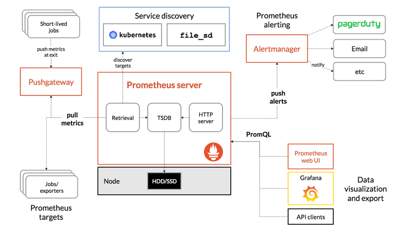

#架构图:

#1.二进制部署prometheus监控系统
## 1.1 Prometheus

	https://prometheus.io/download/

	~]# tar xf prometheus-2.16.0.linux-amd64.tar.gz -C /usr/local/
	~]# cd /usr/local/
	~]# mv prometheus-2.16.0.linux-amd64/ prometheus-2.16.0
	~]# cat /usr/lib/systemd/system/prometheus.service
		[Unit]
		Description=promrtheus
		After=network.target 
		
		[Service]
		ExecStart=/usr/local/prometheus-2.16.0/prometheus --config.file=/usr/local/prometheus-2.16.0/prometheus.yml
		Restart=on-failure
		
		[Install]
		WantedBy=multi-user.target

	~]# systemctl daemon-reload
	~]# systemctl start prometheus		#默认监听9090端口，数据目录为本地，可通过参数指定。默认在/data下 --storage.tsdb.path
	~]# systemctl enable prometheus

	~]# cat /etc/profile.d/prometueus.sh 
		PROM_HOME=/usr/local/prometheus-2.16.0/
		PATH=$PATH:$PROM_HOME

	~]# cat prometheus.yml

		# 全局配置
		global:
		  scrape_interval:     15s # 设置抓取(pull)时间间隔，默认是1m
		  evaluation_interval: 15s # 设置rules评估时间间隔，默认是1m
		  # scrape_timeout is set to the global default (10s).
		 
		# 告警管理配置，暂未使用，默认配置
		alerting:
		  alertmanagers:
		  - static_configs:
		    - targets:
		      # - alertmanager:9093
		
		# Load rules once and periodically evaluate them according to the global 'evaluation_interval'.
		# 告警规则
		rule_files:
		  # - "first_rules.yml"
		  # - "second_rules.yml"
		
		# 抓取(pull)，即监控目标配置
		# 默认只有主机本身的监控配置
		scrape_configs:
		  # The job name is added as a label `job=<job_name>` to any timeseries scraped from this config.
		  - job_name: 'prometheus'
		
		    # metrics_path defaults to '/metrics'
		    # scheme defaults to 'http'.
		
			#主机静态发现
		    static_configs:
		    - targets: ['192.168.100.51:9090']
			  # 给当前配置下的机器定义标签    
			  labels:
	        	apps: node
			# 克隆标签，将原标签克隆并以target标签命名
			relabel_configs:	
			- action: replace
			  source_labels: ['job']
			  regex: (.*)
			  replacement: $1
			  target_labels: idc

			#主机动态发现，动态发现匹配文件写法与上 - targets 相同
			file_sd_configs:
			- files: ['/usr/local/prometheus-2.16.0/sd_config/*.yml']
			  refresh_interval: 5s

			kubernetes_sd_configs:
			

	~]# promtool check config prometheus.yml			#检查配置文件语法
	~]# kill -hup PID 	#动态跟新配置

## 1.2 node_exporter

	https://prometheus.io/download/#node_exporter

	~]# tar xf node_exporter-0.18.1.linux-amd64.tar.gz -C /usr/local/
	~]# cd /usr/local/
	~]# mv node_exporter-0.18.1.linux-amd64/ node_exporter-0.18.1
	~]# cd node_exporter-0.18.1

	~]# cat /usr/lib/systemd/system/node_exporter.service 
		[Unit]
		Description=node exporter
		After=network.target 
		
		[Service]
		# 监控Centos7的 systemd 服务
		ExecStart=/usr/local/node_exporter-0.18.1/node_exporter --collector.systemd --collector.systemd.unit-whitelist=(sshd|docker|kubelet).service
		Restart=on-failure
		
		[Install]
		WantedBy=multi-user.target

	~]# systemctl daemon-reload
	~]# systemctl start node_exporter			#默认监听9100端口
	~]# systemctl enable node_exporter	

## 1.3 grafana

	https://grafana.com/grafana/download

	~]# tar xf grafana-6.6.2.linux-amd64.tar.gz -C /usr/local/
	~]# cd /usr/local/grafana-6.6.2
	
	~]# cd bin
	~]# ./grafana-server -config=../conf/defaults.ini		#默认监听 3000端口

	~]# cat /usr/lib/systemd/system/grafana-server.service 
		[Unit]
		Description=grafana
		After=network.target 
		
		[Service]
		ExecStart=/usr/local/grafana-6.6.2/bin/grafana-server --homepath=/usr/local/grafana-6.6.2 -config /usr/local/grafana-6.6.2/conf/defaults.ini
		Restart=on-failure
		
		[Install]
		WantedBy=multi-user.target

	~]# systemctl daemon-reload
	~]# systemctl start node_exporter			#默认监听3000端口
	~]# systemctl enable node_exporter		

## 1.4 Alertmanager
	
	https://prometheus.io/download/#node_exporter

	~]# tar xf alertmanager-0.20.0.linux-amd64.tar.gz -C /usr/local/
	~]# cd /usr/local/
 
	~]# mv alertmanager-0.20.0.linux-amd64/ alertmanager-0.20.0
	~]# cd alertmanager-0.20.0

	~]# cat alertmanager.yml 	#配置发送邮件告警
		global:
		  resolve_timeout: 5m
		  smtp_smarthost: 'smtp.163.com:25'
		  smtp_from: "youjiangaojing@163.com"
		  smtp_auth_username: 'youjiangaojing@163.com'
		  smtp_auth_password: '1030827997Asd'
		  smtp_require_tls: false
		
		route:
		  group_by: ['alertname']		# 以标签进行分组
		  group_wait: 10s				# 发送告警的延迟时间，用于合并告警
		  group_interval: 10s			# 发送告警的时间间隔
		  repeat_interval: 1m			# 重复告警时间间隔
		  receiver: 'mail'
		
		receivers:
		- name: 'mail'
		  email_configs:
		  - to: 'lzc7970@163.com'

	~]# cat alertmanager.yml		#配合下面钉钉告警
		global:
		  resolve_timeout: 5m
		
		route:
		  group_by: ['alertname']
		  group_wait: 10s
		  group_interval: 10s
		  repeat_interval: 1m
		  receiver: 'dingding_webhook'
		
		receivers:
		- name: 'dingding_webhook'
		  webhook_configs:
		  - url: http://localhost:8060/dingtalk/ops_dingding/send
		    send_resolved: true		#恢复后发送恢复消息

	~]# amtool check-config alertmanager.yml 

	~]# cat /usr/lib/systemd/system/alertmanager.service 
		[Unit]
		Description=alertmanager
		After=network.target
		
		[Service]
		ExecStart=/usr/local/alertmanager-0.20.0/alertmanager --config.file=/usr/local/alertmanager-0.20.0/alertmanager.yml
		Restart=on-failure
		
		[Install]
		WantedBy=multi-user.target	
 
	~]# systemctl daemon-reload
	~]# systemctl start alertmanager		#默认监听 9093端口
	~]# systemctl status alertmanager

## 1.5 实现钉钉告警

	https://github.com/timonwong/prometheus-webhook-dingtalk/releases

	~]# tar xf prometheus-webhook-dingtalk-1.4.0.linux-amd64.tar.gz -C /usr/local/
	~]# cd /usr/local/
	~]# mv prometheus-webhook-dingtalk-1.4.0.linux-amd64/ prometheus-webhook-dingtalk-1.4.0
	~]# cd prometheus-webhook-dingtalk-1.4.0

	~]# cat startup.sh		#默认监听8060端口
		#!/bin/bash 
		
		nohup ./prometheus-webhook-dingtalk --ding.profile="ops_dingding=https://oapi.dingtalk.com/robot/send?access_token=8e6a05712f071e99acb528727493fd066628e255aa8803a6e021913e634b7b0f" &> dingding.log &	

参考文档：https://theo.im/blog/2017/10/16/release-prometheus-alertmanager-webhook-for-dingtalk/

#2.监控不同对象
##2.1 Docker

	https://github.com/google/cadvisor

	# 默认监听8080端口
	~]# docker run  \	
	    --volume=/:/rootfs:ro \
	    --volume=/var/run:/var/run:ro \
	    --volume=/sys:/sys:ro \
	    --volume=/var/lib/docker/:/var/lib/docker:ro \
	    --volume=/dev/disk/:/dev/disk:ro \
		--publish=8080:8080 \
	    --detach=true \
	    --name=cadvisor \
	    registry.cn-hangzhou.aliyuncs.com/quay-image/cadvisor:v0.35.0

##2.2 Kubernetes Pod

	kubelet节点使用cAdvisor提供的metrics接口获取该节点所有容器相关的性能指标数据

	暴露接口地址：
	https://nodeIP:10255/metrics/cadvisor
	https://nodeIP:10250/metrics/cadvisor

	集群资源监控：3119
	资源状态监控：6417
	node监控：9276
 

#3.定义告警模板

#4.Prometheus-operator安装

## 4.1 helm安装	

	https://get.helm.sh/helm-v3.1.2-linux-amd64.tar.gz

	helm2.x 与 helm3.x版本相差较大，helm3.x 已不需要在集群中运行tiller,helm 可直接与 api-server 通信

	~]# tar xf helm-v3.1.2-linux-amd64.tar.gz -C /usr/local
	~]# mv /usr/local/linux-amd64/helm /usr/local/bin/

	#添加仓库
	~]# helm repo add alibb https://kubernetes.oss-cn-hangzhou.aliyuncs.com/charts		#阿里仓库
	~]# helm repo add azure http://mirror.azure.cn/kubernetes/charts	#微软仓库

	#查看仓库
	~]# helm repo list 
		NAME    URL                                                   
		alibb  https://kubernetes.oss-cn-hangzhou.aliyuncs.com/charts
		azure http://mirror.azure.cn/kubernetes/charts  

	#查看默认配置
	~]# helm env

	#查看对应服务operator
	~]# helm search repo redis

	#安装operator
	~]# helm install prometheus-operator --namespace monitoring stable2/prometheus-operator

	#查看release
	~]# helm list 

	#查看release状态
	~]# helm status redis

	#创建charts
	~]# helm create helm_charts

	#打包charts
	~]# cd helm_charts && helm package ./

	#查看生成的yaml文件
	~]# helm template helm_charts-0.1.1.tgz

	#在本地更新仓库元数据
	~]# helm repo update
	

	

	

	

		