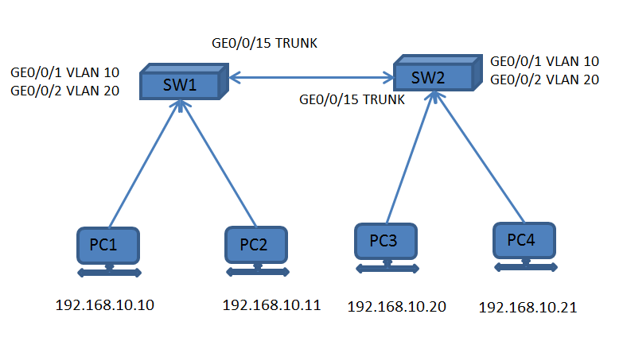

#CCNA
**day1:**

	物理层：规定通信设备的机械的、电气的、功能的会让规程的特性。主要涉及比特的传输，网络接口卡和网络连接等。
	  特点：没有智能性，智能对比特流进行简单的处理，如传输，放大，复制等。
	  代表设备：网线、中继器、集线器
  
    数据链路层：在相邻节点之间建立链路，传送数据帧。工作在同一个网络段。主要涉及介质访问控制、连接控制、流量控制和差错控制等。
	  重要特点：定义物理地址，标识节点；将bit流组合成数据帧。
	  代表设备：交换机，能识别数据帧中的MAC地址信息，在同一网段转发数据。有智能，进行定向转发。

	...

	Cisco组网模型
		1.接入层：接入层通常通过交换机和集线器提供用户到网络的初始连接
		2.分布层：分布层提供接入层与核心层的边界
		3.核心层：核心层提供高速的交换基础设施并且通常不操纵分组内容

	
	IP私有地址：
		A类：10.0.0.0/8
		B类：172.16.0.0/16 ---- 172.31.0.0/16
		C类：192.168.0.0/24 ---- 192.168.255.0/24
    	  
**day2:**

	Cisco路由器：
		1.Cisco路由器的接口表达式
			<接口类型><插槽号><接口号>
		
		2.接口类型
			路由器中典型的接口类型有：串口serial、快速以太网接口fastEthernet(FE)、吉比特以太网接口gigabitethernet(GE)
		
		3.插槽号
			有插槽：插槽号按从右至左，从下至上的顺序排列
					3	2
					1	0
			
			无插槽：无插槽的路由器，接口表达式为<接口类型><接口号>
		
		4.接口号
			有插槽
				接口为单排，按从右至左的顺序排列，从0开始
					1	0
				接口为双排，按从右至左，从上至下的顺序排列，从0开始
					0	1	2
			无插槽
				接口编号按从左至右的顺序排列，从0.开始
					0	1	2

	Cisco交换机：
		1.Cisco交换机的接口表达式 
			<接口类型><插槽号><接口号>

		2.接口类型
			交换机中典型的接口类型右：快速以太网接口fastEthernet(FE)、吉比特以太网接口gigabitethernet(GE)

		3.插槽号
			有插槽：插槽号按从上至下的顺序排列
					1
					2
					3
					4
					...
			无插槽：无插槽的交换机，插槽号统一为0
		
		4.接口号
			接口为单排，按从左至右的顺序排列
					1	2	3

			接口为双排，按从左至右的顺序排序，上排为奇数，从1开始，下排位偶数，从2开始
					1	3	5	7
					2	4	6	8
				
		注:有时会遇到serial 0/0/0 这样的接口，它表示————串口 第一个大插槽/第一个小插槽/第一个接口

**day3:**

	路由器的组成及功能：
		1.CPU：执行操作系统的指令
		2.随机访问存储器(RAM)：RAM中内容断电丢失
			-- 运行操作系统
			-- 运行配置文件
			-- IP路由表
			-- ARP缓存
			-- 数据包缓存区
		3.只读存储器(ROM)：保存开机自检软件，存储路由器的启动引导程序
			-- bootstrap指令
			-- 基本的自检软件
			-- 迷你版IOS
		*4.非易失RAM(NVRAM)：存储启动配置。包括IP地址，路由协议，主机名
		5.闪存FLASH-运行操作系统(Cisco IOS)
		6.Interfaces-拥有多种物理接口用于连接网络接口类型举例：

	路由器日常操作：
		1.system-view		进入系统视图(默认为用户视图)
		2.sysname HOSTNAME  	更改主机名
		3.interface Ethernet0/0/1 (进入某一个接口)
		4.ip address IP MASK  给接口配置IP地址
		5.undo shutdown		激活端口

	

**day4:**

	路由信息来源：
		直连路由：路由器的直连接口所在网络。
		静态路由：手工为路由器配置的路由条目。
		动态路由：路由器动态学习到的路由。

	
	动态路由协议分类：
		IGP(内部网管协议)
			RIP(距离矢量路由协议)
			OSPF(Open Shortest Path First，开放式最短路径优先协议)
			EIGRP(增强内部网关路由协议,Cisco私有协议)
			IS-IS
		BGP(外部网关协议)

**day5:**

	VLAN(Virtual Local Area Network,虚拟局域网)
	特点：
		1.一个VLAN中所有设备都是在同一个广播域内；广播不能跨越VLAN传播
		2.一个VLAN为一个逻辑子网；由被配置为此VLAN成员的设备组成，不同VLAN间需通过路由器实现相互通信
		3.VLAN中成员多基于switch端口号码，划分VLAN就是对Switch接口划分
		4.VLAN工作于OSI参考模型的第二层
		5.可配置VLAN(2-1000)

	#设置VLAN，将接口加入VLAN
	[...] system-view	进入配置视图
	[SW1]sysname SW1
	[SW1] vlan 10		创建VLAN 10，并进入VLAN 10配置视图，如果VLAN 10存在则直接进入
	[SW1] quit
	[SW1] vlan 20
	[SW1] quit
	[SW1] display vlan	显示所有VLAN信息
	[SW1] interface GigabitEthernet 0/0/1	
	[SW1] port link-type access	
	[SW1] port default vlan 10
	[SW1] quit
	[SW1] interface GigabitEthernet 0/0/2
	[SW1] port link-type access	
	[SW1] port default vlan 20
	[SW1] quit

	#设置TRUNK，将接口0/0/15设为TRUNK
	[SW1] interface GigabitEthernet 0/0/15	进入GE 0/0/15 接口
	[SW1] port link-type trunk					设置为TRUNK模式
	[SW1] port trunk allow-pass vlan all		允许所有VLAN经过TRUNK
	[SW1] display this 						显示设置的TRUNK

		
		
	

	
			 