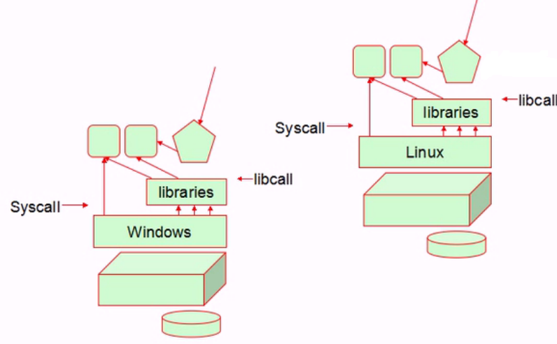

# 1-1
# 2-1
* 主动学习：
	动手实践：40%
	讲给别人：70%
	写博客：5w1h
		what、what、when、where、who、
		how

* 被动学习：
	听课：10%
	笔记：20%
# 2-2
linux运维课程体系大纲：

	linux入门；
	linux系统管理；
	linux服务及安全管理；
		httpd,lamp,lnmp
		cache:memcached、varnish
		DB:mysql(marriadb)
	linux Cluster:
		LB Cluster:Nginx、LVS
		HA Cluster:Keepalived
	linux Ops:ansible
	Monitoring:zabbix 

	http:
		tomcat、lnmt、lamt、session replication cluster
		分布式存储系统：
			MogileFS,GlusterFS
		LB Cluster:haproxy
		MYSQL:HA cluster、MHA、备份和恢复、主从复制、读写分离
		NoSQL:redis、mongodb、HBase
		运维工具：puppet，saltstack,cobbler,PXE+kickstart
		虚拟化：
			Linux操作系统原理：虚拟化技术原理
			kvm虚拟化应用详解、xen虚拟化（淘汰）
			虚拟化网络：SDN
			OpenStack云栈
		docker:容器云
		ELK Stack: Elasticsearch、Logstash、Kibana
		大数据：Hadoop(v2),并行存储及分析平台
			HBase、Hive
			Storm,Spark
		系统优化：
			

RedHat：

	认证考试：
		RHCSA
		RHCE
		RHCA
it技术领域：

	研发：
		硬件：
		CPU(运算器和控制器)，内存，输入，输出
		机器语言：二进制命令，二进制数据
		软件：
		低级语言（离机器近）：汇编语言 、汇编器
		高级语言（离人近）：编译器
			系统级：c、c++...
				操作系统、对性能要求较高的服务类程序 
			应用级：java，python
				应用程序：ansible,puppet
		高级语言-->汇编语言-->机器语言
		
		程序员的程序代码：编程语言；
  	应用：
		linux运维：linux生态圈中的各应用程序的应用
			shell脚本：让某些应用工作能自动完成
			python:专业编程语言
		DevOps:开发运维

# 2-3
计算机操作系统：

	ENIARC：
		CPU:运算器、控制器、寄存器、缓存
		存储器：内存、RAM(Random Access Memory)
		Input:下指令，提供数据等
		Output:输出数据加工的结果
	程序：指令+数据
		算法+数据结构
	
	32 位操作系统
	2^10=1024
	2^32=2^10*2^10*2^2  bytes
		=1024*1024*4	KB
		=1024*4			MB
		=4				GB

	程序运行过程：
	数据、指令(硬盘)---->内存---->CPU(寄存器)
	
	CPU速度远大于内存---->(增加CPU缓存)
	cache is King 缓存为王	

	GNU:GNU is not unix
		GPL:General Public License

	OS的接口有两类
		GUI:Graphic User Interface
			GNone: c,gtk
			KDE	 :c++,qt
		CLI:Command Line Interface(与操作系统进行交互)
			bash
			zsh
			sh
			csh
			ksh
			tcsh
	操作系统功能：
		驱动程序
		进程管理
		安全
		网络安全
		内存管理
		文件系统
		...

	API:Application Program Interface
		程序员面对的编程接口

		POSTFIX:Portable Operating System

	ABI:Application Binary Interface

	

**syscall :系统调用**

**libcal：库调用**

linux发行版：
	
	debian
		ubuntu
		knopix
	slackware
		s.u.s.e
			opensuse
	redhot
		redhat enterprise linux:rhel
			centos:community enterprise OS
		fedora core

	gentoo
	archLinux

	软件程序：版本号
		major.minor.release

	linux官网 www.kernel.org
	