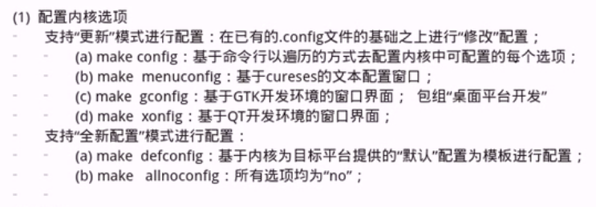
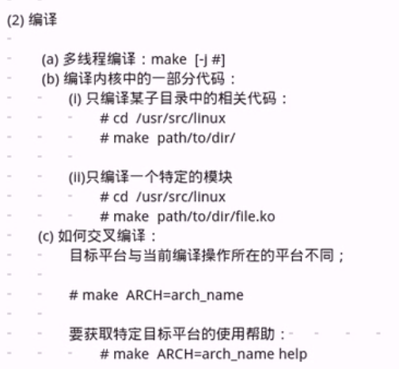
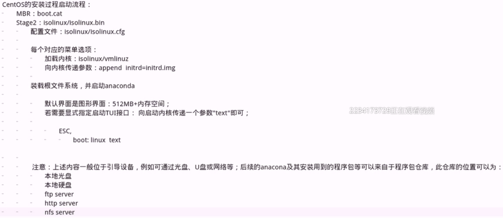
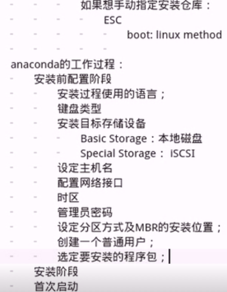
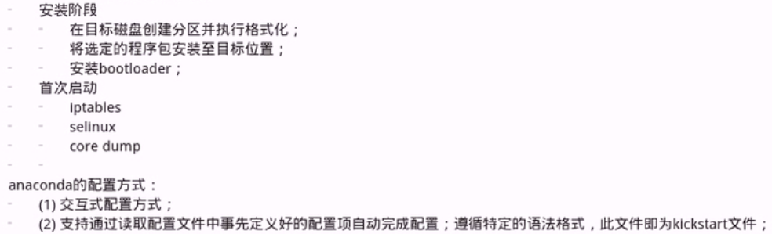
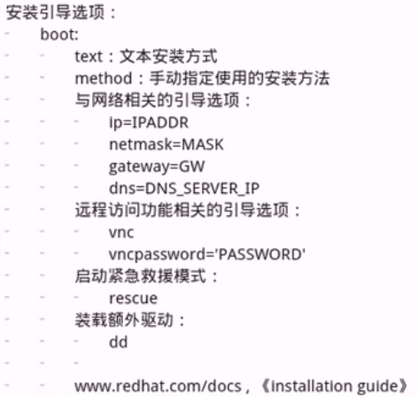
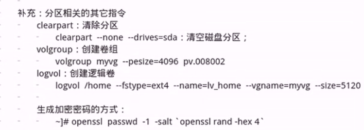
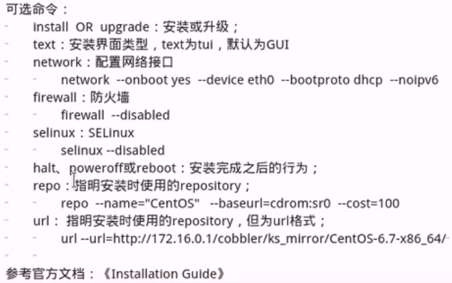
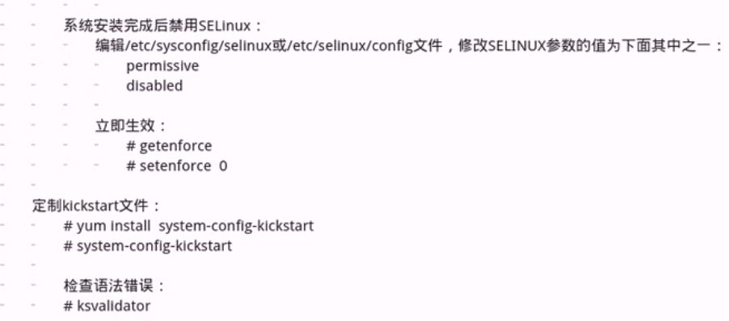

CentOS系统启动流程

	linux系统的组成部分：内核+跟文件系统
		内核：进程管理、内存管理、网络协议栈、文件系统、驱动程序、安全功能
			IPC:inter process communication
				消息队列、semerphor、shm
				socket

	运行中的系统环境可分为两层：内核空间、用户空间
		用户空间：应用程序(进程或线程)		
		内核空间：内核代码(系统调用)

	内核设计流派：
		单内核设计：把所有功能集成于同一程序
			linux
		微内核设计：每种功能使用一个单独的子系统实现
			windows Solaris

		linux内核特点：
			支持模块化：.ko（kernel object）
			支持模块运行时动态装载或卸载

			组成部分：
				核心文件：/boot/vmlinuz-VERSION-release
				ramdisk:
					CentOs 5:/boot/initrd-VERSION=release.img
					CentOS 6,7:/boot/initramfs-VERSION-release.img
				模块文件：/lib/modules/VERSION-release

	CentOS系统的启动流程：
			
		POST：加电自检
			ROM：CMOS
				BIOS：Basic Input and Output System
			ROM+RAM

		Boot Sequence：
			按次序查找各引导设备，第一个有引导程序的设备即为本次启动要用到的设备

			bootloader：引导加载器，程序
				Windows：ntloader 
				linux:
					LILO:Linux Loader
					GRUB:Grand Uniform Bootloader
						GRUB 0.X:Grub Legacy
						GRUB 1.X:Grub2

				功能：提供一个菜单，允许用户选择要启动的系统或不同的内核版本；把用户选定的内核装载到RAM的特定空间中，解压、展开，而后把系统控制权移交给内核；
			
			MBR：Master Boot Record
				512bytes
					446bytes：BootLoader
					64bytes：fat
					2bytes:55AA   非55AA表示bootloader无效
			GRUB：
				bootloader：1st stage
				Partition:filesystem friver,1.5stage
				Partition:/boot/grub,2nd stage

			UEFI，GPT

		kernel:
			自身初始化：
				探测可识别到的所有硬件设备
				加载硬件驱动程序;(有可能会借助于randisk加载驱动)
				以只读方式挂载跟文件系统
				运行用户空间的第一个应用程序：/sbin/init

				
			init程序的类型：
				CentOS 5:SysV init
					配置文件：/etc/inittab

				CentOS 6:Upstart
					配置文件：/etc/inittab
							/etc/init/*.conf

				CentOS 7:Systemd
					配置文件：/usr/lib/systemd/system/
							/etc/systemd/system/

			ramdisk:
				linux内核的特性之一：使用缓冲和缓存来加速对磁盘的文件访问
					ramdisk-->ramfs
	
				CentOS 5:initrd
					工具程序：mkinitrd
				CentOS 6,7:initramfs
					工具程序：dracut,mkinitrd

		系统初始化流程(内核级别)：POST --> BootSequence(BIOS) --> Bootloader(MBR) --> kernel(ramdisk) --> rootfs(readpnly) --> /sbin/init()

		/sbin/init:
			CentOS 5:SysV init
				运行级别：为了系统的运行或维护等目的而设定的机制
					0-6:7个级别
					 	0：关机，shutdown
						1：单用户模式(single user)，root用户，无需认证；维护模式
						2：多用户模式(multi user),会启动网络功能，但不会启动NFS;维护模式
						3：多用户模式(multi user),完全功能模式；文本界面
						4：预留模式：目前无特别使用目的，但习惯以3级别功能使用；
						5：多用户模式(multi user),完全功能模式，图形界面
						6：重启，reboot
		
					默认级别：3,5
					级别切换：init #
					查看级别：
						who -r
						runlevel
					配置文件：/etc/inittab

			总结(用户空间的启动流程)：/sbin/init (/etc/inittab)
				设置默认运行级别 --> 运行系统初始化脚本，完成系统初始化 --> 关闭对应级别下需要停止的服务，东东对应级别下需要停止的服务，启动对应级别下需要开启的服务 --> 设置登录终端 --> [启动图形界面终端] 

			CentOS 6:
				init程序：upstart，但依然是/sbin/init,其配置文件
					/etc/init/*.conf,/etc/inittab(仅用于定义默认运行级别)

			CentOS 7：
				init程序：systemd，配置文件：/usr/lib/systemd/system/*,/etc/systemd/system/*
				
				完全兼容SysV脚本机制；因此，service命令依然可用；不过，建议使用systemctl命令来控制服务；
			
					systemctl {start|stop|restart|status} name[.service]			 

内核设计体系：单内核、微内核
		
	linux:单内核设计，但充分借鉴了微内核体系的设计的优先；为内核引入了模块化机制；
		内核的组成部分：
			kernel:内核核心，一般为bzimage,通常位于/boot目录，名为vmlinuz-VERSION-release;
			kernel object:内核对象，即内核模块，一般放置于/lib/modules/VERSION-release/ 内核模块与内核核心版本一定要严格匹配；

				[]:N
				[M]:module
				[*]:Y,编译进内核信息
				
				内核：动态装载和卸载

			ramdisk:辅助性文件，并非必须，这取决于内核是否能直接驱动rootfs所在的设备；
				目标设备驱动，例如SCSI设备的驱动
				逻辑设备驱动，例如LVM设备的驱动
				文件系统：例如xfs文件系统
	
				ramdisk:是一个简装版的跟文件系统

		内核信息查看：uname [option]
			-r:内核的release号
			-n：主机名

		模块信息查看:
			lsmod
			modinfo
			modprobe
			depmod:
				内核模块依赖关系文件的生成文件
			快快的装载和卸载的另一组命令：
				insmod
				rmmod

		ramdisk文件的管理：
			mkinitrd:
				为当前使用中的内核重新制定ramdisk文件
			dracut:
				
		内核信息输出的伪文件系统：
			/proc:内核状态和统计信息的输出接口；同时，还提供一个配置接口，/proc/sys
				参数：
					只读：信息输出，例如/proc/#/*
					可写：可接受用户指定一个新值来实现对内核某功能或特性的配置：/proc/sys/

						/proc/sys:
							net/ipv4/ip_forward 相当于 net.ipv4.ip_forward
		
					(1) sysctl：
						专用于查看或设定/proc/sys目录下参数的值：
							sysctl [options] [variable[=value]]
							查看：
								sysctl -a
								sysctl variable
							修改其值
								sysctl -w variable=value
					(2) 文件系统命令(echo ,cat)
						查看：
							cat /proc/sys/PATH/TO/SOME_KERNEL_FILE
						设定：
							echo "value" > /proc/sys/PATH/TO/SOME_KERNEL_FILE
					(3) 配置文件：
						/etc/sysctl.conf,/etc/sysctl.d/*.conf	
							立即生效的方式：sysctl -p [/PATH/TO/CONFIG_FILE]

					注意：上述1.2种方式的设定仅当前运行内核有效
				
				内核参数：
					net.ipv4.ip_forward:核心转发
					vm.drop_caches:内存回收
					kernel.hostname:主机名
					net.ipv4.icmp_echo_ignore_all:忽略所有ping操作

			/sys目录：
		
				sysfs:输出内核识别出的各硬件设备的相关属性信息，也有内核对硬件特性的可设置参数；对此些参数的唏嘘该，即可定制设备工具特性；
				udev:通过读取/sys目录下的硬件设备信息按需为各硬件设备创建设备文件，udev是用户空间程序；专用工具：devadmin,hotplug; udev为设备创建设备文件时，会读取其事先定义好的规则文件，一般在/etc/udev/rules.d/目录下，以及/usr/lib/udev/rules.d/目录下

编译内核：

	程序包的编译安装：
		./configure ,make, make install

	前提：开发环境(开发工具，开发库)，头文件：/usr/include

	开源：源代码-->可执行格式
		发行版：以“通用”的目标

	前提：
		(1)准备好开发环境
	    (2)获取目标主机上硬件设备的相关信息
		(3)获取到目标主机系统功能的相关信息，例如要启用的文件系统
		(4)获取内核源代码包：www.kernel.org

		准备开发环境
			CentOS 6，7：
				包组：
					Development Tools
					Server Platform Development

		获取目标主机上硬件设备的相关信息：
			CPU:
				~]# cat /proc/info
				~]# lscpu
				~]# x86info -a
			PCI(IO):
				~]# lspci
				~]# lsusb
				~]# lsblk
			了解全部硬件设备信息：
				~]# hal-device

		内核编译过程：
			步骤：
				~]# tar xf linux-3.10.67.tar.xz -C /usr/src
				~]# cd /usr/src
				~]# ln -s linux-3.10.67 linux
				~]# cd linux

				~]# make menuconfig  	配置内核参数
				~]# make [-j #] 		编译内核，可使用-j指定编译线程数量
				~]# make modules_install 安装内核模块
				~]# make install		安装内核
		
				重新启动，选择使用新内核
	
			screen命令：
				打开screen: 
					~]# screen
				拆除screen:ctrl+a,d
				列出screnn:
					~]# screen -ls
				连接至screen:
					~]# screen -r ID
				关闭screen:
					~]# exit

回顾：
	
	内核编译、CentOS系统安装
		内核编译：
			make menuconfig
			make [-j #]
			make modules_install
			make install

		CentOS系统安装
			bootloader --> isolinux/vmlinuz(isolinux/initrd) --> anaconda

				anaconda
					安装前配置阶段
						交互式配置
						配置文件(自动配置)
					安装阶段
					首次启动

	安装引导选项：
		ks:指明kickstart文件的位置：
			ks=
				DVD drive:ks=cdrom:/PATH/TO/KICKSTART_FILE
				Hard Drive:ks=hd:/DEVICE/PATH/TO/KICKSTART_FILE
				HTTP Server:ks=http://HOST[:PORT]/PATH/TO/KICKSTART_FILE
				FTP Server:ks=ftp://HOST[:PORT]/PATH/TO/KICKSTART_FILE
				HTTPS Server:ks=https://HOST[:PORT]/PATH/TO/KICKSTART_FILE
		
		kickstart文件的格式；
			命令段：
				指定各种安装前配置选项，如键盘类型等；
					必备命令
					可选命令
			程序包段：
				指明要安装程序包，以及包组，也包括不安装的程序包
					%packages
					@group_name
					package
					-package
					%end
			脚本段：
				%pre:安装前脚本
					运行环境：运行安装介质上的微型linux系统环境

				%post:安装后脚本
					运行环境：安装完成的系统

			命令段中的必备命令：
				authconfig:认证方式配置
					authconfig --enableshadow --passaslgo=sha512
				bootloader:定义bootloader的安装位置及相关配置
					bootloader --location=mbr  --driveorder=sda --append="crashkernel=auto rhgb quiet"
				keyboard:设置键盘类型
					keyboard us
				lang:语言类型 
					lang zh_CN.UTF-8 , GBK 
				part:分区布局
					part /boot --fstype=ext4 --size=500
					part pv.008002 --size=51200
				rootpw:管理员密码
					rootpw 
				timezone:时区
					timezone Asia/Shanghai

