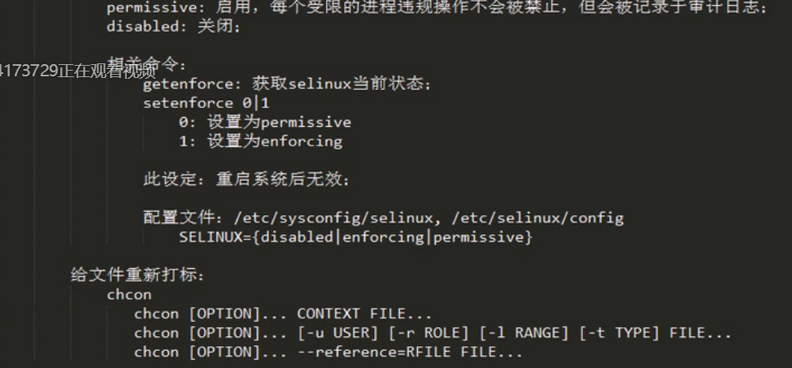
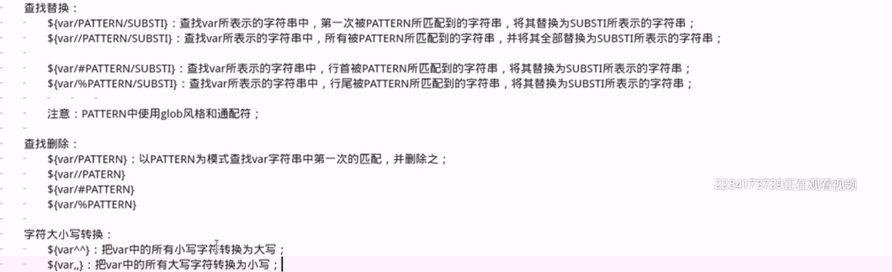

# 16-1 

Systemd:
	
	POST --> Boot Sequence(BIOS) --> Bootloader(MBR) --> Kernel(ramdisk) --> rootfs --> /sbin/init
		init:
			CentOS 5:SysV init
			CentOS 6:Upstart
			CentOS 7:Systemd

		Systemd的新特性：
			系统引导时实现服务并行启动
			按需激活进程
			系统状态快照
			基于依赖关系定义服务控制逻辑

		核心概念：unit
			unit由其相关配置文件进行标识、识别和配置；文件中主要包含了系统服务、监听的socket、保存的快照以及其它与init相关的信息；这些配置文件主要保存在：
				/usr/lib/systemd/system
				/run/systemd/system
				/etc/systemd/system   #将/usr/..system/下的服务文件创建链接

		unit的常见类型：
			Service unit：.service,用于定义系统服务；
			Target unit：.target,用于模拟实现"运行级别"
			Device unit：.device,用于定义内核识别的设备
			Mount unit：.mount,定义文件系统挂载点
			Socket unit：.socket,用于标识进程间通信用到的socket文件	
			Snapshot unit：.snapshaot,管理系统快照
			Swap unit：.swap,用于标识swap设备
			Automount unit：.automount,文件系统自动点设备
			Path unit：.path,用于定义文件系统中的文件或目录

		关键特性：
			基于socket的激活机制：socket与程序分离
			基于bus的激活机制
			基于device的激活机制
			基于path的激活机制
			系统快照：保存各unit的当前状态信息于持久存储设备中
			向后兼容SysV init脚本  /etc/init.d/

		不兼容：	
			systemctl命令是固定不变的
			非由systemd启动的服务，systemctl无法与之通信

		管理系统服务：
			systemctl命令：

		

# 16-4

# 17-1

信号捕捉：

	列出信号：
		trap -l
		kill -l
		man 7 signal
	
		trap 'COMMAND' SIGNALS

		常可以进行捕捉的信号：
			除kill ,term