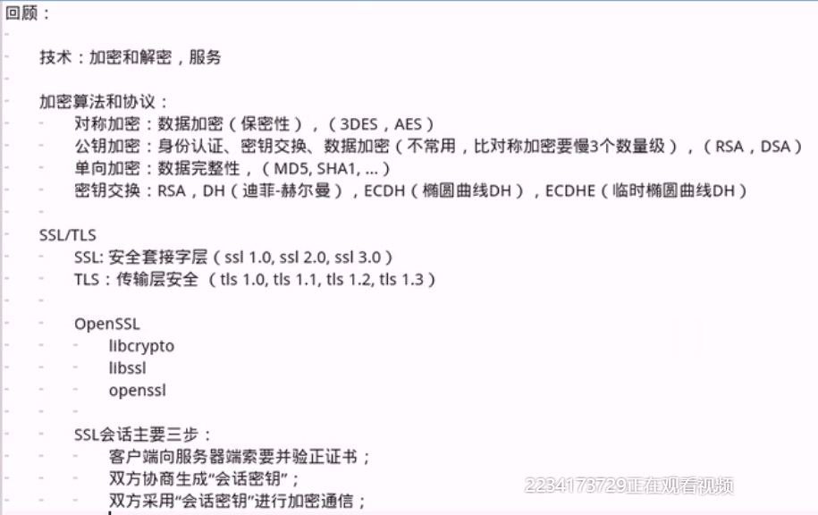
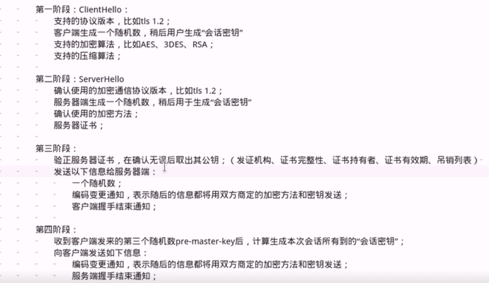
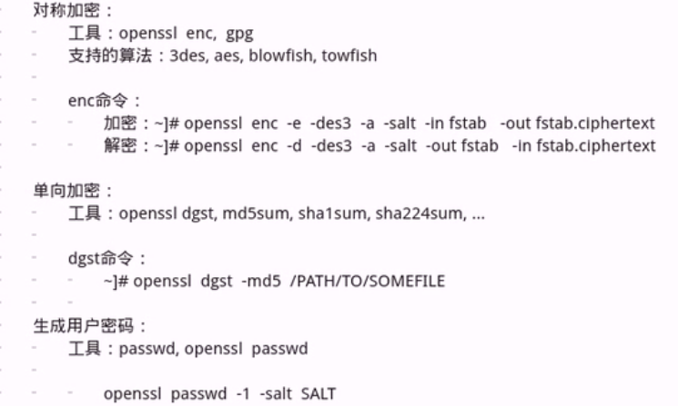
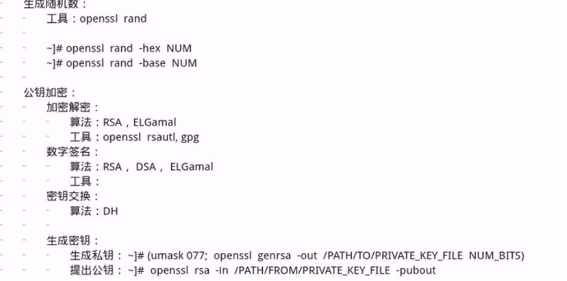
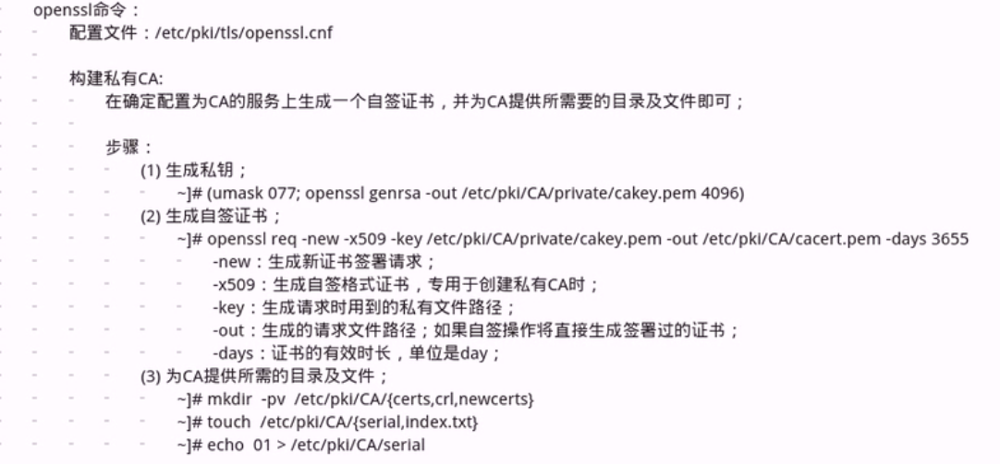
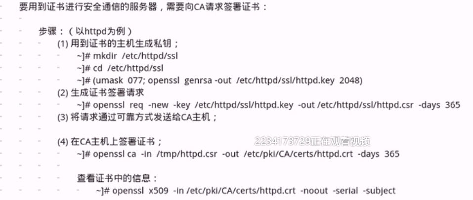

Linux Services and Security:

	OpenSSL(ssl/tls)
	OpenSSH
	bind(dns)
	web(http):httpd(apache),php,mariadb(mysql),LAMP,nginx(tengine,openresty),lnmp
	file server:nfs,ftp,smaba
	dhcp,pxe
	iptables
	sudo,pam,nsswitch

OpenSSL
	
	传输层协议：TCP，UDP，SCTP
		port：进程地址，进程向内核注册使用某端口(独占)

	同一主机上的进程间通信：IPC，message queue，shm,semerphor
	不同的主机上的进程间通信：socket
		cip:port<-->sip:port
			cip:55673<-->sip:80

	SSL:Secure Sockets Layer

	安全的目标：
		保密性：confidentiality
		完整性：Intergrity
		可用性：availability

	攻击类型：
		威胁保密性的攻击：窃听、通信量分析
		威胁完整性的攻击：更改、伪装、重放、否认
		威胁可用性的攻击：拒绝服务(Dos) DDoS:分布式拒绝服务攻击

	解决方案：
		技术：
			加密和解密、服务(用于抵御攻击的服务，也即是为了上述安全目标而特地设计的安全服务)
	
		加密和解密：
			传统加密方法：替换加密方法、置换加密方法
			现代加密方法：现代块加密方法

		服务：
			认证机制
			访问控制机制

		密钥算法和协议：
			对称加密
			公钥加密
			单向加密
			认证协议

	Linux体统：OpenSSL(ssl),GPG(pgp)
		OpenSSL由三部分组成：
			libencrypt
			libssl
			openssl多用途命令行工具

		加密算法和协议：
			对称加密：加密和解密使用同一个密钥
				DES：Date Encryption Standard
				AES：Advanced Encryption Standard (128bits,192,256,384)
				Blowfish
				Twofish
				IDEA
				RC6
				CAST5

				特性：
					1.加密、解密使用同一个密钥，加密时间短
					2.将原始数据分割成固定大小的块，逐个进行加密

				缺陷：
					1.密钥过多
					2.密钥分发困难
			
			
			非对称加密：密钥分为公钥与私钥
				公钥：从私钥中提取产生；可公开给所有人：pubkey
				私钥：通过工具创建，使用者自己保留，必须保证其私密性：secret key
				
				特性：用搞那个药加密的数据，只能使用与之配对的私钥解密；反之亦然，加密时间长

				用途：
					数字签名：主要让接收方确认发送方的身份
					密钥交换：发送方用对方公钥加密一个对称密钥，对发送给对方

				算法：RSA，DSA，ELGamal
					
			单向加密：即提出数据指纹，只能加密，不能解密
				特性：定长输出、雪崩效应
				功能：完整性保证
				算法：
					MD5：message Digest 5 ,128bits
					sha1:secure hash algorithm 1,160bits
						sha224,sha256,sha384,sha612

			密钥交换：IKE（internet key exchange）
				公钥加密
				DH(Deffie-hellman)

			
			对称加密     ：加密解密使用同一密钥，加解密速度快。随着人数增多，密钥数量急增n(n-1)/2。
			非对称加密 ：使用公私钥配对加解密，速度慢。公钥是从私钥中提取出来的，一般拿对方公钥加密来保证数据安全性，拿自己的私钥加密来证明数据来源的身份。
			单向加密     ：不算是加密，也常称为散列运算，用于生成独一无二的校验码(或称为指纹、特征码)来保证数据的完整性和一致性，如MD5、SHA。具有雪崩效应，任何一点数据的改变，生成的校验码值变化非常大。
			互联网数据安全可靠的条件：
			1.数据来源可信，即数据发送者身份可信。
			2.数据具备完整性，即数据未被修改过。
			3.数据安全性，即数据不会被泄漏，他人截获后无法解密。

			数字签名：验证数据完整性
			A ----> B
			1.A单向加密，生成数据特征码
			2.A非对称加密私钥加密数据特征码
			3.B用A非对称加密公钥解密特征码，用相同单向加密算法计算数据特征码
			4.比较特征码，相同即数据未被修改

			加密过程：加密数据
			A ----> B
			1.A单向加密数据，得到数据特征码
			2.A对称加密数据和特征码，得到对称加密密钥
			3.A使用B非对称加密公钥加密对称加密得到的密钥附加在数据后，将数据发送给B
			4.B非对称加密密钥解密数据包，得到A对称加密密钥
			5.B使用A对称加密密钥解密数据包，得到数据和特征码
			6.B使用相同单向加密算法得到数据特征码，并与解密的特征码进行比对，若相同则数据未被修改
			存在危险：中间人攻击

			PKI:Public Key Infrastructure
				公钥基础设施：
					签证机构：CA
					注册机构：RA
					证书吊销列表：CRL
					证书存取库：

			X.509v3：定义了证书的结构及认证协议标准
				版本号
				序列号
				签名算法ID
				发行者名称
				有效期限
				主体名称
				主体公钥
				发行者的唯一标识
				主体的唯一标识
				扩展
				发行者的签名

			SSL：Secure Sockets Layer
				Netscape:1994
				V1.0，V2.0，V3.0
			TLS：Transport Layer Security
				IETF:1999
				V1.0,V1.1,V1.2

				分层设计：
					1.最底层：基础算法原语的实现：aes,rsa,md5
					2.向上一层：各种算法的实现
					3.在向上一层：组合算法实现的半成品
					4.用各种组件拼装而成不和热闹搞得各种成品密码学协议软件

				协议的开源实现：OpenSSl 

	

OpenSSL（2）		

	组件：
		libcrypto,libssl主要由开发者使用
		openssl:多用途命令行工具

	openssl:
		众多子命令，分为三类：
			标准命令
			消息摘要命令(dgst子命令)
			加密命令(enc子命令) 

		标准命令：enc,ca,req,genrsa

	
	

Linux系统上的随机数生成器：
	
	/dev/random :仅从熵池返回随机数；随机数用尽，阻塞
	/dev/urandom：从熵池返回随机数；随机数用尽，会利用软件生成伪随机数，非阻塞，伪随机数不安全
	
		熵池中随机数的来源：
			硬盘IO中断时间间隔
			键盘IO中断时间间隔

	CA：
		公共信任CA
		私有CA

		建立私有CA：
			OpenSSL
			OpenCA

