DNS and Bind

	Sockets:
		C/S:
			Client:发起应用请求的程序
			Server:相应请求(提供服务)的程序
				LISTEN：Socket

		传输层协议：TCP、UDP、SCTP
			TCP：transmission control protocol
				面向连接的协议：双方通信之前要事先建立虚连接；
			UDP：User Datagram Protocol
				无连接的协议：双方无须通信之前需要事先建立虚连接；

		DNS：Domain Name Service,应用层协议
			C/S
				53/tcp,53/udp
			www.mageeud.com:FQDN(Full Qualified Domain Name)
				
			tld:top level domain
				组织域：.com .net .org .gov .edu .mil
				国家域：.cn .hk .tw ...
		
			DNS查询类型：
				递归查询
				迭代查询
				
			DNS名称解析方式：
				名称-->IP:正向解析			
				IP-->名称：反向解析
			
				注：二者的名称空间，非为同一个空间，即非为同一棵树；因此，也不是同一个解析库

			域：magedu.com.	
				www.magedu.com
				ftp.magedu.com

			DNS服务器类型：
				负责解析至少一个域：
					主名称服务器
					辅助名称服务器
				不负责解析：
					缓存名称服务器

			一次完整的查询请求经过的流程：
				client-->hosts文件-->DNS local cache-->DNS server(recursion)
					自己负责解析的域：直接查询数据库并返回答案
					不是自己负责解析域：server cache --> iteration(迭代)

				解析答案：
					肯定答案：
					否定答案：不存在查询的键，因此，不存在与其查询键对应的值

		主-从DNS服务器：
			主DNS服务器：维护所负责解析的域数据库的那台服务器；读写操作均可运行
			从DNS服务器：从主DNS服务器那里或其他的从DNS服务器那里"复制"一份解析库，但只能进行读操作
			
				主从同步实施方案：
					序列号：serial，即数据库的版本号，主服务器数据库内容发生变化时，其版本号递增
					刷新时间间隔：refresh,从服务器每多久到服务器检查序列号更新状况
					重试时间间隔：retry,从服务器从主服务器请求同步解析库失败时，再次发起尝试请求的时间间隔
					过期时长：expire，从服务器始终练习不到主服务器时，多久之后放弃从主服务器同步数据，停止提供服务
					否定答案的缓存时长：
	
					区域传送：
						全量传送：传送整个数据库
						增量传送：仅传送更改的数据

		区域(zone)和域(domain)
			FQDN-->IP
				正向解析库：区域
			IP-->FQDN
				反向解析库：区域
			连个加起来-->域

		区域数据库文件：
			资源记录：Resource Record，简称rr
				记录类型：A，AAAA，PTR，SOA，NS，CNAME，MX

			SOA：Start Of Authority，起始授权记录；一个区域解析库有且只能有一个SOA记录，而且必须放在第一条
			NS：Name Service，域名服务记录；一个区域解析库可以有多个NS记录，其中还一个为主
			A：Address，地址记录，FQDN-->IPv4
			AAAA:FQDN-->IPv6
			CNAME：别名记录
			PTR：IP-->FQDN
			MX：Mail Exchanger，邮件交换器
				优先级：0-99，数字越小优先级越高
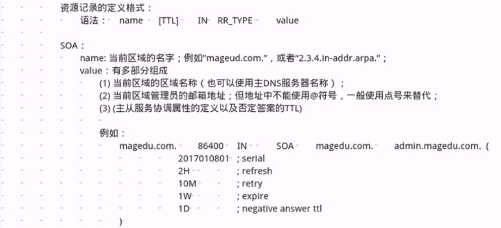
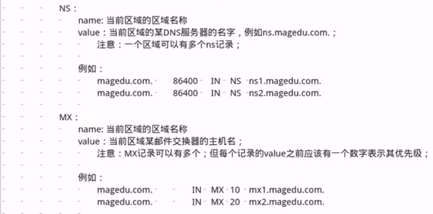
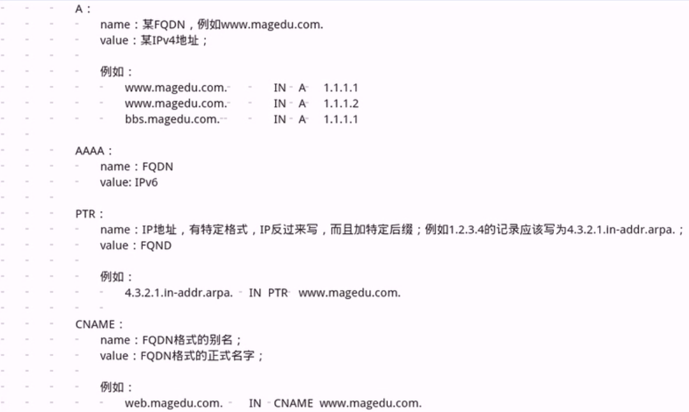
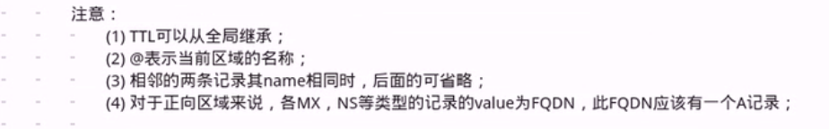

DNS and Bind(2)

	BIND的安装配置：
		BIND：Berkeley Internet Name Domain,ISC.org
			dns:协议
			bind：dns协议的一种实现
			named：bind程序的运行的进程名

		程序包：
			bind-libs：被bind和bind-utils包中的程序共同用到的库文件
			bind-utils:bind哭护短程序及，如dig,host,nslookup

			bind：提供的 dns server,以及几个常用的测试程序
			bind-chroot:选装，让named运行于jail模式下

		bind:
			主配置文件：/etc/named.conf
				或包含进来其他文件
					/etc/named.iscdlv.key
					/etc/named.rfc1912.zones
					/etc/named.root.key
			解析库文件
				/var/named/目录下：
					一般名字为：ZONE_NAME.zone

				注意：(1) 一台DNS服务器可同时为多个区域提供解析
					 (2) 必须要有根区域解析库文件：named.ca
					 (3) 还应该有两个区域解析库文件：localhost和127.0.0.1的正反向解析库
						正向：named.localhost
						反向：named.loopback

			rndc:remote name domain contoller
				953/tcp,但默认监听于127.0.0.1地址，因此仅允许本地使用

			bind程序安装完成后，默认即可做缓存名称服务器使用；如果没有专门负责解析的区域，直接即可启动服务
				CentOS 6：service named start 
				CentOS 7:systemctl start named.service

			主配置文件格式：
				全局配置段：
					options {...}
				日志配置段：
					logging {...}
				区域配置段：
					zone {...}
						哪些由本级负责解析的区域，或转发的区域

					注意：每个配置语句必须以分号结尾

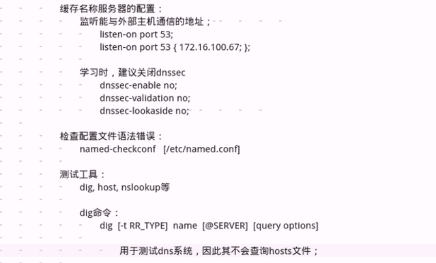	
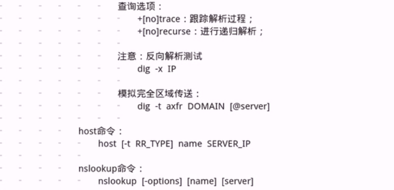	
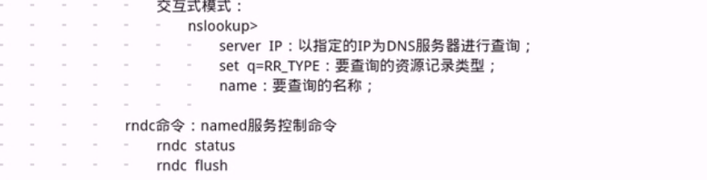	
				

配置解析一个正向区域：

	以chuan.com域为例

		1.定义区域
			在主配置文件中或主配置文件辅助配置文件中实现
				zone "ZONE_NAMW" IN {
					type "master|slave|hint|forward";
					file "ZONE_NAME.zone";
				};
			
		2.建立区域数据文件
			在/var/named目录下建立区域数据文件

			 $TTL 1D
			 @       IN SOA  @ admin.qq.com. (
                                        20181105        ; serial
                                        1D              ; refresh
                                        1H              ; retry
                                        1W              ; expire
                                        3H )            ; minimum
        	NS      ns1	
			ns1     A       192.168.179.110
			www     A       192.168.179.111
        			A       192.168.179.112
			web     CNAME   www
			bbs     A       192.168.179.111

			注：该文件属主为root,属组为named，权限640

		(3) 让服务器重载配置文件和区域配置文件
			检查配置文件
				named-checkconf [FILE.CONF]
				named-checkzone ZONE DIR/FILE
			rdnc status
			rdnc reload

	
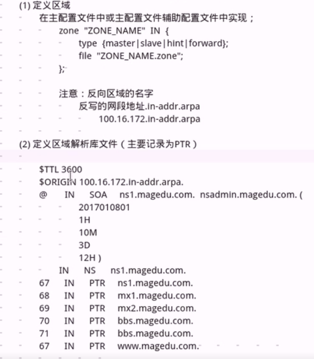

主从服务器配置

	注意：从服务器时区域级别的概念

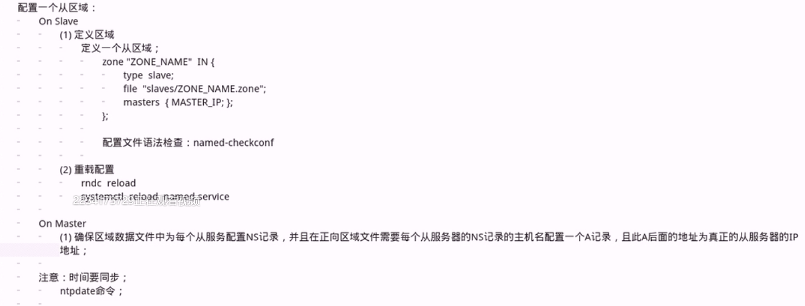
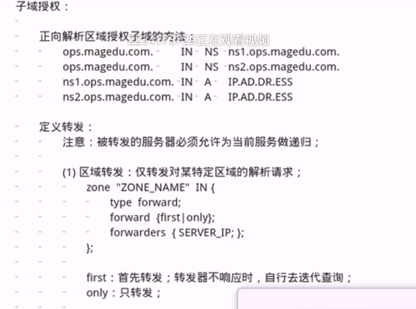
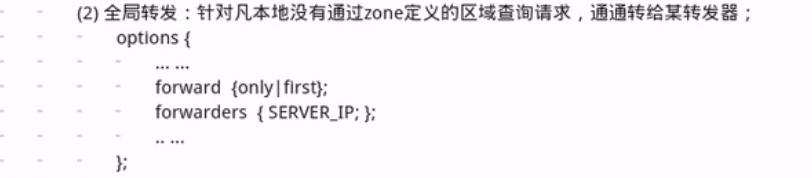
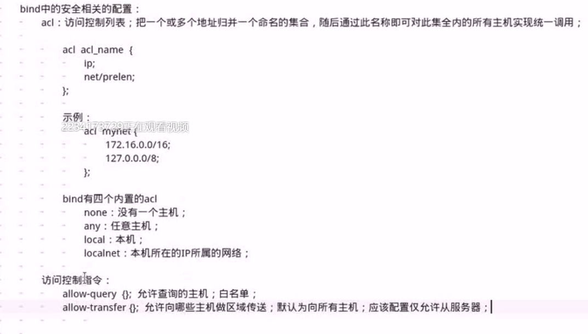
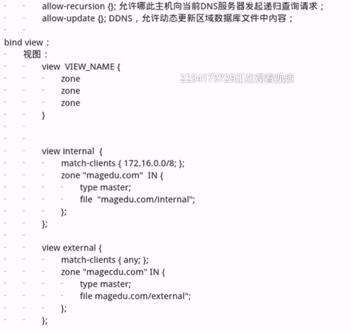		

