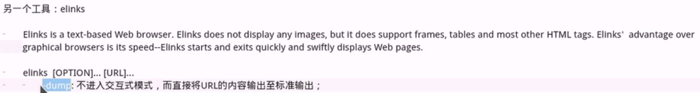

Web Service:

	应用层：http,https
		实现某类具体应用

	传输层协议：TCP，UDP，SCTP

	IANA：
		0-1023：总所周知，永久地分配给固定的应用使用，特权端口；
		1024-41951：亦为注册端口，但是要求不是特别严格，分配给程序注册为某应用使用；3306/tcp,11211/tcp
		41952+:客户端程序随机使用的端口，动态端口，或私有端口；其范围定义在/proc/sys/net/ipv4/ip_local_port_range

	DSB Socket:IPC的一种实现，允许位于不同主机（也可以在同一主机）上的进程间通信	Socket API（封装在内核中的socket通信相关的系统调用）
			SOCK_STREAM：tcp套接字
			SOCK_DGRAM：udp套接字
			SOCK_RAW：raw套接字，原始套接字，裸套接字
		
		根据套接字所使用的地址格式，Socket Domain
			AF_INET:address family ,ipv4
			AF_INET6:ipv6
			AF_UNIX:同一主机上的不同进程间基于socket套接字通信使用的一种地址；Unix_SOCK

	TCP FSM：CLOSED,LISTEN,SYN_SENT,SYN_RECV,ESTABLISHED,FIN_WAIT1,CLOSED_WAIT,FIN_WAIT2,LAST_ACK,TIME_WAIT,CLOSED

	TCP协议的特性：
		建立连接：三次握手
		将数据打包成段：校验和(CRC32)
		确认、重传及超时
		排序：逻辑序号
		流量控制：滑动窗口算法
		拥塞控制：慢启动和拥塞避免算法

	http:hyper text transfer protocol,应用层协议，80/tcp
		html:hyper text mark language，超文本标记语言
		css:casscading style sheet
		js:javascript,客户端脚本	

	协议版本：
		http/0.9:原型版本，功能简陋
		http/1.0:cache,MIME.method
			MIME:Multipurpose Internet Mail Extesion
			method:GET/POST/HEAD/PUT/DELETE/TRACE/OPTIONS
		http/1.1:增强了缓存功能
			spdy
		http/2.0
			
	工作模式
		http请求报文：http request
		http响应报文：http response
			一次http事物；请求<-->响应

		web资源：web resource
			静态资源(无需服务端作出额外处理)：.jpg,.png,.gif...
			动态资源(服务端需要通过执行程序作出处理，发送给客户端的是程序的运行结果)：.php,.jsp

			注意：一个页面中展示的资源可能有多个；每个资源都需要单独请求

			资源的标识机制：URL
				
	一次完整的http请求处理过程：
		(1) 建立或处理连接：接收请求或拒绝请求
		(2) 接收请求：接收来自于网络上的主机请求报文对某特定资源的一次请求的过程
		(3) 处理请求：对请求报文进行解析，获取客户端请求的资源及请求方法等相关信息
		(4) 访问资源：获取请求报文中请求的资源
		(5) 构建相应报文
		(6) 发送相应报文
		(7) 记录日志

		接收请求的模型：
			并发访问相应模型：
				单进程I/O模型：启动一个进程处理用户请求，这意味着，一次只能处理一个请求，多个请求被串行响应；
				多进程I/O结构：由父进程并行启动多个子进程，每个子进程响应一个请求
				复用的I/O模型：一个进程响应n个请求
					多线程模式：一个进程生成n个线程，一个线程处理一个请求
					事件驱动：一个进程直接处理n个请求
				复用的多进程I/O结构：启动多个(m)个进程，每个进程生成(n)个线程
					响应的请求数量：m*n
	http服务器程序	
		httpd(apache)
		nginx
		lighttpd
		
		应用程序服务器：
			IIS：.net
			tomcat:.jsp

		httpd的程序版本：
			httpd 1.3:官方已停止维护
			httpd 2.0:
			httpd 2.2:
			httpd 2.4:目前最新稳定版

		httpd的功能特性：
			CGI：COmmon Gateway Interface
			虚拟主机：ip，port,FQDN
			反向代理
			负载均衡
			路径别名
			丰富的用户认证机制
				basic
				digest
			支持第三方模块
			...

		PV:page view  一次页面访问
		UV:user view  独立用户浏览量

	
	

虚拟IP

	ip addr add 192.168.179.111 dev ens33
	
	<VirtualHost 192.168.179.110:80>
	    ServerName www.chuan.com
	    DocumentRoot /data/www/aaa
	    <Directory /data/www/aaa>
	        AllowOverride None
	        Require all granted
	    </Directory>
	</VirtualHost>
	
	<VirtualHost 192.168.179.111:80>
	    ServerName www.chuan.com
	    DocumentRoot /data/www/bbb
	    <Directory /data/www/bbb>
	        AllowOverride None
	        Require all granted
	    </Directory>
	
	</VirtualHost>

虚拟端口

	Listen 10080
	<VirtualHost 192.168.179.110:80>
	    ServerName www.chuan.com
	    DocumentRoot /data/www/aaa
	    <Directory /data/www/aaa>
	        AllowOverride None
	        Require all granted
	    </Directory>
	</VirtualHost>
	
	<VirtualHost 192.168.179.110:10080>
	    ServerName www.chuan.com
	    DocumentRoot /data/www/bbb
	    <Directory /data/www/bbb>
	        AllowOverride None
	        Require all granted
	    </Directory>
	
	</VirtualHost>

FQDN

	C:\Windows\System32\drivers\etc

	<VirtualHost 192.168.179.110:80>
	    ServerName www.chuan1.com
	    DocumentRoot /data/www/aaa
	    <Directory /data/www/aaa>
	        AllowOverride None
	        Require all granted
	    </Directory>
	</VirtualHost>
	
	<VirtualHost 192.168.179.110:80>
	    ServerName www.chuan2.com
	    DocumentRoot /data/www/bbb
	    <Directory /data/www/bbb>
	        AllowOverride None
	        Require all granted
	    </Directory>
	
	</VirtualHost>

访问控制
	#htpasswd -c /etc/httpd/.htpasswd tom 

	Listen 10080
	<VirtualHost 192.168.179.110:80>
	    ServerName www.chuan1.com
	    DocumentRoot /data/www/aaa
	    <Directory /data/www/aaa>
	        AllowOverride None
	        Require all granted
	    </Directory>
	    <Directory /data/www/aaa/hello.html>
	        AllowOverride None
	        AuthType Basic
	        AuthName "username & passwd"
	        AuthUserFile /data/www/.htpasswd
	        Require user tom
	    </Directory>
	</VirtualHost>

	server-status页面：
	
	<VirtualHost 192.168.179.110:10080>
	    ServerName www.chuan2.com
	    DocumentRoot /data/www/bbb
	    <Directory /data/www/bbb>
	        AllowOverride None
	        Require all granted
	    </Directory>
	    <Location /server-status>
	        SetHandler server-status
	                <RequireAll>
	                        Require ip 192.168
	                </RequireAll>
	    </Location>
	</VirtualHost>
	
	</VirtualHost>

## HTTP协议

	

	首部信息分类
		通用首部
		请求首部
		响应首部
		实体首部
		扩展首部

## curl

## 实现https

192.168.179.110:https服务器

	已开启默认http服务
	~]# yum install -y mod_ssl
	~]# cd /etc/httpd/
	~]# mkdir ssl
	~]# cd ssl/
	~]# (umask 077;openssl genrsa -out httpd_key.pem 1024)
	~]# openssl req -new -key httpd_key.pem -out httpd_csr.pem
		Country Name (2 letter code) [XX]:CN
		State or Province Name (full name) []:SiChuan
		Locality Name (eg, city) [Default City]:ChengDu
		Organization Name (eg, company) [Default Company Ltd]:chuan
		Organizational Unit Name (eg, section) []:chuan.com
		Common Name (eg, your name or your server's hostname) []:www.test.com 
		Email Address []:
		
		Please enter the following 'extra' attributes
		to be sent with your certificate request
		A challenge password []:
		An optional company name []:

	~]# scp httpd_csr.pem root@192.168.179.113:/tmp/

	~]# vim /etc/httpd/conf.d/ssl.conf
		59 DocumentRoot "/var/www/html"  #若是目的修改，需要显示授权
 		60 ServerName www.test.com:443
	 	SSLCertificateFile /etc/httpd/ssl/httpd_crt.pem
		SSLCertificateKeyFile /etc/httpd/ssl/httpd_key.pem

192.168.179.113:CA主机
	
	~]# cd /etc/pki/CA/
	~]# echo 01 > serial
	~]# touch index.txt
	~]# (umask 077;openssl genrsa -out private/cakey.pem 2048)
	~]# openssl req -new -x509 -key private/cakey.pem -out cacert.pem -days 365
	Country Name (2 letter code) [XX]:CN
	State or Province Name (full name) []:SiChuan
	Locality Name (eg, city) [Default City]:ChengDu  
	Organization Name (eg, company) [Default Company Ltd]:chuan
	Organizational Unit Name (eg, section) []:chuan.com
	Common Name (eg, your name or your server's hostname) []:www.chuan.com
	Email Address []:

	~]# openssl ca -in /tmp/httpd_csr.pem -out certs/httpd_crt.pem
	~]# scp certs/httpd_crt.pem root@192.168.179.110:/etc/httpd/ssl/

实验：
	
1.长连接设定，并测试

		[root@localhost conf.d]# cat keepalive.conf 
		KeepAlive On
		MaxKeepAliveRequests 100
		KeepAliveTimeout 15

		[root@localhost ~]# ./telnet 192.168.1.6 80
		Trying 192.168.1.6...
		Connected to 192.168.1.6.
		Escape character is '^]'.
		GET /index.html HTTP/1.1
		host:192.168.1.6          
		
		HTTP/1.1 200 OK
		Date: Sat, 10 Nov 2018 09:25:53 GMT
		Server: Apache/2.4.6 (CentOS)
		Last-Modified: Sat, 10 Nov 2018 09:22:57 GMT
		ETag: "a-57a4c037003c4"
		Accept-Ranges: bytes
		Content-Length: 10
		Content-Type: text/html; charset=UTF-8

		test file
		Connection closed by foreign host.

2.模块加载，卸载，三种工作模式切换

	-rw-r--r--. 1 root root  742 Jun 27 02:07 00-mpm.conf

3.提供用户的访问控制
	

4.虚拟主机
		IP
		PORT
		FQDN
5.内置status页面

6.压缩文件
	
	# mod_deflate 模块

	SetOutputFilter DEFLATE
	
	AddOutputFilterByType DEFLATE text/html
	AddOutputFilterByType DEFLATE text/plain
	AddOutputFilterByType DEFLATE application/xhtml+xml
	AddOutputFilterByType DEFLATE text/xml
	AddOutputFilterByType DEFLATE application/xml
	AddOutputFilterByType DEFLATE application/x-javascript
	AddOutputFilterByType DEFLATE text/javascript
	AddOutputFilterByType DEFLATE text/css
	
	#level of compression(highest9-lowest 1)
	DeflateCompressionLevel 9
		

7.SSL设定

8.压力测试
	
	ab、webbench、http_load、jmeter、loadrunner、tcpcopy

	ab -n 100000 -c 10 URL

9.安装LAMP

	amp组合方式：

		client --> http protocol --> httpd + php module --> (php-mysql,mysql procotol) --> mysqld
		client --> http procotol --> httpd --> fastcgi procotol --> fpm(php application server) --> (php-mysql,mysql procotol) --> mysqld

	httpd + php module + mysqld: 关闭selinux,firewalld
		yum install -y httpd php php-mysql mariadb-server
		cd /var/www/html/
		vim index.php
			<?php
        		phpinfo();
			?>
		systemcti start httpd #可查看php测试页面

		vim mysql.php
			<?php
		        $conn = mysql_connect('localhost','root','');
		        if ($conn)
		                echo "OK";
		        else
		                echo "NO";
			?>
		systemctl start mariadb  #可测试是否连接mysql			

	
	注：skip-name-resolve=ON #mysql 跳过主机名解析，反解

	httpd + php-fpm + mysqld：
		yum install -y php-fpm httpd php-mbstring php-mcrypt mariadb-server
		vim /etc/php-fpm.d/www.conf
		mkdir /var/lib/php/session -pv
		chown apache:apache /var/lib/php/session/
		systemctl start php-fpm			#9000端口

		vim /etc/httpd/conf.d/fcgi.conf   #需要proxy_fcgi_module 模块
			DirectoryIndex index.php
			<VirtualHost *:80>
			        ServerName www.chuan.com
			        DocumentRoot /data/www/html
			        ProxyRequests Off
			        ProxyPassMatch ^/(.*\.php)$ fcgi://127.0.0.1:9000/data/www/html/$1
			        <Directory "/data/www/html">
			                Options None
			                AllowOverride None
			                Require all granted
			        </Directory>
			</VirtualHost>
		mkdir /data/www/html -p
		vim /data/www/html/index.php
			<?php
				phpinfo();
			?>
		
		systemctl start mariadb
		

	注：
		服务配置文件：/etc/php-fpm.conf,/etc/php-fpm.d/*.conf
		php环境配置文件：/etc/php.ini,/etc/php.d/*.ini

	mysql管理工具
		https://www.phpmyadmin.net/    直接放在httpd目录下
		php-mbstring 模块

10.编译安装LAMP
