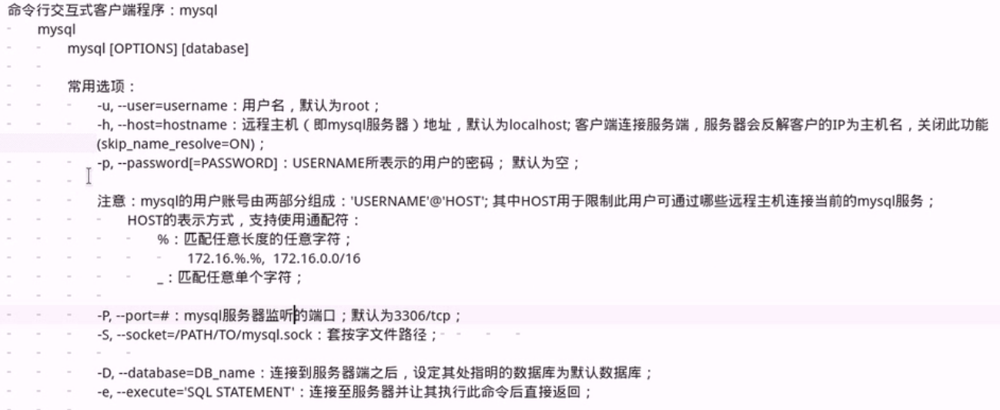
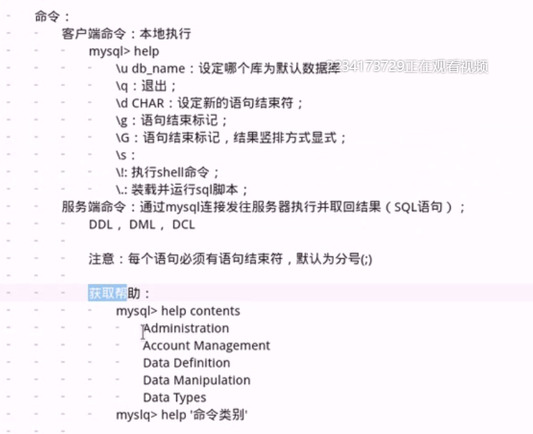
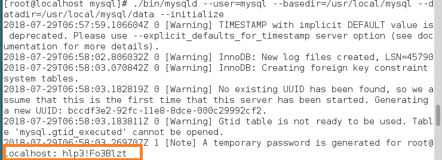
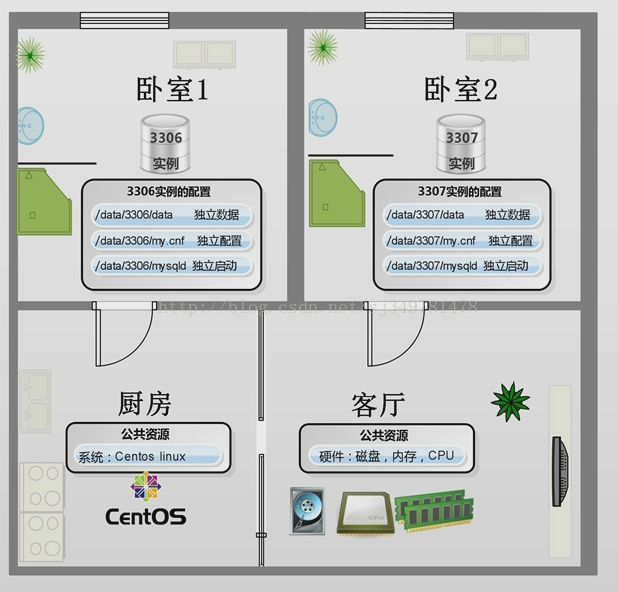

回顾：

	amp组合方式：
		client --> http protocol --> httpd + php module --> (php-mysql,mysql procotol) --> mysqld
		client --> http procotol --> httpd --> fastcgi procotol --> fpm(php application server) --> (php-mysql,mysql procotol) --> mysqld

	快速部署amp:
		CentOS 7:
			Modules:程序包，httpd,php,php-mysql,mariadb-server
				启动的服务：mariadb,httpd
			FastCGI:程序包，httpd,php-fpm,php-mysql.mysql-server
				启动的服务：mariadb,php-fpm,httpd

# mysql

	事物：组织多个操作为一个整体，要么全部都成功执行，要么失败回滚；

		一个存储系统是否支持事物，测试标准
			acid：
				a:原子性
				c:一致性
				i:隔离性
				d:
	mariadb程序的组成:C/S
		C:Client --> mysql/procotol --> Server
			mysql:CLI交互式客户端程序
			mysqldump:备份工具
			mysqladmin:管理工具
			mysqlbinlog:
			..
		S:Server
			mysqld
			mysqld_safe：建议运行服务端程序
			mysql_multi:多实例
	 
			三类套接字地址：
				IPv4/6:3306/tcp
				Unix Sock:/var/lib/mysql/mysql.sock

##CentOs 7.3 二进制包mysql5.7安装及基础命令:

	1.下载、解压
		下载 wget -c https://dev.mysql.com/get/Downloads/MySQL-5.7/mysql-5.7.18-linux-glibc2.5-x86_64.tar.gz
		解压 tar -xzvf mysql-5.7.18-linux-glibc2.5-x86_64.tar.gz
		重命名 mv mysql-5.7.18-linux-glibc2.5-x86_64/  /usr/local/mysql
	
	2.添加mysql用户和组
		添加用户组 groupadd mysql
		添加用户 useradd -r -g mysql mysql
			
	3.安装数据库

		切换到mysql目录 cd/usr/local/mysql
		修改当前目录用户和组 chown -R mysql:mysql ./
		安装数据库 bin/mysqld --initialize --user=mysql --basedir=/usr/local/mysql --datadir=/usr/local/mysql/data

		红框为生成的临时密码，后面会使用

	
	4.配置文件

		vim /etc/my.conf
		[mysqld]
		character_set_server=utf8
		init_connect='SET NAMES utf8'
		basedir=/usr/local/mysql
		datadir=/usr/local/mysql/data
		socket=/tmp/mysql.sock
		lower_case_table_names = 1
		log-error=/var/log/mysqld.log
		pid-file=/usr/local/mysql/data/mysqld.pid
		#log-bin=mysql-bin
		server-id=1

	5.添加环境变量，配置开机启动

		添加环境变量 echo "PATH=/usr/local/mysql/bin:$PATH" >> /etc/profile ; source /etc/profile
		创建启动脚本 cp /usr/local/mysql/support-files/mysql.server /etc/init.d/mysqld
		修改 /etc/init.d/mysqld 
		46行 basedir=/usr/local/mysql
		47行 datadir=/usr/local/mysql/data

	6.启动mysql

		启动 service mysqld start
		加入开机启动项 chkconfig --add mysqld

	7.登录修改密码

		登录 mysql -uroot -p
		第一次登录密码为第3步的随机密码
		修改密码 SET password = PASSWORD('centos');

## 基础命令：

	1.开启,关闭mysql
		/etc/init.d/mysqld start
		/etc/init.d/mysqld stop  #kill pkill killall
	
	2.查看mysql端口
		ss -lnt | grep 3306
		netstat -lnt | grep 3306
	
	3.登录mysql
		mysql   #还未设置密码
		mysql -uroot   #使用root用户，没有密码
		mysql -uroot -p   #root用户，密码登录
		mysql -uroot -p(password)  #密码为明文，不安全

	4.为管理员root用户设置密码
		mysqladmin -u root password "123456" #没有密码的用户设置密码命令
	
	5.修改密码
		命令行修改 
		1 mysqladmin -uroot -p123456 password "654321"   
		数据库中修改 
		2 忘记密码的情况
		update mysql.user set authentication_string=password('123456') where user='root';  
		flush privileges;  #更改后必须刷新
		3 直接修改当前用户密码
		set password=password('123456');
		set password for 
	
	6.忘记数据库密码
		1 mysqld_safe --skip-grant-tables  & #忽略授权表启动 --skip-networking(跳过网络连接)
		2 mysql  #可以直接登录
		3 update mysql.user set authentication_string=password('123456') where user='root';  
		5 exit
		6 mysqladmin -uroot -p123456 shutdown
		7 /etc/init.d/mysqld start   #然后就可正常登录
	
	注:SQL语句最常见的分类一般就是3类:
	DDL–数据定义语言(CREATE,ALTER,DROP)
	DML–数据操作语言(SELECT,INSERT,DELETE,UPDATE)
	DCL–数据控制语言(GRANT,REVOKE,COMMIT,ROLLBACK)
	
	7.创建数据库
		create database test; #未指定字符集，会给默认的字符集
		create database test character set utf8; #设置为utf-8字符集
		show create database test\G; #查看创建信息

	8.查询数据库	
		1 show databases;  #查询所有数据库
		2 show databases like 'test%';  #查询特定的数据库
		3 select database();  #查看当前所在数据库

	9.删除数据库
		drop database test; #删除test数据库
	
	10.增加一条数据
		insert into tablename value(...);

	给表加锁
		lock TABLES tb1_name read|write[,tb2_name read|write]...
		unlock tables [tb_name]
		
		flush tables tb1_name,...[with read lock]
		unlock tables [tb_name]

	10.连接数据库，查看当前数据库信息
		use dbname;
		select version();
		select user();
		select now();

	11.创建用户以及赋予用户权限
		创建chuan用户，赋予test数据库的所有权限，用户密码为123456
		1 grant all privileges on test.* to 'chuan'@'localhost' identified by '123456';
		2 create user 'chuan'@'localhost' identified by '123456';
		  grant all on test.* to 'chuan'@'localhost';

		grant update（name） on test.* to 'chuan'@'localhost'; 权限为哪个表的那个字段
		注:localhost也可换为其他地址，如10.0.0.% , 10.0.0.0/255.255.255.0 网段等
		查看用户权限
		show grants for 'chuan'@'localhost';

		修改用户名：
		rename user old_user to new_user
	
	12.删除数据库多余用户
		1 drop user 'username'@'hostname';
		2 delete from mysql.user where user='username';
		  flush privileges;
	
	13.权限回收
		权限列表:
		 SELECT       
		 INSERT
		 UPDATE       
		 DELETE       
		 CREATE       
		 DROP         
		 REFERENCES
		 INDEX
		 ALTER
		 CREATE TEMPORARY TABLES
		 LOCK TABLES
		 EXECUTE
		 CREATE VIEW
		 SHOW VIEW
		 CREATE ROUTINE
		 ALTER ROUTINE
		 EVENT
		 TRIGGER
		
		desc mysql.user;  #可查看表结构可加\G
		select * from mysql.user\G;
		
		revoke INSERT ON test.* from 'chuan'@'localhost';
	
	14.创建数据表及查看信息
		create table <表名>
		(
		    <字段名1> <类型1>,
		    <字段名2> <类型2>,
		    <字段名3> <类型3>
		);
		eg:
		create table student(
		id int(4) not null,
		name char(20) not null,
		age tinyint(2) not null default 0,
		dept varchar(16) default null
		);
		
		查看表结构:
		desc student;
		show colums from student;
		查看建表信息:
		show create table student\G;
	
	15.创建索引
		注:无论建立主键索引还是普通索引，都要在表的对应列上创建，可以对单列创建索引，也可以对多列创建索引。
		1 在创建表时，可以增加建立索引的语句
		create table student(
		id int(4) not null AUTO_INCREMENT,
		name char(20) not null,
		age tinyint(2) not null default 0,
		dept varchar(16) default null
		primary key(id),    #主键
		KEY index_name(name)   #name字段普通索引
		);
		2 单列索引
		普通索引
		法一:CREATE INDEX IndexName ON TableName(字段名(length));
		eg: CREATE INDEX dept_index ON student(dept);  #创建索引
		    DROP INDEX dept_index ON student;  #删除索引
		法二:ALTER TABLE TableName ADD INDEX IndexName(字段名(length));
		eg: ALTER TABLE student ADD INDEX dept_index(dept); #创建索引
		    ALTER TABLE student DROP INDEX dept_index;  #删除索引
		注:如果是CHAR,VARCHAR,类型,length可以小于字段的实际长度,如果是BLOB和TEXT类型就必须指定长度.
		
		唯一索引
		法一:CREATE UNIQUE INDEX IndexName ON TableName(字段名(length)); 
		eg: CREATE UNIQUE INDEX dept_index ON student(dept);
		法二:ALTER TABLE TableName ADD UNIQUE(字段名(length)); 
		eg: ALTER TABLE student ADD UNIQUE(dept);
		注: 唯一索引,与普通索引类似,但是不同的是唯一索引要求所有的类的值是唯一的,这一点和主键索引一样.但是他允许有空值.
		
		主键索引
		主键索引,不允许有空值.主键索引建立的规则是 int优于varchar,一般在建表的时候创建,最好是与表的其他字段不相关的列或者是业务不相关的列.一般会设为 int 而且是 AUTO_INCREMENT自增类型的
		在创建表时未指定主键，可添加主键索引:
		alter table student change id id int primary key auto_increment;
		
		3 组合索引
		
		CREATE INDEX IndexName On TableName(字段名(length),字段名(length),...);
		eg: CREATE INDEX union_index ON student(name,age,dept);
		注:如果你建立了 组合索引(union_index) 那么他实际包含的是3个索引(name),(name,age)(name,age,dept);
		最左前缀:where name=...  where name=... and age=... 等索引才能生效。 
		
		4 查询表中所有索引
		show index from student\G;
		explain select * from student where name='chuan'\G;  #查看是否使用索引
		总结:
		1.要在表的列上创建索引。
		2.索引会加快查询速度，但会影响更新的速度，因为要维护索引。
		3.索引不是越多越好，要在频繁查询的where后的条件列上创建索引。
		4.小表或唯一值少的列上不建索引，要在大表以及不同内容多的列上创建索引。
		
16.数据表插入数据
		
		insert into tablename(<列1>,<列2>,...) value('v1','v2',...);
		drop index NAME from TABLE
		eg: insert into student(id,name,age) value('1','chuan','20');
		    insert into student(name,age) value('chuan','21'),('chuan2','22'); #多行插入
	
	17.数据表查询数据
		select * from student;
		select id,name from student;
		select id,name from student limit 2;
		select id,name from student limit 0,2;
		select * from student where id=1;
		select * from student where name='chuan';
		select * from student where id=1 and name='chuan';
		select * from student where id=1 or name='chuan';
		select * from student where id>5 and id<10;
		select * from test order by id asc/desc;
		select * from student where id>5 order by id desc;
		select ClassID from students where age  > (select avg(age) from students);
		select ClassID，avg(age) FROM students GROUP BY ClassID;
		select ClassID,avg(age) from students GROUP BY ClassID HANVING avg(age) > 25;
		explain select * from student where age='20'\G; #查询是否走索引

		查询执行路径：
			请求 --> 查询缓存
			请求 --> 查询缓存 --> 解析器 --> 预处理器 --> 优化器 --> 查询执行引擎 --> 存储引擎 --> 数据
		select语句的执行流程：
			FROM --> WHERE --> Group By --> Having --> Order BY --> SELECT --> Limit
			
			where：
				算数操作符：+，-，*，/，%
				比较操作符：=，<>，!=，<=>，>，>=，<，<=
					
					IS NULL，IS NOT NULL
					区间：BETWEEN min AND max
					IN：列表
					LIKE：模糊比较，%和_
					
				逻辑操作符
					AND，OR，NOT

			group by：根据指定的字段把查询的结果进行分组，以用于聚合运算	
				avg()，max()，min()，sum()，count()

				HAVING：对分组聚合后的结果进行条件过滤

			ORDER by：根据指定的字段把查询的结果进行排序
				升序：ASC
				降序：DESC

			LIMIT：对输出的结果进行数量限制

	18.数据表修改、删除数据
		update student set name='test' where id=5;
		delete from student where id=5;
	
	19.字段的添加修改操作
		alter table student add sex char(4);
		alter table student delete sex;
	
	20.更改表名及删除表
		alter table student rename stu;
		drop table stu;

	21.查询表结构
		desc tablename

	22.根据表项排序
		select * from test ORDER BY id;   	#默认正序
		select * from test ORDER BY id DESC; #默认反序
	
	1.命令行修改登录提示符
		prompt \u@chuan \r:\m:\s->
	2.修改my.cnf永久生效
		prompt=\\u@chuan \r:\m:\s->

## mysql5.7多实例安装部署

	1. 背景
		MySQL数据库的集中化运维，可以通过在一台服务器上，部署运行多个MySQL服务进程，通过不同的socket监听不同的服务端口来提供各自的服务。各个实例之间是相互独立的，每个实例的datadir, port, socket, pid都是不同的。

	2. 多实例特点
		* 有效利用服务器资源，当单个服务器资源有剩余时，可以充分利用剩余的资源提供更多的服务。
		* 资源互相抢占问题，当某个服务实例服务并发很高时或者开启慢查询时，会消耗更多的内存、CPU、磁盘IO资源，导致服务器上的其他实例提供服务的质量下降。

	3.mysql多实例的两种部署方式
		1.多个实例共用一个配置文件(官方推荐)。
		2.一个实例一个配置文件(本文采用)。

	4.配置步骤
	1. wget -c https://dev.mysql.com/get/Downloads/MySQL-5.7/mysql-5.7.18-linux-glibc2.5-x86_64.tar.gz
	2. tar -xzvf mysql-5.7.18-linux-glibc2.5-x86_64.tar.gz -C /usr/local/
	3. ln -s /usr/local/mysql-5.7.18-linux-glibc2.5-x86_64.tar.gz /usr/local/mysql
	4. useradd -r -s /sbin/nologin mysql
	5. mkdir /data/mysql/{3306,3307}/data -p
	6. vim /data/mysql/3306/my.cnf
		[client]
		port = 3306
		socket = /data/mysql/3306/mysql3306.sock
		
		[mysql]
		auto-rehash
		
		[mysqld_safe]
		log-error = /data/mysql/3306/my3306.err
		pid-error = /data/mysql/3306/my3306.pid
		
		[mysqld]
		user = mysql
		port = 3306
		socket= /data/mysql/3306/mysql3306.sock
		pid-file = /data/mysql/3306/mysql3306.pid
		datadir = /data/mysql/3306/data
		basedir = /usr/local/mysql
		
		skip_name_resolve = 1 
		skip-external-locking 
		max_connections = 3000
		max_connect_errors = 10 
		transaction_isolation = READ-COMMITTED
		interactive_timeout=86400
		wait_timeout=86400
		back_log=600
		####cache######  
		table_open_cache=2000 
		thread_cache_size=500
		query_cache_size=128M
		query_cache_min_res_unit=128k
		sort_buffer_size=2M
		read_buffer_size=2M
		read_rnd_buffer_size=4M
		join_buffer_size=2M
		bulk_insert_buffer_size=16M
		max_heap_table_size=64M
		tmp_table_size=64M
		
		###MyISAM####
		key_buffer_size=64M
		key_cache_block_size=4k
		myisam_sort_buffer_size=2M
		
		########innodb settings########
		#innodb_page_size = 4k
		innodb_buffer_pool_size = 1G
		innodb_buffer_pool_instances = 1
		innodb_buffer_pool_load_at_startup = 1
		innodb_buffer_pool_dump_at_shutdown = 1
		#innodb_lru_scan_depth = 2000
		innodb_lock_wait_timeout = 50
		#innodb_io_capacity = 4000
		#innodb_io_capacity_max = 8000
		innodb_flush_method = O_DIRECT
		innodb_file_format = Barracuda
		innodb_file_format_max = Barracuda
		innodb_log_group_home_dir = /data/mysql3306/redolog/
		innodb_undo_directory = /data/mysql3306/undolog/
		innodb_undo_logs = 128
		#innodb_undo_tablespaces = 3
		innodb_flush_neighbors = 1
		innodb_log_file_size = 256M
		innodb_log_buffer_size = 8M
		innodb_purge_threads = 4
		innodb_large_prefix = 1
		innodb_thread_concurrency = 64
		innodb_print_all_deadlocks = 1
		innodb_strict_mode = 1
		innodb_sort_buffer_size = 4M
		
		######mysqld-5.7########
		innodb_buffer_pool_dump_pct = 40
		innodb_page_cleaners = 4
		innodb_undo_log_truncate = 1
		innodb_max_undo_log_size = 2G
		innodb_purge_rseg_truncate_frequency = 128
		binlog_gtid_simple_recovery=1
		log_timestamps=system
		transaction_write_set_extraction=MURMUR32
		show_compatibility_56=on
		
		sql_mode=NO_ENGINE_SUBSTITUTION,STRICT_TRANS_TABLES 
		
		#skip-grant-tables

	7. cp -a /data/mysql/3306/my.conf /data/mysql/3307/
	8. vim /data/mysql/3306/my.cnf
	   %s/3306/3307/g
	9. chown -R mysql:mysql /data
	10./usr/local/mysql/bin/mysqld --
	https://blog.csdn.net/sj349781478/article/details/77142228

## mysql备份与恢复

	备份
		
		1.单个数据库备份
			[root@linux-node1 ~]# mysqldump -uroot -p123456 test > /tmp/test_bak.sql
			[root@linux-node1 ~]# mysql -uroot -p123456 test < /tmp/test_bak.sql
			[root@linux-node1 ~]# egrep -v "#|\*|--|^$" /tmp/test_bak.sql   #过滤出备份内容如下
			DROP TABLE IF EXISTS `student`;
			CREATE TABLE `student` (
			  `id` int(11) DEFAULT NULL,
			  `name` char(10) DEFAULT NULL
			) ENGINE=InnoDB DEFAULT CHARSET=utf8;
			LOCK TABLES `student` WRITE;
			INSERT INTO `student` VALUES (1,'zhang'),(2,'wang'),(3,'li'),(4,'liu');
			UNLOCK TABLES;
		
		2.-B参数备份与恢复
			[root@linux-node1 ~]# mysqldump -uroot -p123456 -B test > /tmp/test_bak_B.sql
			[root@linux-node1 ~]# mysql -uroot -p123456 < /tmp/tset_bak_B.sql
			
			[root@linux-node1 ~]# mysqldump -uroot -p123456 -B test | gzip > /tmp/tset_bak_B.sql.gz
			[root@linux-node1 ~]# mysqldump -uroot -p123456 -B test study | gzip > /tmp/mul_bak.sql.gz
			注:--compact 减少垃圾数据输出，适用于调试
		
		3.分库备份
			[root@linux-node1 ~]# mysql -uroot -p123456 -e "show databases;" 2> /dev/null | grep -Evi "database|infor|perfor" | sed -r 's#^([a-z].*$)#mysqldump -uroot -p123456 -B \1 | gzip > /tmp/bak/\1_bak.sql.gz#' | bash
		
		4.分表备份
			test 库
			study student 表
			[root@linux-node1 ~]# mysqldump -uroot -p123456 test study student > /tmp/test_bak.sql
			
			备份表结构，没有数据
			test库，库后面可加一个或多个表
			[root@linux-node1 ~]# mysqldump -uroot -p123456 -d test > /tmp/test_bak.sql
			
			只备份数据
			test库，库后面可加一个或多个表
			[root@linux-node1 ~]# mysqldump -uroot -p123456 -t test > /tmp/test_bak.sql
		
		5.备份所有数据库 -A
			[root@linux-node1 ~]# mysqldump -uroot -p123456 -A -B > /tmp/test_bak.sql

			mysqldump -uroot -p123456 --all-databases -R -E --triggers -x --master-data=2 > all.sql

		
		6.binlog备份与恢复
			数据备份但不能停止数据库时,-F 刷新binlog,--master-data=1不用刷新binlog，备份时会有记录。
			--single-transaction适合innoDB引擎
			[root@linux-node1 ~]# mysqldump -uroot -p123456 -B -F test > /tmp/test_bak.sql
			[root@linux-node1 ~]# mysqldump -uroot -p123456 -B --single-transaction --master-data=1 test > /tmp/test_bak.sql
			恢复
			mysqlbinlog -d test mysql-bin.000020 > test_bak.sql   只是将test库中恢复的内容重定向到备份文件中，即可恢复数据库 
			mysqlbinlog mysql-bin.000020 --start-position=365 --stop-position=456 -r test_bak.sql 指定位置点恢复
			mysqlbinlog mysql-bin.000020 --satrt-datetime='2018-9-1 09:54:32' --stop-datetime='2018-9-1 09:54:33' -r test_bak.sql   指定时间点恢复
			
			--master-data=2
			--CHANGE MASTER TO MASTER_LOG_FILE='mysql-bin.000001',MASTER_LOG_POS=100;
			
			--master-data=1
			CHANGE MASTER TO MASTER_LOG_FILE='mysql-bin.000001',MASTER_LOG_POS=100;
		
		7.恢复总结
			1.利用source命令恢复数据库
			source /tmp/test_bak.sql
			2.利用mysql命令恢复数据库
			mysql -uroot -p123456 test < tset_bak.sql  #未加-B
			mysql -uroot -p123456 < tset_bak_B.sql  #加了-B选项
			3.批量恢复
			mysql_bak.sql
			study_bak.sql
			sys_bak.sql
			test_bak.sql
			
			for dbname in `ls /tmp/bak | awk -F "_" '{print $1}'`; do mysql -uroot -p123456 < ${dbname}_bak.sql; done
		
		8.生产常用命令:	
			show [full] processlist; 查看正在执行的sql语句，加FULL完整显示
			show status; 查看当前会话的数据库状态信息。
			show global status;查看整个数据库运行状态信息。
			set global key_buffer_size = 1024*32;不重启数据库调整数据库参数，可直接生效，重启数据库后失效
			show variables; 查看数据库的参数信息
			
		参考资料:https://www.cnblogs.com/martinzhang/p/3454358.html

## mysql主从复制

	1.主从形式
		一主一从
		主主复制
		一主多从—-可实现读写分离
		多主一从
		级联复制

	2.用途及条件
		mysql主从同步用途:
		1.实时灾备,用于故障切换
		2.读写分离，提供查询服务
		3.备份，避免影响业务
		mysql主从部署必要条件:
		1.主库开启binlog日志(设置log-bin参数)
		2.主从server-id不同
		3.从库服务器能连通主库服务器

	3.主从原理

	原理:
	    mysql的replication是一个异步的复制过程(mysql5.1.7以上版本分为异步复制(主服务器不等待从服务器同步完成便返回)和半同步（主服务器等待部分从服务器同步完成在返回）两种模式),从一个mysql instace(我们称之为master)复制到另一个mysql instance(我们称之slave)。在master与slave之间的实现整个复制过程主要由三个线程来完成，其中两个线程(sql线程和IO线程)在slave端,另外一个线程(dump线程)在master端。
	    要实现mysql的replication,首先必须打开master端的binary log(mysql-bin.xxxxxx)功能，否则无法实现。因为整个复制过程实际上就是slave从master端获取该日志然后再在自己身上完全顺序的执行日志中所记录的各种操作。打开mysql的binary log可以通过在my.cnf配置文件中的mysqld参数组([mysqld]标识后的参数部分)增加“log-bin”参数项。

	过程:
		1.slave上面的IO线程连接上master,并请求从指定日志文件的指定位置(或者从最开始的日志)之后的日志内容。
		2.master接收到来自slave的IO线程的请求后，通过负责复制的IO线程根据请求信息读取指定日志指定位置之后的日志信息，返回给slave端的IO线程。返回信息中除了日志所包含的信息之外，还包括本次返回的信息在master端的binary log 文件的名称以及在binary log中的位置。
		3.slave的IO线程接收到信息后，将接收到的日志内容依次写入到slave端的relay log(中继日志)文件(mysql-relay-bin.xxxxxx)的最末端，并将读取到的master端的bin-log的文件名和位置记录到master-info文件中，以便在下一次读取的时候能够清楚的告诉master,”我需要从某个bin-log的哪个位置开始往后的日志内容，请发给我”。
		4.slave的SQL线程检测到relay log中新增加了内容后，会马上解析该log文件中的内容成为在master端真实执行时候的那些可执行的sql语句，并在自身执行这些语句。这样，实际上就是在master端和slave端执行了同样的sql语句，所以两端的数据是完全一样的。

	4.主从配置

		环境:centos 7 mysql-5.7
			
		主库配置:
			
		1.开启master bin-log	
			[root@localhost ~]# vim /etc/my.cnf
			log-bin=mysql-log
			server-id=1  #这个必须不同
			
		2.清空master防火墙
			[root@localhost ~]# iptables -F
			
		3.启动mysql	
			[root@localhost ~]# /etc/init.d/start mysqld
			
		4.检查bin-log是否开启	
			[root@localhost ~]# mysql -uroot -p123456 -e "show variables like 'log_bin';"  #查看是否打开，ON为开启
			
		5.授权从库账号	
			mysql> grant replication slave on *.* to 'rep'@'192.168.179.%' identified by '960711';
			mysql> flush privileges;
			
		6.若主库已有数据，需要先将主库数据备份到从库	
			mysql> flush table with read lock;  #只允许读数据，不允许写数据。
			注:锁表后数据库不能退出，备份可在新窗口进行
			mysql> show master status;    #查看bin-log文件和位置，用于从库同步起始位置
			[root@localhost ~]# mysqldump -uroot -p123456 -A -B > /tmp/rep.sql
			注:或可加上--master-data=2参数，可直接获取bin-log文件及位置，加-x参数，备份时自动锁表 
			mysql> unlock tables; #解锁
		
	从库配置:
			
		1.修改server-id，保证与主库不一样	
			[root@localhost ~]# vim /etc/my.cnf
			server-id=3

		2.设置连接	
			mysql> CHANGE MASTER TO
			       MASTER_HOST='192.168.179.110',
			       MASTER_PORT=3306,
			       MASTER_USER='rep',
			       MASTER_PASSWORD='960711',
			       MASTER_LOG_FILE='mysql-bin.000003',
			       MASTER_LOG_POS=1452;
			#该信息会存放在master.info中
			
		3.打开slave开关	
			start slave
			
		4.查看slave状态	
			show slave status\G;
			#若出现如下为成功:   
			    Slave_IO_Running: Yes
			    Slave_SQL_Running: Yes
			
			回顾mysql主从复制原理要点:
			
			1、异步方式同步
			2、逻辑同步模式，多种模式，默认是通过SQL语句执行。
			3、主库通过记录binlog实现对从库的同步。binlog记录数据库的更新语句
			4、主库一个线程，从库两个线程来完成的
			5、从库关键文件master.info,relay-log,relay-log.info(sql线程记录位置的文件)
			6、如果还想级联从库，需要打开log-bin和log-slave-updates参数
			
			疑问:
			
			1.read-only #只读，重启生效
			注:read-only只能对不是super权限或all privileges权限生效
			2.当从库数据和主库数据冲突
			
			法一:stop slave
			set global sql_slave_skip_counter=1
			start slave;
			法二:
			slave-skip-errors = 1030,1062,1007
			skip-name-resolve
			该参数可参考:https://www.cnblogs.com/ivictor/p/5311607.html
			3.从库什么时候开启binlog
			    1.级联
			    2.以从库进行备份
			4.级联slave参数
			
			log-bin=mysql-bin
			log-slave-updates
			expire_logs_days=7  binlog日志保存时间
			主从切换
			
			选pos最大的或半同步的从库作为主库，参考下文；
			https://blog.csdn.net/alen_liu_sz/article/details/79451581
			
			参考资料:
			https://blog.csdn.net/shukebai/article/details/66007638
			https://www.cnblogs.com/wangzehuaw/p/6347348.html
			https://blog.csdn.net/thekenofdis/article/details/78965941
			https://www.cnblogs.com/clsn/p/8150036.html
			
			acid （数据库事务正确执行的四个基本要素的缩写） 编辑
			ACID，指数据库事务正确执行的四个基本要素的缩写。包含：原子性（Atomicity）、一致性（Consistency）、隔离性（Isolation）、持久性（Durability）。一个支持事务（Transaction）的数据库，必须要具有这四种特性，否则在事务过程（Transaction processing）当中无法保证数据的正确性，交易过程极可能达不到交易方的要求。

	5.主主配置
	
		master1：
			server_id=1
			log-bin=mysql-log
			relay_log=relay-log		
			auto_increment_offset=1		自动增长id，初始为1，每次加2，即使用奇数id
			auto_increment_increment=2	初始为2，每次加2，即使用偶数id

		master2：
			server_id=2
			log-bin=mysql-log
			relay_log=relay-log			
			auto_increment_offset=1
			auto_increment_increment=2

		启动服务
		账号授权：
			grant replication client，replication slave on *.* to 'repuser'@'IPaddr' identified by 'pass';
			flush privileges;

		

		设置连接	
			mysql> CHANGE MASTER TO
			       MASTER_HOST='192.168.179.110',
			       MASTER_PORT=3306,
			       MASTER_USER='rep',
			       MASTER_PASSWORD='960711',
			       MASTER_LOG_FILE='mysql-bin.000003',
			       MASTER_LOG_POS=1452;
			#该信息会存放在master.info中

		打开slave开关	
			start slave

		配置：
			1.server_id必须不同
			2.均启用binlog和relay log
			3.存在自动增长的id表，为了使得id不相冲突，需要定义其自动增长方式

			服务启动后执行如下步骤：
				都授权有复制权限的用户账号
				各自把对方指定为主节点

	复制时应该注意的问题：
		1.从服务设定为“只读”
			在从服务器启动read_only，但仅对非SUPER权限的用户有效

			阻止所有用户：
				mysql>FLUSH TABLES WITH READ LOCK;

		2.尽量确保复制时的事务安全
			在master节点启用参数:事务完成后立即同步到binlog日志中
				sync_binlog=ON

			如果用到的是InnoDB存储引擎：
				InnoDB_flush_logs_at_trx_commit=ON
				innodb_support_xa=ON
		3.从服务器意外终止时尽量避免自动启动复制线程
		4.从节点：设置参数
			sync_master_info=ON
			sync_relay_log_info=ON

