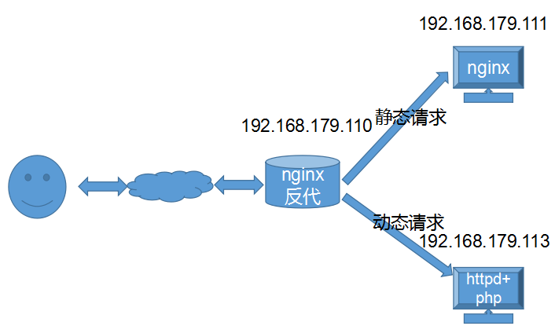

#1. Apache httpd
##1.1 欢迎文件配置
	~]# /etc/httpd/conf.d/welcome.conf
##1.2 长连接设置
	~]# cat keepalive.conf 
	KeepAlive On
	MaxKeepAliveRequests 100
	KeepAliveTimeout 15

	~]# telnet 192.168.179.110 80  
	Trying 192.168.179.110...
	Connected to 192.168.179.110.
	Escape character is '^]'.
	GET /index.html HTTP/1.1
	host:192.168.179.110
	
	HTTP/1.1 200 OK
	Date: Tue, 27 Nov 2018 13:07:38 GMT
	Server: Apache/2.4.6 (CentOS)
	Last-Modified: Tue, 27 Nov 2018 13:04:16 GMT
	ETag: "a-57ba5163b963d"
	Accept-Ranges: bytes
	Content-Length: 10
	Content-Type: text/html; charset=UTF-8
	
	test page
##1.3 虚拟主机 基于IP
	~]# ip addr add 192.168.179.111 dev ens33
	~]# cat virtualhost.conf 
	<VirtualHost 192.168.179.110:80>
	        ServerName www.ilinux.io
	        DocumentRoot /data/www/ilinux
	        <Directory /data/www/ilinux>
	                AllowOverride none
	                require all granted
	        </Directory>
	</VirtualHost>
	
	<VirtualHost 192.168.179.111:80>
	        ServerName www.iunix.io
	        DocumentRoot /data/www/iunix
	        <Directory /data/www/iunix>
	                AllowOverride none
	                require all granted
	        </Directory>
	</VirtualHost>

	~]# mkdir /data/www/{ilinux,iunix}/ -pv
	~]# echo www.ilinux.io > /data/www/ilinux/index.html
	~]# echo www.iunix.io > /data/www/iunix/index.html 

## 1.4 虚拟主机 基于端口
	
	~]# cat virtualhost.conf 
	Listen 8080
	
	<VirtualHost 192.168.179.110:80>
	        ServerName www.ilinux.io
	        DocumentRoot /data/www/ilinux
	        <Directory /data/www/ilinux>
	                AllowOverride none
	                require all granted
	        </Directory>
	</VirtualHost>
	
	<VirtualHost 192.168.179.110:8080>
	        ServerName www.iunix.io
	        DocumentRoot /data/www/iunix
	        <Directory /data/www/iunix>
	                AllowOverride none
	                require all granted
	        </Directory>
	</VirtualHost>

## 1.5 虚拟主机 基于FQDN

	~]# cat virtualhost.conf 
	<VirtualHost 192.168.179.110:80>
	        ServerName www.ilinux.io
	        DocumentRoot /data/www/ilinux
	        <Directory /data/www/ilinux>
	                AllowOverride none
	                require all granted
	        </Directory>
	</VirtualHost>
	
	<VirtualHost 192.168.179.110:80>
	        ServerName www.iunix.io
	        DocumentRoot /data/www/iunix
	        <Directory /data/www/iunix>
	                AllowOverride none
	                require all granted
	        </Directory>
	</VirtualHost>

	注：需修改本机hosts文件
	windows：
		C:\Windows\System32\drivers\etc
	linux:
		/etc/hosts

## 1.6 访问控制
	
	~]# htpasswd -c /etc/httpd/.htpasswd tom
	~]# htpasswd /etc/httpd/.htpasswd jerry    # -c创建文件，第二次不需要添加，否则会覆盖

	~]# cat access.conf 
	<VirtualHost 192.168.179.110:80>
        ServerName www.ilinux.io
        DocumentRoot /data/www/ilinux
        <Directory /data/www/ilinux>
                AllowOverride None
                AuthType Basic
                AuthName "username & passwd"
                AuthUserFile /etc/httpd/.htpasswd
                Require user tom jerry
        </Directory>
	</VirtualHost>

## 1.7 内置status页面

	~]# cat status.conf 
	<VirtualHost 192.168.179.110:80>
        ServerName www.iunix.io
        <Location /server-status>
                SetHandler server-status
                <RequireAll>
                        Require ip 192.168
                </RequireAll>
        </Location>
	</VirtualHost>

	http://www.iunix.io/server-status

## 1.8 实现文件压缩
	
	# mod_deflate 依赖模块

	~]# cat yasuo.conf
	SetOutputFilter DEFLATE
	
	AddOutputFilterByType DEFLATE text/html
	AddOutputFilterByType DEFLATE text/plain
	AddOutputFilterByType DEFLATE application/xhtml+xml
	AddOutputFilterByType DEFLATE text/xml
	AddOutputFilterByType DEFLATE application/xml
	AddOutputFilterByType DEFLATE application/x-javascript
	AddOutputFilterByType DEFLATE text/javascript
	AddOutputFilterByType DEFLATE text/css
	
	#level of compression(highest9-lowest 1)
	DeflateCompressionLevel 9

## 1.8 实现https服务

	CA主机：
		~]# cd /etc/pki/CA/
		~]# echo 01 > serial
		~]# touch index.txt
		~]# (umask 077;openssl genrsa -out private/cakey.pem 2048)
		~]# openssl req -new -x509 -key private/cakey.pem -out cacert.pem -days 365
		Country Name (2 letter code) [XX]:CN
		State or Province Name (full name) []:SiChuan
		Locality Name (eg, city) [Default City]:ChengDu  
		Organization Name (eg, company) [Default Company Ltd]:chuan
		Organizational Unit Name (eg, section) []:chuan.com
		Common Name (eg, your name or your server's hostname) []:www.chuan.com
		Email Address []:
		
		~]# openssl ca -in /tmp/httpd_csr.pem -out certs/httpd_crt.pem
		~]# scp certs/httpd_crt.pem root@192.168.179.110:/etc/httpd/ssl/

	httpd主机：
		已开启默认http服务
		~]# yum install -y mod_ssl
		~]# cd /etc/httpd/
		~]# mkdir ssl
		~]# cd ssl/
		~]# (umask 077;openssl genrsa -out httpd_key.pem 1024)
		~]# openssl req -new -key httpd_key.pem -out httpd_csr.pem
		    Country Name (2 letter code) [XX]:CN
		    State or Province Name (full name) []:SiChuan
		    Locality Name (eg, city) [Default City]:ChengDu
		    Organization Name (eg, company) [Default Company Ltd]:chuan
		    Organizational Unit Name (eg, section) []:chuan.com
		    Common Name (eg, your name or your server's hostname) []:www.test.com 
		    Email Address []:
		
		    Please enter the following 'extra' attributes
		    to be sent with your certificate request
		    A challenge password []:
		    An optional company name []:
		
		~]# scp httpd_csr.pem root@192.168.179.113:/tmp/
		
		~]# vim /etc/httpd/conf.d/ssl.conf
		    DocumentRoot "/var/www/html"  #若是目的修改，需要显示授权
		    ServerName www.test.com:443
		    SSLCertificateFile /etc/httpd/ssl/httpd_crt.pem
		    SSLCertificateKeyFile /etc/httpd/ssl/httpd_key.pem

## 1.9 压力测试
	工具：ab、webbench、http_load、jmeter、loadrunner、tcpcopy

	~]# yum install -y httpd-tools
	ab -n 100000 -c 10 URL

## 1.10 httpd+php处理动态请求
方法一：php编译成模块

		~]# yum install -y httpd php php-mysql mariadb-server
		~]# cd /var/www/html/
		~]# vim index.php
			<?php
        		phpinfo();
			?>
		~]# systemcti start httpd #可查看php测试页面

		~]# vim mysql.php
			<?php
		        $conn = mysql_connect('127.0.0.1','root','');
		        if ($conn)
		                echo "OK";
		        else
		                echo "NO";
			?>
		~]# systemctl start mariadb  #可测试是否连接mysql	

方法二：php-fpm管理php进程

	httpd主机：192.168.179.110
		~]# yum install -y httpd
		~]# cat virtualhost.conf 
		<VirtualHost 192.168.179.110:80>
		        DirectoryIndex index.php
		        ServerName www.chuan.com
		        DocumentRoot /data/www/html
		        ProxyRequests off
		        ProxyPassMatch ^/(.*\.php)$ fcgi://192.168.179.111:9000/data/www/html/$1
		        <Directory /data/www/html>
		                Options FollowSymLinks
		                AllowOverride None
		                Require all granted
		        </Directory>
		</VirtualHost>
		~]# systemctl start httpd

	php-fpm主机：192.168.179.111
		~]# yum install -y php-fpm php-mbstring php-mysql php-mcrypt
		~]# vim /etc/php-fpm.d/www.conf
			listen = 192.168.179.111:9000
			listen.allowed_clients = 192.168.179.110
		~]# mkdir /data/www/html -pv

		~]# wget https://files.phpmyadmin.net/phpMyAdmin/4.0.10.20/phpMyAdmin-4.0.10.20-all-languages.tar.gz   #测试
		~]# tar xf phpMyAdmin-4.0.10.20-all-languages.tar.gz -C /data/www/html/
		~]# ln -sv /data/www/html/phpMyAdmin-4.0.10.20-all-languages/ /data/www/html/pma
		~]# cd /data/www/html/pma 
		~]# cp config.sample.inc.php config.inc.php	
		~]# vim config.inc.php
			$cfg['Servers'][$i]['host'] = '192.168.179.113';

		~]# mkdir /var/lib/php/session -pv
		~]# chown apache:apache /var/lib/php/session/
		~]# systemctl start php-fpm

	mariadb主机：192.168.179.113
		~]# yum install -y mariadb-server
		~]# mysql
			> grant all on *.* to "tom"@"%" identified by "960711";
		~]# systemctl start mariadb
		
		注：skip-name-resolve=ON #mysql 跳过主机名解析，反解  /etc/my.cnf

	访问：
		http://192.168.179.110/pma/

	注：
		服务配置文件：/etc/php-fpm.conf,/etc/php-fpm.d/*.conf
		php环境配置文件：/etc/php.ini,/etc/php.d/*.ini

## 1.11 httpd默认参考文档
	~]# yum install -y httpd-manual

	访问：
		http://SERVER/manual/

#2. nginx
##2.1 虚拟主机 基于IP
	server {
        listen 80;
        server_name 192.168.179.110;
        location / {
                root /data/www/ilinux;
                index index.html index.htm;
        }
	}
	server {
	        listen 80;
	        server_name 192.168.179.111;
	        location / {
	                root /data/www/iunix;
	                index index.html index.htm;
	        }
	}

##2.2 虚拟主机 基于端口
	server {
        listen 80;
        server_name 192.168.179.110;
        location / {
                root /data/www/ilinux;
                index index.html index.htm;
        }
	}
	server {
	        listen 8080;
	        server_name 192.168.179.110;
	        location / {
	                root /data/www/iunix;
	                index index.html index.htm;
	        }
	}

##2.3 虚拟主机 基于FQDN
		server {
        listen 80;
        server_name www.ilinux.io;
        location / {
                root /data/www/ilinux;
                index index.html index.htm;
        }
	}
	server {
	        listen 80;
	        server_name www.iunix.io;
	        location / {
	                root /data/www/iunix;
	                index index.html index.htm;
	        }
	}

##2.4 内建status页面
	ngx_http_stub_status_module模块

	server {
	    listen 80;
	    server_name www.ilinux;

	    location /status {
	        stub_status on;
	    }
	}

##2.5 反向代理
	ngx_http_proxy_module模块

	nginx（反代）+ httpd
	
	192.168.179.110：
		~]# cat proxy.conf
			server {
		        listen 80;
		        server_name 192.168.179.110;
		
		        location / {
		                proxy_pass http://192.168.179.113:80/; 
		        }
			}

	192.168.179.113：
		~]# cat /etc/httpd/conf.d/virtual.conf 
			<VirtualHost 192.168.179.113:80>
			        ServerName www.ilinux.com
			        DirectoryIndex index.php
			        DocumentRoot /data/www/html
			        <Directory /data/www/html>
			                AllowOverride None
			                Require all granted
			        </Directory>
			</virtualHost>
				

##2.6 反代实现动静分离
	

	nginx（反代）+ nginx（静态请求）+ httpd（+php 动态请求）

	192.168.179.110:
		server {
	        listen 80;
	        server_name 192.168.179.110;
	
	        location / {
	
	                proxy_pass http://192.168.179.111:80/;
	        }
	
	        location ~ \.php$ {
	                proxy_pass http://192.168.179.113:80/;
	        }
		}

	nginx（反代）+ nginx（静态请求）+ php-fpm（动态请求）

	nginx（静态请求）：

	server {
        listen 80;
        index index.php;
        root /data/www/html;
        server_name www.iunix.io;
        location ~ \.php$ {
                root /data/www/html;
                fastcgi_pass 192.168.179.111:9000;
                fastcgi_index index.php;
                include fastcgi.conf;
        }

	}

##2.7 nginx反向代理服务器实现缓存
##2.8 nginx实现七层负载均衡

#3. LVS

#4. HAProxy

#5. ansible
##5.1 常用参数
	1.-a MODULE_ARGS，--args=MODULE_ARGS：传递参数给模块。
	2.-C，--check：不对远程主机做出一些改变，而是预测某些可能发生的改变。
	3.-e EXTRA_VARS，--extra-vars=EXTRA_VARS：配置额外的配置变量(key=value或者YAML/JSON格式)。
	4.-i INVENTORY，--inventory-file=INVENTORY：指定inventory文件，多个文件使用逗号分隔。默认为/etc/ansible/hosts。
	5.-m MODULE_NAME，--module-name=MODULE_NAME：指定要执行的模块名，默认的模块为"command"。
	6.-o，--one-line：简化输出(一行输出模式)。
	7.--syntax-check：检查playbook的语法，不会执行。

##5.2 常用模块
###1.查看所有匹配到的主机

	~]# ansible all --list-hosts		#列出所有匹配到的地址

###2.测试是否连接

	~]# ansible all -m ping		#测试是否能连接

###3.指定inventory文件
多个文件使用逗号分隔。默认为/etc/ansible/hosts

	~]# ansible all -i /root/hosts -m ping	#指定hosts文件	

###4.查看模块信息

	~]# ansible-doc -l		#查看所有模块
	~]# ansible-doc -s MODULE	#查看某个模块	

###5.copy
copy模块：拷贝文件

	ansible-doc -s copy
	- name: Copies files to remote locations.
	action: copy
	    backup=[yes|no]   # 拷贝的同时也创建一个包含时间戳信息的备份文件，默认为no
	    dest=             # 目标路径，只能是绝对路径，如果拷贝的文件是目录，则目标路径必须也是目录
	    content           # 直接以content给定的字符串或变量值作为文件内容保存到远程主机上，它会替代src选项
	    directory_mode    # 当对目录做递归拷贝时，设置了directory_mode将会使得只拷贝新建文件，
	                      # 旧文件不会被拷贝。默认未设置
	    follow=[yes|no]   # 是否追踪到链接的源文件。
	    force=[yes|no]    # 设置为yes(默认)时，将覆盖远程同名文件。设置为no时，忽略同名文件的拷贝。
	    group             # 设置远程文件的所属组
	    owner             # 设置远程文件的所有者
	    mode=             # 设置远程文件的权限。使用数值表示时不能省略第一位，如0644。
	                      # 也可以使用'u+rwx'或'u=rw,g=r,o=r'等方式设置。
	    src=              # 拷贝本地源文件到远程，可使用绝对路径或相对路径。如果路径是目录，且目录后加了
	                      # 斜杠"/"，则只会拷贝目录中的内容到远程，如果目录后不加斜杠，则拷贝目录本身和
	                      # 目录内的内容到远程。
	
	~]# ansible all -m copy -a "src=test.txt dest=/tmp/test.txt"	#将本地test.txt文件拷贝到目标机器中
	~]# ansible all -m copy -a "content='test page' dest=/tmp/content.txt"	#将content中的字符串当做输入
	~]# ansible all -m copy -a "src=test.txt dest=/tmp/content.txt mode=0770 owner=sshd group=sshd backup=yes" -o  	#指定用户，组，且使用一行输出
	~]# ansible all -m copy -a "src=/root/a dest=/tmp" -o	#a，a/*都将拷贝
	~]# ansible all -m copy -a "src=/root/a/ dest=/tmp" -o		#a/*都将拷贝
###6.shell
shell模块，command模块（默认）：执行指定命令

	
	ansible-doc -s shell
	- name: Execute commands in nodes.
	- action: shell
	      chdir       # 在执行命令前，先cd到指定的目录下
	      creates     # 用于判断命令是否要执行。如果指定的文件(可以使用通配符)存在，则不执行。
	      removes     # 用于判断命令是否要执行。如果指定的文件(可以使用通配符)不存在，则不执行。

	~]# ansible all -m command -a "ls /tmp"		
	~]# ansible all -m shell -a "echo $PATH"
###7.file
file文件模块：管理文件、目录的属性，也可以创建文件或目录。

	ansible-doc -s file
	- name: Sets attributes of files
	  action: file
      group       # file/directory的所属组
      owner       # file/directory的所有者
      mode        # 修改权限，格式可以是0644、'u+rwx'或'u=rw,g=r,o=r'等
      path=       # 指定待操作的文件，可使用别名'dest'或'name'来替代path
      recurse     # (默认no)递归修改文件的属性信息，要求state=directory
      src         # 创建链接时使用，指定链接的源文件
      state       # directory:如果目录不存在则递归创建
                  # file:文件不存在时，不会被创建(默认值)
                  # touch:touch由path指定的文件，即创建一个新文件，或修改其mtime和atime
                  # link:修改或创建软链接
                  # hard:修改或创建硬链接
                  # absent:目录和其中的文件会被递归删除，文件或链接将取消链接状态

	~]# ansible all -m file -a "path=/tmp/x/y/z state=directory group=root owner=root mode=0755 recurse=yes"	
	~]# ansible all -m file -a "src=/tmp/x/y/z state=link dest=/tmp/linktest"
###8.fetch
fetch拉取文件模块：和copy工作方式类似，只不过是从远程主机将文件拉取到本地端，存储时使用主机名作为目录树，且只能拉取文件不能拉取目录。

	ansible-doc -s fetch
	- name: Fetches a file from remote nodes
	  action: fetch
      dest=               # 本地存储拉取文件的目录。例如dest=/data，src=/etc/fstab，
                          # 远程主机名host.exp.com，则保存的路径为/data/host.exp.com/etc/fstab。
      fail_on_missing     # 当设置为yes时，如果拉取的源文件不存在，则此任务失败。默认为no。
      flat                # 改变拉取后的路径存储方式。如果设置为yes，且当dest以"/"结尾时，将直接把源文件
                          # 的basename存储在dest下。显然，应该考虑多个主机拉取时的文件覆盖情况。
      src=                # 远程主机上的源文件。只能是文件，不支持目录。在未来的版本中可能会支持目录递归拉取。
      validate_checksum   # fetch到文件后，检查其md5和源文件是否相同。

	~]# ansible 192.168.179.111 -m fetch -a "src=/etc/fstab dest=/tmp" 
	~]# ansible 192.168.179.111 -m fetch -a "src=/etc/fstab dest=/tmp/ flat=yes"

###9.yum
yum包管理模块:

	ansible-doc -s yum
	- name: Manages packages with the `yum' package manager
	action: yum
    disable_gpg_check   # 安装包时禁止gpgcheck，仅在state=present或latest时生效。
    disablerepo         # 禁用指定的repoid，多个repoid使用逗号分隔。
    enablerepo          # 明确使用该repoid
    exclude             # 排除哪些包不安装，仅在state=present或latest时生效。
    list                # 类似于yum list
    name=               # 指定安装的包名，可带上版本号.
    state               # 状态。('present'、'installed','latest')用于安装包，
                        # ('absent'、'removed')用于移除已安装包。
    update_cache        # 强制更新yum的cache。

	~]# ansible all -m yum -a "list=ansible"
	~]# ansible all -m yum -a "name=httpd state=installed"
	~]# ansible centos -m yum -a "name=httpd state=removed"
	~]# ansible centos -m yum -a "name=/tmp/*.rpm exclude=*unix* state=present"		#安装本地的包，且排除某些包不安装。

###10.yum_repository 
yum_repository配置yum源模块:用于配置yum源。可以实现非常完整的yum仓库配置。但是一般只需简单的添加yum源即可。

	ansible-doc -s yum_repository
	- name: Add or remove YUM repositories
    action: yum_repository
      baseurl      # 地址
      mirrorlist   # 设置mirrorlist地址
      description  # 描述信息
      enabled      # 是否启用该仓库，默认为yes
      file         # 保存此仓库的文件，不设置该项的话则默认以name选项中的名称命名，将自动以".repo"后缀结尾。
      gpgcheck     # 是否要进行gpgcheck
      name=        # 仓库的名称，要保证名称的唯一性
      reposdir     # 保存.repo文件的目录，默认/etc/yum.repos.d/
      state        # repo文件的状态，present/absent，默认present。

	~]# ansible 192.168.100.63 -m yum_repository -a 'name=aliyun_epel description="epel repo" baseurl=http://mirrors.aliyun.com/epel/7/$basearch/ gpgcheck=no enabled=yes'

	例如：
	- name: Add repository
	  yum_repository:
	    name: aliyun_epel
	    description: EPEL YUM repo
	    baseurl: http://mirrors.aliyun.com/epel/7/$basearch/
		gpgcheck: no
	
	- name: Add multiple repositories into a file
	  yum_repository:
	    name: epel
	    description: EPEL YUM repo
	    file: sohu_epel
	    baseurl: http://mirrors.sohu.com/fedora-epel/7/$basearch/
	    gpgcheck: no

###11.service
service服务管理模块：

	ansible-doc -s service
	- name: Manage services.
	  action: service
      enabled   # 设置服务为开机自启动，默认为no
      name=     # 服务名
      state     # 'started'和'stoped'分别启动和停止服务，它们是幂等操作，多次启动或停止服务的结果是一样的，
                # 也就是说对于运行中的服务不会再执行启动操作，同理停止也是一样。'restarted'总是重启服务，
                # 'reloaded'总是重读配置文件，如果服务是未运行状态，则'reloaded会启动服务。
                # (state和enabled两者至少要给一个)

	~]# ansible all -m service -a "name=httpd state=started"
	~]# ansible all -m service -a "name=httpd enabled=yes"

###12.user
user用户管理模块：同理还有组管理模块group，就不多做说明了。

	ansible-doc -s user
	- name: Manage user accounts
	action: user
      name=            # 要创建、修改、移除的用户名。
      password         # 设置用户密码。此处只能使用加密密码作为值。
      system           # 设置为yes表示创建一个系统用户，只能用于创建，不能用于修改已有用户为系统用户。
      state            # 创建用户(present)还是删除用户(absent)。默认为present。
      createhome       # 创建家目录，或者已有的用户但家目录不存在也会创建。设置为no则不创建家目录。
      home             # 指定要创建的家目录路径
      move_home        # 如果设置为yes，则"home="则表示将家目录移动到此选项指定的路径下。
      uid              # 设置用户的uid
      group            # 设置用户的primary group
      groups           # 将用户加入到辅助组列表中。如果设置"groups="，则会将此用户从所有辅助组中移除。
      shell            # 设置用户的shell。
      force            # 配合'state=absent'时，等价于'userdel --force'，即强制删除用户、家目录和邮件列表。
      remove           # 配合'state=absent'时，等价于'userdel --remove'，即删除家目录和邮件列表。
      update_password  # user是幂等模块，"always"将总是修改密码。"on_create"将只在创建用户时设置密码。

	~]# ansible all -m user -a "name=chuan system=yes shell=/sbin/nologin"

	~]# openssl passwd -1 123456
	$1$9jwmFoVU$MVz7ywscpoPS5WXC.srcP/
	~]# ansible all -m user -a "name=chuan password='$1$fAGodLjd$XvKeD.4J.o0phHQPXHoRE/' update_password=always"

	~]# ansible all -m user -a "name=chuan state=absent"

###13.debug
debug模块：用于输出自定义的信息，类似于echo、print等输出命令。ansible中的debug主要用于输出变量值、表达式值，以及用于when条件判断时。

	ansible-doc -s debug
	- name: Print statements during execution
	action: debug
      msg        # 输出自定义信息。如果省略，则输出普通字符。
      var        # 指定待调试的变量。只能指定变量，不能指定自定义信息，且变量不能加{{}}包围，而是直接的变量名。
      verbosity  # 控制debug运行的调试级别，有效值为一个数值N。		

	~]# ansible all -m debug -a "msg='i want to print this message'"

	可以输出变量值，不过一般使用到变量的时候都会在playbook中使用debug模块，以下是一个示例：
	tasks:
	  - name: print any messages
	      debug: msg="you name is {{ name }}"

###14.cron
cron定时任务模块：cron模块用于设置定时任务，也用于管理定时任务中的环境变量。

	ansible-doc -s cron
	- name: Manage cron.d and crontab entries.
    action: cron
      backup         # (yes/no)如果设置了，则会在修改远程cron_file前备份这些文件
      cron_file      # 自定义cron_file的文件名，使用相对路径则表示在/etc/cron.d中。必须同时指定user选项
      user           # 指定哪个用户的crontab将要被修改，默认为root
      disabled       # 禁用crontab中的某个job，要求state=present
      env            # (yes/no)设置一个环境变量，将添加在crontab的顶端。使用name和value定义变量名和值
      job            # 需要执行的命令。如果设置了env，则表示环境变量的值，此时job="XXXX"等价于value="XXXX"。
                     # 要求state=present
      minute         # 分(0-59, *, */N)，不写时，默认为*
      hour           # 时(0-23, *, */N)，不写时，默认为*
      day            # 日(1-31, *, */N)，不写时，默认为*
      month          # 月(1-12, *, */N)，不写时，默认为*
      weekday        # 周(0-6 for Sunday-Saturday, *)，不写时，默认为*
      name           # 描述crontab任务的字符串。但如果设置的是env，则name为环境变量的名称。要求state=absent
                     # 注意，若未设置name，且state=present，则总会创建一个新job条目，即使cron_file中已经存在
                     # 同样的条目
      special_time   # 定时任务的别称，用于定义何时运行job条目。
                     # 有效值有reboot/hourly/daily/weekly/monthly/yearly/annually。
      state          # job或者env的状态是present(默认)还是absent。present用于创建，absent用于移除

	~]# ansible all -m cron -a "name='update' job='/usr/sbin/ntpdate ntp1.aliyun.com' minute=*/10"
	~]# ansible all -m shell -a "crontab -l"
		192.168.179.112 | CHANGED | rc=0 >>
		#Ansible: update
		*/10 * * * * /usr/sbin/ntpdate ntp1.aliyun.com
		
		192.168.179.111 | CHANGED | rc=0 >>
		#Ansible: update
		*/10 * * * * /usr/sbin/ntpdate ntp1.aliyun.com
	~]# ansible all -m cron -a "name='update' state=absent"

	~]# ansible centos7 -m cron -a 'name="ntpdate" job="/usr/sbin/ntpdate ntp1.aliyun.com" cron_file=ntpdate_cron user=root minute=*/2' -o
	~]# ansible centos7 -m cron -a 'name="ntpdate" state=absent cron_file=ntpdate_cron user=root' -o

###15.archive
archive归档模块：于在远端压缩文件。当然，前提是在远端主机上要有对应的压缩工具。支持zip/gz/tar/bz2。
	
	ansible-doc -s archive 
	- name: Creates a compressed archive of one or more files or trees.
    action: archive
      dest         # 目标归档文件名。除非path指定要压缩的是单文件，否则需要dest选项
      format       # 指定压缩格式，默认为gz格式
      group        # 文件/目录的所属组
      owner        # 文件/目录的所有者
      mode         # 设置文件/目录的的权限，支持'0644'或'u+rwx'或'u=rw,g=r,o=r'等格式
      path=        # 要压缩的文件，可以是绝对路径，也可以是glob统配的路径，还可以是文件列表
      remove       # 压缩后删除源文件

	例如：
	# 将目录/path/to/foo/压缩为/path/to/foo.tgz
	- archive:
	    path: /path/to/foo
	    dest: /path/to/foo.tgz
	
	# 压缩普通文件/path/to/foo为/path/to/foo.gz并删除源文件，由于压缩的是单文件，所以可以省略dest选项
	- archive:
	    path: /path/to/foo
	    remove: True
	
	# 将单文件/path/to/foo压缩为zip格式
	- archive:
	    path: /path/to/foo
	    format: zip
	
	# 将给定的文件列表压缩为bz2格式，压缩包路径为/path/file.tar.bz2
	- archive:
	    path:
	        - /path/to/foo
	        - /path/wong/foo
	    dest: /path/file.tar.bz2
	    format: bz2

###16.unarchive
unarchive解包模块：默认复制ansible端的归档文件到被控主机，然后在被控主机上进行解包。如果设置选项remote_src=yes，则表示解包被控主机上的归档文件。要求在被控主机上有对应的解包命令。unzip命令用于解压".zip"文件，gtar(tar包提供)命令用于解压".tar"、".tar.gz"、".tar.bz2"和".tar.xz"。

	ansible-doc -s unarchive
	- name: Unpacks an archive after (optionally) copying it from the local machine.
    action: unarchive
      creates      # 如果指定的文件存在则不执行该任务。可用于实现幂等性
      dest=        # 远程机器上需要被解包的归档文件，要求是绝对路径
      exclude      # 列出解包过程中想要忽略的目录和文件
      group        # 文件/目录的所属组
      owner        # 文件/目录的所有者
      mode         # 设置文件/目录的的权限，支持'0644'或'u+rwx'或'u=rw,g=r,o=r'等格式
      keep_newer   # 在解包过程中，如果目标路径中和包中有同名文件，且比包中的文件更新，则保留新的文件
      list_files   # 设置为true时，将返回归档文件中的文件列表
      remote_src   # 设置为yes表示远程主机上已有目标归档文件，即不再从本地复制归档文件到远端，直接在远端解包。
                   # 默认为no
      src=         # 如果remote_src=no,将复制本地归档文件到远端，可相对路径也可绝对路径. 
                     如果remote_src=yes, 将解包远程已存在的归档文件
                     如果remote_src=yes且src中包含了"://",将指挥远程主机从url中下载文件并解包

	例如：
	# 复制ansible端的foo.tgz文件到远端并解包
	- unarchive:
	    src: foo.tgz
	    dest: /var/lib/foo
	
	# 直接解包远端已经存在的文件- unarchive:
	    src: /tmp/foo.zip
	    dest: /usr/local/bin
	    remote_src: True
	
	# 从url上下载压缩包，然后进行解压
	- unarchive:
	    src: https://example.com/example.zip
	    dest: /usr/local/bin
	    remote_src: True

###17.script
script模块：用于控制远程主机执行脚本。在执行脚本前，ansible会将本地脚本传输到远程主机，然后再执行。在执行脚本的时候，其采用的是远程主机上的shell环境。

	ansible-doc -s script
	- name: Runs a local script on a remote node after transferring it
    action: script
      chdir         # 在远程执行脚本前先切换到此目录下。
      creates       # 当此文件存在时，不执行脚本。可用于实现幂等性。
      removes       # 当此文件不存在时，不执行脚本。可用于实现幂等性。
      free_form=    # 本地待执行的脚本路径、选项、参数。之所以称为free_form，是因为它是脚本名+选项+参数。

	例如，将ansible端/tmp/a.sh发送到各被控节点上执行，但如果被控节点的/tmp下有hello.txt，则不执行。
    - hosts: centos
      remote_user: root
      tasks:
        - name: execute /tmp/a.sh,but only /tmp/hello.txt is not yet created
          script: /tmp/a.sh hello
          args:
            creates: /tmp/hello.txt

###18.template
template模块：template模块用法和copy模块用法基本一致，它主要用于复制配置文件（配合jinja2模板使用）。

	ansible-doc -s template
	- name: Templates a file out to a remote server.
    action: template
      backup    # 拷贝的同时也创建一个包含时间戳信息的备份文件，默认为no
      dest=     # 目标路径
      force     # 设置为yes (默认)时，将覆盖远程同名文件。设置为no时，忽略同名文件的拷贝
      group     # 设置远程文件的所属组
      owner     # 设置远程文件的所有者
      mode      # 设置远程文件的权限。使用数值表示时不能省略第一位，如0644。
                # 也可以使用'u+rwx' or 'u=rw,g=r,o=r'等方式设置
      src=      # ansible控制器上Jinja2格式的模板所在位置，可以是相对或绝对路径
      validate  # 在复制到目标主机后但放到目标位置之前，执行此选项指定的命令。
                # 一般用于检查配置文件语法，语法正确则保存到目标位置。
                # 如果要引用目标文件名，则使用%s，下面的示例中的%s即表示目标机器上的/etc/nginx/nginx.conf。

	~]# ansible centos -m template -a "src=/tmp/nginx.conf.j2 dest=/etc/nginx/nginx.conf mode=0770 owner=root group=root backup=yes validate='nginx -t -c %s'" -o -f 6

	- tasks: 
     - name: template file based var
       template: src=/templates/nginx{{ ansible_distribution_major_version }}.conf.j2 dest=/etc/nginx/nginx.conf validate="/usr/sbin/nginx -t -c %s"

###19.setup
	acts组件是用来收集被管理节点信息的，使用setup模块可以获取这些信息。

	ansible-doc -s setup
	- name: Gathers facts about remote hosts
  	action: setup:
      fact_path:             # path used for local ansible facts (`*.fact') - files in this dir will be run (if executable) and their results be added to `ansible_local'
                               facts if a file is not executable it is read. Check notes for Windows options. (from 2.1 on) File/results
                               format can be json or ini-format
      filter:                # if supplied, only return facts that match this shell-style (fnmatch) wildcard.
      gather_subset:         # if supplied, restrict the additional facts collected to the given subset. Possible values: `all', `min', `hardware', `network', `virtual',
                               `ohai', and `facter'. Can specify a list of values to specify a larger subset. Values can also be used with
                               an initial `!' to specify that that specific subset should not be collected.  For instance:
                               `!hardware,!network,!virtual,!ohai,!facter'. If `!all' is specified then only the min subset is collected.
                               To avoid collecting even the min subset, specify `!all,!min'. To collect only specific facts, use
                               `!all,!min', and specify the particular fact subsets. Use the filter parameter if you do not want to display
                               some collected facts.
      gather_timeout:        # Set the default timeout in seconds for individual fact gathering

	~]# ansible 192.168.179.111 -m setup

##5.3 playbook应用
###5.3.1 ansible-playbook参数

ansible-playbook命令的选项和ansible命令选项绝大部分都相同。但也有其特有的选项。以下是截取出来的帮助信息。

	~]# ansible-playbook --help
	Usage: ansible-playbook playbook.yml
	
	Options:
	  -e EXTRA_VARS,--extra-vars=EXTRA_VARS # 设置额外的变量，格式为key/value。-e "key=KEY"，
	                                        # 如果是文件方式传入变量，则-e "@param_file"
	  --flush-cache          # 清空收集到的fact信息缓存
	  --force-handlers       # 即使task执行失败，也强制执行handlers
	  --list-tags            # 列出所有可获取到的tags
	  --list-tasks           # 列出所有将要被执行的tasks
	  -t TAGS,--tags=TAGS    # 以tag的方式显式匹配要执行哪些tag中的任务
	  --skip-tags=SKIP_TAGS  # 以tag的方式忽略某些要执行的任务。被此处匹配的tag中的任务都不会执行
	  --start-at-task=START_AT_TASK # 从此task开始执行playbook
	  --step                 # one-step-at-a-time:在每一个任务执行前都进行交互式确认
	  --syntax-check         # 检查playbook语法

###5.3.2 nginx（反代）+ tomcat

实验环境：	
	192.168.179.110：ansible
	192.168.179.115：nginx
	192.168.179.111：tomcat1
	192.168.179.112：tomcat2

	roles/
	|-- jdk
	|   |-- default
	|   |-- files
	|   |   `-- java.sh
	|   |-- handlers
	|   |-- meta
	|   |-- tasks
	|   |   `-- main.yaml
	|   |-- templates
	|   `-- vars
	|       `-- main.yaml
	|-- nginx
	|   |-- default
	|   |-- files
	|   |   `-- lb.conf
	|   |-- handlers
	|   |   `-- main.yaml
	|   |-- meta
	|   |-- tasks
	|   |   `-- main.yaml
	|   |-- templates
	|   `-- vars
	`-- tomcat
	    |-- default
	    |-- files
	    |-- handlers
	    |   `-- main.yaml
	    |-- meta
	    |-- tasks
	    |   `-- main.yaml
	    |-- templates
	    |   `-- server.xml.j2
	    `-- vars

	nginx:
		~]# yum install -y ansible
		~]# cd /etc/ansible
		~]# mkdir -pv roles/{nginx,tomcat,jdk}/{files,templates,tasks,handlers,vars,meta,default} 
		~]# vim roles/nginx/tasks/main.yaml
			- name: install nginx
			  yum:
			    name: nginx
			    state: latest
			  when: 
			    - ansible_os_family == "RedHat"
			- name: copy conf file
			  copy:
			    src: lb.conf
			    dest: /etc/nginx/conf.d/
			  tags: conf
			  notify: restart nginx
			- name: start nginx
			  service:
			    name: nginx
			    state: started
			    enabled: yes
		~]# vim roles/nginx/handlers/main.html
			- name: restart nginx
			  service:
			    name: nginx
			    state: restarted
		~]# vim roles/nginx/files/lb.conf
			upstream tcsrvs {
	        server 192.168.179.111:8080;
	        server 192.168.179.112:8080;
			}
			server {
			        listen 192.168.179.115:80;
			        server_name www.ilinux.io;
			        location / {
			                proxy_pass http://tcsrvs;
			        }
			}

	tomcat:
		~]# cat roles/tomcat/handlers/main.yaml 
			- name: restart tomcat
  			service: name=tomcat state=restarted
		~]# cat tasks/main.yaml    
			- name: install packages
			  yum:
			#    name="{{item}}"
			#    state=latest
			    name: [tomcat,tomcat-admin-webapps,tomcat-webapps,tomcat-docs-webapp]
			    state: latest
			#  with_items:
			#    - tomcat
			#    - tomcat-admin-webapps
			#    - tomcat-webapps
			#    - tomcat-docs-webapp
			#  when:
			#    - ansible_os_family == "Redhat"
			- name: copy conf file
			  template: src=server.xml.j2 dest=/etc/tomcat/server.xml
			  tags: conf
			  notify: restart tomcat
			- name: start tomcat
			  service: name=tomcat state=started enabled=yes

	jdk:
		~]# cat tasks/main.yaml 
			- name: install jdk
			  yum: name=java-{{ version }}-openjdk-devel state=latest
			- name: config env file
			  copy: src=java.sh dest=/etc/profile.d/
			- name: flush env
			  shell: . /etc/profile.d/java.sh
		~]# cat vars/main.yaml 
			version: 1.8.0
		~]# cat files/java.sh 
			export JAVA_HOME=/usr
			export PATH=$JAVA_HOME/bin:$PATH

		~]# cat nt.yaml		#只要有nginx角色，任何主机都可运行
			- hosts: lbsrvs
			  remote_user: root
			  roles:
			  - nginx
			- hosts: tcsrvs
			  remote_user: root
			  roles:
			#  - { role: jdk, version: 1.8.0 }
			  - tomcat
			  - jdk

#6. Zabbix

##6.1 搭建server，agent

##6.1.1 yum安装

**Server:**

	1.更新yum源
		~]# rpm -ivh https://mirrors.aliyun.com/zabbix/zabbix/3.0/rhel/7/x86_64/zabbix-release-3.0-1.el7.noarch.rpm
	2.server端安装相关软件
		~]# yum install zabbix-web zabbix-server-mysql zabbix-get zabbix-web-mysql mariadb-server -y
	3.修改php时区配置
		~]# vim/etc/httpd/conf.d/zabbix.conf
			php_value date.timezone Asia/Shanghai
	4.数据库配置
		~]# vim /etc/my.cnf
			skip_name_resolve=ON
		~]# systemctl start mariadb
		~]# mysql
		> create database zabbix;
		> grant all on zabbix.* to zbxuser@'192.168.%.%' identified by 'zbxpass';
		> grant all on zabbix.* to zbxuser@'localhost' identified by 'zbxpass';
		> flush privileges;
		~]# zcat /usr/share/doc/zabbix-server-mysql-3.0.24/create.sql.gz | mysql -uzbxuser -pzbxpass zabbix
	5.修改zabbix-server配置
		~]# vim /etc/zabbix/zabbix_server.conf
			DBHost=localhost  #数据库所在主机
			DBName=zabbix  #数据库名
			DBUser=zabbix  #数据库用户
			DBPassword=123456  #数据库密码
	6.启动服务
		~]# systemctl start zabbix-server httpd

**Agent:**

	1.更新yum源
		~]# rpm -ivh https://mirrors.aliyun.com/zabbix/zabbix/3.0/rhel/7/x86_64/zabbix-release-3.0-1.el7.noarch.rpm
	2.agent端安装相关软件
		~]# yum install -y zabbix-sender zabbix-agent
	3.修改zabbix-agent配置
		~]# vim /etc/zabbix/zabbix_agentd.conf 
			Server=192.168.179.110
	4.启动服务
		~]# systemctl start zabbix-agent

**Proxy：**

	1.更新yum源
		~]# rpm -ivh https://mirrors.aliyun.com/zabbix/zabbix/3.0/rhel/7/x86_64/zabbix-release-3.0-1.el7.noarch.rpm
	2.proxy端安装相关软件
		~]# yum install -y zabbix-proxy-server zabbix-get mariadb-server
	3.数据库配置
		~]# systemctl start mariadb
		~]# mysql
			> create database zabbix_proxy;
			> grant all on zabbix_proxy.* to zbxproxy@'localhost' identified by 'zbxpass';
			> flush privileges;
		~]# zcat /usr/share/doc/zabbix-proxy-mysql-3.0.24/schema.sql.gz | mysql -uzbxproxy -pzbxpass zabbix_proxy
	4.修改zabbix-proxy配置			
		~]# vim /etc/zabbix/zabbix_proxy.conf
			Server=192.168.179.110
			Hostname=proxy.chuan.com
			DBUser=zbxproxy
			DBPassword=zbxpass
	5.启动服务
		~]# systemctl start zabbix-proxy

**注：以上默认为被动模式，若为主动模式，要注意hostname参数。**

##6.1.2	源码安装

添加监控，item，triggers，graph，screen
action，定义报警媒介，添加报警
添加模板，设定自定发现	
自定义key

##6.x 监控nginx连接数

	UserParameter=nginx.status[*],./usr/bin/ngxstatus.sh $1		

	~]# chmod +x ngxstatus.sh
	~]# cat ngxstatus.sh
		#!/bin/bash
		HOST=127.0.0.1
		PORT=80
		URI='ngxstatus'
		
		active(){
		    curl -s http://$HOST:$PORT/$URI | awk '/^Active/{print $3}'
		}
		accepts(){
		    curl -s http://$HOST:$PORT/$URI | awk 'NR==3{print $1}'
		}
		handled(){
		    curl -s http://$HOST:$PORT/$URI | awk 'NR==3{print $2}'
		}
		requests(){
		    curl -s http://$HOST:$PORT/$URI | awk 'NR==3{print $3}'
		}
		reading(){
		    curl -s http://$HOST:$PORT/$URI | awk 'NR==4{print $2}'
		}
		writing(){
		    curl -s http://$HOST:$PORT/$URI | awk 'NR==4{print $4}'
		}
		waiting(){
		    curl -s http://$HOST:$PORT/$URI | awk 'NR==4{print $6}'
		}
		
		$1	

##6.x 监控tomcat
	
	1.1 agent主机上安装
		~]# yum install -y java-1.8.0-openjdk-devel zabbix-java-gateway
	1.2 配置
		~]# vim /etc/zabbix/zabbix_java_gateway.conf
	1.3 启动
		~]# systemctl start zabbix-java-gateway
	2.1 agent主机tomcat安装
		~]# cd /usr/local/src
		~]# wget http://mirrors.hust.edu.cn/apache/tomcat/tomcat-8/v8.5.32/bin/apache-tomcat-8.5.32.tar.gz
		~]# tar -xzvf apache-tomcat-8.5.32.tar.gz -C /usr/local/
		~]# ln -s /usr/local/apache-tomcat-8.5.32/ /usr/local/tomcat
	2.2 添加监控配置
		~]# vim /usr/local/tomcat/bin/catalina.sh
			CATALINA_OPTS="$CATALINA_OPTS -Dcom.sun.management.jmxremote
			  -Dcom.sun.management.jmxremote.port=8888
			  -Dcom.sun.management.jmxremote.ssl=false
			  -Dcom.sun.management.jmxremote.authenticate=false
			  -Djava.rmi.server.hostname=IPADDR"
	2.3 启动tomcat
		~]# /usr/local/tomcat/bin/startup.sh

	3.1 server主机配置
		~]# vim /etc/zabbix/zabbix_server.conf
			JavaGateway=192.168.179.143  #监控客户机
			StartJavaPollers=5   #开启进程数
	3.2 重启server
		~]# systemctl restart zabbix-server
		
	注：若是编译安装，记得设置环境变量

##.x自定义报警脚本

#7. MySQL & MariaDB
##7.1 安装mysql

	~]# tar xf mysql-5.7.24-linux-glibc2.12-x86_64.tar.gz -C /usr/local/
	~]# ln -sv mysql-5.7.24-linux-glibc2.12-x86_64/ /usr/local/mysql
	~]# vim /etc/profile
		PATH=/usr/local/mysql/bin:$PATH
	~]# . /etc/profile
	~]# useradd -r mysql
	~]# cd /usr/local/mysql
	~]# mkdir /usr/local/mysql/{data,etc,logs}
	~]# vim /usr/local/mysql/etc/my.cnf
		[mysqld]
		datadir=/usr/local/mysql/data
		socket=/tmp/mysql.sock
		symbolic-links=0
		[mysqld_safe]
		log-error=/usr/local/mysql/logs/error.log
		pid-file=/usr/local/mysql/data/mysql.pid
		!includedir /usr/local/mysql/etc/my.cnf.d
	~]# mkdir /usr/local/mysql/etc/my.cnf.d
	~]# touch /usr/local/mysql/logs/error.log
	~]# chown -R mysql.mysql /usr/local/mysql/*
	~]# mysqld --initialize-insecure --user=mysql --datadir=/usr/local/mysql/data --basedir=/usr/local/mysql 
	~]# cp /usr/local/mysql/support-files/mysql.server /etc/init.d/mysqld
	~]# chkconfig --add mysqld
	~]# service mysqld start

注：socket文件不放在/tmp目录下回报错，不知道是什么原因

##7.2 mysql操作

	mysql命令：
		常用选项：
			-h：服务端地址
			-u：用户名
			-p：密码
			-P：服务端端口
			--protocol={TCP|SOCKET|PIPE|MEMORY}：
				本地通信：基于本地回环地址进行请求，将基于本地通信协议
					Linux：SOCKET
					Windows：PIPE，MEMORY
				非本地通信：使用非本地回环地址进行的请求，TCP协议
			--socket=path，-S path
				~]# mysql --socket=/tmp/mysql.sock
			--database=db_name，-D db_name
			-C：数据压缩传输
			-e：非交互模式执行SQL语句
			-E：查询结果纵向显示			

	1.命令行修改登录提示符
		prompt \u@chuan \r:\m:\s->
	2.修改my.cnf永久生效
		prompt=\\u@chuan \r:\m:\s->

###7.2.1 DML–数据操作语言
**DML-数据操作语言(SELECT,INSERT,DELETE,UPDATE)**

	1.insert
		定义表结构：
		mysql> create or replace table t(
		    id int primary key,
		    sex char(3) default('nv'),
		    name char(20)
		);

		mysql> insert into t values(1,'nan','longshuai1'); 			# 插入一行数据
		mysql> insert into t values(2,'nan','longshuai2'),(3,'nv','xiaofang1'); # 一次性插入两行数据
		mysql> insert into t values(4,DEFAULT,'xiaofang2'); 			# sex字段使用默认值
		mysql> insert into t(id,name) values(5,'xiaofang3'); 			# 指定插入的字段
		mysql> insert into t(id,sex,name) values(6,'nv','xiaofang4'); 	# 等价于insert into t values()
		mysql> insert into t(name,id) values('xiaofang5',7); 			# 指定插入的字段，且改变字段顺序
		mysql> insert into t value(8,'nan','longshuai3'); 				# 使用value，而非values

	2.update
		mysql> UPDATE table_name SET column1 = value1, column2 = value2 WHERE id=100;
		mysql> update book set bookcount=2 where bookname in ('ss') order by bookid limit 10;
		mysql> update t set id=id+1 where id>5 order by id desc;
	
	3.delete
		mysql> delete from t where id>6 and sex='nv';
		mysql> delete from t order by id limit 2;

	4.select
		select * from student;
		select id,name from student;
		select id,name from student limit 2;
		select id,name from student limit 0,2;
		select * from student where id=1;
		select * from student where name='chuan';
		select * from student where id=1 and name='chuan';
		select * from student where id=1 or name='chuan';
		select * from student where id>5 and id<10;
		select * from test order by id asc/desc;
		select * from student where id>5 order by id desc;
		select ClassID from students where age  > (select avg(age) from students);
		select ClassID，avg(age) FROM students GROUP BY ClassID;
		select ClassID,avg(age) from students GROUP BY ClassID HANVING avg(age) > 25;
		explain select * from student where age='20'\G; #查询是否走索引

		查询执行路径：
			请求 --> 查询缓存
			请求 --> 查询缓存 --> 解析器 --> 预处理器 --> 优化器 --> 查询执行引擎 --> 存储引擎 --> 数据
		select语句的执行流程：
			FROM --> WHERE --> Group By --> Having --> Order BY --> SELECT --> Limit

		where：
			算数操作符：+，-，*，/，%
			比较操作符：=，<>，!=，<=>，>，>=，<，<=
				
				IS NULL，IS NOT NULL
				区间：BETWEEN min AND max
				IN：列表
				LIKE：模糊比较，%和_
				
			逻辑操作符
				AND，OR，NOT

			group by：根据指定的字段把查询的结果进行分组，以用于聚合运算	
				avg()，max()，min()，sum()，count()

				HAVING：对分组聚合后的结果进行条件过滤

			ORDER by：根据指定的字段把查询的结果进行排序
				升序：ASC
				降序：DESC

			LIMIT：对输出的结果进行数量限制

		DDL：CREATE/ALTER/DROP
		DML：INSERT/UPDATE/DELETE/SELECT
		DCL：GRANT/REVOKE
###7.2.2 密码修改

	~]# mysqladmin -u root password "123456" #没有密码的用户设置密码命令
	~]# mysqladmin -uroot [-h ip] -p123456 password "654321"   #命令行修改
	mysql> set password [for 'root'@'localhost'] =password('123456');		#数据库中修改
	mysql> alter user root@localhost identified by '123456';

	管理员忘记密码：
		~]# /etc/init.d/mysqld stop   #必须先停止服务
		~]# mysqld_safe --skip-grant-tables --skip-networking & 	#忽略授权表启动 --skip-networking(跳过网络连接)
		~]# mysql  #可以直接登录
		mysql> update mysql.user set authentication_string=password('123456') where user='root';  
		mysql> exit
		~]# mysqladmin -uroot -p123456 shutdown
		~]# /etc/init.d/mysqld start   #然后就可正常登录
	
###7.2.3 用户管理

	1.创建用户，赋予权限
		mysql> create user 'chuan'@'127.0.0.1' identified by '123456';	#无任何权限
		mysql> grant all on *.* to 'chuan'@'localhost' identified by '123456';	#授予任何库的所有权限
				
		权限列表:
			 SELECT       
			 INSERT
			 UPDATE       
			 DELETE       
			 CREATE       
			 DROP         
			 REFERENCES
			 INDEX
			 ALTER
			 CREATE TEMPORARY TABLES
			 LOCK TABLES
			 EXECUTE
			 CREATE VIEW
			 SHOW VIEW
			 CREATE ROUTINE
			 ALTER ROUTINE
			 EVENT
			 TRIGGER

	2.修改用户名：
		mysql> rename user old_user to new_user
	3.查看用户权限
		mysql> show grants for 'root'@'localhost';
	4.权限回收
		mysql> revoke select on test.* from 'chuan'@'192.168.100.1';
		mysql> revoke all on test.* from 'chuan'@'192.168.100.1';

		注：赋予权限的是哪个表，回收权限就只能指向哪个表，如这儿使用*.*将无法收回权限
	5.删除用户
		mysql> drop user 'username'@'hostname';

		mysql> delete from mysql.user where user='username';
		mysql> flush privileges;
###7.2.4 数据库操作
	1.创建数据库
		mysql> create database test; #未指定字符集，会给默认的字符集
		mysql> create database test character set utf8; #设置为utf-8字符集
		mysql> show create database test\G; #查看创建信息
	2.查询数据库	
		mysql> show databases;  #查询所有数据库
		mysql> show databases like 'test%';  #查询特定的数据库
		mysql> select database();  #查看当前所在数据库
	3.删除数据库
		mysql> drop database test; #删除test数据库
	4.查看当前数据库信息
		mysql> select version();	#查看当前数据库版本
		mysql> select user();		#查看当前数据库登录用户
		mysql> select now();		#查看当前时间

###7.2.5 数据表操作

	1.创建表
		mysql> create table students(id int,name char(20));
	2.查看表属性
		mysql> desc students;
		mysql> show table status like 'students'\G;
	3.修改表名
		mysql> alter table students rename to student;
	4.删除表
		mysql> drop table if exists table_name1[,table_name2]...
	5.查看建表信息
		mysql> show create table student\G;

###7.2.6 变量查询与修改

	1.查询
		mysql> select @@[global|session].sort_buffer_size;
		mysql> show [global|session] variables like "sort_buffer%";

	2.修改
		mysql> set [global|session] sort_buffer_size=32M;
		mysql> set @@[global|session].sort_buffer_size=32M;

	动态变量：能在运行过程中修改的变量称为动态变量
	静态变量：只能在数据库实例关闭状态下修改的变量称为静态变量或只读变量。

###7.2.7 索引

	索引：提取索引的创建在表上的字段中的数据，构建出一个独特的数据结构

	索引的作用：加速查询操作，副作用：降低写操作性能
		表中数据子集：把表中某个或某些字段（where子句中用到的字段）的数据取出来另存为一个特定数据结构组织的数据
			
	索引类型：B+ TREE，HASH
		B+ TREE：顺序存储，每一个叶子节点到根节点的距离相同；左前缀索引，适合于范围类型的数据查询（最长为70字节左右）
			适用于B+ TREE索引的查询类型：全键值、键值范围或键前缀
				全值匹配：精确匹配某个值
					where column = ‘value’；
				最左前缀匹配：只精确匹配起头的部分
					where column like 'perfix%';
				范围匹配值：
					精确匹配某一列，范围匹配另一列
					只用访问索引的查询：范围索引
						index（name）；
						select name from students where name like ‘t%’；
			
			不适合B+ TREE索引：
				如果查询条件不是从最左侧列开始，索引无效
					index（age，name）
					where name = ‘tom’;
				不能跳过索引中的某列
					index（name，age，gender）
					where name=‘’ and age >30；  Y
					where age>30 and name=''; 	N
				如果查询中的某个列是为范围查询，那么其右侧的列都无法再使用索引优化查询
					where age>30 and name=‘’；

	1.在创建表时，可以增加建立索引的语句
		create table student(
			id int(4) not null AUTO_INCREMENT,
			name char(20) not null,
			age tinyint(2) not null default 0,
			dept varchar(16) default null
			primary key(id),    #主键
			KEY index_name(name)   #name字段普通索引
		);
	
	2.单列索引
		普通索引
			法一:CREATE INDEX IndexName ON TableName(字段名(length));
				eg: CREATE INDEX dept_index ON student(dept);  #创建索引
		    		DROP INDEX dept_index ON student;  #删除索引
			法二:ALTER TABLE TableName ADD INDEX IndexName(字段名(length));
				eg: ALTER TABLE student ADD INDEX dept_index(dept); #创建索引
		    		ALTER TABLE student DROP INDEX dept_index;  #删除索引

			注:如果是CHAR,VARCHAR,类型,length可以小于字段的实际长度,如果是BLOB和TEXT类型就必须指定长度.
		
		唯一索引
			法一:CREATE UNIQUE INDEX IndexName ON TableName(字段名(length)); 
				eg: CREATE UNIQUE INDEX dept_index ON student(dept);
			法二:ALTER TABLE TableName ADD UNIQUE(字段名(length)); 
				eg: ALTER TABLE student ADD UNIQUE(dept);
		
			注: 唯一索引,与普通索引类似,但是不同的是唯一索引要求所有的类的值是唯一的,这一点和主键索引一样.但是他允许有空值.
		
		主键索引
			主键索引,不允许有空值.主键索引建立的规则是 int优于varchar,一般在建表的时候创建,最好是与表的其他字段不相关的列或者是业务不相关的列.一般会设为 int 而且是 AUTO_INCREMENT自增类型的
		
			在创建表时未指定主键，可添加主键索引:
				alter table student change id id int primary key auto_increment;
		
	3.组合索引	
		CREATE INDEX IndexName On TableName(字段名(length),字段名(length),...);
			eg: CREATE INDEX union_index ON student(name,age,dept);
		
			注:如果你建立了 组合索引(union_index) 那么他实际包含的是3个索引(name),(name,age)(name,age,dept);
			最左前缀:where name=... 、 where name=.. and age=.. 等索引才能生效。 
		
	4.查询表中所有索引
		show index from student\G;
		explain select * from student where name='chuan'\G;  #查看是否使用索引
	
	高性能索引策略：
		（1）在where中独立使用列，尽量避免其参与运算
		（2）左前缀索引：索引构建于字段的最左侧的多少个字符，要通过索引选择性来评估
			索引选择性：不重复的索引值和数据表的记录总数的比值
		（3）多列索引：
			AND连接的多个查询条件更适合使用多列索引，而非多个单键索引
				index（gender）index（age）
				index（gender，age）		
		（4）选择合适的索引列次序：选择性最高的放左侧
	
	总结:
		1.要在表的列上创建索引。
		2.索引会加快查询速度，但会影响更新的速度，因为要维护索引。
		3.索引不是越多越好，要在频繁查询的where后的条件列上创建索引。
		4.小表或唯一值少的列上不建索引，要在大表以及不同内容多的列上创建索引。

###7.2.8 事务

	一般来说，事务是必须满足4个条件（ACID）：原子性（Atomicity，或称不可分割性）、一致性（Consistency）、隔离性（Isolation，又称独立性）、持久性（Durability）。
		原子性：一个事务（transaction）中的所有操作，要么全部完成，要么全部不完成，不会结束在中间某个环节。事务在执行过程中发生错误，会被回滚（Rollback）到事务开始前的状态，就像这个事务从来没有执行过一样。
		一致性：在事务开始之前和事务结束以后，数据库的完整性没有被破坏。这表示写入的资料必须完全符合所有的预设规则，这包含资料的精确度、串联性以及后续数据库可以自发性地完成预定的工作。
		隔离性：数据库允许多个并发事务同时对其数据进行读写和修改的能力，隔离性可以防止多个事务并发执行时由于交叉执行而导致数据的不一致。事务隔离分为不同级别，包括读未提交（Read uncommitted）、读提交（read committed）、可重复读（repeatable read）和串行化（Serializable）。
		持久性：事务处理结束后，对数据的修改就是永久的，即便系统故障也不会丢失。

	注：在 MySQL 中只有使用了 Innodb 数据库引擎的数据库或表才支持事务。在 MySQL 命令行的默认设置下，事务都是自动提交的，即执行 SQL 语句后就会马上执行 COMMIT 操作。

	事务参数：
		mysql> show variables like 'autocommit';
		+---------------+-------+
		| Variable_name | Value |
		+---------------+-------+
		| autocommit    | ON    |
		+---------------+-------+

	显示启动事务：
		mysql> set @@session.autocommit=0;	#禁止自动提交事务
		mysql> start transaction;	#手动开启事务
		mysql> savepoint p1;		#保存点
		mysql> rollback to p1;		#回滚到p1点
		mysql> release savepoint p1;#删除一个保存点
		mysql> commit;				#提交，一个事务完成
	
###7.2.9 锁

	mysql> show full processlist;		#查看所有用户执行情况

##7.3 MySQL日志
###7.3.1 刷新日志

	以下操作会刷新日志文件，刷新日志文件时会关闭旧的日志文件并重新打开日志文件。对于有些日志类型，如二进制日志，刷新日志会滚动日志文件，而不仅仅是关闭并重新打开。
		
		mysql> FLUSH LOGS;
		~]# mysqladmin flush-logs
		~]# mysqladmin refresh

###7.3.2 错误日志

	记录信息：
		（1）mysqld启动和关闭过程输出的信息
		（2）mysqld运行中产生的错误信息
		（3）event scheduler运行时产生的信息
		（4）主从复制架构中，从服务器复制线程启动时产生的日志
		
	配置参数（相关变量）：
		log_error=/usr/local/mysql/logs/error.log					
		log_warning={ON|OFF}

###7.3.3 查询日志

	在超时时间内完成的查询是一般查询，可以将其记录到一般查询日志中，但是建议关闭这种日志（默认是关闭的），超出时间的查询是慢查询，可以将其记录到慢查询日志中。

	配置参数（相关变量）：
		general_log={ON|OFF}			#是否启用查询日志
		general_log_file=HOSTNAME.log	#指定查询日志的路径。不给定路径时默认的文件名以 datadir/`hostname`.log 命名。
		log_output={FILE|TABLE|NONE}	# TABLE表示记录日志到表中，FILE表示记录日志到文件中，NONE表示不记录日志。不指定时默认为file。表：table（mysql.general_log）
			
###7.3.4 慢查询日志

	查询超出变量 long_query_time 指定时间值的为慢查询。但是查询获取锁(包括锁等待)的时间不计入查询时间内。

	配置参数（相关变量）：				
		long_query_time=10		 	# 指定慢查询超时时长(默认10秒)，超出此时长的属于慢查询
		slow_query_log={ON|OFF} 	# 也是是否启用慢查询日志，此变量和log_slow_queries修改一个另一个同时变化                                   
		slow_query_log_file=/usr/local/mysql/data/localhost-slow.log	#默认路径为库文件目录下主机名加上-slow.log
		log_output={FILE|TABLE|NONE}	# 定义一般查询日志和慢查询日志的输出格式，默认为file
		log_queries_not_using_indexes=OFF # 查询没有使用索引的时候是否也记入慢查询日志
	
	mysql 5.7上没有该参数，mariadb上存在
		log_slow_queries={ON|OFF}
		log_slow_filter= admin,filesort,filesort_on_disk,full_join,full_scan,query_cache,query_cache_miss,tmp_table,tmp_table_on_disk
		log_slow_rate_limit
		log_slow_verbosity

###7.3.5 二进制日志

	二进制日志包含了引起或可能引起数据库改变(如delete语句但没有匹配行)的事件信息，但绝不会包括select和show这样的查询语句。语句以"事件"的形式保存，所以包含了时间、事件开始和结束位置等信息。
	二进制日志是以事件形式记录的，不是事务日志(但可能是基于事务来记录二进制日志)，不代表它只记录innodb日志，myisam表也一样有二进制日志。
	二进制日志只在事务提交的时候一次性写入(基于事务的innodb二进制日志)。

####7.3.5.1 查看二进制日志
	二进制日志格式：	
		binlog_format={STATEMENT|ROW|MIXED}
			STATEMENT：语句
			ROW：行
			MIXED：混编
			
	查看二进制日志文件列表：
		mysql> SHOW MASTER|BINARY LOGS；
			
	查看当前正在使用的二进制日志文件：
		mysql> SHOW MASTER STATUS；

	查看二进制日志文件中的事件
		mysql> SHOW BINLOG EVENTS [IN 'log_name'] [FROM pos] [LIMIT [offset,] row_count]；
		
	服务器变量：
		log-bin=[on|filename]	#binlog的文件名
		sql_log_bin={ON|OFF}	#设置会话中是否记录binlog
		max_binlog_size=		#二进制日志最大大小
		sync_binlog={1|0}	

	注：出于安全和功能考虑，极不建议将二进制日志和datadir放在同一磁盘上。对于mysql 5.7，直接启动binlog可能会导致mysql服务启动失败，这时需要在配置文件中的mysqld为mysql实例分配server_id。

	mysqlbinlog：
			
		mysqlbinlog [option] log-file1 log-file2...

		-d,--database=name：只查看指定数据库的日志操作
		-o,--offset=#：忽略掉日志中的前n个操作命令
		-r,--result-file=name：将输出的日志信息输出到指定的文件中，使用重定向也一样可以。
		-s,--short-form：显示简单格式的日志，只记录一些普通的语句，会省略掉一些额外的信息如位置信息和时间信息以及基于行的日志。可以用来调试，生产环境千万不可使用
		--set-charset=char_name：在输出日志信息到文件中时，在文件第一行加上set names char_name
		--start-datetime,--stop-datetime：指定输出开始时间和结束时间内的所有日志信息
		--start-position=#,--stop-position=#：指定输出开始位置和结束位置内的所有日志信息
		-v,-vv：显示更详细信息，基于row的日志默认不会显示出来，此时使用-v或-vv可以查看

####7.3.5.2 删除二进制日志
	
	删除二进制日志有几种方法。不管哪种方法，都会将删除后的信息同步到二进制index文件中。
	
	1.reset master将会删除所有日志，并让日志文件重新从000001开始。
		mysql> reset master;

	2.PURGE { BINARY | MASTER } LOGS { TO 'log_name' | BEFORE datetime_expr }	
		mysql> purge master logs to "binlog_name.00000X"； #将会清空00000X之前的所有日志文件。
		mysql> purge master logs before 'yyyy-mm-dd hh:mi:ss'； #将会删除指定日期之前的所有日志。但是若指定的时间处在正在使用中的日志文件中，将无法进行purge。

	3.使用--expire_logs_days=N选项指定过了多少天日志自动过期清空。

####7.3.5.3 二进制日志相关参数

	log_bin={on|off|base_name}			 #指定是否启用记录二进制日志或者指定一个日志路径(路径不能加.否则.后的被忽略)
	sql_log_bin={on|off}				   #设置会话中是否记录binlog，只有在log_bin开启的时候才有效
	expire_logs_days=					  #指定自动删除二进制日志的时间，即日志过期时间
	binlog_do_db= 						 #明确指定要记录日志的数据库
	binlog_ignore_db= 					 #指定不记录二进制日志的数据库
	log_bin_index=	 					#指定mysql-bin.index文件的路径
	binlog_format={mixed|row|statement}	#指定二进制日志基于什么模式记录
	binlog_rows_query_log_events={1|0} 	#MySQL5.6.2添加了该变量，当binlog format为row时，默认不会记录row对应的SQL语句，设置为1或其他true布尔值时会记录，但需要使用mysqlbinlog -v查看，这些语句是被注释的，恢复时不会被执行。
	max_binlog_size=	 				 #指定二进制日志文件最大值，超出指定值将自动滚动。但由于事务不会跨文件，所以并不一定总是精确。
	binlog_cache_size=32768				#基于事务类型的日志会先记录在缓冲区，当达到该缓冲大小时这些日志会写入磁盘
	max_binlog_cache_size=				#指定二进制日志缓存最大大小，硬限制。默认4G，够大了，建议不要改
	binlog_cache_use					#使用缓存写二进制日志的次数(这是一个实时变化的统计值)
	binlog_cache_disk_use				#使用临时文件写二进制日志的次数，当日志超过了binlog_cache_size的时候会使用临时文件写日志，如果该变量值不为0，则考虑增大binlog_cache_size的值
	binlog_stmt_cache_size=32768	 	#一般等同于且决定binlog_cache_size大小，所以修改缓存大小时只需修改这个而不用修改binlog_cache_size
	binlog_stmt_cache_use				#使用缓存写二进制日志的次数
	binlog_stmt_cache_disk_use			#使用临时文件写二进制日志的次数，当日志超过了binlog_cache_size的时候会使用临时文件写日志，如果该变量值不为0，则考虑增大binlog_cache_size的值
	sync_binlog = { 0 | n } 			#这个参数直接影响mysql的性能和完整性
		sync_binlog=0:不同步，日志何时刷到磁盘由FileSystem决定，这个性能最好。
		sync_binlog=n:每写n次二进制日志事件(不是事务)，MySQL将执行一次磁盘同步指令fdatasync()将缓存日志刷新到磁盘日志文件中。Mysql中默认的设置是sync_binlog=0，即不同步，这时性能最好，但风险最大。一旦系统奔溃，缓存中的日志都会丢失。
	

	注：在innodb的主从复制结构中，如果启用了二进制日志(几乎都会启用)，要保证事务的一致性和持久性的时候，必须将sync_binlog的值设置为1，因为每次事务提交都会写入二进制日志，设置为1就保证了每次事务提交时二进制日志都会写入到磁盘中，从而立即被从服务器复制过去。

####7.3.5.4 二进制日志定点还原数据库

	只需指定二进制日志的起始位置（可指定终止位置）并将其保存到sql文件中，由mysql命令来载入恢复即可。当然直接通过管道送给mysql命令也可。

	选择时间点来恢复比较直观些，并且跨日志文件恢复时更方便。
	~]# mysqlbinlog --stop-datetime="2014-7-2 15:27:48" /tmp/mysql-bin.000008 | mysql -u user -p password
	
	恢复多个二进制日志文件时：
	~]# mysqlbinlog mysql-bin.[*] | mysql -uroot -p password
	
	或者将它们导入到一个文件中后恢复。
	~]# mysqlbinlog mysql-bin.000001 > /tmp/a.sql
	~]# mysqlbinlog mysql-bin.000002 >>/tmp/a.sql
	~]# mysql -u root -p password -e "source /tmp/a.sql"

###7.3.6 事务日志
	
[事务日志](http://www.cnblogs.com/f-ck-need-u/p/9010872.html#auto_id_16)

###7.3.7 中继日志

##7.4 备份
###7.4.1 备份类型

	按照是否能够继续提供服务，将数据库备份类型划分为：
		热备份：在线备份，能读能写
		温备份：能读不能写
		冷备份：离线备份
	按照备份数据库对象分类：
		物理备份：直接复制数据文件
		逻辑备份：将数据导出至文件中，必要时将其还原(也包括备份成sql语句的方式)
	按照是否备份整个数据集分为：
		完全备份：备份从开始到某段时间的全部数据
		增量备份：备份自上次增量备份以来变化的数据
			-->
			    -->
			        -->
		差异备份：备份自完全备份以来变化的数据					
			-->
			------>
			-------->
	分类方式不同，不同分类的备份没有冲突的关系，它们可以任意组合。

###7.4.2 备份内容和备份工具

	需要备份的内容：文件、二进制日志、事务日志、配置文件、操作系统上和MySQL相关的配置（如sudo，定时任务）。
	物理备份和逻辑备份的优缺点：
		物理备份：直接复制数据文件，速度较快。
		逻辑备份：将数据导出到文本文件中或其他格式的文件中。有MySQL服务进程参与，相比物理备份而言速度较慢；可能丢失浮点数精度；但可以使用文本工具二次处理；可以跨版本和跨数据库系统进行移植。

	备份策略：要考虑安全，也要考虑还原时长
		完全备份+增量
		完全备份+差异

	备份工具：
		mysqldump：逻辑备份工具。要求mysql服务在线。MyISAM(温备)，InnoDB（热备）
		mysqlhotcopy：物理备份工具，温备份，实际上是冷备。加锁、flush table并进行cp或scp。即将废弃的工具
		cp:冷备
		lvm快照：几乎热备。注意点是：先flush table、lock table、创建快照、释放锁、复制数据。因为要先flush table和lock table，这对于MyISAM来说很简单很容易实现。但对于InnoDB来说，因为事务的原因，锁表后可能还有缓存中的数据在写入文件中，所以应该监控缓存中的数据是真的已经完全写入数据文件中，之后才能进行复制数据。
		xtrabackup:开源。MyISAM（温备），InnoDB（热备），速度较快。

###7.4.3 mysqldump

官方手册：https://dev.mysql.com/doc/refman/5.7/en/mysqldump.html

	mysqldump默认会从配置文件中的mysqldump段读取选项，配置文件读取的顺序为：
	/etc/my.cnf --> /etc/mysql/my.cnf --> /usr/local/mysql/etc/my.cnf --> ~/.my.cnf

	语法选项：	
		mysqldump [OPTIONS] database [tables]
		mysqldump [OPTIONS] --databases [OPTIONS] DB1 [DB2 DB3...]
		mysqldump [OPTIONS] --all-databases [OPTIONS]

	连接选项：
		-u, --user=name        指定用户名
		-S, --socket=name      指定套接字路径
		-p, --password[=name]  指定密码
		-P, --port=#           指定端口
		-h, --host=name        指定主机名
		-r, --result-file=name 将导出结果保存到指定的文件中，在Linux中等同于覆盖重定向。在windows中因为回车符\r\n的原因，使用该选项比重定向更好

	筛选选项：
		--all-databases, -A：指定dump所有数据库。等价于使用--databases选定所有库
		--databases, -B：指定需要dump的库。该选项后的所有内容都被当成数据库名；在输出文件中的每个数据库前会加上建库语句和use语句
		--ignore-table=db_name.tbl_name：导出时忽略指定数据库中的指定表，同样可用于忽略视图，要忽略多个则多次写该选项
		-d, --no-data：不导出表数据，可以用在仅导出表结构的情况。
		--events, -E：导出事件调度器
		--routines, -R：导出存储过程和函数。但不会导出它们的属性值，若要导出它们的属性，可以导出mysql.proc表然后reload
		--triggers：导出触发器，默认已开启
		--tables：覆盖--databases选项，导出指定的表。但这样只能导出一个库中的表。格式为--tables database_name tab_list
		--where='where_condition', -w 'where_condition'：指定筛选条件并导出表中符合筛选的数据，如--where="user='jim'"

	DDL选项：
		--add-drop-database：在输出中的create database语句前加上drop database语句先删除数据库
		--add-drop-table：在输出的create table语句前加上drop table语句先删除表，默认是已开启的
		--add-drop-trigger：在输出中的create trigger语句前加上drop trigger语句先删除触发器
		-n, --no-create-db：指定了--databases或者--all-databases选项时默认会加上数据库创建语句，该选项抑制建库语句的输出
		-t, --no-create-info：不在输出中包含建表语句
		--replace：使用replace代替insert语句

	字符集选项：
		--default-character-set=charset_name：在导出数据的过程中，指定导出的字符集。很重要，客户端服务端字符集不同导出时可能乱码，默认使用utf8
		--set-charset：在导出结果中加上set names charset_name语句。默认启用。

	复制选项：
		--apply-slave-statements
		--delete-master-logs
		--dump-slave[=value]
		--include-master-host-port
		--master-data[=value]  
			该选项主要用来建立一个replication，当值为1时，导出文件中记录change master语句；
			当值为2时，change master语句被写成注释语句，默认值为空。
			该选项自动忽略--lock-tables，当没有使用--single-transaction时自动启用--lock-all-tables。

	格式化选项：
		--compact：简化输出导出的内容，几乎所有注释都不会输出
		--complete-insert, -c：insert语句中加上插入的列信息
		--create-options：在导出的建表语句中，加上所有的建表选项
		--tab=dir_name, -T dir_name：将每个表的结构定义和数据分别导出到指定目录下文件名同表名的.sql和txt文件中，其中.txt文件中的字段分隔符是制表符。要求mysqldump必须和MySQL Server在同一主机，且mysql用户对指定的目录有写权限，并且连接数据库的用户必须有file权限。且指定要dump的表，不能和--databases或--all-databases一起使用。它的实质是执行select into outfile。
		--fields-terminated-by=name：指定输出文件中的字段分隔符
		--fields-enclosed-by=name：指定输出文件中的字段值的包围符，如使用引号将字符串包围起来引用
		--fields-optionally-enclosed-by=name：指定输出文件中可选字段引用符
		--fields-escaped-by=name：指定输出文件中的转义符
		--lines-terminated-by=name：指定输出文件中的换行符   
		-Q, --quote-names：引用表名和列名时使用的标识符，默认使用反引号"`" 

	性能选项：
		--delayed-insert：对于非事务表，在insert时支持delayed功能，但在MySQL5.6.6开始该选项已经废弃
		--disable-keys, -K：在insert语句前后加上禁用和启用索引语句，大量数据插入时该选项很适合。默认开启
		--insert-ignore：使用insert ignore语句替代insert语句
		--quick, -q：快速导出数据，该选项对于导出大表非常好用。默认导出数据时会一次性检索表中所有数据并加入到内存中，而该选项是每次检索一行并导出一行

	加锁和事务相关选项：
		--add-locks         
		在insert语句前后加上lock tables和unlock tables语句，默认已开启。
		
		--flush-logs, -F 
		在开始dump前先flush logs，如果同时使用了--all-databases则依次在每个数据库dump前flush，
		如果同时使用了--lock-all-tables,--master-data或者--single-transaction，则仅flush
		一次，等价于使用flush tables with read lock锁定所有表，这样可以让dump和flush在完全精
		确的同一时刻执行。
		
		--flush-privileges   
		在dump完所有数据库后在数据文件的结尾加上flush privileges语句，在导出的数据涉及mysql库或
		者依赖于mysql库时都应该使用该选项
		
		--lock-all-tables, -x  
		为所有表加上一个持续到dump结束的全局读锁。该选项在dump阶段仅加一次锁，一锁锁永久且锁所有。
		该选项自动禁用--lock-tables和--single-transaction选项
		
		--lock-tables, -l  
		在dump每个数据库前依次对该数据库中所有表加read local锁(多次加锁，lock tables...read local)，
		这样就允许对myisam表进行并发插入。对于innodb存储引擎，使用--single-transaction比
		--lock-tables更好，因为它不完全锁定表。因为该选项是分别对数据库加锁的，所以只能保证每个数
		据库的一致性而不能保证所有数据库之间的一致性。该选项主要用于myisam表，如果既有myisam又有
		innodb，则只能使用--lock-tables，或者分开dump更好
		
		--single-transaction 
		该选项在dump前将设置事务隔离级别为repeatable read并发送一个start transaction语句给
		服务端。该选项对于导出事务表如innodb表很有用，因为它在发出start transaction后能保证导
		出的数据库的一致性时而不阻塞任何的程序。该选项只能保证innodb表的一致性，无法保证myisam表
		的一致性。在使用该选项的时候，一定要保证没有任何其他连接在使用ALTER TABLE,CREATE TABLE,
		DROP TABLE,RENAME TABLE,TRUNCATE TABLE语句，因为一致性读无法隔离这些语句。
		--single-transaction选项和--lock-tables选项互斥，因为lock tables会隐式提交事务。
		要导出大的innodb表，该选项结合--quick选项更好
		
		--no-autocommit  
		在insert语句前后加上SET autocommit = 0，并在需要提交的地方加上COMMIT语句
		
		--order-by-primary  
		如果表中存在主键或者唯一索引，则排序后按序导出。对于myisam表迁移到innobd表时比较有用，但是
		这样会让事务变得很长很慢

	备份实例：		
		1.单个数据库备份
			~]# mysqldump -uroot -p123456 test > /tmp/test_bak.sql
			~]# mysql -uroot -p123456 test < /tmp/test_bak.sql
			~]# egrep -v "#|\*|--|^$" /tmp/test_bak.sql   #过滤出备份内容如下
				DROP TABLE IF EXISTS `student`;
				CREATE TABLE `student` (
				  `id` int(11) DEFAULT NULL,
				  `name` char(10) DEFAULT NULL
				) ENGINE=InnoDB DEFAULT CHARSET=utf8;
				LOCK TABLES `student` WRITE;
				INSERT INTO `student` VALUES (1,'zhang'),(2,'wang'),(3,'li'),(4,'liu');
				UNLOCK TABLES;
		
		2.-B参数备份与恢复
			~]# mysqldump -uroot -p123456 -B test > /tmp/test_bak_B.sql
			~]# mysql -uroot -p123456 < /tmp/tset_bak_B.sql
			
			~]# mysqldump -uroot -p123456 -B test | gzip > /tmp/tset_bak_B.sql.gz
			~]# mysqldump -uroot -p123456 -B test study | gzip > /tmp/mul_bak.sql.gz
			
			注:--compact 减少垃圾数据输出，适用于调试
		
		3.分库备份
			~]# mysql -uroot -p123456 -e "show databases;" 2> /dev/null | grep -Evi "database|infor|perfor" | sed -r 's#^([a-z].*$)#mysqldump -uroot -p123456 -B \1 | gzip > /tmp/bak/\1_bak.sql.gz#' | bash
		
		4.分表备份
			test 库
			study student 表
				~]# mysqldump -uroot -p123456 test study student > /tmp/test_bak.sql
			
			备份表结构，没有数据
			test库，库后面可加一个或多个表
				~]# mysqldump -uroot -p123456 -d test > /tmp/test_bak.sql
			
			只备份数据
			test库，库后面可加一个或多个表
				~]# mysqldump -uroot -p123456 -t test > /tmp/test_bak.sql
		
		5.备份所有数据库 -A
			~]# mysqldump -uroot -p123456 -A -B > /tmp/test_bak.sql

			~]# mysqldump -uroot -p123456 --all-databases -R -E --triggers -x --master-data=2 > all.sql

		
		6.binlog备份与恢复
			数据备份但不能停止数据库时,-F 刷新binlog,--master-data=1不用刷新binlog，备份时会有记录。
			--single-transaction适合innoDB引擎
				~]# mysqldump -uroot -p123456 -B -F test > /tmp/test_bak.sql
				~]# mysqldump -uroot -p123456 -B --single-transaction --master-data=1 test > /tmp/test_bak.sql
			恢复
				~]# mysqlbinlog -d test mysql-bin.000020 > test_bak.sql   #只是将test库中恢复的内容重定向到备份文件中，即可恢复数据库 
				~]# mysqlbinlog mysql-bin.000020 --start-position=365 --stop-position=456 -r test_bak.sql #指定位置点恢复
				~]# mysqlbinlog mysql-bin.000020 --satrt-datetime='2018-9-1 09:54:32' --stop-datetime='2018-9-1 09:54:33' -r test_bak.sql   #指定时间点恢复
			
			--master-data=2
			--CHANGE MASTER TO MASTER_LOG_FILE='mysql-bin.000001',MASTER_LOG_POS=100;
			
			--master-data=1
			CHANGE MASTER TO MASTER_LOG_FILE='mysql-bin.000001',MASTER_LOG_POS=100;
		
		7.恢复总结
			1.利用source命令恢复数据库
				mysql> source /tmp/test_bak.sql
			2.利用mysql命令恢复数据库
				mysql -uroot -p123456 test < tset_bak.sql  #未加-B
				mysql -uroot -p123456 < tset_bak_B.sql  #加了-B选项
			3.批量恢复
				mysql_bak.sql
				study_bak.sql
				sys_bak.sql
				test_bak.sql
			
			~]# for dbname in `ls /tmp/bak | awk -F "_" '{print $1}'`; do mysql -uroot -p123456 < ${dbname}_bak.sql; done
		
###7.4.4 xtrabackup

##7.5 主从复制
###7.5.1 主从复制原理
[主从原理](https://www.cnblogs.com/f-ck-need-u/p/9155003.html#)

###7.5.2 主从复制配置
	主：
		1.开启master bin-log
			log-bin=mysql-log
			server-id=1  #这个必须不同

		2.授权从库账号	
			mysql> grant replication slave on *.* to 'rep'@'192.168.179.%' identified by '960711';
			mysql> flush privileges;

		3.若主库已有数据，需要先将主库数据备份到从库	
			mysql> flush table with read lock;  #只允许读数据，不允许写数据。
				注:锁表后数据库不能退出，备份可在新窗口进行
			mysql> show master status;    #查看bin-log文件和位置，用于从库同步起始位置
			~]# mysqldump -uroot -p --all-databases --master-data=2 > dump_all.db
				注:加上--master-data=2参数，可直接获取bin-log文件及位置，加-x参数，备份时自动锁表 
			mysql> unlock tables; #解锁

	从：
		1.开启中继日志
			relay_log=slave_log
			server-id=3
				
			注：relay_log.info用于记录SQL线程信息
		2.设置连接	
			mysql> CHANGE MASTER TO
			       MASTER_HOST='192.168.179.110',
			       MASTER_PORT=3306,
			       MASTER_USER='rep',
			       MASTER_PASSWORD='960711',
			       MASTER_LOG_FILE='mysql-bin.000003',
			       MASTER_LOG_POS=1452;
			#该信息会存放在master.info，用于记录IO线程信息中
			
		3.打开slave开关	
			start slave
			
		4.查看slave状态	
			show slave status\G;
			#若出现如下为成功:   
			    Slave_IO_Running: Yes
			    Slave_SQL_Running: Yes

###7.5.3 半同步复制
###7.5.4 复制过滤

	复制过滤器：
	仅复制有限一个或几个数据库相关的数据，而非所有；由复制过滤器进行
	
	两种实现思路
	（1）主服务器
		主服务器仅向二进制日志中记录有关特定数据库相关的写操作
		问题：其他库的time-point recovery将无从实现；
		
			binlog_do_db=
			binlog_ignore_db=
			
	（2）从服务器
		从服务器的SQL THREAD仅重放关注的数据库或相关的事件，并将其应用于本地
		问题：网络IO和磁盘IO
		
			Replicate_Do_DB=					
			Replicate_Ignore_DB=
			Replicate_Do_Table=
			Replicate_Wild_Do_Table=
			Replicate_Wild_Ignore_Table=

##7.6 读写分离
##7.7 高可用

#8.Redis

#9.ELK Stack
以下实验均使用5.5.1版本
##9.1 elasticsearch集群搭建
	~]# cat /etc/hosts
		...
		192.168.179.110 node1
		192.168.179.111 node2
		192.168.179.113 node3
###9.1.1 elasticsearch搭建	

	9200端口：数据端口
	9300端口：集群端口

	~]# yum install -y java-1.8.0-openjdk
    ~]# rpm -ivh elasticsearch-5.5.1.rpm
	~]# grep ^[^#] /etc/elasticsearch/elasticsearch.yml 
		cluster.name: myels
		node.name: node3
		path.data: /els/data
		path.logs: /els/logs
		network.host: 192.168.179.113
		http.port: 9200
		discovery.zen.ping.unicast.hosts: ["node1", "node2", "node3"]
		discovery.zen.minimum_master_nodes: 2 
	~]# vim jvm.options 
		-Xms1g	#初始化使用堆内存
		-Xmx1g	#最大使用堆内存
	~]# mkdir /els/{data,logs} -pv
	~]# chown -R elasticsearch.elasticsearch /els
    ~]# systemctl restart elasticsearch

	~]# curl -XGET http://node1:9200/_cat/nodes

	注：scp的配置文件注意权限问题

###9.1.2 elasticsearch-head搭建

	9100端口
	
	elasticsearch-head 	es的图形界面插件，托管于GitHub

	安装npm：
	~]# wget https://nodejs.org/dist/v6.9.5/node-v6.9.5-linux-x64.tar.xz
	~]# tar -xvf node-v6.9.5-linux-x64.tar.xz
	~]# mv node-v6.9.5-linux-x64 /usr/local/node
	~]# ln -s /usr/local/node/bin/node /usr/local/bin/node
	~]# ln -s /usr/local/node/lib/node_modules/npm/bin/npm-cli.js /usr/local/bin/npm	

	~]# git clone git://github.com/mobz/elasticsearch-head.git
	~]# cd elasticsearch-head
	~]# /usr/local/bin/npm install
	~]# nohup npm run start &	

	~]# vim /etc/elasticsearch/elasticsearch.yml
		http.cors.enabled: true
		http.cors.allow-origin: "*"
	~]# systemctl restart elasticsearch  

	http://localhost:9100/

	注：以上方法会有一些报错，但仍可使用

	docker安装：
	~]# yum install docker -y
	~]# systemctl start docker && systemctl enable docker
	# docker load < /usr/local/src/elasticsearch-head-docker.tar.gz
	~]# docker run -d -p 9100:9100 docker.io/mobz/elasticsearch-head:5
	~]# docker images	
	~]# docker run -d -p 9100:9100 mobz/elasticsearch-head:5
	
	~]# vim /etc/elasticsearch/elasticsearch.yml
		http.cors.enabled: true
		http.cors.allow-origin: "*"
	~]# systemctl restart elasticsearch  

#9.2 kibana安装

	5601端口

	~]# rpm -ivh kibana-5.5.1-x86_64.rpm
	~]# grep ^[^#] /etc/kibana/kibana.yml   
		server.port: 5601
		server.host: "192.168.179.110"
		server.name: "node1.kibana"
		elasticsearch.url: "http://192.168.179.110:9200"
	~]# systemctl restart kibana

	配置代理：nginx

	server {
		listen 80;
		server_name kibana.test.com
		location / {
			proxy_pass http://127.0.0.1:5601
			proxy_http_version 1.1;
			proxy_set_header Upgrade $http_upgrade;
			proxy_set header Connection 'upgrade';
			proxy_set_header Host $host;
			proxy_cache_bypass $http_upgrade;
		}
	}
		
#9.3 filebeat安装

	无监听端口

	~]# rpm -ivh filebeat-5.5.1-x86_64.rpm
	~]# vim /etc/filebeat/filebeat.yml
	
	#采集数据文件
	- input_type: log
	  paths:
    	- /var/log/nginx/access.log

	#输出给es
	output.elasticsearch:
	  hosts: ["node1:9200"]

	#输出给logstash
	output.logstash:
	  hosts: ["node3:5044"]

	#输出给redis（最好关闭redis持久化）
	output.redis:
	  hosts: ["localhost"]
	  password: "chuan"
	  key: "filebeat"
	  db: 5
	  timeout: 5

	注：若要注释，需全部注释，否则会出错。如：
	#output.elasticsearch:
  	  #hosts: ["node1:9200"]
	注：若在一台服务器上收集多个日志，需在每个input后面定义document_type: xxxxxx，用于在logstash中判断写入哪个索引

#9.4 logstash安装

	9600端口

	~]# yum install -y java-1.8.0-openjdk
	~]# rpm -ivh logstash-5.5.1.rpm

	~]# vim /etc/filebeat/conf.d/test.conf

	input {
	#    beats {
	#       host => "0.0.0.0"
	#       port => 5044
	#    }
	
	    redis {
	        data_type => "list"
	        key => "filebeat"
	        password => "chuan"
	        db => 5
	    }
	}
	
	filter {
	    grok {
	        match => {
	            "message" => "%{IPORHOST:clientip} %{HTTPDUSER:ident} %{USER:auth} \[%{HTTPDATE:datetime}\] \"%{WORD:verb} %{URIPATHPARAM:request} HTTP/%{NUMBER:httpversion}\" %{NUMBER:http_status_code} %{NUMBER:bytes} \"(?<http_referer>\S+)\" \"(?<http_user_agent>\S+)\" \"(?<http_x_forwarded_for>\S+)\""
	                }
	        }
	}
	
	output {
	#    elasticsearch {
	#       hosts => ["192.168.179.110:9200","192.168.179.111:9200"]
	#       index => "logstash-ngxlog-%{+YYYY.MM.dd}"
	#    }
	
	    stdout {
	        codec => rubydebug
	    }
	}

	//注：需要在logstash用户下测试该配置，logstash默认为不可登陆用户
	~]# usermod -s /bin/bash logstash
	~]# su - logstash
	~]# /usr/share/logstash/bin/logstash  -f /etc/logstash/conf.d/test.conf 

#git
## gitlab

1.~]# wget https://mirrors.tuna.tsinghua.edu.cn/gitlab-ce/yum/el7/gitlab-ce-10.0.0-ce.0.el7.x86_64.rpm
2.~]# yum isntall -y ./gitlab-ce-10.0.0-ce.0.el7.x86_64.rpm
3.~]# gitlab-ctl reconfigure
4.~]# /opt/gitlab/bin/gitlab-ctl start

注:账户为root

